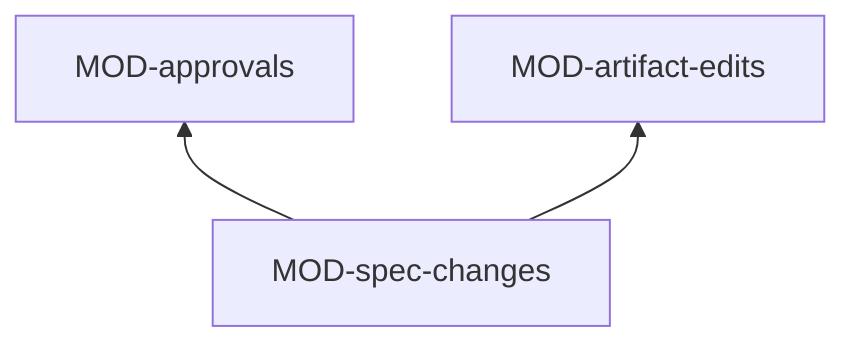

# ARC-041 Specification and design

## Context

Requirements, use cases and the architecture are the artifacts a person accepts before anything is built on them, and so
is a release test report. They are drafted by participants from their origins (UC-005, UC-007, UC-022), changed by
typing (UC-018, UC-023) or by prompt (UC-019), and accepted by a commit under the accepting person's account that names
the exact text (UC-006, UC-008). A SPEC is never written directly: a change is a proposal in a change queue beside the
text it replaces, written verbatim once accepted. Every other reviewed file is written directly to the default branch,
where it counts as open until an approval record names its text. Status is derived from those records, never stored.

## Decision

Specification and design is one service of ARC-037: **the change control of every reviewed artifact**. It derives
statuses from approval records, and composes every acceptance, proposal and save as one commit on the head that was
read. The jobs that draft these artifacts are not modules of this subsystem: they are kinds in the job catalogue
(ARC-046) — deriving requirements, use cases and the architecture, changing them by prompt, reviewing an architecture,
proposing groups — run by the one job runner. What those kinds need from this subsystem it offers as strategies: the
recipes that assemble the SPEC with its open queues, the use cases with their statuses and the whole architecture, the
precondition that what a draft rests on is accepted, and the writers that turn a draft into change-queue entries or into
open files. The checks of a draft are the artifact model's (ARC-048).

It uses Sources and resources — a product's links to its sources, which every accepted requirement must name —,
Participants and jobs, Access and the artifact model.

### Responsibility within the system

Keeping every reviewed file — use case, architecture decision, module file, SPEC change entry, release test report —
open until accepted, and accepted only on its exact text; writing accepted SPEC changes verbatim in their queue's order
with their records, and only when each of their requirements names a source linked to its product; saving edits and
group files only on the text they were opened on; writing drafted artifacts as proposals; and offering the drafting
kinds every input their rules demand.

### The interface it offers

| Module | Functions other subsystems use |
|---|---|
| MOD-approvals | `approvalSchema`, `statusOf`, `statuses`, `lastAcceptedText`, `acceptShown`, `acceptanceBlockers`, `fallbackAcceptLink`, `approvalStrategies` |
| MOD-spec-changes | `Queue`, `queues`, `openQueueOf`, `proposeSection`, `entryView`, `acceptEntries`, `applyApproved`, `requirementHistory`, `specStrategies` |
| MOD-artifact-edits | `saveFile`, `saveGroupFile`, `fallbackEditLinks`, `reviewLayoutCommit`, `editStrategies` |

### Its modules

| Module | Folder | Responsibility |
|---|---|---|
| MOD-approvals | `src/approvals/` | the schema of approval records under `docs/approvals/`; the status of a reviewed file — open, accepted, changed since acceptance —; its last accepted text; accepting one or many files shown, in one commit with one record each, leaving out and naming what changed since it was shown or rests on what is not accepted; GitHub's prefilled page without a token; the recipes of accepted use cases and of the whole architecture, and the precondition that what a draft rests on is accepted |
| MOD-spec-changes | `src/spec-changes/` | change queues under `docs/spec-freigaben/`: proposals of whole sections with their rationale, impact list and origin; the person's open queue of the day; acceptance in the queue's order with each anchor, the SPEC section replaced byte for byte with its record and decision in one commit, nothing written on a stale text; the same application for the instance's workflow without a token; each requirement's history; the recipe of the SPEC with its open queues, and the writer that turns classified candidates into queue entries — a duplicate as an added source, a change under the existing name, a conflict only as a person decided it |
| MOD-artifact-edits | `src/artifact-edits/` | saving an edited use case, decision, module file or group file only on the blob it was opened on, refusing a changed identifier, keeping the edit on refusal; GitHub's editor and new-file pages without a token; the review layout written into a new product; the writer that commits drafted use cases and architecture files as open files, new identifiers assigned, in one commit |

The kinds that draft these artifacts, and how they use these strategies:

| Kind in MOD-job-catalogue | Recipes | Checks | Reviewing participant | Writer |
|---|---|---|---|---|
| derive requirements (UC-005) | a linked source version's excerpt (MOD-source-register); the SPEC with its open queues | the requirement form; classes of candidates | — | queue entries |
| change requirements by prompt (UC-019) | the requirements named; the SPEC with its open queues | the same | — | the editor's draft, or queue entries from a CI agent |
| derive use cases (UC-007) | the requirements chosen; every use case | the use-case schema; realised names | — | open files |
| change a use case by prompt (UC-019) | the use case, its requirements, every other use case | the same; the identifier kept | — | the editor's draft, or an open file from a CI agent |
| derive the architecture (UC-022) | the whole SPEC; every accepted use case | the decision and module schemas; uses, provides, cycles, names | review the architecture, another participant and model | open files, after the due diligence step of MOD-reuse-facts |
| change the architecture (UC-023) | the description; the whole SPEC; every use case; the whole architecture | the same | the same | the editor's draft, or open files |
| propose groups (UC-021) | the items of one kind, by title and identifier | the group rules | — | pending moves shown on the page |

### The formats it owns

The schema of the approval record (MOD-approvals); the change queue with its index, entries, rationales and decisions
(MOD-spec-changes). The prompts and output schemas of the drafting kinds are in MOD-job-catalogue.

## Alternatives

- **A module per drafted artifact — requirements, use cases, architecture.** Rejected: each would repeat the pipeline the
  job runner already runs; they differ only in data and in the recipes and writers kept here (`DON'T REPEAT YOURSELF`).
- **Status kept in a field of each file or in a status file.** Rejected: `STATUS IS DERIVED FROM THE RECORDS`; a field
  could claim acceptance for a text nobody read.
- **SPEC changes written directly, reviewed in pull requests.** Rejected: `A SPECIFICATION CHANGE IS APPROVED BEFORE IT IS
  WRITTEN`, with the current text beside the proposal, on the dashboard.

## Consequences

- Any reviewed file edited after acceptance shows as changed since acceptance at once, without anyone resetting a status.
- Accepting many files is still one commit, so a reviewer's "Accept all N shown" is atomic.
- The instance's own SPEC can be changed without a token, through its workflow (ARC-039), with the same functions.
- A new kind of drafted artifact needs a schema in the artifact model and, at most, one more recipe or writer here.
- A SPEC change is accepted only when every requirement it holds names a source its product links (`A REQUIREMENT HAS A
  REGISTERED SOURCE`). Agent M's own SPEC names its sources in words — its Product Owner, the book *Vibe Coding* —, so
  those sources are registered in the instance's library and linked in its `docs/sources.md` before a change to it can
  be accepted.
