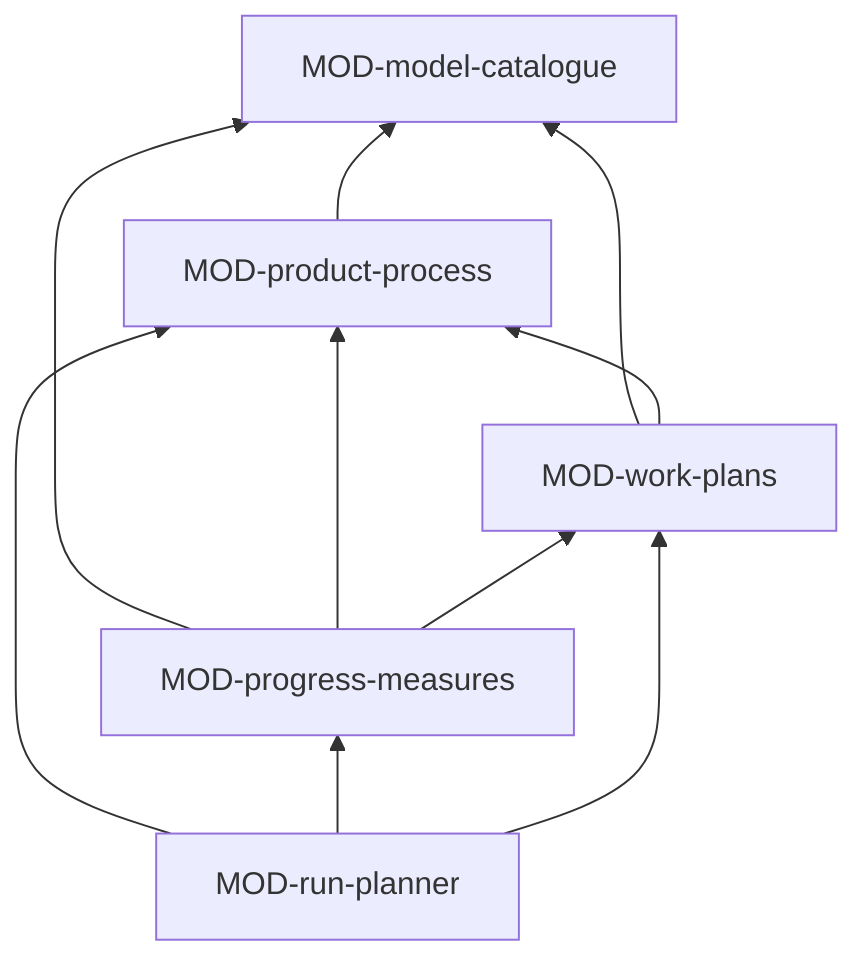

# ARC-042 Process

## Context

How a product is developed is declared, not assumed: one process model from a catalogue that is data, its roles held by
participants, its gates with what they check and who decides them, a Definition of Done, practices, branches, and the
gates and artifacts its process requirements add (UC-002, UC-031). The work is organised in an implementation plan or a
backlog that builds the system bottom-up along the modules' interfaces (UC-045, UC-032). Jobs start only for what is
accepted, selected and below the limits, stop at every gate, and a run carries a whole selection through the model
without a click between its jobs (UC-024, UC-034, UC-043). Progress is shown in the model's own measure (UC-035) and
on the main page as stages (UC-046), and what waits for a person's acceptance is told by the Site's notifications
(UC-047) — all derived from records.

## Decision

Process is the highest of the services of ARC-037: **declarations and plans as Markdown in the product repository,
everything about their state derived, and the next actions of a run as a pure function of the records**. Any driver
evaluates that function whenever it notices a change, and starts the actions of its own route (ARC-037, process view).
Its declarations, records and plans are documents of the common shape, defined by schemas in its modules' folders and
read by MOD-documents (ARC-048). Its jobs — drafting a plan, proposing backlog items, closing a sprint, implementing a
step or an item, deciding a gate as an agent — are kinds in the job catalogue (ARC-046); it offers them their recipes,
checks and writers as strategies. Process uses Tests and releases, Specification and design, Sources and resources,
Participants and jobs, Access and the artifact model.

### Responsibility within the system

Validating process models and the product's declaration; deriving the product's workflow, its gates' states and whether
a participant may decide a gate; checking a pull request against the Definition of Done; keeping implementation plans,
backlogs and sprints, and deriving each item's state and whether it can start; turning a selection into a run and
computing its next actions, the implementation job's inputs included; computing progress in the model's measure, the
stages of the main page, and what waits for a person's acceptance.

### The interface it offers

| Module | Functions other subsystems use |
|---|---|
| MOD-model-catalogue | `catalogue`, `modelSchema`, `modelFindings`, `planGrid`, `modelDiagram` |
| MOD-product-process | `declarationSchema`, `declarationFindings`, `workflowOf`, `holdsRole`, `gateSchema`, `gateStates`, `mayDecide`, `recordGateDecision`, `doneCheck`, `processStrategies` |
| MOD-work-plans | `planSchemas`, `itemStates`, `startable`, `planFindings`, `backlogFindings`, `sprintFacts`, `savePlan`, `saveItems`, `saveOrder`, `startSprint`, `endSprint`, `closeSprint`, `workStrategies` |
| MOD-run-planner | `runOf`, `nextActions`, `raiseLimits`, `runStrategies` |
| MOD-progress-measures | `productFacts`, `progressIn`, `stageShares`, `currentStage`, `gateOverview`, `blocked`, `whoWorksOnWhat`, `buildInProgress`, `waitingForAPerson`, `waitingForAcceptance` |

### Its modules

| Module | Folder | Responsibility |
|---|---|---|
| MOD-model-catalogue | `src/model-catalogue/` | the shipped catalogue — waterfall, V-model, reuse-oriented, Scrum, Kanban, and the practices — as data files in its folder, and the instance's models under `docs/process-models/`; the schema of a definition and the validation a schema cannot express; the plan of every accepted requirement in every phase; the model's diagram |
| MOD-product-process | `src/product-process/` | the schema of the product's `docs/process.md`: model and version, roles and their holders, practices, branches, Definition of Done, the closer of a sprint; the workflow with the gates process requirements add; the schema of gate records under `docs/gates/` and their states; who may decide a gate; the Definition-of-Done check of a pull request, which the product's CI runs; the recipe and writer of an agent's gate decision |
| MOD-work-plans | `src/work-plans/` | the schemas of the order of a plan's steps under `docs/plan/` and of a backlog under `docs/backlog/`, and of sprints under `docs/backlog/sprints/` with their review and retrospective; each item's derived state and what keeps it from starting — acceptance, what it builds on, the sprint's selection, the work-in-progress limit, the gate before its phase —; checks of a plan or backlog against the architecture; the recipes, checks and writers of drafting a plan, proposing items and closing a sprint |
| MOD-run-planner | `src/run-planner/` | a run as the job that names its jobs, with its selection and limits; its next actions from the records — CI set up first, then the steps in the order of the modules' interfaces and of the model's phases and gates, then the tests, then the validation, none above a limit, none after a failed job it depends on —; the recipe of an implementation job's inputs: the module's file, its subsystem's and the system's decisions, the SPEC, the interfaces of the modules it uses, its code and tests |
| MOD-progress-measures | `src/progress-measures/` | the facts of a product gathered once; progress in the model's measure — plan entries per phase, remaining items per time box, items per state over time —; gates passed, pending, not reached; what is blocked; who works on what; the six stages of the main page, the build in progress, what waits for a person; what waits for a person's acceptance in a repository, from its snapshot and tags alone |

### The formats it owns

The schema of a process model definition (MOD-model-catalogue); the schemas of the product's declaration and of the
gate record (MOD-product-process); the schemas of the order files and of the sprint record with its review and
retrospective (MOD-work-plans); the run's part of its job record (MOD-run-planner). The schema of plan steps and backlog
items is the artifact model's (MOD-documents).

## Alternatives

- **Process models as code paths.** Rejected: `THE CATALOGUE IS DATA`; a model is a data file the instance can adapt.
- **A scheduler that keeps the state of runs.** Rejected: there is no server to keep it, and records already hold
  everything; any driver can compute the next actions from them.
- **Item states written into the item files.** Rejected: `PROGRESS AND JOB STATE ARE DERIVED, NOT STORED`.
- **The Definition-of-Done check in the browser.** Rejected: it must hold whoever merges, so it runs in the product's CI
  (`A PULL REQUEST IS MERGED ONLY WHEN THE DEFINITION OF DONE HOLDS`).

## Consequences

- Two drivers may compute the same next action; only the one whose commit lands on the head it read takes it.
- A product's process can be changed later; earlier work keeps the model it was done under.
- A run whose route needs a Bridge advances only while a Bridge or the tab is running; the run panel says so.
