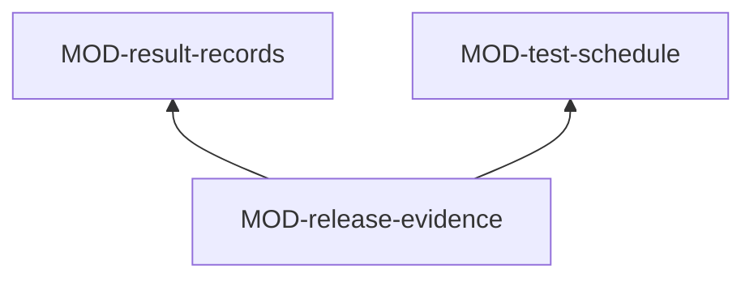

# ARC-043 Tests and releases

## Context

A product's tests are its evidence: each guards named requirements at one level, states its expected result before it
runs, and is shown to fail on a planted fault (UC-026). The product declares which levels run on which occasion, and its
CI configuration is generated from that schedule (UC-027). Every run leaves a record that is never rewritten, on the
branch `test-results` (UC-028); flaky tests and model-dependent rates are told apart from failures. A release runs every
test at every level on one commit, and accepting its report releases — changelog, tag — on that tested commit (UC-013);
the audit shows every requirement of a release with its evidence (UC-030). The test cases' own format is the artifact
model's (MOD-test-document), since the trace graph needs it.

## Decision

Tests and releases is one service of ARC-037: **the schedule as data, CI generated from it, results as records on their
own branch, and the release as a flow over these records**. Generating tests (UC-026) and running the levels of a commit
on a participant (UC-028) are kinds in the job catalogue (ARC-046); this subsystem offers them the strategies they need —
the recipe of every existing test guarding a selection with the product's paid services, the check of proposed test
cases against the existing ones, and the writer of result and counter-proof records. Setting up CI in a run is the same
generation a person starts on the schedule page, offered as a writer. It uses Specification and design for the
acceptance of the release test report, Sources and resources for a release's linked source versions and for the
product's resources and paid services, and Participants and jobs, Access and the artifact model.

### Responsibility within the system

Keeping each product's test schedule and the CI configuration generated from it in agreement — with Agent M's
Definition-of-Done check among its jobs and no run for a commit of job records only —; recording every run's outcomes
and counter-proofs and reading them back per commit, test and release; computing versions, running release candidates,
composing the release test report, telling whether a report waits for a person's acceptance, releasing on its
acceptance, and deriving the audit.

### The interface it offers

| Module | Functions other subsystems use |
|---|---|
| MOD-test-schedule | `scheduleSchema`, `defaultSchedule`, `scheduleFindings`, `configurationDrift`, `secretsNeeded`, `occasionsOf`, `proposeSchedule`, `applyPipelineSchedule`, `scheduleStrategies` |
| MOD-result-records | `resultSchema`, `parseOutcomes`, `appendResult`, `resultsAt`, `flakyTests`, `rateComparison`, `testHistory`, `resultStrategies` |
| MOD-release-evidence | `nextVersion`, `startReleaseCandidate`, `releaseReport`, `acceptAndRelease`, `reportsAwaitingAcceptance`, `auditRows`, `auditDocument` |

### Its modules

| Module | Folder | Responsibility |
|---|---|---|
| MOD-test-schedule | `src/test-schedule/` | the schema of the product's schedule of levels by occasion, the book's default, its rules — the release candidate column always ticked, tests calling a paid service never on a commit or pull request —; the generated configuration for GitHub Actions or GitLab CI, with the Definition-of-Done check job, the step that appends each run's record, the secrets it needs by name, and no run for job records only; the difference between the configuration and the schedule; the writer that sets up CI in a run |
| MOD-result-records | `src/result-records/` | the schema of the result record and of the counter-proof record on the branch `test-results`, written only by appending, never changed, deleted or force-pushed; the outcomes of a commit per level, *not run* for a level without a record; flaky tests; model-dependent rates against the last release; a test's history across commits and releases; the recipe of the existing tests that guard a selection, the check of proposed test cases against them, the writer of records |
| MOD-release-evidence | `src/release-evidence/` | the next calendar version of a product's own line; the release candidate tag and its complete run; the release test report under `docs/tests/releases/`, and whether one waits for acceptance; acceptance with its known limitations, the changelog entry and the tag on the tested commit in one decision; the audit rows of a release and their export as one Markdown document |

### The formats it owns

The schema of the schedule (MOD-test-schedule); the schemas of the result record and the counter-proof record and the
layout of the branch `test-results` (MOD-result-records); the release test report and the audit document
(MOD-release-evidence).

## Alternatives

- **A module for generating tests.** Rejected: it would repeat the job runner's pipeline; generating tests is a kind with
  this subsystem's recipe, check and writer.
- **Results read from the CI service's logs.** Rejected: CI services expire logs; `TEST RESULTS ARE KEPT IN THE
  REPOSITORY`, on a branch that only grows.
- **Results committed to the default branch.** Rejected: every run would add commits to the branch people work on, and
  those commits would start CI again.
- **A hand-written CI configuration.** Rejected: `THE CI CONFIGURATION IS GENERATED FROM THE SCHEDULE`; the generated file
  and the schedule enter in one pull request so they never disagree.
- **Retrying a flaky test until it passes.** Rejected: a test that flips on the same commit is flaky and is shown so.

## Consequences

- Every product carries a branch `test-results` that grows with every run.
- A release is reproducible from its tag: the tested commit, its records and the accepted report.
- A product whose CI is edited by hand is shown the difference; regenerating it is the person's decision.
