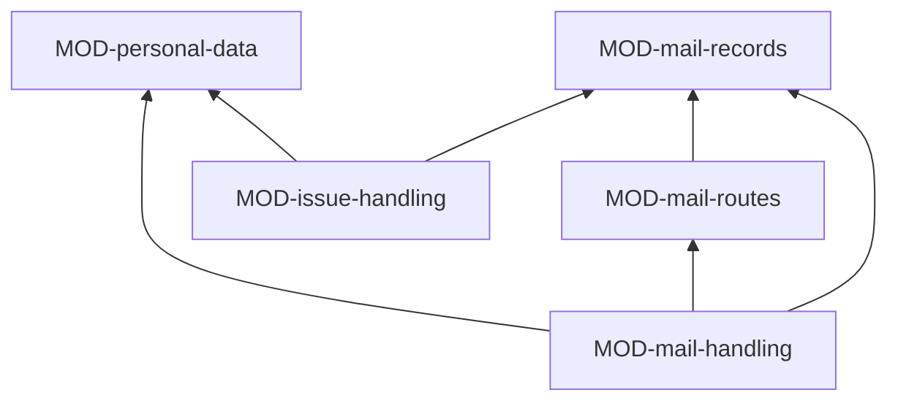

# ARC-044 Issues and mail

## Context

Software evolves through issues: filed by a person, or created from mail that reports a fault or asks for a change
(UC-012, UC-038). A mail's people must never reach a repository or an issue: the mail stays in the mailbox, an issue
names it only by a pseudonymous identifier, report data enters only rewritten without persons and checked by three
models, and only a person's click creates an issue or sends a reply (UC-038, UC-039). A mailbox is reached through its
provider's web API — Microsoft 365 — or, for every other mailbox, through the Bridge (UC-037). An issue is handled as a
bug, fixed under a regression test, or as a change, which enters through the SPEC first (UC-012), and either can move
into the backlog (UC-033).

## Decision

Issues and mail is a service of ARC-037, above Process and Specification and design: **the issue tracker is the only
record of a mail's handling, the mailbox the only store of mail, and every text from a mail passes a search for its
people before it is written anywhere**. Mailbox operations go through one interface with two routes as plug-ins: the
provider's web API from the page, and IMAP and SMTP through the Bridge. Its jobs — proposing issues from mail, rewriting
report data without persons, checking a text for persons, drafting replies, analysing an issue, fixing a bug — are kinds
in the job catalogue (ARC-046), run by the one job runner; this subsystem offers them their recipes, checks and writers
as strategies — above all the search of a text for the people of its mail, which every text from a mail passes. Its
settings files are documents of the common shape, defined by schemas (ARC-048).

### Responsibility within the system

Reaching a mailbox read-only and sending only what a person released; naming mails by identifier and keeping their
handling in issues — lists, notes, labels —; keeping personal data out of every repository and issue; turning mails
into issues and closed issues into replies; analysing an issue as bug, change or not reproducible, and moving it into
the backlog; the product's settings for pseudonymisation and the collaborators who consented to be named.

### The interface it offers

| Module | Functions other subsystems use |
|---|---|
| MOD-mail-routes | `routeFor`, `signIn`, `mailbox`, `providerLinks`, `Mail`, `Draft`, `DraftRef`, `ShownMail` |
| MOD-mail-records | `mailId`, `listedMailIds`, `noteText`, `notesOf` |
| MOD-personal-data | `personHits`, `checkersFor`, `settingsSchemas`, `pseudonymisationOf`, `namedPersonFindings`, `privacyStrategies` |
| MOD-mail-handling | `readNewMail`, `decideMail`, `repliesDue`, `storeReplies`, `sendReply`, `askReporter`, `noReply`, `mailStrategies` |
| MOD-issue-handling | `confirmClass`, `backlogItemFrom`, `moveToBacklog`, `closeWithLinks`, `issueStrategies` |

### Its modules

| Module | Folder | Responsibility |
|---|---|---|
| MOD-mail-routes | `src/mail-routes/` | one mailbox interface over two routes: Microsoft Graph, opened by the provider's sign-in in the page with exactly `Mail.ReadWrite`, `Mail.Send` and `offline_access`; IMAP and SMTP through the Bridge with the password for one request. Reading changes nothing; drafts are stored in the mailbox's Drafts folder; a draft is sent only with the confirmation of the exact mail shown |
| MOD-mail-records | `src/mail-records/` | the identifier `MAIL-` and its derivation; the list of identifiers in an issue; the notes in an issue's comments — reply sent, question sent, no reply — with identifier and date only; matching a thread without a model; which mails are still undecided |
| MOD-personal-data | `src/personal-data/` | the people of a mail and the search of a text for them, as a check every text from a mail passes; the choice of three checkers of three models, none of them the rewriter, at places the mailbox allows; the schemas of the product's `docs/settings.md`, with pseudonymisation on unless switched off, and of its `docs/collaborators.md`; the check that a generated artifact names a person only by account or with consent; the recipe of report data for rewriting |
| MOD-mail-handling | `src/mail-handling/` | reading new mail and leaving decided mails out; a person's decision on a mail — create an issue, add to an issue, not an issue —; the replies due from closed issues and answers received; storing, sending and noting replies; asking a reporter; the recipes and writers of proposing issues and drafting replies |
| MOD-issue-handling | `src/issue-handling/` | the recipe of an issue with the requirements, use cases and tests it touches, for its analysis and for fixing a bug test-first — never a mail —; confirming its class; the backlog item prefilled from an issue; closing an issue with links |

MOD-mail-routes reaches the Bridge through Access's Bridge client. For a change, MOD-issue-handling's recipe gives the
issue, with its touched requirements, to the job kind that changes requirements, so the queue it writes names the issue
(ARC-041); for the backlog, it prefills an item that Process's MOD-work-plans writes.

### The formats it owns

The mail identifier, the list of identifiers in an issue and the notes in its comments (MOD-mail-records); the mailbox
connection's fields, kept by Access in the browser (MOD-mail-routes); the schemas of the product's settings file and
collaborators file (MOD-personal-data). The prompts and output schemas of the mail and issue kinds are in
MOD-job-catalogue.

## Alternatives

- **Copies of mails, or a list of reporters, in a repository.** Rejected: `MAIL STAYS IN THE MAILBOX`; the issue is the
  only record of a mail's handling.
- **IMAP from the browser through a web proxy.** Rejected: a proxy would be a server of Agent M's, and the password would
  pass through it.
- **One model checking rewritten texts for persons.** Rejected: `A REWRITTEN TEXT IS CHECKED BY THREE LLMS`, none of them
  the rewriter.

## Consequences

- Without a mailbox connection in this browser, the mail pages say so; issues still work.
- A mail filed into a folder the connection does not name cannot be found again until the folder is named.
- Every issue text from a mail costs a rewrite and three checks.
