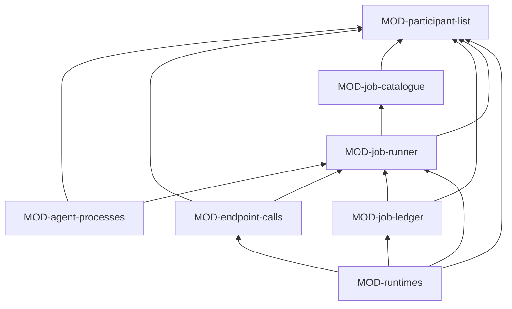

# ARC-046 Participants and jobs

## Context

Most of Agent M's work is done by participants — people, model endpoints, CI agents, CLI agents and sandboxed agents —
in jobs: deriving requirements, drafting use cases or an architecture, reviewing it, planning, implementing, generating
and running tests, analysing issues, proposing issues from mail, rewriting report data and checking it for persons,
drafting replies, closing a sprint. Every such job has the same shape: check that it may start, assemble what the
participant must see, check that it fits, state what is sent where, send it, check what comes back — by rules, and by
reviewing participants — and send the findings back until the draft passes or a fixed limit is reached, write the
result, and leave a record. The same job must run in the browser tab, in CI and through a Bridge (`ONE DEFINITION, THREE
DRIVERS`), and its state must be derived from records and runtimes, never stored (`PROGRESS AND JOB STATE ARE DERIVED,
NOT STORED`).

## Decision

Participants and jobs is the layer between the services and the bottom layers of ARC-037: **one job runner, shared by
every subsystem and both programs, that interprets every kind of job from data**.

- **Job kinds are data.** Every kind — about twenty-five — is one folder in MOD-job-catalogue: its definition (the
  capabilities its participant needs; its preconditions; its input, as named recipes; its prompt and output schema; its
  checks; its reviewing participants and how they must differ from the drafter; the gates it can reach; its writer), and
  its prompt and schema as data files. They exist exactly once (`ONE DEFINITION, THREE DRIVERS`); a new kind that reuses
  existing steps is a new folder, and no code changes (`THE CATALOGUE IS DATA`, `OPEN FOR EXTENSION, CLOSED FOR CHANGE`).
- **The steps that need knowledge are strategies.** A definition names its recipes, checks and writers; each is a
  strategy provided by the module that owns the knowledge — the SPEC with its open queues by MOD-spec-changes, a source
  version's excerpt by MOD-source-register, the inputs of an implementation step by MOD-run-planner, the queue-entry
  writer by MOD-spec-changes, the open-file writer by MOD-artifact-edits, the search for a mail's people by
  MOD-personal-data, and so on. Each such module offers its strategies under names; the drivers register those of the
  modules they include. The runner itself knows none of them.
- **The correction loop is part of the runner**, for every kind: checks and reviewing participants produce findings in
  the one compiler form; errors go back, warnings go back to be fixed or justified, what a person decides never goes
  back; the loop stops at no finding, at its limit, or when a round changes nothing; every round is kept.
- **A participant driver** sends a job's input to one participant and returns its answer: a model endpoint
  (MOD-endpoint-calls), a coding-agent process on the machine (MOD-agent-processes, in CI and in the Bridge), or an
  agent on a Bridge (MOD-runtimes, over Access's Bridge client). These are the strategies of one driver interface. A
  person is no driver; a person decides on the pages.
- **A job is queued** by committing its start record to the repository of the product it works on; the route it names
  takes it by a commit made only on the head it read, so two drivers never take the same job. A job that reaches a gate
  appends that it waits there and stops; it is resumed when the gate's record exists. Its end record closes it. Its
  state is derived from its record and, until it has ended, from the live state its runtime reports.

### Responsibility within the system

Who may do a job and where its data may go; every kind of job, defined once as data; how any job is prepared, run and
corrected; how jobs are recorded, identified, taken, resumed, cancelled and retried; and what state, log and cost each
job has, across every product.

### The interface it offers

| Module | Functions other subsystems use |
|---|---|
| MOD-participant-list | `Participant`, `participantSchema`, `eligible`, `differs` |
| MOD-endpoint-calls | `endpointDriver`, `testEndpoint`, `diagnoseEndpoint` |
| MOD-agent-processes | `Agent`, `installedAgents`, `agentDriver`, `testAgent` |
| MOD-job-runner | `Strategies`, `JobContext`, `Part`, `Prepared`, `JobResult`, `registerStrategies`, `prepareJob`, `runJob`, `writeResult`, `provenanceLines` |
| MOD-job-catalogue | `kindOf` |
| MOD-job-ledger | `RecordPart`, `JobRecord`, `JobRow`, `newJobId`, `startRecord`, `appendToRecord`, `takeJob`, `jobState`, `listJobs`, `recordsNewestFirst`, `jobCost` |
| MOD-runtimes | `ResourceNeed`, `routesFor`, `queueJob`, `runOnTab`, `liveState`, `jobLog`, `cancelJob`, `retryJob`, `jobWorkflowFiles`, `routeStrategies` |

### Its modules

| Module | Folder | Responsibility |
|---|---|---|
| MOD-participant-list | `src/participant-list/` | the schema of the instance's `docs/participants.md`: the five types, model, context size and price, capabilities, processing place, route; which participants may do a job — capabilities, places a source or a mailbox permits —, and that a reviewer or checker differs from the drafter in participant and model |
| MOD-endpoint-calls | `src/endpoint-calls/` | the driver for OpenAI-compatible and Anthropic endpoints, in a browser or in Node; the test request; the reason a browser cannot call an endpoint, with the routes that would work |
| MOD-agent-processes | `src/agent-processes/` | in Node only: the coding-agent CLIs installed on the machine, and the driver that runs one with a task in a working folder — with the machine's own login, or in CI with its key from a secret — streaming its output and stopping it on cancel |
| MOD-job-runner | `src/job-runner/` | the interpreter of a job's definition: preconditions, recipes, fitting the parts to the participant's context, every destination and what goes there, the correction loop with checks and reviewing participants, the gates, the writer; the registry of strategies; the provenance lines of its commits |
| MOD-job-catalogue | `src/job-catalogue/` | every job kind as data, one folder each, with its definition, prompt and output schema; the schema of a definition |
| MOD-job-ledger | `src/job-ledger/` | the job record under `docs/jobs/`: identifiers never reused, a start, then appended parts — taken, gate reached, resumed, end —, never rewritten; taking a job; the seven states; the list across products; the records newest first, read only as far as a caller needs; the cost, never guessed |
| MOD-runtimes | `src/runtimes/` | the three routes — this tab, CI, a Bridge — behind one interface: which routes a participant has, queueing, running on the tab with the driver of an endpoint or of an agent on a Bridge, resuming, live state, log, cancel, retry; the job workflow a product needs on GitHub or GitLab; the writer that checks and records a coding participant's branch and pull request |

The drivers implement the `Driver` type MOD-job-runner defines, so they point to it; the runner receives them, and the
strategies, from the program that composes it. MOD-runtimes also uses Access: the repository host to queue, take and
cancel CI jobs and read their state, and the Bridge client to hand jobs to a Bridge. The CI route's job workflow is
started by the push of a start record; it is not the product's test configuration, which starts no run for a commit of
job records only (ARC-043).

### The formats it owns

The participant list's schema (MOD-participant-list); the job definition and every kind's definition, prompt and output
schema (MOD-job-catalogue); the strategy and driver types, the round record of the correction loop and the provenance
lines of a commit (MOD-job-runner); the job record's schema (MOD-job-ledger); the job workflow files (MOD-runtimes). The
schemas are read by MOD-documents (ARC-048).

## Alternatives

- **A module per kind of job, or per kind of drafted artifact.** Rejected: they would repeat the same pipeline with other
  data; the differences between kinds are data and a few strategies, so they are kept as such (`DON'T REPEAT YOURSELF`).
- **Kinds as code in the services that own their artifacts.** Rejected: the prompts and schemas would be spread over many
  folders and each service would re-implement the sequence of a job; one catalogue keeps every definition in one place.
- **Kinds known to the runner by name.** Rejected: every new kind would change the runner; with strategies under names, a
  service adds a step without touching this subsystem.
- **Jobs kept in the runtime only — the CI service's runs, the Bridge's memory.** Rejected: a job is recorded in its
  product's repository, and its state survives a closed tab and a restarted Bridge only there.
- **Truncating input that does not fit.** Rejected: nothing is left out silently; the job is not sent and the person is
  told what does not fit.

## Consequences

- A new kind of work is a folder of data, plus a strategy only where a step needs knowledge no module offers yet.
- A job taken by CI runs with the person's token and the agent's key from CI secrets; one taken by a Bridge runs with the
  computer's own logins; nothing of the browser's store reaches them.
- A job running in a tab dies with the tab; its record then shows it as ended without record, and it can be retried.
- Every commit a job makes names the Agent M version, the participant and the model; the artifacts it writes name none
  of them.
