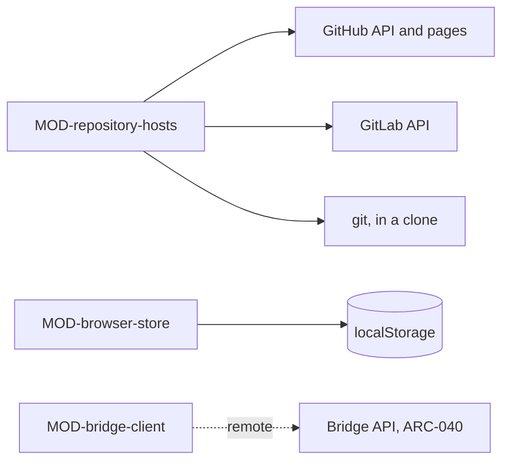

# ARC-047 Access to the repository servers, the browser's store and the Bridge

## Context

Agent M has no server, so everything it keeps lies with others: the repositories on GitHub or a GitLab server, the
configuration in the person's browser, and the Bridges on the person's computers (ARC-037). Each call to them can fail in
ways a local call cannot — a refused or expired token, a used-up rate limit, a branch that moved, a Bridge that is not
running, a browser that blocks the call — and each failure must be named, not reported as a generic error (`A REMOTE
INTERFACE NAMES HOW IT FAILS`). Tokens, keys and passwords must go only where they belong.

## Decision

Access is the layer of adapters at the bottom of ARC-037's layers, beside the artifact model. **Every call that leaves
the running code, except to a model endpoint, a mail provider or a registry, goes through Access**; the three
exceptions belong to the subsystem whose function they serve (ARC-046, ARC-044, ARC-045). Access uses no other subsystem;
it speaks, as a client, the protocol the Bridge defines (ARC-040).

**One repository interface, shared by every program.** A repository is reached through one host interface with three
adapters as plug-ins: GitHub's REST API and GitLab's REST API, used in the browser with the person's token, and a local
clone through the `git` command, used in Node — by the Workflows in a CI checkout, with the person's token from a CI
secret, and by the Bridge, with its computer's own git login. Every service therefore reads and writes the same way in
all three drivers, and a commit on an expected head means the same everywhere: in a clone it is a push that only
fast-forwards.

### Responsibility within the system

Reading and writing repositories on GitHub and GitLab behind one interface, with GitHub's web pages as the fallback
without a token; keeping one person's configuration in their browser, with export and import; and reaching a Bridge on
loopback or through the jump host, including the tunnel commands and the jump host's web-server configuration a person
needs to set this up.

### The interface it offers

| Module | Functions other subsystems use |
|---|---|
| MOD-repository-hosts | `Host`, `Snapshot`, `PullRequest`, `PullRequestFacts`, `CiRun`, `Issue`, `RepositoryInfo`, `parseAddress`, `connect`, `readSnapshot`, `readHistory`, `listTags`, `repositoryInfo`, `createBranch`, `commitFiles`, `openPullRequest`, `listPullRequests`, `pullRequestFacts`, `mergePullRequest`, `listCiRuns`, `startWorkflow`, `cancelCiRun`, `ciRunLog`, `listIssues`, `createIssue`, `commentOnIssue`, `setIssueLabels`, `setIssueState`, `createTag`, `listReleaseAssets`, `publishRelease`, `setPipelineSchedule`, `issueCounts`, `webLinks` |
| MOD-browser-store | `openStore`, `readSetting`, `writeSetting`, `clearSetting`, `clearEverything`, `listSettings`, `exportSettings`, `importSettings`, `readExport`, `expiringSoon`, `secretValues` |
| MOD-bridge-client | `Bridge`, `JumpHost`, `RemoteSession`, `TunnelPlan`, `bridgeAt`, `pair`, `testBridge`, `handOver`, `askAgent`, `bridgeJobs`, `bridgeJobLog`, `cancelOnBridge`, `mailCall`, `probe`, `allocatePort`, `tunnelCommands`, `proxyConfiguration` |

Every function that crosses the network says so in its module file, and names its failures: a token refused (with the
token's name and the page on which it is renewed), a permission missing, a rate limit used up (the account's or the
network's, with its reset time), a branch moved since it was read, not found, not reachable (with the reason a browser
gives or the Bridge reports).

### Its modules

| Module | Folder | Responsibility |
|---|---|---|
| MOD-repository-hosts | `src/repository-hosts/` | one host interface with three adapters as plug-ins — GitHub's REST API, GitLab's REST API, a local clone through `git` (Node only) —: snapshots, history, commits on an expected head, branches, pull or merge requests, CI runs, issues, tags, and the addresses of the server's own pages — token pages prefilled, secrets, new-file pages for the fallback without a token. It refuses a commit that would write a configured secret. |
| MOD-browser-store | `src/browser-store/` | the person's configuration in `localStorage`, under the instance's key: tokens with their expiry, products, endpoints and keys, the Bridge's address and token, the mailbox connection, the jump host and remote sessions, the mails marked *not an issue*; a clear that removes the entry; export with every secret, optionally locked with a passphrase, and import; the export file's format, which the Bridge reads too |
| MOD-bridge-client | `src/bridge-client/` | the page's client of the Bridge API, directly on loopback or through the jump host's HTTPS address with its web-server login; jobs handed over, and drafting requests to an agent on a Bridge; the allocation of remote sessions' ports; the tunnel commands for computers without a Bridge and the configuration of the jump host's web server |

The three modules do not use each other: a caller gives Access's repository functions the token it read from the
browser's store, and gives the Bridge client the address and token it read there.

## Alternatives

- **Each service calling the repository servers itself.** Rejected: the rules on tokens, rate limits, refused commits
  and the fallback without a token would be repeated in every service (`DON'T REPEAT YOURSELF`).
- **A client library for each server's API.** Rejected: Agent M uses a small subset of each API through `fetch`, which
  every driver has; a library would be one more dependency of every page, and the failures Agent M must name would still
  have to be told apart by its own code (`KEEP IT SIMPLE`).
- **Signing in to GitHub through an OAuth app instead of a pasted token.** Rejected: `THE GITHUB TOKEN IS PASTED, NOT
  OBTAINED BY LOGIN`; an OAuth app needs a server for its secret.
- **IndexedDB or cookies for configuration.** Rejected: `CONFIGURATION IS STORED IN LOCALSTORAGE, NOT IN A COOKIE`.

## Consequences

- A product on GitLab and one on GitHub look the same to every service, and so does a clone in CI or on a Bridge's
  computer; a further kind of server is one more adapter.
- Every write is a commit on an expected head, so concurrent writers never overwrite each other.
- The person's settings exist only in their browser; another browser needs an export or the setup again.
- Every Pages site of the same owner can read the browser's store; the settings page says so before anything is stored
  (`THE SHARED PAGES ORIGIN IS DISCLOSED`).
