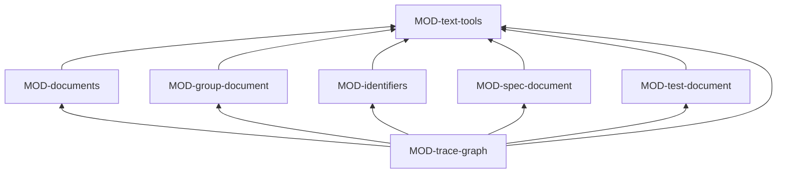

# ARC-048 The artifact model

## Context

Every subsystem reads the same kinds of file. Most are Markdown documents of one shape — front matter, then named
sections, or a register as a table — : use cases, architecture decisions and module files, plan steps and backlog items,
approval, gate, job and result records, and the registers of participants, sources, resources, process models,
declarations, schedules and settings. Three are of a shape of their own: the SPEC, with its requirements inside its
sections; the declarations of test cases inside test files; and the group files with their nested lists. Every artifact
is identified, names its origin and is linked to others only by identifiers. From these texts alone follow the checks a
person or a correction loop needs, the traceability matrix that is never stored, the coverage gaps, the module view, the
impact lists of a change, and whether a drafted candidate is new, a change, a duplicate or a conflict. All of it is needed
in the browser, in CI and in the Bridge (ARC-037).

## Decision

The artifact model is the subsystem at the bottom of ARC-037's layers: **pure functions over texts, and one interpreter
for every document of the common shape**. Given texts — or a snapshot's function that reads them — it returns parsed
structures, findings and derived graphs. It performs no input or output, keeps no state, uses no other subsystem, and
runs unchanged in both programs and in CI.

**Documents from schemas.** Instead of one reader, writer and checker per format, MOD-documents interprets a **schema**:
a small data file that states a document kind's file name pattern, its front matter keys with their types, its required
sections, or a register's columns. The schema of each format lives in the folder of the module that owns the format, so
every format is still defined once, by its owner (`A DATA FORMAT IS DEFINED ONCE`): the schemas of use cases, decisions,
module files and items in MOD-documents' own folder; the schema of an approval record in MOD-approvals' folder; of a job
record in MOD-job-ledger's; and so on. A new format is a schema, not new code.

**Checks in two kinds.** What a schema can say — a missing section, a key of the wrong type, an identifier that does not
match its file name — MOD-documents checks for any document. What needs several artifacts at once — a realised name
that matches no requirement, a module interface used but not provided, a cycle, an item naming a module the
architecture does not describe — MOD-trace-graph checks on the graph. Requirements and test declarations are checked by
their own modules.

**Candidates.** Whether a drafted candidate is new, a change of a named artifact, a duplicate of one or a conflict with
one is decided the same way for requirements, architecture decisions, use cases, items and tests: candidates are merged
among themselves first, exact duplicates are found without a model by the key each kind's schema names, and the model's
class is kept only where no rule decides. MOD-documents does this once for every kind.

### Responsibility within the system

Defining and interpreting the formats of the review layout, and deriving from texts alone identifiers, checks, the
classes of candidates, the trace graph, coverage gaps, impact lists and the module view's rows.

### The interface it offers

| Module | Functions other subsystems use |
|---|---|
| MOD-text-tools | `Finding`, `DiffLine`, `parseFrontMatter`, `blobSha`, `sha256`, `lineDiff`, `finding`, `formatFinding` |
| MOD-documents | `Schema`, `Document`, `loadSchema`, `readDocument`, `writeDocument`, `documentFindings`, `readRegister`, `appendSection`, `classifyCandidates`, `artifactSchemas` |
| MOD-identifiers | `kindOfIdentifier`, `identifiersIn`, `nextIdentifier`, `instanceOfPagesAddress` |
| MOD-spec-document | `Requirement`, `parseSpec`, `requirementFindings`, `sectionText`, `replaceSection`, `requirementNamesIn`, `renamedRequirements`, `specSkeleton` |
| MOD-test-document | `TestDeclaration`, `testDeclarations`, `testFindings` |
| MOD-group-document | `parseGroupFile`, `groupFileText`, `applyMoves`, `hierarchy` |
| MOD-trace-graph | `Graph`, `traceGraph`, `graphFindings`, `tracesTo`, `coverageGaps`, `requirementImpact`, `architectureImpact`, `moduleOrder`, `moduleRows`, `compareGraphs`, `selfSufficiencyFindings` |

### Its modules

| Module | Folder | Responsibility |
|---|---|---|
| MOD-text-tools | `src/text-tools/` | the text primitives every format uses: front matter, git blob SHA-1 and SHA-256, line differences, the finding in compiler form, the marks of history in a document |
| MOD-documents | `src/documents/` | the schema language and its interpreter: reading, writing and checking every document of the common shape and every register table; appending a section to a record; classifying candidates against existing artifacts; the schemas of use cases, architecture decisions, module files and items |
| MOD-identifiers | `src/identifiers/` | the identifier scheme, where each identifier stands, the next free identifier of a kind — never one the version history holds —, references by position |
| MOD-spec-document | `src/spec-document/` | the SPEC: sections and requirements in their form, their checks, a section's exact bytes and its replacement byte for byte, names and renames, the skeleton of a new product's SPEC |
| MOD-test-document | `src/test-document/` | the declaration of a test case in any test file — identifier, level, what it guards, the module it exercises, precondition, input, expected result — and its checks |
| MOD-group-document | `src/group-document/` | group files: the nested groups of one kind, moves, and the hierarchy with every item in one place |
| MOD-trace-graph | `src/trace-graph/` | the graph of all identifiers and what names them; the checks across artifacts; traces, coverage gaps, impact lists, the order of modules by their uses, the module rows, the comparison of two versions, references to what exists only inside Agent M |

### The formats it owns

Front matter and the finding (MOD-text-tools); the schema language, and the schemas of use cases, architecture
decisions, module files and items (MOD-documents); the requirement form of the SPEC (MOD-spec-document); the test
declaration (MOD-test-document); the group file (MOD-group-document).

## Alternatives

- **One reader, writer and checker per format.** Rejected: more than a dozen formats share one shape, and each would
  repeat the same code (`DON'T REPEAT YOURSELF`); a schema per format keeps each format with its owner without repeating
  the code that reads it.
- **The formats in the services that write them, read with their own code.** Rejected: the trace graph needs the
  traceable formats at once, so services would depend on each other merely to read.
- **A general schema library such as JSON Schema with a YAML parser.** Rejected: the front matter in use is a small
  subset and the sections are Markdown; a schema language of a few types is simpler than adapting a general one to
  Markdown (`KEEP IT SIMPLE`).
- **A stored traceability matrix.** Rejected: `THE TRACEABILITY MATRIX IS DERIVED`.
- **Classifying candidates separately for each kind of artifact.** Rejected: the rules are the same for requirements and
  architecture decisions (`THE DERIVATION RULES HOLD FOR ARCHITECTURE`), and for use cases, items and tests only the key
  differs.

## Consequences

- Every derivation can be tested on fixture texts alone, in milliseconds (`DESIGN TO TEST`).
- A new document kind, record or register is a schema file in its owner's folder; MOD-documents does not change.
- A format that does not fit the common shape keeps a module of its own; today that is the SPEC, test declarations and
  group files.
- The cost of deriving the graph is paid on every page that needs it; the graph is built from one snapshot at a time.
