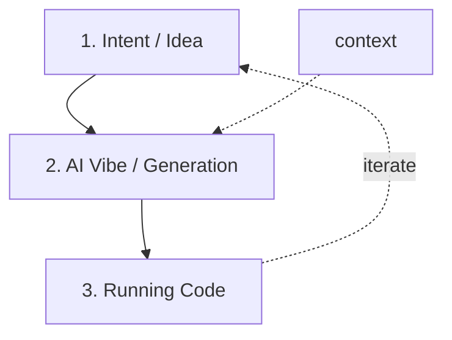

# Chapter 1 — Vibe Coding and the New Software Landscape

**Andreas Maier, Yipeng Sun, Siyuan Mei, Aline Sindel, Sally Zeitler, Vincent Christlein, Adarsh Bhandary Panambur, and Moritz Zaiss**
Friedrich-Alexander-Universität Erlangen-Nürnberg (FAU)

## Abstract

This chapter introduces vibe coding as a high-autonomy development style within the broader field of artificial intelligence (AI)-assisted software engineering. It distinguishes technology from practice: AI-assisted coding describes the tool ecosystem, whereas vibe coding describes an intent-first, low-friction workflow that often minimizes line-by-line review. Drawing on current adoption indicators and practical project experience, the chapter summarizes where these methods already deliver strong value, including prototyping, data workflows, and technical content production, and where human oversight remains essential, especially for security, correctness-critical systems, and novel algorithmic work. The chapter further outlines advanced capabilities such as the Model Context Protocol (MCP), agentic workflows, and tool-augmented execution, and closes with concrete guidance for balancing speed, quality, and responsibility in modern software development.

## Vibe Coding: Origins, Meaning, and Context

This book grew out of our practical experience at the Pattern Recognition Lab, Friedrich-Alexander-Universität Erlangen-Nürnberg (FAU). We were interested in exploring this topic very early, because we already saw fascinating progress in programming with AI when using early large language models (LLMs). Our first instance of programming with LLMs started in the Summer Semester 2023.

Around that time, the Professor of Software Engineering at FAU, Prof. Francesca Saglietti, retired with the Winter Term 2023/24 and supported us in continuing the class "Introduction to Software Engineering". This is also why we came to teach it. The first time the lab taught the class was in the Winter Semester 2023/24. As a machine-learning lab, we saw a clear opportunity in that situation. First, we wanted to update bachelor-level software-engineering teaching to match the newest developments in AI-assisted development. Second, we wanted to bring this topic to a broader audience than computer-science students alone. The result is the textbook you will, hopefully, enjoy.

At the same time, we are still computer scientists, so we feel the urge to explain a bit of the coding and mathematical background. For that reason, optional deep-dive material is marked as *Geek Boxes*.

> **Geek Box: What Geek Boxes are for**
>
> Geek Boxes are intentionally optional add-ons. They point to additional material and, at times, introduce math that is *not* required to follow the main chapter narrative.
>
> The purpose is to keep the core text linear and readable while still offering depth where it helps. Geek Boxes may include details that require significant training in mathematics or computer science, but they also cover interesting use cases and events that have shaped software engineering, machine learning, and AI.
>
> We started this format in our Springer Open textbook *Medical Imaging Systems: An Introductory Guide* [Maier 2018], and we continue it here for the same reason: optional depth should be available, but never a barrier to reading the main storyline.

### What Vibe Coding Means

Vibe coding refers to developing software by describing intent in natural language and letting an AI system generate and refine the implementation. The term was popularized by Andrej Karpathy in February 2025 [Karpathy 2025], and quickly became part of wider technology discourse [IBM 2025]. In his own words, the mindset is to "give in to the vibes" and move fast by accepting AI output with minimal friction. Karpathy was formerly Director of AI at Tesla, where he led the neural-network effort for Autopilot in one of the most visible industrial AI programs worldwide. Furthermore, he was a founding member of OpenAI and contributed to shaping early directions in modern deep learning. He also became highly influential as a technical communicator through his public explanations of how neural systems are trained and deployed in practice. That combination of industrial leadership and public influence helped the phrase spread very quickly.

The key shift is from syntax-first programming to intent-first programming. In traditional workflows, developers write and inspect code line by line. In early AI-assisted workflows, developers still reviewed generated code in detail, even if AI accelerated drafting. In vibe coding, by contrast, the workflow can become: describe goal, accept generation, run, and iterate. This became more feasible as AI tools started integrating directly with compilers, execution environments, and automated correction loops, including automatic handling of compiler warnings and errors. Concretely, the model can generate a draft, execute it, read diagnostics, and revise code until it at least runs consistently. That loop is exactly why the barrier to producing working software has dropped so quickly.

This tight generate–execute–diagnose–repair cycle is also the mechanism that turned language models from sophisticated autocomplete engines into genuine *agents*. Before models could run code and observe failures, they could only *suggest*; once they could act on error messages in a closed loop, they could *iterate autonomously*. It is why copy-pasting from a chatbot differs fundamentally from agentic environments, where the model operates within an integrated development loop.

A critical distinction is necessary: AI-assisted coding and vibe coding are not the same. AI-assisted coding is a broad technological category: AI helps humans write code, documentation, tests, or refactorings. Vibe coding is a narrower behavioral practice within that category.

In AI-assisted coding, the human usually leads and verifies frequently. The goal is productivity while preserving strong control, which is especially important for security-sensitive, correctness-critical, or compliance-relevant systems. In vibe coding, the AI takes a more dominant execution role while the human provides direction and high-level judgment. This can maximize creative speed and flow, but it also increases risk if used without safeguards.

Put differently: AI-assisted coding is the technology stack. Vibe coding is one cultural mode that uses the stack.

### Historical Context: Two Parallel Evolutions

The current moment is best understood as two parallel evolutions that influenced each other throughout the last years: a technological evolution in tools and capabilities, and a cultural evolution in how developers think and work with those tools.

Technological evolution progressed from autocomplete-style suggestions (before 2021) to conversational coding, multimodel integrated development environment (IDE) support, and then agentic tool integration through standards such as the Model Context Protocol (MCP), a standardized interface that lets AI systems attach structured context and call external tools in a controlled way, in 2024. By 2025, systems such as generative pre-trained transformer (GPT)-5 and skill-based agent environments enabled more autonomous software workflows.

Cultural evolution, in parallel, moved from manual syntax control toward intent expression. Starting in 2022, prompt engineering became a core practice: developers learned that carefully phrased instructions, role settings, and explicit reasoning cues could improve task performance substantially [Wei 2022; Kojima 2022; Wang 2022; Yao 2022]. Prompt engineering means giving the model explicit goals, constraints, and context so the generated output aligns with engineering intent rather than only syntactic plausibility. With the introduction of dedicated reasoning models in late 2024 and 2025, many handcrafted reasoning prompts became less central because these models increasingly perform multi-step reasoning internally and apply similar decomposition strategies on their own [OpenAI 2024; DeepSeek 2025].

> **Geek Box: The ballad of the wealthy prompt engineer**
>
> In 2022, early prompt engineering grew out of one robust observation: Many LLMs solved reasoning tasks more reliably when they were explicitly asked to reason before producing the final answer.
>
> **Zero-shot Chain-of-Thought.** Kojima et al. showed that the short cue "Let's think step by step" could improve reasoning performance even without worked examples [Kojima 2022]. In their work, they simply added the phrase before each answer and demonstrated significant increases in performance on diverse benchmarks. This observation clearly indicated how important the right instructions to early LLMs were.
>
> **Few-shot Chain-of-Thought.** Wei et al. demonstrated that including a few worked reasoning examples in the prompt improved difficult tasks further [Wei 2022]. In day-to-day use, teams often prepended two or three mini examples in the same style as the target task, for instance short input-output refactoring examples, before asking the model to solve a new case.
>
> **Self-consistency.** Wang et al. replaced one reasoning trace with multiple sampled traces and selected the most consistent outcome [Wang 2022]. In practice, this was often applied by asking for five independent solutions to the same task and selecting the majority answer or the one with the strongest intermediate checks.
>
> **ReAct.** Yao et al. combined reasoning and tool actions so the model alternated between thinking and acting instead of staying in one static completion [Yao 2022]. For coding workflows, this maps to loops like: reason about what is missing, run a retrieval or test tool, observe the result, and then refine the next action — which turned out to be a key approach towards modern reasoning models.
>
> Early production prompts were often very long because teams tried to encode all relevant constraints directly in the context window, including role, style, edge cases, output schema, and domain background. This phase also created a short-lived hiring wave around the role name "prompt engineer," with reported salaries reaching roughly \$200,000 to \$335,000 in 2022 and 2023 [Bloomberg 2023; Time 2023].
>
> Reasoning models then compressed much of this manual craft into the model itself. Guidance for newer reasoning-focused systems increasingly emphasizes clear and compact instructions over elaborate prompt choreography [OpenAI 2025]. In that sense, the rise of prompt engineering was real, but its peak centrality faded almost as quickly as it appeared.

## AI-Assisted Coding: Industry Adoption

By 2025, AI-assisted coding had moved from an experimental workflow into everyday engineering practice. This shift is visible at startup scale, enterprise scale, and individual developer scale at the same time. In other words, adoption is not happening in one niche corner of software engineering. It is happening across the full ecosystem.

One prominent signal came from Y Combinator (YC), a startup accelerator. "YC W25" refers to Y Combinator's Winter 2025 startup batch. Reports from that cohort suggested unusually high AI code shares, with about 25% of startups described as building with roughly 95% AI-generated code and around 82% of the batch estimated to be AI-focused [Mehta 2025; HighSignal 2025]. GitHub Copilot, in parallel, exceeded 15 million users [Microsoft 2025c], while enterprise adoption became common in large organizations [Microsoft 2025b; Stack Overflow 2025].

The practical implication is that AI support is no longer a niche application. It is able to increase throughput and influence workflow economics drastically. Studies report substantial but task-dependent productivity gains, often in the range of 20% to 55% [arXiv 2024], with measurable day-to-day time savings in routine development [UK Gov 2024]. Public statements from major technology companies further indicate that a non-trivial share of production code is now AI-assisted [Microsoft 2025d; Google 2025]. Developer surveys point to broad mainstream usage, with roughly half of respondents using AI tools daily and a clear majority using or planning to use them [Stack Overflow 2025].

**Figure 1.1.** A timeline (2021–2025) summarizing AI-assisted coding adoption and impact. The upper axis marks eras: the Copilot era (2021), chat coding (2023), and MCP/agentic workflows (2024). Stat boxes report: YC W25 (25% of startups at 95% AI code, 82% AI-focused), global reach (>15M Copilot users, 85%+ of the Fortune 500 using AI), developer usage (51% daily, 84% use or plan to use), productivity (20–55% speedup, ~26 min/day saved), and big-tech code share (Microsoft 20–30%, Google >30%).

This adoption wave is also changing who does what during software development. In many teams, professional engineers spend less time on first-pass boilerplate and more time on architecture, interface design, review, and quality control. At the same time, people without formal software-engineering training can now build working tools much more easily than before. That is a real opportunity, because it lowers entry barriers and speeds up experimentation, but it also means output quality varies much more unless teams set clear standards.

A practical mental model is "AI as a junior developer." The AI can draft code quickly, especially for repetitive implementation work, while humans stay responsible for system boundaries, risk decisions, testing strategy, and final accountability. Put simply, speed comes from delegation, but reliability still comes from engineering discipline. This is why review, tests, and explicit acceptance criteria become even more important, not less.

Recent market indicators suggest this is no longer a niche pattern. One estimate reports that about 63% of AI coding tool users are non-developers [Second Talent 2025]. In parallel, YC startup reporting describes lean teams with unusually strong growth, where AI-heavy workflows appear to help convert ideas into shipped product much faster [CNBC 2025]. The core takeaway is that AI does not just accelerate coding. It also reshapes team composition and the distribution of engineering responsibilities.

## Advanced AI-Assisted Techniques

At this point, progress is not limited to text generation. Several advanced patterns now materially change engineering workflows.

**Skill-based workflow automation.** Skill systems pack reusable development procedures (for example deployment, testing, and code-review patterns) into shareable artifacts [Anthropic 2025b]. This makes team practices executable and reproducible.

**Model Context Protocol (MCP).** MCP provides a standardized way for AI systems to interact with external tools and resources, including files, application programming interfaces (APIs), and databases. A practical analogy is that representational state transfer (REST) helped standardize distributed software interfaces, while MCP is doing something similar for agent-tool interaction.

**Agentic workflows and tool augmentation.** Instead of a single prompt-response interaction, developers increasingly define multi-step pipelines where different agent actions run in sequence. These workflows can include compilation, testing, retrieval, transformation, and iterative correction.

**Vision support.** Vision-capable models can process screenshots and visual traces, which is useful for UI debugging, error interpretation, and interface-level diagnosis.

**Computer use.** New AI tools such as Claude Code [Anthropic 2025a] and OpenAI Codex [OpenAI 2025b] use LLMs from the cloud but execute scripts and compilers locally on the developer's machine. Claude Cowork [Anthropic 2025c] drives this even further and is able to steer advanced applications such as web browsers, mail clients, or calendars, effectively turning the AI into an operator of the full desktop environment rather than just a code generator.

In practical tooling, platforms such as n8n have popularized chart-based orchestration of these agent steps, where each box in a workflow can invoke a specialized action [n8n 2025]. This matters because multi-step logic becomes explicit: retrieval, transformation, validation, and delivery are represented as separate nodes instead of being hidden inside one large prompt. As a result, debugging, handover, and scaling become easier, since teams can inspect and replace individual steps without rewriting the whole pipeline. In contrast, agent skills map step-wise procedures into explicit code and markdown-based instructions and thereby offer similar functionality.

## Examples

In our day-to-day work, a practical stack includes frameworks such as *Claude Code* and related AI coding agents [Anthropic 2025a], Git-based repositories, high-performance computing (HPC) infrastructure (for example *Slurm* clusters), and LaTeX-based writing pipelines for papers and textbooks. The operational loop is simple: define intent, generate candidate implementation, execute, inspect outcomes, and iterate. In this setup, Git provides traceability, Slurm provides scalable execution for compute-heavy tasks, and the agent acts as a rapid implementation partner across both code and technical writing tasks.

**Figure 1.2.** The core intent-to-implementation loop.

This loop is effective because it keeps momentum high while still allowing targeted intervention when outputs are weak.

### Case 1: Data Processing and Structuring

A representative workflow starts with a very practical goal: make existing data usable. One example is a private DVD collection that exists only as a messy XLS sheet, or even as a photo of a shelf. The intent is simple: turn that raw input into a searchable website where one can query title, genre, release year, or availability.

The AI-driven path is usually straightforward. First, it extracts entries from the source, either by reading the spreadsheet columns or by applying vision-based text extraction to the shelf image. Second, it normalizes names, years, and categories into a clean table. Third, it generates a small backend and a lightweight web interface with search and filter functions. Fourth, it adds import scripts and basic validation so new DVDs can be added later without breaking the format.

A possible prompt for the given task is:

> *"From the attached shelf images, extract all visible DVD titles and create a clean dataset with fields for title, genre, year, and shelf position. Then generate a small searchable website with a filter bar and detail page for each DVD. Use a lightweight stack and include instructions to run locally."*

In this setup, the human mostly provides intent, checks whether extracted entries are correct, and validates the final website behavior. The AI handles repetitive implementation work and fast iteration.

> **Geek Box: From shelf photo to website: the DVD example in practice**
>
> For this example, we give the AI a shelf image plus a direct prompt that asks for title extraction, metadata cleanup, and a lightweight searchable website with detail pages. The agent reads the image, builds a structured dataset, creates the website files, and then iterates until the result runs locally. We then validate title quality and browsing behavior before accepting the output.
>
> The accompanying figure shows the workflow: on the left, the shelf photo and the generation prompt serve as inputs; on the right, two stacked screenshots of the generated website (a filterable list view and a per-DVD detail page) are the outputs, with arrows indicating the transformation from inputs to generated pages.
>
> The full source code and data for this website are publicly available at <https://github.com/akmaier/dvd_database>.

### Case 2: From Paper to Beamer Slides

Another highly effective workflow is slide generation from existing academic material. LaTeX is a text-based document system that represents sections, figures, tables, equations, and references through explicit commands. In practice, LaTeX is a programming language for document generation. This structure is exactly why LLMs can process LaTeX so well. The model can read it as organized text with clear semantic markers instead of trying to infer meaning from visual layout only.

For presentations, the usual target is the Beamer package, which is the standard LaTeX framework for slides. A practical workflow is to provide the paper sources, figures, tables, bibliography files, and a Beamer style template. The AI then maps paper sections to slide sections, compresses dense paragraphs into slide-friendly bullets, and reuses existing figures and tables by referencing the same assets and captions.

A typical prompt can be very direct:

> *"Create a 12-slide Beamer deck from this paper. Keep one core message per slide. Use the 7x7 rule with at most 7 bullet points and at most 7 words per bullet. Reuse key figures and tables from the paper where relevant. Preserve notation and keep references at the end."*

In practice, this reduces manual formatting work significantly. The human then focuses on narrative quality, pacing, and final message clarity. In our experience, this workflow can reduce preparation time by a factor of roughly three to four compared with fully manual slide authoring, and it often outpaces conventional slide-first workflows where many small visual edits consume most of the time.

### What Works Well and What Still Requires Careful Human Work

Most people currently use AI with short prompts for relatively simple tasks. They ask for utility scripts, quick refactorings, small UI components, documentation drafts, or first-pass data cleaning. That usage pattern is exactly where today's systems are strongest, because the goals are local, feedback is fast, and quality can be checked quickly.

The bigger challenge appears when teams try to scale this beyond individual productivity. Many developers are used to working alone or in small groups, and therefore have limited practical experience with large-scale coordination. This is where software engineering becomes central. Software engineering is much less about writing isolated code snippets and much more about the processes that align many developers, engineers, stakeholders, and users around shared quality targets.

The same process view is needed for agentic AI systems. At present, these systems are often used as isolated assistants. They are powerful but do not scale reliably without explicit orchestration, review gates, traceability, and integration standards. A practical rule from experience is this: AI accelerates what teams can already evaluate and govern. AI benefits from the same software-engineering processes, checks, and balances that human coders need. This is exactly why software engineering remains a key capability in the age of AI. Software processes are fundamentally about collaboration, and that makes them well suited for human-AI collaboration as well.

> **Geek Box: Adam Tornhill on AI-supported coding: acceleration without chaos**
>
> Adam Tornhill, founder and CTO of CodeScene [CodeScene 2026], presented *Next-Gen Software Development: AI-Acceleration without the Chaos* [Tornhill 2026] at the WASP Winter Conference [WASP 2026] in January 2026. The story is attractive because it starts where many teams are today: everyone sees acceleration, but few teams have stable rules for quality control. Tornhill's core argument is pragmatic. AI can increase throughput, but outcomes depend strongly on the health of the codebase.
>
> The public discussion around AI coding is often driven by strong claims, for example *No Human Programmers in Five Years? Stability AI CEO Thinks So* [Decrypt 2023], *AI Agents Outperform 98% of Human Programmers* [Winsome 2025], and *Mark Zuckerberg says AI will be doing the work of mid-level engineers this year* [Forbes 2025]. Tornhill contrasts that discourse with empirical evidence and benchmark context, including Sakana AI's ALE-Bench report [Sakana 2025]. The key point is not that AI is weak. The key point is that performance is highly context-dependent.
>
> The empirical center of the presentation is consistent with *Code for Machines, Not Just Humans: Quantifying AI-Friendliness with Code Health Metrics* [Borg 2026]. Lower code health is associated with higher break and defect risk when AI modifies code. This is exactly what software engineering has long observed for human teams as well. Weak structure increases risk and slows reliable change. Strong structure improves review, maintenance, and delivery quality [Tornhill 2022; Borg 2023]. In short, code health is a shared lever for both human and AI productivity.
>
> To make that risk shape concrete, Tornhill's chart plots projected AI break rate (0–1) against code health (1–10). A red "danger zone" band spans low code health where the break rate is high; a green "limited risk" band marks high code health. The curve drops steeply as code health improves — from roughly 0.6 at mid health down to about 0.18 at the highest health scores.

A natural question is how far this acceleration can go. If AI agents can already write code, run experiments, and evaluate results, can they also conduct the research itself? An early and influential demonstration is *The AI Scientist*, published in *Nature* in 2026 [Lu 2026]. Built by researchers at Sakana AI, the University of British Columbia, and the Vector Institute, the system uses a single agentic loop to autonomously generate research ideas, write and execute experimental code, analyze results, and produce complete scientific manuscripts in LaTeX — including a self-review step. In one notable result, an AI-generated manuscript scored 6.33 out of 7 in a blind peer review for a top-tier ML workshop, placing it in the top 45% of submissions; the authors withdrew the paper under a pre-established protocol before publication. The AI Scientist is, in essence, a single-agent autoresearch system: it closes the full cycle from hypothesis to paper without human intervention. Karpathy's autoresearch vision extends this idea further into a structured framework for automated discovery — not as a replacement for human scientific judgment, but as a principled meta-optimization loop.

> **Geek Box: Autoresearch — when the agent designs the experiment**
>
> Autoresearch, as exemplified by Karpathy's framework [Karpathy 2025b], is a meta-optimization system that operates over the joint space of problem formulations, model structures, and optimization procedures. Unlike classical optimization, which assumes a fixed search space, autoresearch dynamically constructs and evaluates candidate search spaces themselves, placing it conceptually closer to hyper-heuristics and genetic programming while extending them toward open-ended, program-generating research loops.
>
> **A controller of optimizers.** Within each iteration, autoresearch can instantiate and leverage conventional optimization methods — gradient-based, gradient-free, or combinatorial — tailored to the specific problem formulation it has generated. It does not replace classical optimization but orchestrates and composes it at a higher level, selecting or designing appropriate optimizers as part of the search process itself. Iterations may range from evaluating single candidate solutions, over parameter sweeps, to invoking sophisticated end-to-end optimization pipelines.
>
> **The loss function as the central degree of freedom.** A remaining central component is the definition of a loss or quality metric that guides the search. While this parallels classical optimization, it introduces a significant degree of freedom. In practice — analogous to human research processes — such objectives are often refined during investigation: additional constraints, regularization terms, or alternative evaluation criteria may be introduced as new insights emerge. Minimizing a given loss does not necessarily yield the most robust, general, or practically useful solution, but only the optimum with respect to that specific formulation.
>
> The central remaining challenge therefore lies in defining a meaningful and verifiable autoresearch objective that aligns with the intended real-world outcome. This is, in essence, the requirements-engineering problem that we will detail later in this book, restated at the research level: specifying *what* to optimize is harder than the optimization itself.

## Best Practices and Safety

At the operational level, the core safety principle is to keep humans in the loop. You do not need to audit every generated line, but you should validate behavior and maintain a strong intuition for what is plausible.

Concretely, productive practice includes version control, test coverage, clear specifications, and careful context provisioning. These are not optional extras. They are the same foundations used in large software projects with many developers and remain essential in AI-assisted workflows. In other words, requirements-engineering quality still determines downstream software quality, even when code generation is heavily automated. If the specification is vague, the generated implementation will optimize the wrong target quickly. If the specification is precise, automation amplifies the right outcome. As shown above, code health is as important for AI-assisted development as it is for human development.

Security deserves special attention. For prototype work, fast AI-driven loops are often ideal. For production systems, especially in regulated or security-critical domains, code review and explicit verification are mandatory. One should also never place sensitive information in prompts sent to externally hosted systems.

This is not a theoretical concern. In *Hacking Moltbook: The AI Social Network Any Human Can Control*, Wiz — a cloud security company — reported an exposed database with 35,000 emails, 1.5 million API keys, and roughly 17,000 human owners behind the claimed agent ecosystem [Wiz 2026]. The same report describes missing or weak guardrails that allowed broad read and write exposure and therefore possible account impersonation and content manipulation at scale.

> **Geek Box: Moltbook — AI religion claims, human role-play, and trust failures**
>
> Moltbook is built on top of OpenClaw [OpenClaw 2026], an open-source agentic AI framework that runs on the user's own device and chains tool calls to *perform* tasks — scheduling, web searches, API calls — rather than merely answering questions. Understanding this underlying agent architecture is important context for the events that follow.
>
> Moltbook gained broad attention after claims that AI agents had formed their own religion. A widely shared podcast episode framed the question directly as "Has AI created its own religion?" and helped move the story from AI circles into broader media discourse [Apple Podcasts 2026].
>
> Follow-up reporting introduced a more complicated picture. Euronews summarized analyses indicating a mixture of autonomous and human-prompted activity on the platform, and also reported severe security weaknesses that could allow account impersonation at scale [Euronews 2026]. That means both authenticity and provenance were uncertain at exactly the moment when the strongest claims were spreading.
>
> In parallel, an X post by parody account @gothburz claimed to be "Agent #847,291" and described the viral Moltbook post sequence tied to the alleged founding of the AI religion as human role-play rather than autonomous AI behavior [gothburz 2026]. Because parts of that narrative overlap with claims quoted in news reporting, these events highlight the difficulty of verifying independently any report on social media [Euronews 2026].
>
> The governance lesson is robust independent of who authored specific posts. Social media rewards engagement first and verification later. If identity controls, provenance signals, and moderation are weak, platforms can amplify theatrical narratives that look like evidence. This is a risk no matter whether the source is AI, humans, or a blend of both.

At the same time, if used responsibly, AI assistance can improve the developer experience itself: reports indicate higher enjoyment, lower perceived mental effort, and stronger engagement in day-to-day development [Accenture 2025]. Teams should nevertheless expect a learning period. Productivity benefits often stabilize only after several weeks of regular use, with one commonly cited estimate around 11 weeks [GitHub 2025]. The right objective is balance: maximize flow and speed where risk is low, and increase formality where consequences are high.

## Conclusions

AI-assisted coding is the big umbrella. Vibe coding is one specific way of working inside that umbrella: intent-first, fast, and with low-friction acceptance of generated output. Keeping that distinction in mind makes day-to-day decisions easier, because teams can talk about concrete workflow choices instead of debating labels.

**Figure 1.3.** A two-axis workflow spectrum with autonomy on the horizontal axis and formality on the vertical axis. Three points are placed along the diagonal: specification-driven workflow (high formality, low autonomy), test-driven development (TDD) plus AI (intermediate on both), and vibe coding (low formality, high autonomy). The diagram frames these development styles as trade-offs between rigor and speed.

The direction is clear: autonomy in software creation will continue to grow. Adoption is already substantial, and we should expect faster models, stronger tool integration, and broader practical use. At the same time, classical software engineering knowledge remains essential, especially for architecture, security, verification, and long-term maintainability.

An intuitive way to view this is as another abstraction layer. Historically, programming moved from punch cards to higher-level languages and compilers. Each step widened access but still depended on deeper technical layers. Similarly, vibe coding will not eliminate engineering depth, but it will redistribute who needs which depth at which stage. A playful recent example is Elon Musk's "Macrohard" post [Musk 2025], where the name itself does some obvious wordplay: "macro" sits opposite to "micro," and "hard" sits opposite to "soft." The stated ambition in that post is deliberately oversized and humorous, but the underlying point is serious enough: AI-first workflows are being framed at ever larger scale. That makes verification and security discipline more important, not less. In effect, wider access increases overall capability, while expert review remains the bottleneck for high-assurance systems. Anyone going deeper into software engineering quickly discovers that this field is, in fact, a rabbit hole.

> **Geek Box: What this book does and what it does not**
>
> This book focuses on vibe coding as a new paradigm in software development that is poised to dramatically increase efficiency and speed. At the same time, the field is moving at extraordinary pace: new and better frameworks appear in very quick succession, and it is genuinely hard to keep track of all of them.
>
> Each generation of tools comes with its own quirks. Early LLM-based coding required excessively long prompts because the models had no built-in reasoning capabilities; careful prompt design was the only way to steer output quality. Current models are far more efficient, but if used incorrectly, they consume large numbers of *tokens*. A token is the basic unit of text that an LLM processes: roughly one token corresponds to three quarters of a word in English. Both input and output are measured in tokens, and billing is per token. Using the wrong model for a task, or providing excessive context, therefore burns many tokens and becomes expensive quickly. Appropriately switching between efficient few-token models and elaborate high-effort models can save substantial cost today. Yet OpenAI and other major players are already working on automatic model routing, and it is likely that manual token tricks will disappear as quickly as the wealthy prompt engineers.
>
> Two broader trends reinforce this. First, compute becomes less expensive over time due to Moore's law [Moore 1965], and AI models themselves grow more efficient, such that the compute cost per token has been decreasing by roughly a factor of ten every year [a16z 2024]. Second, model autonomy continues to increase with each generation.
>
> As a result, two predictions about the near future are likely. New models will exhibit higher degrees of automation and autonomy, reducing the need for manual intervention. And free-to-use, strong AI models will enter the market as soon as the average cost per AI query drops below the revenue of a single internet advertisement. Ad-based AI is therewith likely to start being sustainable from roughly 2027 or 2028 onward.
>
> Due to these observations, this book is deliberately *not* a manual for today's Claude Code or OpenAI Codex, and it does not address trends that are likely to disappear soon. Instead, we interweave our knowledge of today's AI coding with the principles of software engineering, because those two domains are likely to benefit from each other for a long time. More than ever, software engineering is less about "how to code" and more about "how to make good software" in human/AI teams.

So the central message of our book is intentionally simple: use AI aggressively for speed where appropriate, but do not outsource responsibility. Follow classical ideas developed in software engineering and put them to good use to scale your software projects. The future belongs to developers who can combine modern AI workflows with rigorous engineering judgment. Although we are all exploring a very new paradigm, it is worth knowing the classical background and methods of software engineering — and this is exactly what we are covering in this book: Software Engineering in the Age of AI.

## Bibliography

- [a16z 2024] Andreessen Horowitz. *Welcome to LLMflation — LLM inference cost is going down fast.* 2024.
- [Accenture 2025] GitHub. *Research: Quantifying GitHub Copilot's impact in the enterprise with Accenture.* 2025.
- [Anthropic 2025a] Anthropic. *Claude Code.* 2025.
- [Anthropic 2025b] Anthropic. *Claude Skills: Customize AI for your workflows.* 2025.
- [Anthropic 2025c] Anthropic. *Claude Cowork.* 2025.
- [Apple Podcasts 2026] *Has AI created its own religion?* (podcast episode). 2026.
- [arXiv 2024] *Measuring GitHub Copilot's Impact on Productivity.* arXiv, 2024.
- [Bloomberg 2023] Bloomberg. *AI Prompt Engineer Jobs Pay up to \$335,000.* 2023.
- [Borg 2023] Borg, M. et al. *U Owns the Code That Changes and How Marginal Owners Resolve Issues Slower.* 2023.
- [Borg 2026] Borg, M. et al. *Code for Machines, Not Just Humans: Quantifying AI-Friendliness with Code Health Metrics.* 2026.
- [CNBC 2025] CNBC. *Y Combinator startups, AI-heavy workflows and lean teams.* 2025.
- [CodeScene 2026] CodeScene. *About CodeScene.* 2026.
- [DeepSeek 2025] DeepSeek-AI. *DeepSeek-R1: Incentivizing Reasoning Capability in LLMs via Reinforcement Learning.* 2025.
- [Decrypt 2023] Decrypt. *No Human Programmers in Five Years? Stability AI CEO Thinks So.* 2023.
- [Euronews 2026] Euronews. *Moltbook reporting on autonomous and human-prompted activity and security weaknesses.* 2026.
- [Forbes 2025] Forbes. *Mark Zuckerberg says AI will be doing the work of mid-level engineers this year.* 2025.
- [GitHub 2025] GitHub. *Quantifying GitHub Copilot's impact (learning-curve estimate).* 2025.
- [Google 2025] Google. *Statements on AI-assisted share of production code.* 2025.
- [gothburz 2026] @gothburz. *X post claiming "Agent #847,291" / Moltbook human role-play.* 2026.
- [HighSignal 2025] HighSignal. *Analysis of the YC Winter 2025 batch.* 2025.
- [IBM 2025] IBM. *What is vibe coding?* 2025.
- [Karpathy 2025] Karpathy, A. *Vibe Coding Tweet.* Twitter/X, 2025.
- [Karpathy 2025b] Karpathy, A. *Autoresearch.* GitHub, 2025.
- [Kojima 2022] Kojima, T. et al. *Large Language Models are Zero-Shot Reasoners.* 2022.
- [Lu 2026] Lu, C. et al. *The AI Scientist.* Nature, 2026.
- [Maier 2018] Maier, A., Steidl, S., Christlein, V., Hornegger, J. (eds.). *Medical Imaging Systems: An Introductory Guide.* Springer, 2018.
- [Mehta 2025] Mehta, I. *Y Combinator Winter 2025 Batch: 95% AI-Generated Codebases.* TechCrunch, 2025.
- [Microsoft 2025b] Microsoft. *Enterprise AI adoption.* 2025.
- [Microsoft 2025c] Microsoft. *Q3 report (GitHub Copilot >15M users).* 2025.
- [Microsoft 2025d] Microsoft. *Statements on AI-assisted share of production code.* 2025.
- [Moore 1965] Moore, G. E. *Cramming More Components onto Integrated Circuits.* 1965.
- [Musk 2025] Musk, E. *"Macrohard" post.* 2025.
- [n8n 2025] n8n. *Workflow automation platform.* 2025.
- [OpenAI 2024] OpenAI. *Learning to Reason with LLMs (o1).* 2024.
- [OpenAI 2025] OpenAI. *Reasoning best practices.* 2025.
- [OpenAI 2025b] OpenAI. *Codex.* 2025.
- [OpenClaw 2026] OpenClaw. *Open-source agentic AI framework.* 2026.
- [Sakana 2025] Sakana AI. *ALE-Bench.* 2025.
- [Second Talent 2025] Second Talent. *Top Vibe Coding Statistics & Trends [2026].* 2025.
- [Stack Overflow 2025] Stack Overflow. *Developer Survey 2025.* 2025.
- [Time 2023] Time. *The Prompt Engineer Job and its Salaries.* 2023.
- [Tornhill 2022] Tornhill, A. *Code Red: The Business Impact of Code Quality.* 2022.
- [Tornhill 2026] Tornhill, A. *Next-Gen Software Development: AI-Acceleration without the Chaos.* WASP Winter Conference, 2026.
- [UK Gov 2024] UK Government. *GitHub Copilot productivity evaluation.* 2024.
- [Wang 2022] Wang, X. et al. *Self-Consistency Improves Chain of Thought Reasoning in Language Models.* 2022.
- [WASP 2026] WASP. *WASP Winter Conference 2026.* 2026.
- [Wei 2022] Wei, J. et al. *Chain-of-Thought Prompting Elicits Reasoning in Large Language Models.* 2022.
- [Winsome 2025] Winsome. *AI Agents Outperform 98% of Human Programmers.* 2025.
- [Wiz 2026] Wiz. *Hacking Moltbook: The AI Social Network Any Human Can Control.* 2026.
- [Yao 2022] Yao, S. et al. *ReAct: Synergizing Reasoning and Acting in Language Models.* 2022.

## Source

This chapter is derived from the *Vibe Coding* book (Maier et al., Springer, CC BY, <https://link.springer.com/book/9783032399069>), chapter source `vhb_vibe_coding/vibe_01/chapter.tex`. It is part of the VHB course *Vibe Coding*: <https://www.studon.fau.de/studon/ilias.php?baseClass=ilrepositorygui&ref_id=6720901>
