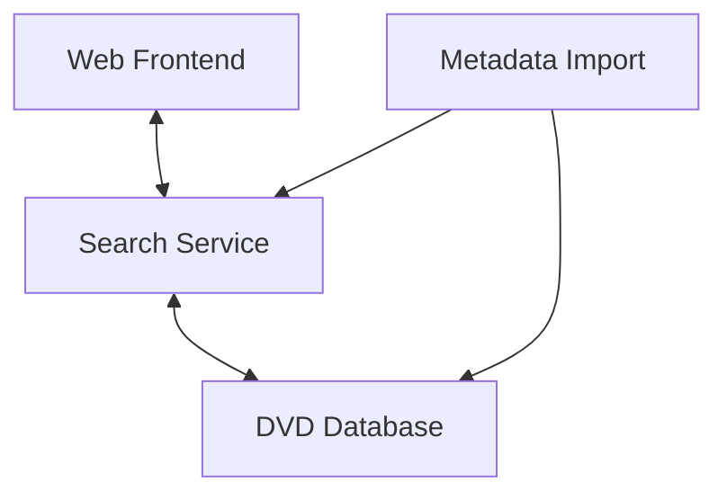

# Chapter 2 — Fundamental Concepts of Software Engineering

**Andreas Maier, Sally Zeitler, Moritz Zaiss, and Aline Sindel**
Friedrich-Alexander-Universität Erlangen-Nürnberg (FAU)

## Abstract

This chapter introduces software engineering as the foundation that keeps artificial intelligence (AI)-assisted development reliable at scale. It explains what software is, how to define software quality in context, and why software products must be treated as systems with explicit requirements, architecture, validation, and evolution strategy. Building on historical lessons and delivering evidence from the CHAOS reports, the chapter develops the core activities of specification, development, verification/validation, and evolution, and places them in the broader software development life cycle. Practical examples include vibe coded example cases, platform-evolution constraints in video game platform ecosystems, and infamous delays in the video game industry to illustrate cost-of-change and process discipline. The central message is simple: high-velocity coding with large language models (LLMs) works best when speed is anchored in disciplined engineering.

## Software Engineering for Vibe Coding

Chapter 1 argued that AI-assisted coding can greatly accelerate implementation, but that responsibility for correctness, safety, and long-term quality remains human. The next step is therefore to establish the software-engineering foundation explicitly: we need a shared understanding of what software is, what "good software" means, and which process structures keep fast development from turning into fragile systems. In other words, before scaling vibe coding, we must understand software engineering as the discipline that makes speed sustainable.

### Why Software Engineering Is Needed

Today, software is a core layer of modern society. Infrastructure, industrial systems, finance, security, and entertainment all rely on software-based services. The figure below gives a quick map for example fields of application for software engineering.

**Figure 2.1.** Five representative application domains in which software is mission-critical, each shown with an icon: infrastructure, industry, financial systems, security, and entertainment. The figure illustrates the breadth of areas that depend on reliable software. (Icons from Flaticon.com.)

At the same time, software also differs from physical products in crucial ways. It is immaterial, largely unconstrained by physical manufacturing limits, hard to measure consistently, and it does not wear out mechanically [Metzner 2020]. Yet software still ages: platforms evolve, interfaces change, dependencies become obsolete, and previously working applications may fail after operating-system updates. This tension explains why software becomes complex quickly and why maintenance dominates long-term effort.

Building software is not like building a chair once and shipping it unchanged forever. A chair is manufactured, sold, and physically wears out. Software is delivered, updated, reconfigured, and often expected to keep evolving.

### Core Challenges

In practice, the challenge is not only technical implementation. Modern software projects must handle heterogeneous platforms, rapidly changing business constraints, security and trust requirements, coordination across roles, version/configuration management, and portability concerns [Sommerville 2016]. Many expensive failures can be traced to ambiguities introduced early and discovered late. This is exactly where software engineering contributes: standards, methods, and tools reduce avoidable errors before they become operational problems [IEEE Computer Society 2025].

### Historical Perspective and the Software Crisis

In the 1960s, the software crisis became visible: projects were frequently over budget, delayed, hard to maintain, and often failed to meet requirements. The term *software engineering* was introduced in this context to emphasize systematic, disciplined development.

Several well-known cases illustrate what happens when complexity, coordination, and validation are underestimated [Bean 2022]:

**IBM operating system (OS)/360 (1963–1965).** IBM developed OS/360 as a unified operating-system family for multiple hardware configurations, which was highly ambitious for its time. The project is often cited because its complexity and scale exceeded early planning assumptions. Delivery required major staffing and schedule expansion, making it a classic example of underestimating integration effort in large software platforms.

**Therac-25 (1985–1987).** Therac-25 was a radiation therapy device in which software controlled safety-relevant treatment behavior. Compared with earlier designs, software played a larger role in interlocks and operational control. A combination of software defects, race conditions, and weak operator feedback contributed to accidental radiation overdoses, illustrating how software failures in medical systems can have immediate physical consequences.

**Denver Airport Baggage System (1995).** The Denver automated baggage project aimed to coordinate high-speed, airport-wide logistics with tight operational constraints. Requirements and system complexity were underestimated, while integration and reliability problems accumulated. The result was long delays, a severe budget overrun, and prolonged disruption to airport operations.

**Ariane 5 Flight 501 (1996).** The Ariane 5 failure is a canonical case of unsafe software reuse across changed assumptions. Software components inherited from Ariane 4 included numeric conversions that were no longer valid under Ariane 5 flight conditions. The resulting overflow propagated erroneous signals, contributed to inertial-reference shutdown, and ultimately caused the launcher breakup shortly after liftoff (see the geek box below).

**German Toll Collection Project (2003).** The Toll Collect project targeted nationwide digital toll collection for heavy vehicles, combining legal, operational, and technical requirements at large scale. Delivery delays meant toll revenue was not collected as planned, leading to substantial financial loss and contractual conflict. The case highlights the economic impact of late delivery in infrastructure software.

**Boeing 737 MAX (2018).** The 737 MAX redesign introduced handling changes that were addressed in part through an automated trim-assist software function. In early implementations, critical behavior depended on limited sensor redundancy and insufficiently robust failure handling. Faulty angle-of-attack inputs could trigger unsafe control actions, and the resulting accidents demonstrated how software, sensor architecture, and certification assumptions interact in safety-critical aviation systems (see the geek box below).

> **Geek Box: Ariane 5 Flight 501: Reuse without revalidation**
>
> Ariane 5 Flight 501 was the maiden launch of Ariane 5 on June 4, 1996. About 40 seconds after liftoff, the launcher broke up in flight and was destroyed by the range safety system. The mission carried no crew, and no human lives were lost in the accident.
>
> The key technical difference from Ariane 4 was the early flight dynamics: Ariane 5 reached higher horizontal velocity in this phase, but parts of the inertial-reference software were reused with Ariane 4 numeric assumptions. A floating-point value related to horizontal motion was converted into a 16-bit signed integer; this exceeded the representable range and raised an operand error (numeric overflow).
>
> The critical engineering issue was exception handling under changed assumptions. The primary inertial-reference unit shut down, the backup unit (running the same software path) failed in the same way shortly after, and diagnostic data was interpreted as valid flight data by flight control logic. That chain produced extreme nozzle commands, rapid trajectory deviation, high aerodynamic loads, and vehicle breakup. Financially, the loss was in the hundreds of millions of US dollars, commonly reported in the rough range of about US$370–500 million when launcher and payload losses are combined.
>
> This remains a textbook software-engineering lesson: reuse is powerful, but only if assumptions are revalidated at system level for the new operational context. [Sommerville 2015]
>
> **Figure 2.2.** An Ariane 5 launcher carrying the James Webb Space Telescope payload, photographed before launch. (Photo: Chris Gunn / NASA Webb, CC BY 2.0, <https://en.wikipedia.org/wiki/File:Ariane_5_with_James_Webb_Space_Telescope_Prelaunch_(51773093465).jpg>.)

> **Geek Box: Boeing 737 MAX: Local software decisions in a system-level safety context**
>
> In the 737 MAX case, Maneuvering Characteristics Augmentation System (MCAS) behavior, sensor redundancy choices, pilot interaction assumptions, and certification framing interacted in a way that reduced overall system robustness. MCAS was introduced because engine and airframe changes altered handling in parts of the flight envelope; the intended function was to apply automatic stabilizer trim in specific high angle-of-attack conditions so aircraft handling would remain closer to earlier 737 variants and reduce additional pilot workload in those moments.
>
> The accident sequence is important. In Lion Air Flight 610 (October 29, 2018), a faulty angle-of-attack input triggered repeated automatic nose-down trim commands; pilots counter-trimmed multiple times, but the command cycle reappeared and the aircraft crashed, killing 189 people. In Ethiopian Airlines Flight 302 (March 10, 2019), a comparable nose-down trim sequence occurred after takeoff and the aircraft crashed, killing 157 people. In total, this failure pattern contributed to two fatal accidents with 346 casualties.
>
> Regulatory response was global grounding. Most authorities grounded the 737 MAX in March 2019, and major returns to service started in late 2020 after software updates, revised procedures, and additional pilot training. In the United States, the FAA lifted the grounding on November 18, 2020, which corresponds to roughly 20 months out of service from the March 2019 grounding wave.
>
> This is why safety-critical software engineering is always system engineering. Good code at component level is necessary, but not sufficient. Teams must validate full-system behavior under realistic fault scenarios, including rare but high-impact combinations. [Bean 2022]
>
> **Figure 2.3.** A Boeing 737 MAX in flight at the Farnborough International Airshow, July 2018. (Photo: Steve Lynes, CC BY 2.0, <https://commons.wikimedia.org/wiki/File:EGLF_-_Boeing_737_Max_-_N7201S_(43406207022).jpg>.)

The lesson for vibe coding is direct: faster generation does not eliminate the underlying engineering risks. If teams "accept everything" without disciplined review and validation, they risk repeating old failure modes in a new technological setting. In addition, modern AI-specific failure modes appear, including AI slop and hallucinated dependencies, where generated repositories may look complete but rely on incorrect or nonexistent components.

> **Geek Box: AI Slop Case Study: RuView and WiFi DensePose Claims**
>
> The RuView project [ruvnet 2026] became highly visible with ambitious claims such as through-wall pose estimation, breathing/heart-rate inference, and low-cost edge deployment from commodity WiFi signals. A viral X post from December 25, 2025 amplified this framing [Doerr 2025], and the repository accumulated about 44k stars. The same viral thread was later accompanied by a community note disputing that the published project actually performed the promised pose detection end-to-end.
>
> This is exactly where engineering judgment matters: popularity is not validation. At the time the project went viral, the repository did not clearly communicate these core limitations. The stronger disclaimers and caveats appeared only later, after community scrutiny increased. Even with later edits, key promised capabilities were not reproducibly available as a working deliverable, including the absence of provided pre-trained model weights and unresolved end-to-end training and counting paths.
>
> The AI slop pattern here is not just "bad code". It is the combination of compelling narrative, rapid viral diffusion, and missing verifiable core artifacts (for example deployable model weights and reproducible evaluation traces). When this happens, users can mistake momentum for maturity.
>
> Current research is also more constrained than the marketing narrative suggested. CSIPose demonstrates through-wall pose estimation with commodity WiFi, but in a controlled research setup with fixed antenna geometry and supervised pipeline design rather than plug-and-play universal deployment [Gu 2025]. Likewise, publicly released channel state information (CSI) datasets such as the IEEE Dataport dataset by Zaman et al. are useful for benchmarking human detection pipelines, but they do not by themselves provide a validated end-to-end real-time dense-pose product [Zaman 2025].
>
> **Figure 2.4.** A screenshot related to the AI slop case study, showing a disclaimer-style correction context.
>
> *Remark:* AI slop does not always come with visible disclaimers like this one, at least not at first, until the community pushes back.

In practice, this can be deceptive: a repository may contain many files, polished documentation, and apparently clean structure, so it looks trustworthy at first glance and can even spread quickly. However, deeper inspection may reveal that central assumptions are invalid, for example a required model artifact, service endpoint, or dataset does not actually exist. This is exactly why engineering checks cannot be replaced by surface-level plausibility. Generated software must still be validated against real dependencies, executable paths, and measurable outcomes.

If one accepts generated output "like a madman" without checks, speed turns into technical debt very quickly. Some AI-generated projects can even go viral before anyone notices that a central dependency is missing or impossible (see the RuView geek box above).

The important continuity point is that these are not entirely new risks; they are old engineering failure patterns expressed through new tooling. When software processes are weakly defined, the AI stack can amplify ambiguity, hide broken assumptions behind plausible output, and accelerate damage. The consequences are not always limited to broken code: when applications handle personally identifiable information, skipped security reviews can cause real harm to real people (see the Tea App geek box below). The AutoResearch incident in the geek box below is a practical example of a simple process gap in an AI-native workflow.

> **Geek Box: The Tea App Scandal: When speed breaks people**
>
> In July 2025, Tea—a US-based dating safety app with 1.6 million users—suffered two devastating data breaches. Both were caused by textbook application programming interface (API) misconfigurations [Richabadas 2025]. The first was an unsecured Firebase database: security policies had never been manually configured, so the entire backend was openly readable. Over 70,000 images were leaked to 4chan, including government IDs used for identity verification and selfies that Tea had promised to "delete immediately" [BBC News 2025]. The second breach was worse in a different way: any authenticated user could use their own API key to download *other* users' private messages—a broken authorization policy that the OWASP API Security Top 10 has warned about for years. Those messages contained sensitive conversations about abortions, infidelity, and domestic abuse. Leaked data also included exact home addresses of 33,000 users, which were compiled into interactive maps and posted publicly. Misogynist groups weaponized the breach, building websites and mobile apps that ranked women's leaked photos and encouraged targeted harassment. Multiple class-action lawsuits followed.
>
> The app had been built by two freelance developers hired through a platform, reportedly under pressure to ship a minimum viable product as fast as possible [Richabadas 2025]. Security was deferred, and the development team did not identify or fix these issues even while the app was a high-profile target. The Tea scandal illustrates a failure mode that fast-paced, AI-assisted development must actively guard against. A working prototype can go from prompt to production in hours, but security, data handling, and threat modeling cannot be vibed. An agentic workflow that skips adversarial review of data storage, retention policies, and access controls is not engineering at all; it is negligence at machine speed. For any project handling personally identifiable information, the lesson is blunt: the ease of building with AI agents makes disciplined security practices *more* important, not less.
>
> **Figure 2.5.** A stylized illustration of the Tea app data leak, showing a smartphone with a broken security shield and leaked private messages and images. (Image generated with DALL-E.)

> **Geek Box: AutoResearch outage lesson**
>
> The *AutoResearch* project, introduced in Chapter 1 as a meta-optimization framework, explores an agentic research workflow in which multiple AI agents collaborate to plan, execute, and iterate on research tasks with limited human intervention [Karpathy 2026a]. The practical goal is to speed up literature analysis, hypothesis generation, and experimental iteration by orchestrating subagents as a coordinated pipeline.
>
> A concrete modern example from this project is an outage report dated March 11, 2026. Karpathy wrote that his autoresearch labs were effectively wiped during an OAuth outage and highlighted the need for failover design when core AI services become temporarily unavailable [Karpathy 2026b].
>
> The engineering point is simple and important: if OAuth is unavailable, subagents may return authentication errors and disconnect from long-running tasks. In the best case, this causes delays of hours or days because work cannot resume cleanly. In a worst case, a misconfigured supervisor agent may treat the error payload as a valid task output and feed it back into an automatic code-update loop, which can corrupt or even destroy working code.
>
> This is why local/server mixed AI infrastructures (for example Claude or Codex with remote services) need explicit safety rails: robust exception handling, retry/failover logic, human approval gates for destructive edits, and mandatory backups before unattended runs. In practical terms, make a backup before launching such workflows, especially in unstable connectivity situations. If you start a long autonomous run right before boarding a train in Germany, your failover strategy is now part of your travel itinerary.
>
> **Figure 2.6.** An illustration for the AutoResearch case study, taken from the project's progress image. (Autoresearch. Image from <https://github.com/karpathy/autoresearch/blob/master/progress.png>.)

### Evolution of Methods Up to Vibe Coding

Programming technologies and process models co-evolved through clear cause-and-effect steps. As compiler techniques matured, developers could translate increasingly complex source programs into executable code more reliably. This caused software scope to expand beyond small handcrafted routines. As higher-level programming languages spread, abstraction reduced low-level implementation effort. This caused teams to build larger systems faster, but also introduced coordination and maintainability challenges that demanded stronger development methods.

The rise of structured programming was a response to growing code complexity. By enforcing clearer control flow and modular decomposition, it caused software to become easier to reason about, test, and review. Object-oriented programming then addressed reuse and extensibility pressures in large codebases. Encapsulation and interface-based design caused architecture to scale better across multiple contributors and releases. In parallel, the waterfall model emerged because engineering teams wanted predictable, sequential planning. This caused stronger upfront control, but also made late change expensive.

The V-model was introduced to address weak traceability between implementation and testing. Its paired development-and-validation structure caused verification to become more systematic, especially in regulated domains. Agile methods are more flexible and can react to changes in, e.g., requirements, early on [Metzner 2020]. Later, Software as a Service emerged as internet infrastructure and APIs matured. Continuous deployment capabilities, including representational state transfer (REST)-style service interfaces, caused maintenance and evolution to shift from rare major releases to frequent iterative updates. In this service-oriented setting, functionality is frequently accessed over network APIs rather than only via local binaries, which means availability, versioning, and interface compatibility become ongoing operational concerns. Vibe coding appears on top of this full trajectory, as illustrated in the figure below: because modern AI systems can generate and revise code quickly, development cycles accelerate, which in turn increases the importance of explicit requirements, validation discipline, and architectural clarity rather than reducing it.

**Figure 2.7.** A timeline from 1950 to 2020+ marking successive software development milestones along a rising arrow: compiler techniques, higher-level programming languages, structured programming, object-oriented programming, the waterfall model, the V-model, agile methods, Software as a Service, and finally vibe coding. Each milestone represents a response to the engineering pressures created by the previous generation. Vibe coding appears at the end of this trajectory, enabled by modern AI systems but still dependent on the process and verification foundations that earlier stages established. (Adapted from [Metzner 2020].)

### Evidence from CHAOS Reports

The CHAOS reports are long-running project-outcome studies by the Standish Group, widely cited in software engineering to discuss delivery risk and process quality. In these reports, projects are typically grouped into three broad categories: *successful* (delivered on time, on budget, and with expected scope), *challenged* (delivered but with significant overruns or scope shortfalls), and *failed* (canceled or not delivered in usable form). The reports are not perfect as scientific instruments, but they remain influential because they provide a consistent managerial view of software delivery outcomes over time.

In the 1994 report, the share of projects that were both on time and on budget was only about 16.2%, which reflected the severe planning and execution instability that motivated process improvement in the following decades [The Standish Group 1994]. By the 2011–2015 period, the figures improved considerably: depending on the exact success criterion, around 40–44% of projects were meeting key goals such as schedule or budget targets [The Standish Group 2015] (see the table below for a breakdown by project size and method). This is a meaningful improvement, but it also indicates that a large fraction of projects still experiences major friction, either as challenged outcomes or outright failures.

For this chapter, the practical interpretation is straightforward: software engineering methods improve outcomes, but they do not eliminate uncertainty. In AI-assisted development, this remains true. Faster code generation can reduce implementation latency, yet without strong requirements work, architecture decisions, and verification discipline, teams can still produce systems that are late, costly, or misaligned with user needs.

Long-running software projects might develop "GTA VI timelines", where everyone expects delays and scope expansion. Behind the joke is a real engineering point about planning uncertainty and iterative refinement (see the game-delay geek box below).

> **Geek Box: Famous game-delay lore**
>
> Duke Nukem Forever remains the classic benchmark for extreme delay. It was announced in 1997 and finally released in 2011 after more than 14 years of development [Wikipedia contributors 2026a; Bell 2025]. During that period, the slogan "when it's done" became shorthand for indefinite release uncertainty [Wikipedia contributors 2026a]. From a software-engineering perspective, it is a cautionary example of repeated scope and technology shifts without stable delivery control.
>
> That phrase then escaped the original project and entered broader game culture. Duke-related running gags and references appeared in other franchises, including fan-documented Serious Sam easter eggs [ExTaZzY 2022]. The cultural joke is funny, but the process lesson is not: when architecture keeps moving while plans remain informal, calendars stop being engineering instruments and become wishful thinking.
>
> The GTA line is similar in structure but on a much larger industrial scale. GTA V was scheduled for a September 17, 2013 release in Rockstar's official announcement stream [Makuch 2013], while Rockstar's GTA VI page currently lists November 19, 2026 [Rockstar Games 2026]. That creates a numbered-series gap of more than thirteen years, which is why analysts and players often use GTA VI as a modern reference point for long-horizon delivery expectations [Bell 2025].
>
> And yes, even this is still cleaner than Sierra's Leisure Suit Larry 4 mythology: the series openly joked about a missing installment, and community retellings escalated into rumors that the game had effectively vanished (with stories about lost floppies, including the legendary "dog ate it" version) [Wikipedia contributors 2026b; Sierra Wiki contributors 2026]. Humor aside, the shared point across all examples is straightforward: unmanaged uncertainty does not disappear; it accumulates.
>
> **Figure 2.8.** An illustration related to the GTA VI timeline and video game delay discussion. (Image generated with DALL-E 3.)

**Table 2.1.** CHAOS report comparison of agile and waterfall outcomes (2011–2015) [The Standish Group 2015].

| Project size | Method | Success | Challenged | Failed |
| --- | --- | --- | --- | --- |
| Large | Agile | 18% | 59% | 23% |
| Large | Waterfall | 3% | 55% | 42% |
| Medium | Agile | 27% | 62% | 11% |
| Medium | Waterfall | 7% | 68% | 25% |
| Small | Agile | 58% | 38% | 4% |
| Small | Waterfall | 44% | 45% | 11% |

Agile methods consistently perform better across project sizes in these data, which also explains why AI-assisted workflows naturally move toward iterative and adaptive development.

## What Is Software and What Is Software Engineering?

A software product is more than source code. According to the Institute of Electrical and Electronics Engineers (IEEE) Standard Glossary of Software Engineering [IEEE 1990]:

> "Software. **Computer programs**, **procedures**, and possibly **associated documentation and data** pertaining to the operation of a computer system."

In practice, this means that manuals, interface descriptions, and data specifications are part of the engineering deliverable. We need this broader definition because software has to be understood, operated, tested, and maintained by different people over time. Code alone rarely explains deployment assumptions, user workflows, input/output formats, or operational constraints. Without explicit documentation and data definitions, teams misinterpret behavior, integrations break, onboarding slows down, and long-term maintenance costs rise sharply.

### Attributes of Good Software

Good software is usually characterized by four key attributes [Sommerville 2016], but these attributes must be defined explicitly because "good" depends on context, stakeholders, and risk profile. A prototype for internal experimentation can tolerate different trade-offs than medical, financial, or safety-critical software. Defining quality criteria up front aligns developers, users, and reviewers on what success means and prevents teams from optimizing one dimension (for example delivery speed) while unintentionally degrading others (for example dependability or usability).

**Maintainable.** Maintainability means that software can be changed at reasonable effort and cost when requirements evolve, defects are discovered, or dependencies and platforms change. In practice, maintainability depends on clear structure, understandable naming, modular decomposition, and disciplined documentation. Without maintainability, even small feature requests quickly become risky and expensive.

**Dependable.** Dependability means users and operators can trust the software to behave correctly, safely, and consistently under expected operating conditions. This includes reliability, robustness against faulty inputs, and predictable behavior in exceptional situations. In critical domains, dependability is not optional: it is a core condition for legal, ethical, and operational acceptance.

**Efficient.** Efficiency means that the software uses computational resources such as runtime, memory, bandwidth, and energy in an appropriate way for its context. An implementation can be functionally correct but still unacceptable if latency is too high or resource consumption is excessive. Efficient software therefore combines correct algorithms with suitable implementation and deployment choices.

**Acceptable.** Acceptability means the software is usable and actually adopted by its intended users in real workflows. This includes intuitive interaction, clear feedback, compatibility with existing processes, and fit to user expectations and constraints. A technically strong system that users cannot or do not want to use fails to deliver value.

### Software Systems and Systems of Systems

A software system consists of interacting components, not isolated scripts. To keep the example aligned with Chapter 1, consider the vibe coded DVD database project: even this small application already requires coordinated behavior between user interface, search logic, and persistent data storage.

More generally, a software system is defined not only by its components, but by how data and control move across component boundaries under explicit interface contracts. This matters because failures often emerge at these boundaries rather than inside isolated modules. A system of systems extends this idea: independently useful systems are integrated into a larger operational whole, typically with heterogeneous technologies, ownership boundaries, and release cycles. Consequently, integration quality, interface stability, and cross-system observability become first-class engineering concerns.

**Figure 2.9.** A component-level software-system view of the Chapter 1 DVD database case, showing four components and the data/control flow between them: a web frontend and a search service exchange requests bidirectionally, the search service queries the DVD database, and a metadata import component feeds both the search service and the database.

Many real products are *systems of systems*, combining heterogeneous subsystems and external services. The Chapter 1 DVD example makes this visible at two levels: the component-level interaction view above and the larger operational composition around the same product boundary shown below. A complementary conceptual example is Minecraft redstone: modular signaling components can be composed into complete computational subsystems, which is discussed in the redstone geek box below.

**Figure 2.10.** A system-of-systems view around the same DVD discovery website product. A central "DVD Discovery Website" boundary is surrounded by four operational subsystems: frontend delivery (the web UI), a search and ranking service, a metadata pipeline, and hosting and operations. The diagram emphasizes that even a small product is composed of independently managed subsystems.

> **Geek Box: Minecraft: A System-of-Systems View Through Redstone**
>
> Minecraft is a sandbox game in which players build, automate, and collaborate in shared virtual worlds. It was not created as a formal hardware-design environment, but its block-based mechanics make it an unusually good playground for systems thinking. Redstone itself was originally introduced as an in-game wiring and automation mechanic for tasks such as switches, doors, traps, and timing circuits. In practice, that simple gameplay feature became a programmable signal layer that players extended far beyond its initial intent.
>
> At the entry level, redstone allows direct realizations of logic-gate behavior such as NOT, AND, and OR. In digital-logic terms, this basis is sufficient for constructing arbitrary Boolean functions by composition, and in Minecraft practice these gates are chained into larger combinational and sequential subsystems [MattBatWings 2023].
>
> MattBatWings documents a full build path from these primitives to a programmable redstone computer, including arithmetic, register storage, instruction memory, program counter behavior, branching, and call-stack control [MattBatWings 2025; MattBatWings 2026]. This is a custom architecture rather than a literal 8086 replica, but the decomposition is structurally close to classic 8086-family processor logic (execution/control blocks, instruction sequencing, and bus/memory interaction) [Intel Corporation 1979].
>
> An advanced neural-network example is the StochasticNet project, which reports a redstone convolutional network for handwritten-digit recognition in Minecraft using a LeNet-5 architecture and 15x15 digit inputs, with reported accuracy up to 80% [Leamoon 2022]. The same source highlights the practical cost: high latency and substantial build complexity despite successful functional demonstration.
>
> **Figure 2.11.** A conceptual progression from redstone logic gates to larger computational systems: NOT, AND, and OR gates compose into Boolean function blocks, which in turn compose into CPU subsystems and LeNet inference blocks.

### Software Product Categories and Applications

Software products are often classified as generic, custom, or mixed forms in between. This distinction matters because cost and risk profiles differ by product type. Typical engineering cost structures are often reported near 60% development and 40% testing for many settings, while for long-lived custom systems the cumulative evolution cost can exceed the initial development cost [Sommerville 2016].

Applications include stand-alone software, transaction systems, embedded systems, batch processing, entertainment platforms, modeling and simulation tools, data collection systems, web applications, and systems of systems [Sommerville 2016]. In modern practice, these domains frequently overlap. A familiar example is WordPress, where content management, authentication, database access, and user interaction operate as connected subsystems. In a real deployment, this usually extends further to themes, plugins, caching layers, external media/content delivery network (CDN) services, and operational tooling. As a result, even a "simple website" often behaves as a system of systems with separate lifecycle, update cycle, and failure modes across components.

### Formal Definition of Software Engineering

After these practical examples, the formal definition is straightforward. According to the IEEE Standard Glossary of Software Engineering [IEEE 1990]:

> "Software engineering. (1) The application of a **systematic**, **disciplined**, **quantifiable approach** to the **development**, **operation**, and **maintenance** of software; that is, the application of **engineering to software**. (2) The **study of approaches** as in (1)."

This practical orientation distinguishes it from computer science as a theoretical discipline, while remaining connected to systems engineering for complex technical products [Sommerville 2016; Metzner 2020].

**Figure 2.12.** A software engineering perspective around a software product. A central "Software Product" ellipse is surrounded by six software-process ellipses—requirements, maintenance, release, implementation, system design, and system analysis—summarizing the activities involved in creating and maintaining a software product.

## Software Processes

A software process describes how requirements are transformed into working software and how that software is kept useful over time [Sommerville 2016], see the software engineering overview figure above. The core activities remain specification, development, verification/validation, and evolution. How process models differ is mainly the structure and timing of feedback.

**Figure 2.13.** A comparison of three software process models. *Waterfall* is a downward staircase of sequential phases: requirements analysis and specification, system and software design, development and testing, integration and system testing, and release and maintenance. The *V-model* pairs decomposition activities (concept, requirements, design, implementation) on the descending left arm with corresponding integration and validation activities (testing, validation and verification, operation and maintenance) on the ascending right arm, with horizontal links tying each development artifact to its matching test level. *Agile* shows short repeated increments in which users and developers move from user stories and architecture through a planning game, story estimation, development and testing, and prototyping, iterating continuously toward rollout. (Adapted from [Sommerville 2016; Stephens 2015; Metzner 2020].)

The figure above also shows why process models evolved. Waterfall improved planning discipline but gives feedback late. The V-model adds explicit traceability between development artifacts and test activities. Agile shortens the loop further by running these activities in repeated increments. Across all three models, process terminology remains important: *products* are concrete outputs (for example, requirements documents or tested builds), *roles* define accountability boundaries, and *pre-/post-conditions* define quality gates between steps. In AI-heavy workflows, this becomes even more relevant because engineers often shift from pure coding toward project-manager-like orchestration of tasks, tools, and review decisions. The idea that software processes need to be adapted for agent-based systems is older than today's vibe coding debate, as the geek box below illustrates.

> **Geek Box: Agile software processes for multi-agent systems (Brosch, 2007)**
>
> Long before LLMs made agentic software engineering a mainstream topic, the question of how to develop *agent-based* software was already on the academic agenda. Christian Brosch's 2007 doctoral dissertation at the Otto-Friedrich-Universität Bamberg, titled *"Konstruktion einer agilen Entwicklungsmethodik zum Einsatz im Software Engineering für Multiagentensysteme"* (construction of an agile development methodology for software engineering for multi-agent systems), argued that classical waterfall-style processes did not fit systems built from autonomous, interacting agents and proposed a tailored agile methodology instead [Brosch 2007]. The conceptual core of the work is the classical view of an agent as an entity that perceives its environment through sensors and influences it through effectors (see figure below)—a cycle that is structurally identical to the modern execution loop of LLM-based agents discussed in later chapters. The 2007 thesis predates the current wave of AI agents by almost two decades, but its basic insight already stands: when software is built from autonomous components that observe, decide, and act, the software process itself must accommodate short feedback cycles, explicit role definitions, and continuous validation of emergent behavior.
>
> **Figure 2.14.** An agent and its environment: two boxes labeled "Agent" (top) and "Environment" (bottom) connected by two curved arrows. The left arrow goes from the environment up to the agent, labeled perception via sensors; the right arrow goes from the agent down to the environment, labeled actions via effectors. The same perception–action cycle reappears today as the execution loop of LLM-driven agents. (Adapted from [Brosch 2007].)

### Cost of Change

A central practical rule is that changes typically become more expensive later in the life cycle, as illustrated in the figure below. This remains true with AI-assisted development: generation can be fast, but late corrections still affect larger code surfaces, integration, release quality, and user trust.

**Figure 2.15.** A line plot showing the illustrative growth of change cost over project phases. Cost rises steeply and roughly exponentially across the phases planning, definition, design, development, release, and maintenance (following exemplary values 10, 40, 80, 160, 320, 640). The values are exemplary, but the shape—corrections becoming exponentially more expensive later in the project—is consistent across empirical studies.

Duke Nukem Forever is a practical illustration of late-change cost at project scale (see the game-delay geek box above). Development started in the late 1990s on one technical base and then repeatedly shifted core technology, including moves from the original Quake II-era approach to Unreal Engine and later major Unreal-generation upgrades during ongoing production [Wikipedia contributors 2026a; Bell 2025]. Each engine transition implied more than a renderer swap: tools, content pipelines, gameplay code, and integration assumptions had to be reworked while expectations kept evolving. This is exactly the cost-of-change curve in practice: decisions changed after substantial implementation investment, so the marginal cost of each additional change rose sharply and contributed to the record-length delay.

### Specification

Specification is where stakeholder intent is translated into engineering targets. It includes requirements elicitation/analysis, formal specification, and requirements validation, as shown in the figure below. Inputs from users, producers, and existing systems are transformed into documented user and system requirements. Validation checks realism, consistency, and completeness before development commits to costly implementation decisions.

**Figure 2.16.** The software specification process and its outputs. Requirements elicitation and analysis feed into system descriptions; requirements specification produces user and system requirements; and requirements validation checks the result before it enters the requirements document. Arrows loop back between the activities because each can expose gaps in the previous one. (Adapted from [Sommerville 2016].)

The Duke Nukem Forever history gives a vivid specification lesson (see the game-delay geek box above). The team repeatedly updated goals to keep pace with what looked cutting-edge at the time: newer rendering and engine capabilities, additional gameplay/visual features, and broader expectations about what players would consider "cool" or competitive in the current market [Wikipedia contributors 2026a; Bell 2025]. In principle, reacting to user expectations is reasonable. In practice, repeated midstream requirement expansion without a stable baseline turned specification into a moving target: completed work was re-scoped, dependencies changed, and downstream design and implementation had to be reworked. This is exactly why specification must distinguish stable product goals from optional innovation layers, and why change control is necessary when market pressure pushes teams to keep adding features.

### Development

Development transforms requirements into architecture, interfaces, data structures, and component-level design decisions, as illustrated in the figure below. This is the phase where abstract intent becomes an implementable technical structure.

**Figure 2.17.** The structure of software design and implementation activities. Platform information, software requirements, and data descriptions feed into four interrelated design activities—architectural design, interface design, database design, and component selection and design—which produce the system architecture, database specification, interface definitions, and component descriptions used downstream. (Adapted from [Sommerville 2016].)

Architectural design defines major structures and relationships, interface design removes ambiguity between components, database design structures data representation, and component selection/design balances reuse with custom implementation.

In the Chapter 1 DVD database case, the vibe coded implementation still implicitly converged to a software architecture: a user interface layer for search and interaction, backend logic for query and filtering behavior, and persistent storage for movie records. Even without a long upfront architecture workshop, these structure decisions emerged because the system had to separate concerns and manage data flow consistently. In larger products, especially video games, this implicit architecture quickly becomes insufficient unless process discipline increases. Teams need explicit interfaces, ownership boundaries, review gates, and integration rules so that AI tooling and software engineers can collaborate reliably rather than producing incompatible local optimizations.

### Verification and Validation

Verification checks conformance to the specification, while validation checks alignment with user and customer expectations.

**Figure 2.18.** The levels of verification and validation. Component testing isolates individual units, system testing checks integrated behavior, and customer testing validates that the product meets real user expectations. Forward and backward arrows indicate that defects found at any level can trigger rework in earlier stages. (Adapted from [Sommerville 2016].)

A robust sequence, shown in the figure above, is component testing first, system testing next, and customer testing before operational acceptance. This ordering controls risk accumulation: low-level defects are cheaper to isolate early, while late-stage customer testing focuses on whether the integrated product is useful and acceptable in realistic operation.

These verification and validation steps exist in waterfall, V-model, and agile processes, but their frequency differs. In waterfall, most validation pressure accumulates late because phases are strongly sequential, so major feedback often arrives after substantial implementation is complete. In the V-model, verification and validation are planned as explicit counterparts to development artifacts (requirements to acceptance-level checks, design to integration/system checks, implementation to component checks), which improves traceability and test completeness even if much execution still occurs in later stages. In agile, the same activities are repeated in short iterations: teams verify continuously through automated and manual tests during each increment and validate frequently through demos, user feedback, and staged releases. The technical activities are therefore similar across models, but feedback frequency, granularity, and correction latency are fundamentally different [Metzner 2020].

### Evolution

Software evolution is continuous during the operational lifetime of a system. The figure below illustrates this as a recurring engineering loop: teams define new requirements, assess the current system baseline, propose scoped changes, implement them, and then feed operational results from the new system back into the next cycle. Changes are triggered by new requirements, platform shifts, performance constraints, security updates, and defect correction.

**Figure 2.19.** A typical software evolution loop. New requirements are defined, the existing system is assessed, changes are proposed and implemented, and the resulting new system feeds back into the next planning cycle. The loop reflects that evolution is a continuous process, not a one-time event. (Adapted from [Sommerville 2016].)

Two complementary strategies are common. *Change anticipation* predicts likely future needs early, so current design choices reduce later rework. *Change tolerance* assumes that not all future changes can be predicted and therefore favors modularity and incremental integration so updates remain controllable [Sommerville 2016].

Game platforms such as Minecraft, Roblox, and Fortnite therefore need to communicate roadmap changes early, so dependent developers can plan architecture and compatibility work before release pressure peaks. For Minecraft, this can include new crafting mechanics, new item systems, or behavioral changes in redstone timing semantics. Even a seemingly small timing change can invalidate higher-level constructions, including complex redstone computing setups discussed in the redstone geek box above, where logic composition relies on predictable update behavior. In process terms, this is exactly where change anticipation and change tolerance interact: platform teams publish planned changes early, while downstream developers keep subsystems modular enough to absorb unavoidable late adjustments.

In the same spirit, one rather informal but useful observation from practical app ecosystems is that many app-store purchases behave economically more like leasing than owning: once platform support ends, the app may no longer run in a secure modern environment. Therefore, many of these systems should rather use the term "rent" over "buy".

## Software Development Life Cycle

The software development life cycle (SDLC) connects requirements, design, implementation, verification, deployment, and maintenance into a repeated loop, as shown in the figure below.

**Figure 2.20.** The software development life cycle as an iterative loop. The cycle connects requirements, design, implementation, verification, deployment, and maintenance in a continuous circular sequence. A feedback arrow from operations back to requirements reflects that real-world use generates new insights and change requests. (Adapted from [Stephens 2015].)

In day-to-day work, a practical phase view starts with initiation and requirements analysis, continues through high-level and low-level design into implementation, then moves into verification/validation, deployment, and maintenance, before looping back to refined requirements for the next cycle. In long-lived products, disposal and archival are part of lifecycle planning as well, because decommissioning affects data, compliance, and user transition.

Fortnite provides an intuitive SDLC example. A new seasonal feature starts with concept and player-experience goals, followed by system and content design, implementation in game services and clients, and extensive validation across gameplay, performance, and anti-cheat constraints. After deployment, telemetry and player feedback drive hotfixes, balancing changes, and content updates. These maintenance signals feed the next requirement cycle, which is why live-service games naturally operate as continuous SDLC loops rather than one-off releases.

For vibe coding, agile approaches are usually natural because AI shortens iteration cycles and enables rapid prototyping. Still, regulated domains (for example medical software) may require V-model-oriented traceability and verification discipline. The practical conclusion is not to replace engineering with AI, but to embed AI in the process model that matches domain risk, compliance constraints, and product lifetime.

## Exercise Problems

To deepen the understanding of software processes, readers should work through the following exercise problems. They are designed to translate the chapter's concepts into concrete analysis, decision-making, and process reasoning tasks.

**Exercise Problem 1:** Analyze a toy application and evaluate maintainability, dependability, efficiency, and acceptability in a structured way. Begin with a short system description and user context, then identify observable evidence for each quality attribute, including likely failure points if that attribute is weak. After this analysis, propose one concrete, technically realistic improvement per attribute and explain the expected effect on development effort and operational quality. Example: for a simple note-taking web app, improve maintainability by modularizing storage logic, improve dependability by adding input validation and error handling, improve efficiency with query/result caching, and improve acceptability by simplifying navigation labels and interaction flow.

**Exercise Problem 2:** Map a mini-project to specification, development, verification/validation, and evolution, and justify why this ordering is necessary. Start by defining the project goal, user group, and operating constraints, then derive a minimal architecture. Next, define implementation responsibilities, test stages, and an evolution plan for platform or requirement changes. Example: for a Minecraft inventory-sorting plugin, first define player-facing behavior and permission rules, then design event and storage modules, then test command behavior and edge cases in controlled scenarios, and finally plan API-compatibility updates for future game versions.

**Exercise Problem 3:** Estimate the impact of discovering the same defect in different life-cycle phases and explain why early detection is economically preferable. Use one concrete defect scenario, quantify direct technical rework for each phase (planning, development, pre-release testing, post-release), and include indirect costs such as support effort, downtime, user trust, and reputational impact. Conclude with a short mitigation strategy showing which engineering practices would have shifted defect discovery earlier. Example: compare the cost of discovering an item-duplication bug during unit tests versus after deployment to a public survival server with active player trading.

## Bibliography

- [Bean 2022] Bean, N. *The Software Crisis.* Kansas State University CIS 642/643 Textbook, 2022.
- [Bell 2025] Bell, A. *Videogame with longest ever development period makes wait for GTA VI seem like nothing.* Guinness World Records, 2025.
- [BBC News 2025] BBC News. *Tea app: I joined for safety. Then my address was leaked and shared.* 2025.
- [Brosch 2007] Brosch, C. *Konstruktion einer agilen Entwicklungsmethodik zum Einsatz im Software Engineering für Multiagentensysteme.* Dissertation, Otto-Friedrich-Universität Bamberg, 2007.
- [Doerr 2025] Doerr, T. *Viral post about RuView.* X, 2025.
- [ExTaZzY 2022] ExTaZzY. *Every Duke Nukem Reference in the Serious Sam Series.* YouTube, 2022.
- [Gu 2025] Gu, Y., Chen, J., Chen, C., He, K., Jia, J., Feng, Y., Du, R., Wu, C. *CSIPose: Unveiling Human Poses Using Commodity WiFi Devices Through the Wall.* IEEE Transactions on Mobile Computing, 2025.
- [IEEE 1990] IEEE. *IEEE Standard Glossary of Software Engineering Terminology (IEEE Std 610.12-1990).* 1990.
- [IEEE Computer Society 2025] IEEE Computer Society (Washizaki, H., ed.). *Guide to the Software Engineering Body of Knowledge (SWEBOK Guide), Version 4.0a.* IEEE Computer Society, 2025.
- [Intel Corporation 1979] Intel Corporation. *8086 Family User's Manual.* Intel Corporation, 1979.
- [Karpathy 2026a] Karpathy, A. *AutoResearch.* GitHub repository, 2026.
- [Karpathy 2026b] Karpathy, A. *My autoresearch labs got wiped out in the oauth outage.* X, 2026.
- [Leamoon 2022] Leamoon. *StochasticNet: LeNet-5 Redstone Digit Recognition in Minecraft.* GitHub, 2022.
- [Makuch 2013] Makuch, E. *Grand Theft Auto V delayed, due September 17.* GameSpot, 2013.
- [MattBatWings 2023] MattBatWings. *Boolean Algebra & Redstone Logic Gates - LRR #3.* YouTube, 2023.
- [MattBatWings 2025] MattBatWings. *How to Make a Redstone Computer from Scratch.* YouTube, 2025.
- [MattBatWings 2026] MattBatWings. *BatPU-2.* GitHub repository, 2026.
- [Metzner 2020] Metzner, A. *Software Engineering - kompakt.* Carl Hanser Verlag, 2020.
- [Rockstar Games 2026] Rockstar Games. *Grand Theft Auto VI.* Official game page, 2026.
- [ruvnet 2026] ruvnet. *RuView.* GitHub repository, 2026.
- [Sierra Wiki contributors 2026] Sierra Wiki contributors. *Leisure Suit Larry 4: The Missing Floppies.* Sierra Fandom Wiki, 2026.
- [Sommerville 2015] Sommerville, I. *Ariane 5 launch accident.* Web resource for Software Engineering, 10th Edition, 2015.
- [Sommerville 2016] Sommerville, I. *Software Engineering.* Pearson, 2016.
- [The Standish Group 1994] The Standish Group. *CHAOS Report 1994.* The Standish Group International, 1994.
- [The Standish Group 2015] The Standish Group. *CHAOS Report 2015.* The Standish Group International, 2015.
- [Stephens 2015] Stephens, R. *Beginning Software Engineering.* Wiley, 2015.
- [Wikipedia contributors 2026a] Wikipedia contributors. *Development of Duke Nukem Forever.* Wikipedia, 2026.
- [Wikipedia contributors 2026b] Wikipedia contributors. *Leisure Suit Larry 5: Passionate Patti Does a Little Undercover Work.* Wikipedia, 2026.
- [Zaman 2025] Zaman, Q., Ahmad, M., Salman, M., Khan, S. *CSI Dataset for WiFi Based Human Detection.* IEEE Dataport, 2025.

## Source

This chapter is derived from the *Vibe Coding* book (Maier et al., Springer, CC BY, <https://link.springer.com/book/9783032399069>), chapter source `vhb_vibe_coding/vibe_02/chapter.tex`. It is part of the VHB course *Vibe Coding*: <https://www.studon.fau.de/studon/ilias.php?baseClass=ilrepositorygui&ref_id=6720901>
