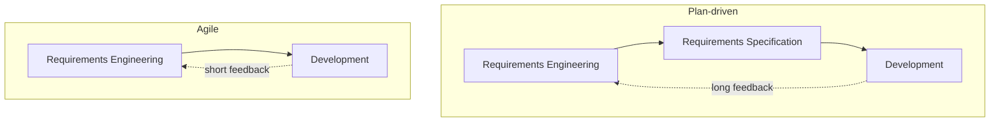
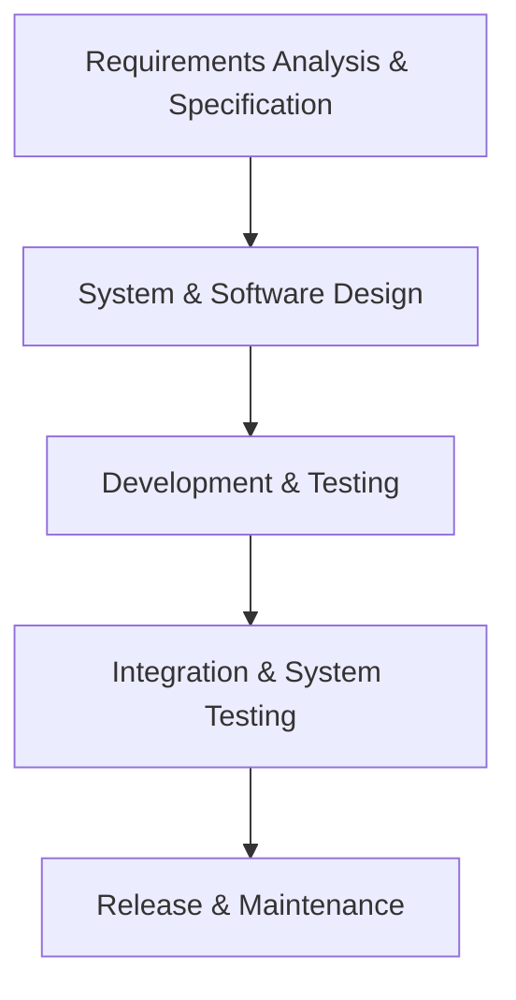
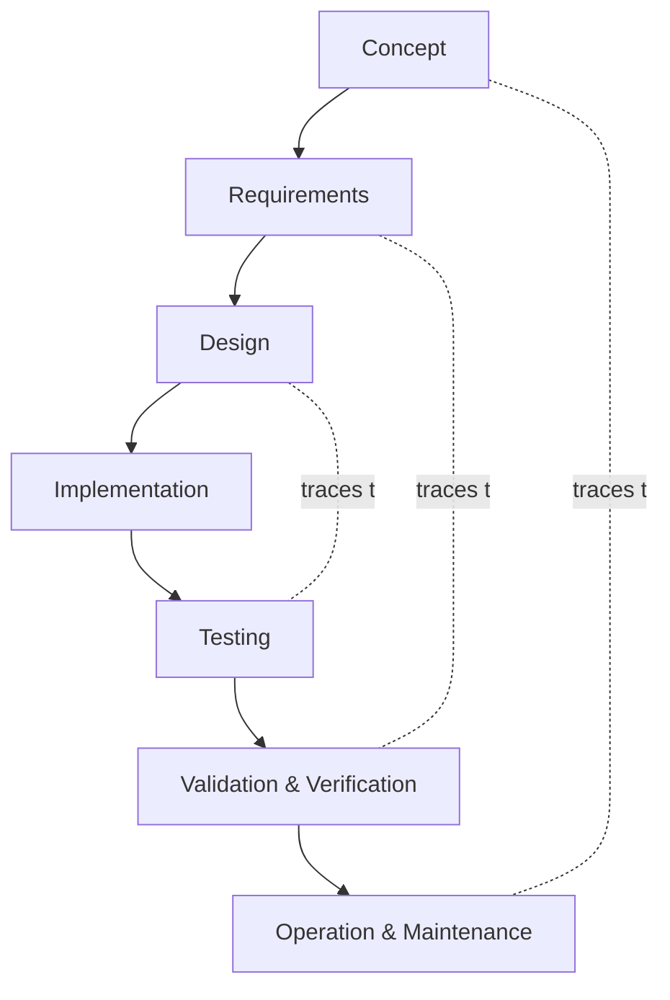
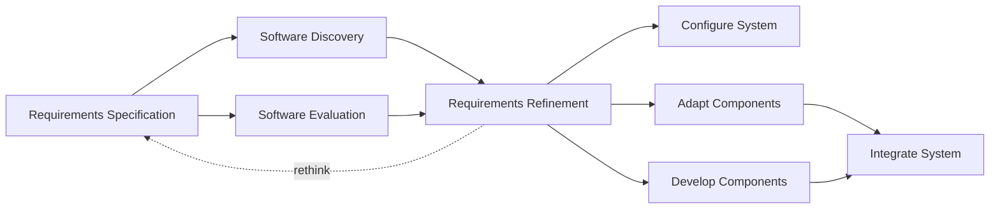

# Chapter 6 — Plan-driven Process Models for Vibe Coding

**Andreas Maier¹, Aline Sindel¹, Christian Bergler², and Sally Zeitler¹**
¹ Friedrich-Alexander-Universität Erlangen-Nürnberg (FAU)
² Ostbayerische Technische Hochschule Amberg-Weiden (OTH-AW)

## Abstract

This chapter explains why software process models and in particular plan-driven ones remain necessary even when large language models (LLMs), code agents, and other artificial intelligence (AI) tools accelerate implementation. The core argument is simple: faster code generation does not remove the need to coordinate people, define responsibilities, document intent, and verify results. Building on the basic software-engineering ideas introduced in Chapter 2, the chapter explains what process models do, why they exist, and how they help teams move from ad-hoc coding to reproducible engineering.

The chapter contrasts plan-driven and agile thinking which is dealt with in Chapter 7, then discusses the waterfall model, the V-model, reuse-oriented development, and the shorter feedback loops that characterize agile work. Along the way it adds practical material, including the startup reality of regulated software, the value and risk of software reuse, and the way AI changes documentation cost without changing accountability. The goal is not to glorify one model. The goal is to understand which risks each model manages well and which risks it accepts.

## Why Process Models Still Matter in AI-Assisted Development

Chapter 2 introduced software engineering as more than writing source code. Requirements, design, implementation, testing, release, and maintenance all belong to the job. A software process model adds the missing organizational layer: it describes which activities happen, in which order they happen, which artifacts they produce, and who is responsible for them. In other words, it turns a list of engineering tasks into a coordinated way of working. This is similar to what Chapter 5 demonstrated on a smaller scale: individual steps such as prompting, verifying, and refining were manually combined into repeatable workflows. Software process models take that same idea and apply it to large projects with many participants. In essence, they are best practices or recipes for organizing software development at scale. The key vocabulary used throughout this chapter, namely artifacts, roles, traceability, verification, and validation, is summarized in the Geek Box on artifacts, roles, and traceability.

Once development scales beyond one person and one laptop, structure becomes more and more important. A solo prototype can survive on memory, intuition, and a bit of chaos. A team project cannot. As soon as several people work on shared code, use multiple tools, or depend on common interfaces, informal coordination becomes expensive. Somebody has to know when a requirement is stable enough to implement, when a test result counts as acceptable evidence, and who is allowed to change a safety-critical component. A process model answers exactly these questions.

This is why process models did not disappear with vibe coding. They remain the mechanism that synchronizes work across time, people, and systems. They provide a common view for planning, reduce dependence on heroic individuals, and help defects show up earlier because testing and review are not left to chance [Metzner 2020; Sommerville 2016]. In certified or regulated settings they also provide the evidence trail needed to show not only what was built, but how it was built and why those steps were considered adequate.

> **Geek Box: Artifacts, roles, and traceability**
>
> Process models often sound abstract because they use a handful of recurring terms. Once these terms are clear, much of the later discussion becomes easier to read.
>
> | Term | Meaning |
> | --- | --- |
> | **Activity** | A piece of work, for example writing requirements, reviewing code, running integration tests, or approving a release. |
> | **Artifact** | A work product created by an activity, such as a requirements document, an architecture sketch, source code, a test report, or a signed release package. |
> | **Phase** | A larger block that groups activities with a common goal, for example requirements engineering, design, implementation, or system test. |
> | **Role** | A defined responsibility in the process, such as developer, reviewer, tester, product owner, or safety officer. One person may hold several roles in a small project. |
> | **Traceability** | The ability to connect artifacts across the process. A requirement should be traceable to a design decision, an implementation unit, a commit, and a test result. |
> | **Verification** | Checking whether the system was built according to its specification. In short: did we build it right? |
> | **Validation** | Checking whether the finished system solves the real user problem. In short: did we build the right thing? |
>
> The last two terms are often confused, but the distinction matters. A program can be perfectly verified against the wrong specification and still disappoint or even harm its users. IEEE terminology keeps this separation explicit [IEEE 1990]. In AI-assisted development the distinction becomes even more important, because generated code can look polished long before anyone has checked whether it implements the correct requirement. Chapter 2 already showed that fluent output is not the same as verified output.

## Plan-Driven and Agile Thinking

A first useful distinction separates *plan-driven* from *agile* process logic. Plan-driven models define a substantial part of the work in advance. Activities, handovers, documents, and milestones are planned early, and progress is measured against that plan. This is attractive when requirements are comparatively stable, the system has to satisfy external rules, or many teams need to align with one another. Agile models plan incrementally. They rely on short feedback loops, smaller batches of work, and frequent updates when requirements or technical understanding change [Sommerville 2016; Cha 2019; Boehm 2003].

The following figure makes this contrast visible. The upper part shows the plan-driven view: requirements engineering leads to a written specification, the specification drives development, and the path back from finished development to changed requirements is long. That long return arrow is the important part. It means that a change request has to fight its way through a larger amount of existing planning and documentation. The lower part shows the agile idea: requirements and development are connected in a much tighter loop. Teams build a prototype or implementation slice, test it, learn from it, and then immediately revisit the requirements. The loop is smaller, which means the cost of learning can also be smaller.

**Figure 6.1.** Conceptual contrast between plan-driven and agile process logic. In the plan-driven flow, requirements engineering produces a requirements specification, which then drives development; a long feedback arrow runs from development all the way back to requirements engineering, so any change must pass back through the specification phase. In the agile flow, requirements engineering and development form a tight two-way loop with no intermediate specification phase, compressing the learning cycle. Adapted from Sommerville [Sommerville 2016].

Neither side is universally superior. A plan-driven release process can be exactly the right answer for a safety-relevant backend or a government procurement project. An agile loop can be exactly the right answer for a user interface that must be refined through frequent feedback. Many real projects therefore combine both styles. Boehm and Turner describe this as a risk-balancing exercise rather than a religious war about methodology [Boehm 2003]. That is the pragmatic reading to keep in mind for vibe coding as well.

## The Waterfall Model

The waterfall model is historically one of the oldest and most intuitive software process models. It assumes that work can be organized into a largely sequential chain: requirements analysis and specification, system and software design, development and testing, integration and system testing, and finally release and maintenance [Metzner 2020; Sommerville 2016]. Each phase produces artifacts that become input to the next phase, so the project moves forward like a row of falling dominoes. If the early dominoes were set up correctly, the sequence works smoothly. If they were not, the repair bill arrives later and with interest.

The following figure shows this downward chain explicitly. The diagram does not merely list five boxes. It also communicates the mindset behind the model. The path is one-directional, every stage assumes that the previous one is already complete enough, and the product gains detail step by step until it is integrated and released. This is why waterfall feels natural to many newcomers. It resembles the logic of manufacturing or construction: first define what should exist, then make a blueprint, then build it, then assemble it, then deliver it. If you can build a shelf from an instruction sheet without improvising halfway through, you already understand why waterfall feels attractive.

**Figure 6.2.** Waterfall model with sequential phase progression. Five descending stages are linked by thick one-directional arrows: requirements analysis and specification, system and software design, development and testing, integration and system testing, and release and maintenance. The descending chain emphasizes that each phase feeds the next one, which makes the approach easy to plan but also means that errors discovered late are expensive to repair. Adapted from Sommerville [Sommerville 2016].

This rigidity is both the strength and the weakness of waterfall. The model is linear, top-down, and easy to explain. Budgets, milestones, and responsibilities can be defined early. Interruptions are minimized because the team is not supposed to revisit fundamental decisions all the time. For small projects with stable requirements, predictable budgets, and little expected change, this can work surprisingly well. In practice, waterfall is often still reasonable in small settings where the team already knows the problem well and where surprises are unlikely. A concrete example is the DVD database from Chapter 1, where a single prompt drove an AI agent through all waterfall phases in one pass (see the Geek Box on the DVD database as an accidental waterfall project).

> **Geek Box: The DVD database as an accidental waterfall project**
>
> The DVD database from Chapter 1 was built with a single prompt, yet the AI agent internally walked through every phase of the waterfall model. This provides a useful micro-example of how waterfall works when requirements are clear and the scope is small.
>
> **Requirements analysis and specification.** The prompt specified the input (shelf photographs), the desired data fields (title, genre, year, shelf position), and the target output (a searchable website with filter bar and detail pages). The scope was fixed in a single sentence, leaving no ambiguity to negotiate.
>
> **System and software design.** The agent chose a static HTML/CSS/JavaScript stack with no server. Data lives in a single JSON file (`dvds.json`), the main page (`index.html`) provides search and filter controls, and a detail page (`detail.html`) shows individual entries.
>
> **Development and testing.** `app.js` loads JSON data, populates genre and year dropdowns, renders a card grid, and supports live search. `detail.js` parses URL parameters for single entries. `styles.css` provides a responsive layout. The agent iterated locally until pages rendered correctly.
>
> **Integration and system testing.** Vision-based title extraction was integrated with the structured dataset. The agent verified that titles matched visible spines, filters produced correct subsets, and detail links resolved properly.
>
> **Release and maintenance.** Files were committed to a public GitHub repository with instructions for running locally. Adding DVDs later requires only appending to `dvds.json`.
>
> Waterfall worked because requirements were complete from the start, scope was small, and no mid-process feedback was needed. For larger or less predictable projects, the same single-pass approach would be risky.
>
> **Figure 6.3.** Two stacked screenshots of the generated DVD database website: a searchable grid view showing DVD cards, and a per-entry detail page.

The downside is the early commitment. Once the team has agreed on the plan, new requirements are hard to integrate cleanly. There is little room for reiteration, and large projects rarely stay still long enough to justify that assumption. If a major misunderstanding is discovered only during integration or system test, the team may need to revisit design decisions, rewrite code, update tests, and renegotiate scope all at once. This is why waterfall is often criticized as impractical for volatile projects. The criticism is not that the model is stupid. The criticism is that the model assumes a world that is calmer than most software projects actually are.

## The V-Model as Structured Verification Strategy

The V-model takes the basic plan-driven idea and adds an important engineering insight: whenever you define something on the way down, you should already know how you will check it on the way back up. On the left side of the V, the project is decomposed from concept to requirements, from requirements to design, and from design to implementation. On the right side, the system is integrated again through testing, verification, validation, operation, and maintenance [Metzner 2020; Stephens 2015]. The two sides are paired. Concept is linked to operation. Requirements are linked to validation and verification. Design is linked to testing.

The following figure visualizes this pairing clearly. The left branch narrows broad intentions into implementable building blocks. The right branch checks whether these building blocks, once combined again, satisfy the intentions that justified them in the first place. The horizontal arrows are the crucial detail. They indicate that later evidence is not floating freely. It is tied back to earlier decisions. This is exactly what traceability looks like in process form.

**Figure 6.4.** V-model with paired development and verification stages. The left (decomposition) branch descends from concept to requirements to design to implementation. The right (integration) branch ascends from implementation through testing, validation and verification, to operation and maintenance. Horizontal links pair concept with operation and maintenance, requirements with validation and verification, and design with testing, so that each verification activity traces back to the artifact it checks. Adapted from Metzner [Metzner 2020] and Stephens [Stephens 2015].

This makes the V-model attractive for large, complex, or heavily regulated systems. Teams get detailed specifications, explicit role definitions, structured deliverables, and a built-in reminder that testing must be thought about from the beginning. An important nuance is worth noting: testing is considered early, but much of the actual testing activity still happens later in the timeline. That is an improvement over naive waterfall, but it does not yet provide the extremely short learning cycles associated with agile methods.

The model is especially popular where uncontrolled change is dangerous. In medical products, security-relevant software, and government systems, teams are not expected to change code because somebody had a clever late-night idea. They are expected to change code because there is a documented requirement, a verified design impact, and a defensible reason for the change. This is also why current guidance from the Food and Drug Administration (FDA) and NIST still emphasizes documented, risk-based verification rather than improvisation at release time [FDA 2026; NIST 2022]. The international standards behind these requirements are summarized in the Geek Box on the regulatory backbone.

> **Geek Box: The regulatory backbone: key standards for medical device software**
>
> When this chapter discusses plan-driven software processes, documentation requirements, and traceability in regulated environments, the underlying reason is a family of international standards that e.g. medical device software must comply with. Four of them are especially important.
>
> **IEC 62304 (Medical Device Software -- Software Life Cycle Processes)** defines lifecycle processes for medical device software [IEC 62304 2015]. It classifies software into safety classes A, B, and C depending on the potential harm to patients: class A covers software where failure causes no injury, class B covers software where failure can cause non-serious injury, and class C covers software whose failure can cause death or serious injury. The higher the class, the more rigorous the required documentation, testing, and review become, which aligns well with the V-model's emphasis on traceable verification at every level.
>
> **ISO 14971 (Application of Risk Management to Medical Devices)** governs risk management throughout the entire device lifecycle [ISO 14971 2019]. It requires manufacturers to identify hazards, estimate and evaluate associated risks, implement risk-control measures, and monitor residual risk after deployment. This is not a one-time activity but a continuous process, which is why the V-model's structured feedback loops and the waterfall model's phase-gate reviews are natural implementation vehicles for these requirements.
>
> **ISO 13485 (Medical Devices -- Quality Management Systems)** specifies a quality management system (QMS) for medical devices [ISO 13485 2016]. It ensures that design, development, and production follow consistent, auditable processes, exactly the kind of organizational discipline illustrated by the startup story in this chapter. Without a functioning QMS, regulatory approval in the EU or the US is effectively impossible.
>
> **IEC 82304-1 (Health Software -- General Requirements for Product Safety)** addresses standalone health software, often called Software as a Medical Device (SaMD) [IEC 82304 2016]. As more AI-assisted tools operate independently of dedicated hardware, this standard becomes increasingly relevant. It requires that safety is designed into the software product itself, not inherited from a surrounding physical device.
>
> Together, these standards explain why the process models discussed in this chapter are not academic exercises. They are the operational framework that regulated industries require, and they are the reason that documentation, traceability, risk analysis, and verification artifacts are mandatory rather than optional.

If a company decides to build medical-grade software, one person year of work may largely disappear into process definition, documentation templates, traceability rules, approval paths, training, and links to version control if no AI is used for the entire process. That work feels slow because it does not produce flashy screenshots. Yet it is the scaffolding that later allows an auditor, tester, or regulator to understand what happened. Nobody founds a startup in order to spend twelve months getting emotionally attached to document states, but regulated software has a way of forcing exactly that relationship.

LLMs change the economics of this overhead, but they do not remove it. They can help draft process documents, summarize change logs, create test-case templates, and explain internal rules to new team members. That can reduce the pain of documentation-heavy methods and may even reduce training effort for participants. Still, the final accountability stays with the organization. A generated traceability matrix is only useful if somebody checks that it actually reflects reality. Fast paperwork is nice. Correct paperwork is nicer. Yet, also here structured AI workflows have enormous potential to support such software processes as we will later see in this book.

## Reuse-Oriented Process Design

A reuse-oriented process begins with requirements, but it does not jump directly to implementation. Instead, it asks an economically uncomfortable and therefore very useful question: what if the thing we want already exists? Teams first search for existing software, libraries, frameworks, services, or components, then evaluate them, then refine their requirements against what is realistically available, and only after that decide whether to configure, adapt, or newly develop missing pieces [Sommerville 2016]. Reinventing the wheel is a surprisingly popular hobby in programming. Reuse-oriented development is the institutional attempt to break that habit.

The following figure shows the logic in detail. The process starts at requirements specification on the left, then branches into software discovery and software evaluation. That means searching for candidate components and checking whether they are fit for purpose. The next box, requirements refinement, is essential. It acknowledges that reuse changes the conversation. Once you know what existing components can and cannot do, you often update the requirements. Only then do you decide whether the system can mainly be configured, whether components must be adapted, or whether genuinely new components have to be written before everything is integrated.

**Figure 6.5.** Reuse-oriented development process. Requirements specification branches into software discovery and software evaluation, which feed into requirements refinement. Refinement can loop back to the original specification, and otherwise leads to one of three routes — configure system, adapt components, or develop components — before everything converges on integrate system. The figure makes clear that discovery and evaluation happen before custom implementation is fixed, and that requirements refinement can send the team back to rethink what should be built at all. Adapted from Sommerville [Sommerville 2016].

This model is highly relevant for vibe coding. A practical recommendation is to use AI support even before touching the code level: let an agent help search package ecosystems, summarize alternatives, and compare trade-offs. If a mature library already solves eighty percent of the problem, it is usually better to integrate it than to generate a fresh eighty-percent-correct clone and spend the following months debugging the missing twenty percent. Existing software can bring accumulated quality, battle-tested behavior, and faster delivery.

Reuse has costs, though, and we should not romanticize it. A library may not exactly fit the original requirements. Once a team decides to reuse it, the requirements may have to change. That is acceptable only if the refined requirements still meet the real user needs. Reuse also buys dependencies, and dependencies come with their own lives: release policies change, maintainers disappear, APIs break, licenses get updated, and cloud model offerings are sometimes deprecated with the emotional warmth of a parking ticket. Empirical work on packaging ecosystems shows that dependency networks can become large, fragile, and difficult to control, especially because transitive dependencies accumulate quietly in the background [Decan 2019].

For that reason, good reuse-oriented practice includes due diligence. Teams should look not only at feature lists, but also at maintenance history, issue resolution behavior, user adoption, and update frequency. A widely used package is not automatically safe, but a package with no active maintenance and unclear ownership should make eyebrows rise. The same logic applies to external AI services. If a team builds its product around one model provider, that provider becomes part of the architecture whether anyone likes the thought or not. A concrete example of both the power and the long-term cost of a complex reuse-oriented stack is the PEAKS project (see the Geek Box on PEAKS).

> **Geek Box: PEAKS: reuse-driven power and the bus factor**
>
> PEAKS (Program for the Evaluation and Analysis of all Kinds of Speech disorders) was a clinical software system for the automatic evaluation of pathological speech [Maier 2009a]. The project idea was to replace subjective perceptual ratings of speech disorders with objective, reproducible measurements based on automatic speech recognition, prosody analysis, and machine-learning classifiers.
>
> The software stack was a textbook example of aggressive reuse. A Java applet provided the recording interface in the browser. An internet layer connected it to server-side Perl scripts that orchestrated C++ and C back-end modules for signal processing and speech recognition. Deep in the back end, FORTRAN math libraries handled numerical routines. Each layer reused mature, battle-tested components, but the integration across five programming languages and multiple decades of library design created a stack that only one developer, namely the lead author, could maintain end to end. His dissertation documents the full requirements analysis for this system even in a dedicated chapter [Maier 2009b].
>
> The payoff was substantial: PEAKS enabled automated recording, ASR-based intelligibility scoring, prosody feature analysis, and direct exports to WEKA [Holmes 1994] and Excel, which dramatically accelerated clinical research and paper writing. Over more than 15 years of operation, roughly 4,000 patients and control subjects were recorded, making it probably the largest speech disorder database in the world. The original publication has been cited more than 246 times to date.
>
> The cost of reuse appeared when the lead developer left the project. Nobody else could navigate the full stack, and all further extensions became impossible without him. The system could be maintained, but it could not be extended, until 2025. This is a classic *bus factor* problem. The bus factor is the number of people on a project who would need to become suddenly unavailable, figuratively by being "hit by a bus," before the project could no longer continue. A bus factor of one means that a single departure can stall everything. It illustrates why reuse-oriented development must be paired with documentation, knowledge transfer, and architectural transparency, exactly the process disciplines discussed in this chapter.
>
> **Figure 6.6.** The PEAKS project logo, showing stylized mountain peaks.

## Scaling Vibe Coding from Individuals to Teams

The common thread across all process models is coordination. That is the part that becomes more important, not less important, once vibe coding scales from an individual developer to a team or organization. A single person with an LLM can improvise. A company releasing a product cannot rely on improvisation alone. It needs synchronization points, review criteria, ownership boundaries, integration rules, and rollback logic. Process models supply that skeleton.

At the same time, AI changes what is cheap inside the process. Draft documentation, trace links, release notes, meeting summaries, and test templates can now be created faster than before. That matters. It means some forms of disciplined engineering are less painful to execute than they used to be. In practice, this may reduce the burden of documentation-heavy models such as the V-model. Chapter 5 showed the same pattern from a different angle: LLMs are good at producing candidate artifacts quickly, but those artifacts still need verification.

The resulting lesson is nuanced. AI can reduce process overhead, but it does not make process optional. If anything, fast code generation increases the need for clear gates, because more candidate changes can now be produced in less time. DORA's 2024 report reflects this broader picture: AI-related productivity gains exist, but sustained engineering performance still depends on process quality, platform support, and disciplined delivery practices rather than on raw code speed alone [DORA 2024].

A useful way to phrase the conclusion is this: process models are not the opposite of vibe coding. They are the mechanism that keeps vibe coding from collapsing into team-wide archaeology. Once several people, several systems, and several risks are involved, someone has to know which artifact is current, which test is authoritative, and which change is allowed to ship. Good process answers those questions before the outage, not after it.

## Exercises

The following exercises ask you to select, adapt, and justify software process models for realistic project scenarios, applying the concepts discussed in this chapter.

**Exercise Problem 1:** Create a waterfall project plan for a browser-based match-three game (similar to Candy Crush). Walk through each waterfall phase explicitly: write a short requirements specification (game rules, grid size, scoring, win/lose conditions), sketch the system design (HTML/CSS/JavaScript modules, game-loop architecture, asset management), describe the development and unit-testing phase, define integration and system tests (e.g., does the score update correctly after a match? does the game end when moves run out?), and state what a release and maintenance plan would look like. Discuss where the waterfall model works well for this project and where its rigidity could become a problem.

**Exercise Problem 2:** Apply the V-model to the DVD database example from Chapter 1 (see also the Geek Box on the DVD database as an accidental waterfall project). For each level on the left side of the V, write the corresponding artifact: concept (what problem does the DVD database solve?), system requirements (what data fields, what search capabilities?), and detailed design (which files, which technology stack?). Then, for each level on the right side, define the matching verification activity: component tests (does the JSON loader work?), integration tests (do filters and detail pages reflect the same data?), and acceptance validation (does the final website match the original shelf contents?). Draw the V-model diagram with your artifacts and tests linked across the two sides.

**Exercise Problem 3:** Apply reuse-oriented due diligence to the PEAKS software stack described in the Geek Box on PEAKS. The system combined a Java applet, Perl scripts, C++/C modules, and FORTRAN math libraries into a single product. For each of the five technology layers, assess the reuse decision: was the component a good choice at the time? What are the maintenance risks today (e.g., Java applets are no longer supported in modern browsers, Perl has declined in popularity, FORTRAN libraries are rarely maintained by new developers)? Then propose a modernized architecture that preserves the same functionality, including recording, speech recognition, prosody analysis, and machine-learning export, but reduces the bus factor. Identify which components you would replace with current alternatives (e.g., a web-based recorder instead of a Java applet, Python instead of Perl, modern numerical libraries instead of FORTRAN), which you would keep, and how you would document the integration so that more than one developer can maintain the system. Additionally, estimate the implementation effort for your modernized architecture assuming AI-assisted development: for each component you propose to replace or rewrite, give a rough time estimate with and without LLM support, and identify where AI tooling would provide the largest speedup (e.g., boilerplate migration, test generation, documentation). Conclude with a short assessment: would the original reuse decisions have been different if the team had applied the due-diligence checklist from this chapter (maintenance history, community size, update frequency, license stability)?

## Bibliography

- [Boehm 2003] Boehm, B., Turner, R. *Using risk to balance agile and plan-driven methods.* Computer, 36(6), 57–66, 2003.
- [Cha 2019] Cha, S., Taylor, R. N., Kang, K. *Handbook of Software Engineering.* Springer International Publishing, 2019.
- [Decan 2019] Decan, A., Mens, T., Grosjean, P. *An empirical comparison of dependency network evolution in seven software packaging ecosystems.* Empirical Software Engineering, 24, 381–416, 2019.
- [DORA 2024] Google Cloud and DORA. *DORA Report 2024.* 2024. <https://dora.dev/research/2024/dora-report/>
- [FDA 2026] U.S. Food and Drug Administration. *Computer Software Assurance for Production and Quality System Software: Guidance for Industry and FDA Staff.* 2026. <https://www.fda.gov/regulatory-information/search-fda-guidance-documents/computer-software-assurance-production-and-quality-management-system-software>
- [Holmes 1994] Holmes, G., Donkin, A., Witten, I. H. *Weka: A machine learning workbench.* Proceedings of ANZIIS'94, 357–361, 1994.
- [IEC 62304 2015] International Electrotechnical Commission. *IEC 62304:2006+AMD1:2015 -- Medical device software -- Software life cycle processes.* 2015.
- [IEC 82304 2016] International Electrotechnical Commission. *IEC 82304-1:2016 -- Health software -- Part 1: General requirements for product safety.* 2016.
- [IEEE 1990] IEEE. *IEEE Standard Glossary of Software Engineering Terminology (IEEE Std 610.12-1990).* 1990.
- [ISO 13485 2016] International Organization for Standardization. *ISO 13485:2016 -- Medical devices -- Quality management systems -- Requirements for regulatory purposes.* 2016.
- [ISO 14971 2019] International Organization for Standardization. *ISO 14971:2019 -- Medical devices -- Application of risk management to medical devices.* 2019.
- [Maier 2009a] Maier, A., Haderlein, T., Eysholdt, U., Rosanowski, F., Batliner, A., Schuster, M., Nöth, E. *PEAKS -- A system for the automatic evaluation of voice and speech disorders.* Speech Communication, 51(5), 425–437, 2009.
- [Maier 2009b] Maier, A. *Speech of Children with Cleft Lip and Palate: Automatic Assessment.* Logos-Verlag, 2009.
- [Metzner 2020] Metzner, A. *Software Engineering — Kompakt.* Carl Hanser Verlag, 2020.
- [NIST 2022] National Institute of Standards and Technology. *Secure Software Development Framework (SSDF) Version 1.1 (NIST SP 800-218).* 2022. <https://csrc.nist.gov/pubs/sp/800/218/final>
- [Sommerville 2016] Sommerville, I. *Software Engineering.* Pearson, 2016.
- [Stephens 2015] Stephens, R. *Beginning Software Engineering.* Wrox / Wiley, 2015.

## Source

This chapter is derived from the *Vibe Coding* book (Maier et al., Springer, CC BY, <https://link.springer.com/book/9783032399069>), chapter source `vhb_vibe_coding/VIBE_06 SOFTWARE PROCESSES/chapter.tex`. It is part of the VHB course *Vibe Coding*: <https://www.studon.fau.de/studon/ilias.php?baseClass=ilrepositorygui&ref_id=6720901>
