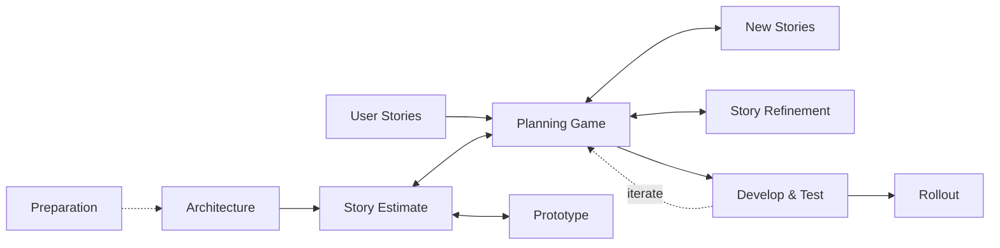
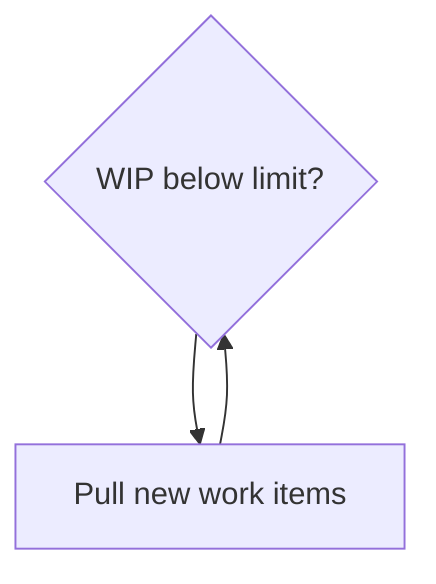
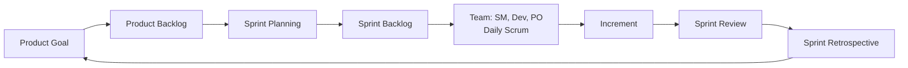

# Chapter 7 — Agile Processes for Vibe Coding

**Andreas Maier, Aline Sindel, and Sally Zeitler**
Friedrich-Alexander-Universität Erlangen-Nürnberg (FAU)

## Abstract

Building directly on Chapter 6, we explain why agile methods remain highly relevant when software is built with strong artificial intelligence (AI) support. The core challenge is not only to generate code quickly. The real challenge is to keep implementation aligned with actual intent while requirements, technical understanding, and user feedback continue to change.

To make that concrete, the chapter explains the basic agile shift away from long feedback loops, introduces the Agile Manifesto, and then discusses two widely used agile frameworks: Kanban and Scrum. It also addresses the hard part that is easy to underestimate, namely scaling agility beyond one person and a handful of experiments. The chapter also covers the role of rapid prototyping, the risk of misunderstandings when humans and AI systems collaborate, the changing interpretation of work-in-progress limits in agentic workflows, and the need for stronger coordination when agile development is pushed toward larger systems.

## Why Agile Processes Matter in AI-Assisted Development

Chapter 6 introduced the basic contrast between plan-driven and agile process models. This chapter continues from that point and makes agile development concrete. The reason this matters for vibe coding is straightforward. Once software is generated and revised rapidly, the dominant risk is often no longer typing speed. The dominant risk becomes intent drift: the system confidently builds something, perhaps even something that compiles and runs, but not the thing that was actually wanted.

That problem already existed in classical software engineering, which is why Chapter 2 spent time on requirements, testing, and feedback loops. Large language models (LLMs) and agents do not remove that problem. They amplify it. If the goal is vague, the result is often a vague or misaligned implementation delivered at very high speed. This is one reason early AI-assisted coding often looked like a stripped-down version of extreme programming: implement, test, fix, repeat. Agile methods provide a more mature process vocabulary for this kind of short-cycle work [Hanser 2010; Stephens 2015].

The engineering point is clear. Agile development is useful whenever teams cannot afford to wait until the end of a long process to discover that they misunderstood the goal. In AI-assisted development, that danger is unusually acute, because both humans and reasoning models can misunderstand an instruction, a constraint, or a user need. Agile methods, therefore, matter not because they are fashionable, but because they reduce the time between misunderstanding and correction.

## The Agile Manifesto as a Shift in Emphasis

The Agile Manifesto from 2001 is still the simplest way to express the change in priorities that agile methods brought into software engineering [Agile Manifesto 2001]. Its four value statements do not say that process, documentation, contracts, or planning are worthless. They say that when tradeoffs must be made, individuals and interactions matter more than rigid tools and procedure, working software matters more than paperwork alone, customer collaboration matters more than treating the contract as the end of the conversation, and responding to change matters more than blindly following a plan.

In practice, those values correct several common failure modes of plan-driven thinking. If interaction is weak, misunderstandings survive too long. If working software is not shown early, a team can document itself into a false sense of progress. If customer collaboration is replaced by one frozen negotiation, the system may satisfy the paper and still disappoint the people who actually need to use it. If following the original plan becomes more important than responding to evidence, the process turns into a ceremonial march toward a very orderly mistake.

For AI-assisted development, these values are especially relevant. A model can produce code, tests, and even documents quickly, but it cannot reliably infer every unstated intention. Chapter 5 already showed that precise prompting and verification matter. Agile thinking extends that lesson from single prompts to the whole development process: keep the interaction alive, show working increments early, let users react, and be ready to correct the course. The key vocabulary behind these practices—user stories, backlogs, and acceptance criteria—is defined in the Geek Box below.

> **Geek Box: User stories, backlog, and acceptance criteria**
>
> Agile projects often sound mysterious only because they use a few recurring terms without stopping to define them.
>
> A **user story** is a short description of desired functionality from the viewpoint of someone who uses or benefits from the system. A common form is: *As a &lt;role&gt;, I want &lt;capability&gt;, so that &lt;benefit&gt;.* The point is not literary beauty. The point is to keep the requirement tied to a user need rather than to implementation details [Cohn 2004].
>
> A **product backlog** is the ordered list of work that might still need to be done for the product. It is larger than the current iteration. A **sprint backlog** is the narrower subset chosen for the current sprint in Scrum. In Kanban, teams may use a backlog in a looser continuous-flow setting, but the basic meaning is similar: work waiting to be pulled.
>
> **Acceptance criteria** turn a story into something testable. They describe how the team will recognize that the story is really done. Without acceptance criteria, a story may be small enough to discuss but still too vague to verify. This matters a great deal in AI-assisted development. A prompt can trigger code generation, but acceptance criteria determine whether the generated result should be accepted.
>
> A backlog is therefore not a magical drawer where unfinished work goes to mature emotionally. It is a synchronization artifact. It tells the team what matters now, what matters later, and what still lacks enough clarity to implement safely.

## Agile Collaboration Between Users and Developers

Agile methods are often described as if they simply remove structure. The agile collaboration model shows that the opposite is true. The user side contributes user stories, new stories, story refinement, and rollout feedback. The developer side contributes architecture, preparation, estimates, prototypes, and the actual development-and-test cycle. The center of the model contains the negotiation machinery that keeps both sides aligned: story estimates, planning games, prototypes, and repeated iteration.

**Figure 7.1.** Agile collaboration model linking user intent and technical implementation through explicit stories, architectural preparation, estimates, prototypes, and repeated iteration. On the user side sit user stories, new stories, story refinement, and rollout; on the developer side sit architecture and preparation. Between them, a planning game connects story estimates and prototypes to the develop-and-test loop, which feeds back into planning across iterations. Rollout does not end the conversation—it produces new stories and refinement work for the next cycle. Adapted from Metzner [Metzner 2020].

This figure also corrects a common misunderstanding about agile work. Agile does not mean developers start coding from vague wishes with no technical preparation. The architecture and preparation boxes make this explicit. Developers still need to know where the system runs, which interfaces exist, and how the solution can be extended later. This point extends to modern AI usage as well: more automation is possible today, but human intent still has to be present, precise, and technically interpretable.

In practice, agile methods often have a better cost-to-use relation and can improve code quality. Defects and misunderstandings are not allowed to age quietly for months. They are exposed and corrected quickly. On the other hand, agile work becomes harder when the whole team does not share the method, when prompts or stories are too abstract, or when stakeholders expect exact long-term predictions too early. In such cases, contracts are often written around a number of prototypes or iterations rather than around a frozen feature list, because the point is to learn before pretending certainty.

## Kanban as Flow-Oriented Synchronization

Kanban comes from Japanese production practice—the word (看板) literally refers to a signboard or visual signal. In industrial just-in-time production, such signals were used to tell the next supplier or workstation when more parts were needed. A vivid example illustrates this: if the production line is about to run out of door handles, the signal must be sent early enough that the next batch arrives before the line stops. Software development borrows exactly this logic and replaces physical parts with work items [Stephens 2015; Kanban 2020].

That origin matters because it explains what Kanban is really optimizing. Kanban is not merely a pretty board with sticky notes. It is a way of keeping value moving through a process without unnecessary waiting, overproduction, or hidden bottlenecks. In software teams, value moves when work is clearly defined, visible, pulled at the right time, reviewed, and completed. If dependencies are unclear or tasks pile up in one column, the board is no longer just a picture of the process. It becomes a picture of where the process is choking.

The Kanban Guide frames this as an optimization problem over effectiveness, efficiency, and predictability. The table below translates these three words into practical questions. Are we delivering the right thing when it is needed? Are we using available people, tools, and compute without creating unnecessary waiting? And can we forecast delivery with an uncertainty that is still useful for planning? These are management questions, but they are also daily engineering questions.

**Table 7.1.** Flow-optimization goals in Kanban-oriented process design. Together, the three goals ask whether work is valuable, whether capacity is used sensibly, and whether delivery can be forecast with useful confidence. Adapted from the Kanban Guide [Kanban 2020].

| Goal | Process interpretation |
| --- | --- |
| Effectiveness | Deliver the capabilities that users need at the point when they need them. |
| Efficiency | Use development resources so that dependencies and waiting times do not dominate throughput. |
| Predictability | Keep uncertainty bounded such that delivery-time forecasts remain actionable for planning. |

A Kanban board makes this visible. A simple four-column board uses the states *Backlog*, *Doing*, *Review*, and *Done*. The important thing is not the artwork. The important thing is the asymmetry. Several cards wait in the backlog, only one card is currently being worked on, two cards are in review, and more cards are already in the done column. That distribution tells a story about flow: work is selected, pulled into execution, checked before acceptance, and only then considered finished.

**Figure 7.2.** An illustrated Kanban board with the common workflow states *Backlog*, *Doing*, *Review*, and *Done*. Several cards wait in the backlog, one card is active in doing, two cards are under review, and multiple cards are completed. The stacked cards show that work is intentionally distributed across stages rather than thrown all at once into active development. Image after Jennifer Falco's CC BY 4.0 illustration [Falco 2023].

The workflow only stays healthy if the team actively manages work in progress (WIP). A minimal pull loop reduces that logic to its core: check whether active work is below the limit, and only then pull new work into the system. This pull rule prevents the whole process from drowning in half-finished tasks. Without it, teams tend to start work faster than they finish it, which looks busy for a while and then produces a heroic amount of blocked columns.

**Figure 7.3.** A minimal pull loop for Kanban-style work-in-progress (WIP) management. A single decision node asks whether work in progress is below the limit; if so, new work items are pulled and control returns to the decision. New work is not started simply because it exists—it is pulled only when the active workflow has enough capacity to absorb it.

This idea becomes even more interesting with AI agents. In a classical human-only setting, the WIP limit is often tied closely to the number of developers available. In an agentic setting, new agents can be spawned quickly, so headcount is no longer the main bottleneck. In that setting, the limit shifts instead toward dependency structure, review capacity, and budget. Spawning ten agents is easy. Making sure that the tenth agent is not waiting on the third one, duplicating the seventh one's work, or producing code that nobody has time to review is the harder part.

## Scrum as Structured Flexibility

Scrum is another agile framework, but it tackles agility from a different angle. Instead of continuous pull flow, Scrum organizes work into explicit time boxes called sprints. Scrum is highly structured, even though its overall purpose is flexibility, and that is the right way to read it. Scrum does not say, "Just adapt." It says, "Adapt, but do so through recurring roles, artifacts, and events" [Scrum 2020]. The term itself is historically linked to Takeuchi and Nonaka's influential discussion of overlapping, fast-moving product-development teams [Takeuchi 1986].

Scrum is also rooted in lean and empirical thinking. Teams try to reduce waste, focus on essentials, produce evidence, inspect what happened, and then adapt. The table below summarizes the three core principles used in the chapter. Transparency ensures that everyone can see what the relevant state of the work actually is. Inspection forces the team to look at progress and artifacts frequently instead of trusting wishful thinking. Adaptation ensures that inspection has consequences rather than becoming a decorative ritual.

**Table 7.2.** Core Scrum principles and their process intent. These principles make Scrum a structured way of handling flexibility rather than an invitation to improvise without evidence. Adapted from the Scrum Guide [Scrum 2020].

| Principle | Process interpretation |
| --- | --- |
| Transparency | Team status and artifacts are visible enough to support shared situational awareness. |
| Inspection | Artifacts and progress are checked frequently to detect mismatches early. |
| Adaptation | Planning, priorities, and execution are revised whenever evidence indicates drift. |

These ideas become a recurring operating loop. The process begins with a product goal and a product backlog that holds stories or requirements still waiting to be done. Sprint planning then selects a subset of that work for the current sprint. Inside the sprint, the team works from the sprint backlog, synchronizes through daily Scrum meetings, and produces an increment. At the end of the sprint, the review checks what was actually achieved, and the retrospective reflects on how the team itself should improve before the next cycle begins.

**Figure 7.4.** The Scrum workflow with explicit artifacts, roles, and synchronization points. A product goal feeds the product backlog; sprint planning draws a sprint backlog, which the team (Scrum Master, Developers, Product Owner) executes with a daily Scrum, producing an increment. The sprint review checks what was achieved, and the sprint retrospective feeds improvements back to the product goal for the next sprint. The fixed-duration sprint turns agility into a repeatable cycle: select work, execute it, inspect the resulting increment, and then improve both the backlog and the team process. Adapted from Sommerville [Sommerville 2016].

Several practical details matter here. A sprint has a fixed duration, often one week in small examples and at most one month in the standard guidance. Daily Scrum meetings are short and intentionally lightweight, often around fifteen minutes. They are not full technical design reviews. Their purpose is to synchronize what is currently being handled so that the team does not drift into silent divergence. This also makes them useful in AI-assisted settings, because they create explicit moments where generated output, blocked tasks, and hidden misunderstandings can be surfaced before they accumulate.

Scrum also relies on clearly separated roles [Scrum 2020]. The table below gives the compact view. The Product Owner represents the requirements and the success of the product. This person does not have to be the main programmer. In fact, it is someone who primarily focuses on understanding users, customers, and stakeholders. The Scrum Master is different. This role protects and coaches the process itself, supports planning, removes obstacles, and helps the whole organization understand why the artifacts matter. The Development Team then provides technical feedback during planning and turns selected backlog items into working increments.

**Table 7.3.** Scrum role focus in practical team operation. The table is short, but the roles matter because they prevent decision authority, process coaching, and implementation work from collapsing into one fuzzy responsibility cloud. Adapted from the Scrum Guide [Scrum 2020].

| Role | Core responsibility |
| --- | --- |
| Product Owner | Defines and prioritizes product goals and backlog items to maximize delivered value. |
| Development Team | Produces usable increments and adapts execution plans during the sprint. |
| Scrum Master | Ensures the Scrum process is understood, followed, and continuously improved. |
| Stakeholders | Provide domain expectations and feedback that shape product-direction decisions. |

A crucial point is that artifacts are the real synchronization mechanism. The product backlog contains the ordered list of relevant work. The sprint backlog narrows this list to what should be achieved in the current sprint. If several teams or several agents work in parallel, these artifacts prevent duplicated work and conflicting assumptions. If they are vague, every participant may believe they are implementing the right thing while in fact implementing different things. This is exactly where the Scrum Master becomes valuable: not because the role writes code, but because the role keeps the process precise enough that the code work remains aligned [Scrum 2020].

> **Geek Box: Brooks's Law and exploding communication paths**
>
> A famous warning from software engineering is Brooks's Law: adding more people to a late software project can make it later [Brooks 1995]. The basic intuition is simple. New contributors do not appear with a perfect context. They need onboarding, clarification, handovers, and interfaces. All of that is communication work.
>
> A small bit of arithmetic shows why naive scaling becomes painful. If every member of a team may need to communicate with every other member, the number of communication paths grows roughly as
>
> $$\frac{n(n-1)}{2}.$$
>
> With 5 people, that is 10 paths. With 10 people, it is 45. With 15 people, it is 105. The team size triples, but the possible communication surface grows by more than a factor of ten.
>
> This is directly relevant for agile methods and for AI agents. Adding more developers or more agents can increase raw implementation capacity, but it does not remove dependencies, review needs, or integration costs. Agile scaling therefore works only when additional coordination structure grows with the team. Otherwise, the project gains more activity and less progress, which is a surprisingly expensive achievement.

## DevOps: Closing the Gap Between Development and Operations

Agile methods accelerate the development cycle, but they say little about what happens after a sprint produces a working increment. How does that increment reach users? How is it monitored in production? Who fixes it at two in the morning when a database connection silently drops? DevOps addresses exactly this gap. It is a set of practices, cultural principles, and automation tools that unify software development (Dev) and IT operations (Ops) into a continuous, shared responsibility [Bass 2015; Humble 2010].

The core idea is that writing code and running code should not be organizationally separated. In traditional setups, developers write features and throw them over a wall to an operations team that deploys, monitors, and maintains them. That wall creates delay, blame, and information loss. DevOps removes the wall by making the team responsible for the full lifecycle: build, test, deploy, monitor, and respond. This is sometimes summarized as "you build it, you run it" [Kim 2016].

Several key components make this practical. *Continuous Integration (CI)* means that every code change is automatically built and tested as soon as it is committed, so integration problems surface within minutes instead of weeks (CI pipelines and their practical setup are discussed in more detail in the chapter on implementation). *Continuous Delivery (CD)* extends this by keeping the software in a deployable state at all times, so that releasing to production becomes a routine decision rather than a stressful event. *Infrastructure as Code (IaC)* treats server configuration, network setup, and deployment pipelines as version-controlled source files, which makes environments reproducible and auditable. *Monitoring and observability* close the feedback loop by feeding production behavior—error rates, latencies, resource usage—back to the development team in near real time [Forsgren 2018].

For AI-assisted development, DevOps is especially relevant. Vibe coded prototypes can be produced quickly, but they become useful only when they can be deployed, tested in realistic environments, and monitored for regressions. CI/CD pipelines also provide natural quality gates: automated tests, linting, and security scans run on every commit regardless of whether the code was written by a human or generated by an LLM. In that sense, DevOps infrastructure acts as an automated reviewer that catches a class of errors before they reach users.

Empirical research supports the connection between DevOps practices and delivery performance. Forsgren, Humble, and Kim analyzed data from thousands of organizations and found that teams with strong CI/CD, monitoring, and shared ownership consistently delivered faster, with fewer failures, and recovered more quickly from incidents [Forsgren 2018]. The DORA metrics—deployment frequency, lead time for changes, change failure rate, and time to restore service—have since become a widely used benchmark for DevOps maturity [DORA 2025a; DORA 2025b].

## Scaling Agility to Large Systems

Agile methods were originally designed for small teams in close proximity. This point deserves emphasis because it matters. If a team is co-located, communication is easy, the product is not heavily regulated, and the system lifetime is moderate, informal interaction can carry a large part of the coordination load. Once the system becomes large, distributed, contractual, or safety-relevant, that assumption weakens—and the communication overhead can grow explosively, as the Geek Box on Brooks's Law illustrates. What worked as a lightweight team practice can become too informal to tell different groups who is doing what, which artifact is authoritative, and which commitments are contractually meaningful.

One common answer nests agile practice in increasingly disciplined layers. At the center lies core agile development: short cycles, close feedback, and working increments. Around that sits disciplined agile delivery, which adds stronger coordination and delivery control. Around that sits agility at scale, where multiple teams and organizational layers need a broader governance framework. The visual message is important. Scaling agility is not just about making the sprint bigger or inviting more people to the stand-up. It means surrounding core agile practices with additional structure so they can survive contact with reality.

**Figure 7.5.** A layered view of agile scaling shown as three nested ellipses. Core agile development sits at the center; disciplined agile delivery surrounds it; and agility at scale forms the outermost layer. Core agile practices remain central, but larger systems require an outer layer of disciplined delivery and organizational coordination if agility is to survive beyond a single small team. Adapted from Ambler [Ambler 2009].

Three groups of scaling factors are particularly important. On the *project side*, system size, system type, expected lifetime, and regulations matter. On the *development side*, team skill, tooling maturity, and the capabilities of the AI agents matter. On the *management side*, contracts, delivery expectations, and work culture matter. Agile scaling fails when one of these layers is ignored. For example, a team may have good sprint discipline locally but still fail because the larger contractual environment requires more predictable release documentation than the local process provides.

That is why large-scale agility often includes plan-driven elements higher up in the hierarchy. Put bluntly: if agility must be pushed into large software projects, it often has to be integrated into a broader plan-driven approach. That is not a betrayal of agile ideas. It is a recognition that multiple teams, long-lived systems, and formal commitments need more explicit synchronization than a single room of developers can provide. Scrum-on-Scrum structures, additional planning layers, and disciplined delivery practices are all attempts to solve exactly that problem.

## What This Means for AI-Assisted Development

At the time of the lecture, one of the sharp observations was that AI-assisted development scaled well for small projects and for one person working with a few agents, but not yet automatically for large productive systems. That observation still reads well. The bottleneck was not only model capability. It was process capability. Without explicit task definitions, backlog quality, review discipline, and multi-team synchronization, faster generation mostly creates faster local activity.

This chapter therefore complements Chapters 5 and 6. Chapter 5 showed that prompts and verification determine whether generated artifacts are useful. Chapter 6 showed that process models become more important when coordination surfaces grow. Agile methods sit exactly in the middle of those two insights. They provide short feedback loops for uncertain work, but they also force teams to expose stories, backlog states, review points, and role boundaries clearly enough that rapid generation does not turn into rapid confusion.

Current industry observations point in the same direction. DORA's 2025 work on AI-assisted software development still ties outcomes to capability, workflow quality, and organizational learning rather than to code generation alone [DORA 2025a; DORA 2025b]. That is consistent with the chapter argument: productive agility for AI is not just about moving faster. It is about keeping fast movement aligned, reviewable, and scalable.

## Exercises

These exercises translate the agile principles and frameworks covered in this chapter into concrete process-design and decision-making tasks.

**Exercise Problem 1:** Translate one everyday replenishment scenario into a complete Kanban process model and justify each workflow stage with respect to effectiveness, efficiency, and predictability. Begin by defining the value stream and the observable work states, then define pull conditions, review checkpoints, and escalation triggers. Example task: model coffee-bean replenishment for a shared office setup with explicit reorder thresholds, supplier lead-time assumptions, and fallback actions.

**Exercise Problem 2:** Construct a Scrum plan for a small software project and explain why each role and artifact is necessary for alignment. Start with a product goal and user-centered backlog entries, then define sprint scope, daily synchronization behavior, and review criteria for increment acceptance. Example task: design a sprint plan for a browser-based match-three game (similar to Candy Crush Saga) with a storyline spanning three chapters, where each sprint delivers one playable chapter with its own level progression, visual theme, and end-of-chapter boss mechanic. Discuss how delays in parallel teams are handled by the process.

**Exercise Problem 3:** Analyze one project where agile flexibility created delivery risk and propose a process redesign that preserves adaptability while improving forecast quality. Begin with a timeline of scope changes and missed expectations, then identify whether the root causes were backlog ambiguity, weak inspection, role confusion, or dependency bottlenecks. Example task: examine a previous project you participated in where frequent changes caused rework and redesign its planning and review cadence.

**Exercise Problem 4:** Design an AI agent collaboration policy that integrates Kanban or Scrum concepts to prevent uncontrolled parallel work. Begin by defining dependency-aware WIP limits and artifact requirements, then specify inspection points where generated outputs are validated against intent and acceptance criteria. Example task: create a process blueprint for a team that runs multiple coding agents in parallel while keeping backlog consistency and code-review quality stable.

## Bibliography

- [Agile Manifesto 2001] Beck, K., Beedle, M., van Bennekum, A., Cockburn, A., Cunningham, W., Fowler, M., et al. *Manifesto for Agile Software Development.* 2001. <https://agilemanifesto.org/>
- [Ambler 2009] Ambler, S. W. *The Agile Scaling Model (ASM): Adapting Agile Methods for Complex Environments.* 2009.
- [Bass 2015] Bass, L., Weber, I., Zhu, L. *DevOps: A Software Architect's Perspective.* Addison-Wesley, 2015.
- [Brooks 1995] Brooks, F. P. *The Mythical Man-Month: Essays on Software Engineering, Anniversary Edition.* Addison-Wesley Professional, 1995.
- [Cohn 2004] Cohn, M. *User Stories Applied: For Agile Software Development.* Addison-Wesley Professional, 2004.
- [DORA 2025a] DORA. *State of AI-assisted Software Development 2025.* 2025. <https://dora.dev/research/ai/dora-report/>
- [DORA 2025b] DORA. *DORA AI Capabilities Model Report.* 2025. <https://dora.dev/ai/capabilities-model/report/>
- [Falco 2023] Falco, J. *Kanban Board.* Wikimedia Commons (CC BY 4.0), 2023. <https://commons.wikimedia.org/w/index.php?curid=132117320>
- [Forsgren 2018] Forsgren, N., Humble, J., Kim, G. *Accelerate: The Science of Lean Software and DevOps.* IT Revolution Press, 2018.
- [Hanser 2010] Hanser, E. *Agile Prozesse: Von XP über Scrum bis MAP.* Springer Berlin, Heidelberg, 2010.
- [Humble 2010] Humble, J., Farley, D. *Continuous Delivery: Reliable Software Releases through Build, Test, and Deployment Automation.* Addison-Wesley, 2010.
- [Kanban 2020] Orderly Disruption Limited and Daniel S. Vacanti, Inc. *The Kanban Guide.* 2020. <https://kanbanguides.org/wp-content/uploads/2021/01/Kanban-Guide-2020-12.pdf>
- [Kim 2016] Kim, G., Humble, J., Debois, P., Willis, J. *The DevOps Handbook: How to Create World-Class Agility, Reliability, and Security in Technology Organizations.* IT Revolution Press, 2016.
- [Metzner 2020] Metzner, A. *Software Engineering - kompakt.* Carl Hanser Verlag, 2020.
- [Scrum 2020] Schwaber, K., Sutherland, J. *The Scrum Guide.* 2020. <https://scrumguides.org/docs/scrumguide/v2020/2020-Scrum-Guide-US.pdf>
- [Sommerville 2016] Sommerville, I. *Software Engineering.* Pearson, 2016.
- [Stephens 2015] Stephens, R. *Beginning Software Engineering.* Wiley, 2015.
- [Takeuchi 1986] Takeuchi, H., Nonaka, I. *The New New Product Development Game.* Harvard Business Review, 64(1), 137–146, 1986.

## Source

This chapter is derived from the *Vibe Coding* book (Maier et al., Springer, CC BY, <https://link.springer.com/book/9783032399069>), chapter source `vhb_vibe_coding/VIBE_07_AGILE_PROCESSES/chapter.tex`. It is part of the VHB course *Vibe Coding*: <https://www.studon.fau.de/studon/ilias.php?baseClass=ilrepositorygui&ref_id=6720901>
