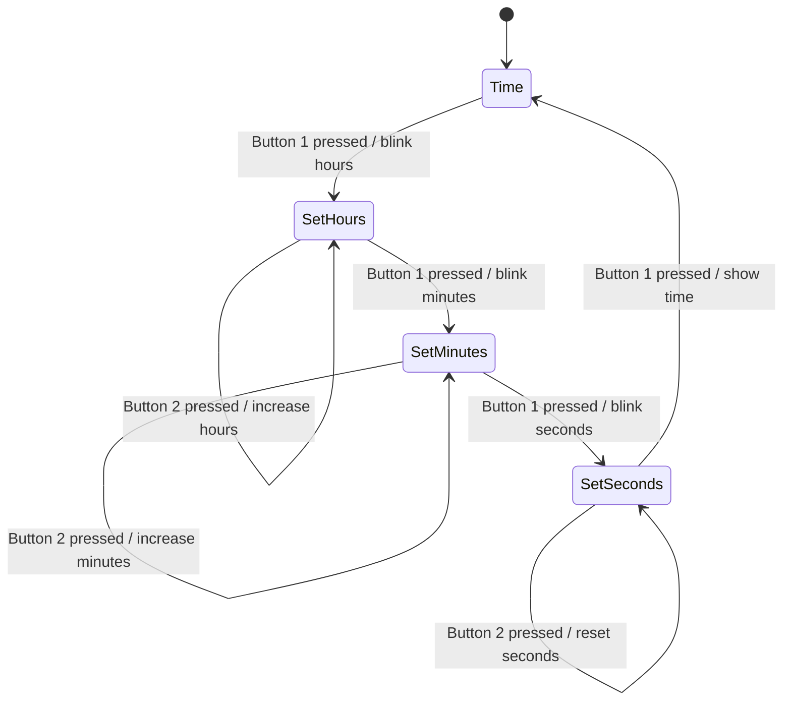

# Chapter 8 — Requirements Engineering in Practice: Finding, Shaping, and Checking What a System Must Do

**Andreas Maier, Sally Zeitler, and Aline Sindel**
Friedrich-Alexander-Universität Erlangen-Nürnberg (FAU)

## Abstract

Requirements engineering is where vague wishes become engineering commitments. This chapter explains how teams move from early stakeholder needs to precise, testable, and evolvable requirements. It introduces the major requirement classes, quality criteria, elicitation methods, specification patterns, modeling techniques, agile user stories, validation practices, and requirement evolution. Along the way, it uses examples from healthcare, library systems, platform products, and recent industry incidents to show that the hard part is usually not typing code quickly. The hard part is making sure the team is solving the right problem, under the right constraints, for the right people.

## Why Projects Drift Before Code Even Starts

Chapter 2 introduced software engineering as the discipline that keeps development from turning into expensive improvisation. Requirements engineering is where that discipline first becomes concrete. Before architecture, implementation, testing, or release planning can work, a team has to agree on what problem the system is supposed to solve, for whom it should solve it, under which constraints it has to operate, and how success will later be recognized. If that agreement is fuzzy, the rest of the project becomes an efficient way of building the wrong thing faster.

One wonderfully brutal image makes that point immediately: everybody says they want a swing, and a few handoffs later, the team has produced a sofa on a tree, forgotten the documentation, billed a roller coaster, and left support as an afterthought. That picture is funny because it compresses several very real failure modes into one page (see the Geek Box below). Requirements get distorted when different people silently fill in different details, when nobody asks what the actual need is, and when the documented requirement becomes a weak photocopy of the original intent. The last panel is the important one. The actual need is simpler than most of the intermediate solutions. That is exactly why requirements engineering exists. It is not there to make projects bureaucratic. It is there to stop teams from mistaking motion for progress.

> **Geek Box: The swing is not about the swing**
>
> The cartoon below is a miniature requirements-engineering case study. Read it from left to right like a postmortem. The early panels show interpretation drift between customer, project management, analysis, design, and implementation. The middle panels show two classics that never go out of style: documentation that somehow evaporated on the way to operations, and a support story that arrives long after the bill.
>
> **Figure 8.1.** The classic "How IT projects really work" cartoon. A single requested object — a swing — is reinterpreted at every handoff: what the customer described, what management understood, what engineers implemented, what operations installed, what was billed, and finally the much simpler tire swing that reflects the customer's actual need. Inspired by the classic "How IT Projects Really Work" cartoon (<https://www.smart-jokes.org/how-it-projects-really-work.html>); images generated using DALL-E 3 and partly manually edited.
>
> The requested object stays nominally the same, but the meaning changes at every handoff. One person hears a business goal. Another imagines a product feature. Another optimizes for technical elegance. Another optimizes for ease of installation. Another optimizes for billing. The lesson is not that people are careless by default. The lesson is that every role carries a partial viewpoint, and partial viewpoints become dangerous when nobody forces them back into one shared requirement statement.
>
> The final tire swing is especially instructive. It is visibly less sophisticated than several earlier panels, yet it is closer to the real need. Requirements engineering, therefore, is not a contest in writing the most impressive specification. It is the disciplined search for the smallest faithful statement of stakeholder intent, constraints, and acceptance conditions.

In formal terms, a requirement can be understood as a needed capability, as a condition a system must satisfy, and as the documented representation of that capability or condition [IEEE 1990]. Sommerville states the idea in a more readable way: requirements describe the services a system should provide and the constraints under which it must operate [Sommerville 2016]. Both formulations matter. The first reminds us that requirements carry contractual and traceable weight. The second reminds us that requirements should still sound like something a team can reason about without needing a legal decoder ring.

### Different readers need different levels of detail

One reason requirement work feels slippery is that the same system has to be described at different levels of precision. A client manager, an end user, a system architect, and a developer are not looking for the same amount of technical detail. User requirements, therefore, stay closer to services, workflows, and externally visible behavior. System requirements push further toward operating conditions, interfaces, timing, security constraints, and implementation-relevant precision [Sommerville 2016; Metzner 2020].

**Figure 8.2.** A diagram of two large requirement categories and their typical readers. User requirements connect to client managers, system end-users, client engineers, contractor managers, and system architects, while system requirements connect to system end-users, client engineers, system architects, and software developers. The arrows show that client-facing roles cluster around user requirements while implementation-facing roles depend on system requirements; client engineers and system architects sit in the overlap and translate between the two views. Adapted from Sommerville [Sommerville 2016].

The figure above makes this split visible. On the left, user requirements are pulled toward client managers and end users because they answer questions like "What should this system help me do?" and "What outcome do I expect to see?" On the right, system requirements are tied more tightly to software developers because they answer questions like "Under which technical conditions must this happen?" and "How precise do we need to be so that implementation and testing are possible?". The shared middle roles, especially client engineers and system architects, are the translators who stop the two sides from drifting apart.

This distinction also explains why teams so often talk past each other. A user requirement like "I want monthly reports" sounds perfectly sensible, but it does not yet specify when the report is generated, which roles may access it, which format is used, how missing data is handled, or how long the system may take. Those details do not contradict the user requirement. They refine it into something a development team can safely build and a test team can actually verify.

An example from university administration makes the distinction even clearer. At the user level, a department head might ask for monthly enrollment reports showing the number of students per course. At the system level, that same wish expands into requirements such as generating the report after midnight on the last working day of the month, restricting access to authorized staff, and exporting the data in CSV format for further processing. None of those details is ornamental. They are the difference between a wish and an implementable specification.

### Not every requirement is a feature

Requirements are also categorized by content. Functional requirements describe what the system should do. Non-functional requirements constrain how well, how safely, how quickly, how reliably, or under which organizational and external conditions the system should do it [Sommerville 2016; Metzner 2020]. Domain requirements add another layer. They arise from the application field itself, such as healthcare, finance, aviation, or public administration, where standards, workflows, and regulations are already waiting in the corridor before the project even starts.

The easy trap is to treat non-functional requirements as polite decoration around the "real" features. That is a great way to build a functionally correct disaster. A search feature that returns results in thirty seconds instead of two, leaks private data, or fails under ordinary workload, is not saved by the fact that technically it does search. Chapter 1 already showed with MoltBook how quickly missing security requirements become public embarrassment. Requirements engineering makes those constraints explicit early enough that they can shape architecture instead of showing up later as apology material. How easily vague non-functional language can hide fundamental disagreements is illustrated in the Geek Box below.

> **Geek Box: A sentence can be clear and still be useless**
>
> "The search should be fast" sounds understandable. It is also a terrible engineering requirement. Nobody knows whether "fast" means half a second, five seconds, or "before I lose patience and make coffee." The sentence is clear enough for casual conversation and too vague for implementation and testing.
>
> The problem becomes vivid once two real users enter the picture. A historian wants to check all European archives for a possible match to a handwritten manuscript fragment. For that user, "fast" might mean three days instead of six months of manual letter writing—a spectacular improvement. A web-search user typing a product name expects results in under one second. For that user, a three-day wait is not "fast." It is broken. Both users read the same requirement sentence and both nod approvingly, yet they walk away with expectations that differ by five orders of magnitude. That is exactly the damage vague requirements do: they create the illusion of agreement while hiding a future conflict.
>
> Now compare the vague version with "The author search shall return either a result list or a no-match message within five seconds under normal operating load." This version still uses ordinary language, but it adds a measurable limit, a concrete system response, and an operational condition. That is the kind of sentence a developer can implement and a tester can check without telepathy.
>
> **Figure 8.3.** A two-panel comic illustrating the ambiguity of the word "fast." A historian is delighted that search results arrive in three days, while a web user considers the very same wait time completely broken. Image generated with DALL-E 3.

The boundary between functional and non-functional requirements becomes clearer with examples. The table below lists four representative requirement statements and their classification. The first two are functional because they describe services the system must provide. The last two are non-functional because they constrain presentation or quality attributes without introducing a new business function.

**Table 8.1.** Examples of functional and non-functional requirements, adapted from Sommerville [Sommerville 2016] and Metzner [Metzner 2020].

| Requirement statement | Classification |
| --- | --- |
| "A user shall be able to search the appointment lists for all clinics." | Functional |
| "Send error message XYZ to the neighboring system when event ABC has occurred." | Functional |
| "Mandatory fields for the user are marked with an asterisk." | Non-functional |
| "The algorithm XYZ must be executable in 2 seconds." | Non-functional |

**Figure 8.4.** A classification diagram for product-related non-functional requirements. A central product-requirements node branches into usability, security, dependability, and efficiency; efficiency branches further into performance and space requirements. Usability concerns how well humans can work with the system, security constrains resistance against misuse or attack, dependability captures reliability and robustness, and efficiency reminds us that speed and resource consumption are not the same thing. Adapted from Sommerville [Sommerville 2016].

The figure above shows why product requirements are not a single checkbox. The central node branches into usability, security, dependability, and efficiency. Efficiency then branches further into performance and space requirements. That split matters because a system can be fast and still waste memory, storage, or bandwidth like there is no tomorrow. The figure, therefore, helps separate concerns that are often carelessly bundled together under the label "quality."

**Figure 8.5.** A classification diagram for organizational non-functional requirements. A central organizational-requirements node connects to environmental requirements, operational requirements, and development requirements. Together they capture constraints such as mandated tooling, rollout procedures, hosting assumptions, and internal process rules. Adapted from Sommerville [Sommerville 2016].

Organizational requirements in the figure above move the focus away from the product itself and toward the environment that has to create, operate, and maintain it. A system may have to run inside a specific infrastructure. It may have to fit an established deployment process. It may have to use approved libraries, development standards, or documentation practices. These are not glamorous requirements, but they are often the ones that decide whether a project integrates smoothly into an existing organization or arrives like a brilliant guest who refuses to learn where the light switches are.

**Figure 8.6.** A classification diagram for external non-functional requirements. A central external-requirements node distinguishes ethical, legislative, and regulatory requirements. The separation matters because not every outside constraint arrives in the same form: some are legal obligations, some are sector rules, and some concern broader ethical limits that shape acceptable system behavior. Adapted from Sommerville [Sommerville 2016].

The figure above adds the final source of pressure. Some requirements are simply waiting for you in the real world. Laws, sector regulation, and ethical obligations do not disappear because a backlog forgot to write them down. In heavily regulated domains this is obvious. In less regulated domains, teams still learn the lesson the hard way when privacy, safety, or disclosure obligations show up late and force architecture changes that are suddenly neither cheap nor elegant.

Domain requirements deserve separate attention because they often hide in plain sight. They come from the application field itself and are so normal to domain experts that they may remain unstated until a project trips over them. In healthcare, that may mean patient privacy, identity checks, and mandatory workflow steps. In finance, it may mean retention rules, auditability, and fraud controls. In military, medical, and financial systems, the domain is already full of obligations before the first backlog item is written. Requirements engineering makes those obligations explicit enough that the team can design for them instead of discovering them during panic-driven rework.

### A good requirement behaves like a good promise

Good requirements are measurable, complete, correct, consistent, unambiguous, pertinent, feasible, traceable, comprehensible, and modifiable [Cha 2019; Meyer 2022; Metzner 2020]. That long list is not there for decoration. It is there because each missing quality creates a different kind of downstream pain. If a requirement is ambiguous, teams implement different things. If it is not measurable, nobody can tell whether it has been satisfied. If it is not traceable, later changes spread through the project like a rumor with no source.

Requirements engineering itself is therefore best understood as an ongoing mediation activity between acquirer and supplier roles [IEEE 2018]. It does not begin and end with a document. It spans discovery, specification, validation, and later change management.

**Figure 8.7.** A four-part diagram of the main requirements-engineering activities. The four quadrants — requirements elicitation, requirements specification, requirements validation and verification, and requirements evolution — form a loop rather than a single workshop. Elicitation scopes the problem and discovers needs, specification selects models and writes the requirements down, validation and verification check adequacy and testability, and evolution manages changes once reality shifts. Adapted from Cha, Taylor, and Kang [Cha 2019].

The figure above is the chapter in one picture. The upper-left quadrant starts with elicitation because teams first need a problem understanding. The upper-right quadrant moves into specification because discovered needs are useless unless they are written down in a form others can work with. The lower-right quadrant reminds us that even a carefully written specification can still be wrong or incomplete, which is why validation and verification are separate activities. The lower-left quadrant closes the loop by showing evolution. Requirements change because understanding changes, organizations change, and the outside world refuses to hold still for a neat project plan.

**Figure 8.8.** A process diagram of activities and artifacts. Requirements elicitation and analysis produce early system descriptions; specification turns those into user and system requirements; validation pushes back into earlier stages; and together these feed a stable requirements document. The arrows loop back rather than forming a one-way assembly line, because teams learn by writing things down and checking them. Adapted from Sommerville [Sommerville 2016].

The figure above adds the artifact view. The arrows do not form a neat one-way assembly line. They loop back because teams learn by writing things down and checking them. A system description can expose gaps in elicitation. Validation can reveal that a precise requirement is still the wrong one. This is why strong requirements work often feels iterative even in plan-driven projects. The process is learning-heavy by design.

## Finding the Real Need Instead of the First Request

Elicitation is the disciplined search for stakeholder needs in context [Sommerville 2016; Cha 2019]. As the first activity in the artifact process (Figure 8.8), it is not just question collection but needs discovery plus context reconstruction. That sounds harmless until one remembers how many different people can count as stakeholders. Users are obvious. Operators are obvious a minute later. Architects, developers, testers, client engineers, regulatory bodies, and affected external parties arrive shortly after that. A stakeholder is anybody with real stakes in the software product, not just the loudest person in the kickoff meeting. If a team only records stakeholder wishes without understanding work practices, constraints, and failure modes, it captures statements while missing the system.

**Figure 8.9.** An icon grid showing six common stakeholder groups placed side by side: users, operators, developers, architects, clients, and testers. Each brings different goals, vocabulary, and constraints into the elicitation process, and the list is not exhaustive — regulators, end customers, support staff, and other affected parties may be equally important depending on the domain. Icons from Flaticon.com.

The figure above breaks the vague word "stakeholder" down into recognizable groups. Users care about task support. Operators care about running the system in the real environment. Developers and architects care about implementation structure. Clients care about business value and constraints. Testers care about how behavior will be checked. The figure shows only a small set of typical groups; many further roles—regulators, standard-setting bodies, support staff, and end customers—belong on that list as well, even if they never sit in the workshop room.

**Figure 8.10.** A four-quadrant stakeholder matrix with influence on the vertical axis and motivation on the horizontal axis. The quadrants are observe (low/low), keep satisfied (high influence, low motivation), keep informed (low influence, high motivation), and close cooperation (high/high). The matrix turns stakeholder analysis into a simple management rule set. Adapted from [Rupp 2014].

The matrix above is useful because it turns a fuzzy social problem into something operational. High-influence and high-motivation stakeholders should be brought close because they shape both direction and acceptance. High-influence but low-motivation stakeholders are the people you do not want to surprise. Low-influence but highly motivated stakeholders are often future users or affected specialists. They may not sign off the budget, but they can reveal painful workflow problems before launch. Fans waiting for a major game release are a good intuition pump. They have very little direct control over the schedule, but they have abundant motivation and can multiply enthusiasm or frustration at scale.

Modern tooling adds one more option to the elicitation toolbox. A large language model (LLM) can be asked to role-play a stakeholder perspective, summarize stakeholder documents, cluster candidate needs, or turn raw notes into a first issue list. Chapter 5 discussed those workflows in more detail. For requirements engineering, the important limit is straightforward. The model can help you surface candidate questions. It cannot replace the stakeholder whose daily work, liability, or operational pain is actually at stake.

**Figure 8.11.** A radial diagram of requirements elicitation techniques. A central node connects to five surrounding families: data gathering, collaborative techniques, cognitive techniques, contextual techniques, and creativity techniques. Data gathering explores available evidence, collaborative methods surface ideas through group interaction, cognitive and contextual methods uncover tacit domain knowledge, and creativity methods deliberately provoke alternatives that straightforward questioning would not reveal. Adapted from Cha, Taylor, and Kang [Cha 2019].

The figure above helps because it prevents method tunnel vision. Data gathering covers background studies, document analysis, interviews, and questionnaires. Collaborative methods include workshops and brainstorming. Cognitive methods, such as repertory grids and card sorting, help experts externalize tacit structures that they normally apply without naming them. Contextual methods, especially observation and protocol analysis, are powerful when the actual work differs from the official process description. Creativity techniques push teams to imagine alternatives and edge cases that routine interviews would never surface [Cha 2019].

Background studies are not glamorous, but they let teams build terminology, discover existing constraints, and reuse prior specifications. Interviews work well when the analyst can establish trust and ask the next question instead of reading from a script like a malfunctioning chatbot. Questionnaires scale well, but only if the questions are unambiguous and reach the right people. Brainstorming can surface ideas and hidden conflicts quickly, which is great until the wrong group composition turns the whole meeting into a competitive sport.

Cognitive techniques deserve a slower look because they are easy to underestimate. A repertory grid builds a concept-by-attribute matrix. That sounds dry until the first blank cells and contradictions start appearing. Suddenly, the team can see which combinations have not been thought through and which assumptions differ between experts. Card sorting works differently. People group domain concepts and explain why they belong together. That is useful precisely because the grouping logic often reveals hidden structure that experts use every day without verbalizing it.

Contextual methods deserve special emphasis because they are often the difference between an acceptable requirement set and a fantasy novel—the London Ambulance Service disaster in the Geek Box below is a vivid example of what happens when this step is skipped. If a team develops hospital software based only on movies and second-hand stories, it will almost certainly misunderstand actual workflows. Observation counters that. Protocol analysis adds a verbal layer by having participants explain what they are doing and why. Both methods can expose tacit constraints that nobody would think to mention in an interview because "everybody knows that" usually means "nobody wrote it down."

One caveat is especially useful: observers must not distort the process they are trying to understand. The observer's paradox is real. As soon as people notice they are being watched, they may behave more formally, more cautiously, or more performatively than usual. Requirements engineers, therefore, need enough domain sensitivity to notice when the observed process is authentic and when everybody has started acting for the audit camera.

Creativity techniques add yet another angle. They are valuable when the task is not only to document today's workflow but also to imagine tomorrow's better one. Creativity workshops deliberately use a more relaxed atmosphere to surface alternatives that a rigid meeting would suppress. ContraVision goes further by presenting optimistic and critical versions of the same future scenario. That contrast is useful when a technology sounds exciting in the abstract and questionable the moment somebody imagines its side effects.

> **Geek Box: A cautionary story: workflow reality always gets a vote**
>
> The failure of the London Ambulance Service Computer-Aided Despatch (LASCAD) system in October 1992 remains one of the most studied disasters in software engineering [Beynon-Davies 1999]. The system was intended to replace a paper-based dispatch process in which call takers recorded emergency details on paper forms, passed them to dispatchers who placed them on a backlit map table, and dispatchers then assigned the nearest available ambulance by radio. The new system was supposed to automate this: callers' locations would be geocoded, the nearest ambulance identified automatically, and dispatch instructions sent electronically.
>
> On the day of full activation, the system collapsed within hours. Ambulances were sent to wrong locations or dispatched in duplicate. Status updates from vehicles were lost or delayed. Exception queues grew faster than operators could handle them. Dispatchers, unable to trust the screen, reverted to telephone calls and manual tracking, which overloaded both the old and the new workflow simultaneously. Response times increased dramatically, and public trust in the service was severely damaged.
>
> The striking part is that LASCAD was not a single-bug failure. It was a requirements-engineering failure on multiple levels. First, the *elicitation* was incomplete: the system was specified around an idealized workflow that assumed reliable vehicle location data, consistent radio coverage, and operators who would trust automated recommendations immediately. None of these assumptions survived contact with central London's radio dead zones, GPS inaccuracies of the era, and dispatchers who had decades of experience with paper-based judgment. Second, the *specification* did not account for exception handling at scale: what should happen when the system cannot locate a vehicle, when two calls arrive for the same address, or when an ambulance crew presses the wrong status button? These are not edge cases in emergency dispatch. They are the normal operating mode. Third, *validation* was rushed: training was minimal, and no realistic stress test simulated a full shift under real call volumes before go-live.
>
> The requirements-engineering lesson is direct. A system can look coherent on a whiteboard and still collapse when it meets overloaded operators, exception queues, unreliable infrastructure, and the rough timing of real emergency work. Listing features is not enough. Requirements engineering must understand the human and organizational setting well enough that the specified system can survive contact with reality. If the LASCAD team had spent more time on contextual elicitation—observing actual dispatch shifts, documenting exception workflows, and validating assumptions with experienced dispatchers—many of the failure modes would have appeared in the requirements document instead of in the newspapers.

## Turning Discovery into a Specification People Can Build

Specification turns discovered needs into analyzable system descriptions [Sommerville 2016; Cha 2019]. The traditional vehicle for this is a software requirements specification (SRS), a document that captures functional and non-functional requirements in enough detail for downstream design, implementation, and testing. This is the point where teams stop saying "we kind of know what they want" and start writing down what exactly has to be implemented, which constraints apply, and which models are helpful for understanding the solution space.

The specification step in the artifact process (Figure 8.8) makes the transition visible. Elicitation learns from people and context. Specification translates that knowledge into artifacts. That translation is not clerical work. It is analytical work. Every choice of wording, structure, model, and level of detail either clarifies the problem or blurs it.

**Figure 8.12.** A side-by-side comparison of two requirement documentation forms. On the left, a reader surrounded by an SRS document, system-requirement panels, charts, and diagrams represents the classical software requirements specification, emphasizing stability, explicitness, and reviewability. On the right, a team member standing before a board full of user-story cards represents agile backlog and user-story framing, emphasizing flow, reprioritization, and incremental delivery. The two are not enemies: stable constraints and compliance obligations belong in formal documentation, while incremental user-facing behavior fits naturally into agile stories. Both illustrations generated with DALL-E 3.

The figure above is useful because it dismantles a false choice. The left image shows a reader surrounded by a traditional SRS, supporting charts, and technical views. It visually communicates explicitness, stability, and reviewability. The right image shows a planning wall full of user-story cards. It communicates flow, reprioritization, and incremental delivery. Classical software requirements specifications are formal, explicit, and well suited to plan-driven work or regulated environments. User stories are lighter, incremental, and better aligned with ongoing backlog refinement. There is no universal law saying a project must choose one and banish the other. Mixed documentation strategies are often the sane option.

### Natural language can be disciplined without becoming unreadable

Even when requirements are written in ordinary language, they do not have to be vague. The Easy Approach to Requirements Syntax (EARS) method gives teams a small set of sentence patterns that reduce ambiguity without forcing them into unreadable formal notation [Mavin 2009]. MoSCoW prioritization adds a separate but equally useful lens by distinguishing what must be delivered from what should, could, or will not be delivered in the current scope [Stephens 2015]. Both methods are explained with their formal definitions in the Geek Box below.

> **Geek Box: EARS and MoSCoW: disciplined language for requirements**
>
> EARS—the **E**asy **A**pproach to **R**equirements **S**yntax—works because it forces the writer to declare the trigger structure of a requirement [Mavin 2009]. Instead of free-form prose, each requirement follows one of five sentence patterns:
>
> | Type | Pattern | Meaning |
> | --- | --- | --- |
> | Ubiquitous | **shall** | Property the system must always maintain. |
> | State-driven | **while** … **shall** | Property that must hold while a precondition is true. |
> | Event-driven | **when** … **shall** | Response that must occur once a triggering event happens. |
> | Optional | **where** … **shall** | Property satisfied only when an optional feature is present. |
> | Unwanted behavior | **if** … **then** … **shall** | Required system response to an undesired external event. |
>
> The patterns are small, but they make hidden assumptions much harder to smuggle into a sentence unnoticed. A ubiquitous requirement such as "The system **shall** encrypt all stored student records" leaves no room for conditional interpretation. A state-driven requirement such as "**While** the exam registration period is closed, the system **shall** reject all new enrollment requests" binds the behavior to an explicit precondition. Without the pattern, a developer might assume the constraint is always active or never active, depending on personal intuition.
>
> EARS solves the clarity problem. A separate but equally important problem is scope control, which is where **MoSCoW** prioritization helps [Stephens 2015]. The acronym stands for **M**ust, **S**hould, **C**ould, and **W**on't:
>
> | Priority | Meaning |
> | --- | --- |
> | **Must** | Required features that must be included for the release to be acceptable. |
> | **Should** | Important features to be included if possible; otherwise deferred to the next release. |
> | **Could** | Desirable features that can be omitted without jeopardizing the release. |
> | **Won't** | Features explicitly excluded from the current scope; may appear in a future release. |
>
> The combination of EARS and MoSCoW works well in artificial intelligence (AI)-assisted workflows. If an LLM drafts candidate requirements from interview notes, the next step is to rewrite the draft into EARS patterns that expose triggers and conditions, and then assign MoSCoW priorities so that scope stays under control rather than expanding with every generated sentence.

MoSCoW solves a different problem. Teams are often capable of describing ten times more desirable behavior than they can responsibly deliver. The categories Must, Should, Could, and Won't help prevent every idea from sneaking into the same priority bucket wearing a fake mustache. In practice, the combination of EARS and MoSCoW works well because one pattern improves clarity while the other improves scope control.

### Backlogs need more structure than a pile of wishes

Agile requirements work is organized around the product backlog, which is a prioritized list of items to be refined and implemented over time [Rupp 2014]. The backlog is not a drawer where ideas go to age in peace. It is a working decision structure. Epics describe large chunks of functionality or product vision. User stories describe visible behavior in smaller slices. Technical stories capture enabling work and non-functional concerns such as maintainability, refactoring, deployment changes, logging, or performance hardening.

That distinction matters because agile work can otherwise drift toward visible features only. A team that tracks search, reporting, and checkout functions while never writing down caching, observability, security hardening, or architecture cleanup is quietly creating tomorrow's crisis ticket. Technical stories are one way to make the less glamorous but still necessary work visible enough to prioritize.

### Models show structure, behavior, and intent

Specification rarely stops at prose. Structural models explain what the important elements are. Behavioral models explain how those elements interact over time. Goal models explain why certain behaviors matter and who is responsible for satisfying them [Cha 2019; van Lamsweerde 2001; Yu 1997].

**Figure 8.13.** A two-part entity-relationship illustration. The top panel introduces the basic notation: rectangles are entities (real-world objects or concepts the system stores information about, such as Student and University), ellipses are attributes (Student ID, Student Name, Student Address, University ID, University Name), and a diamond is a relationship ("Study in"). The bottom panel refines attribute types for a Student entity: an underlined attribute is a key, a composite attribute (Address) expands into subattributes (Street, City), a double ellipse (Phone) is multivalued, and a dashed ellipse (Age) is a derived attribute computable from the date of birth. Notation adapted from [BeginnersBook 2015].

The figure above shows why structural models are so valuable. An entity in this context is a real-world object or concept that the system needs to track—a student, a university, a course. The top panel captures a simple student-university world. Once that relationship is visible, database design is no longer guesswork. The bottom panel goes one level deeper and distinguishes kinds of attributes. That sounds technical, because it is technical, but it also prevents common specification mistakes. If a field is derived, storing it separately creates an inconsistency risk: for example, if both *age* and *date of birth* are stored, a birthday may pass without the age field being updated, so two fields in the same record silently contradict each other. The safe choice is to store only the source value and compute the derived one on demand. If an attribute is multivalued—such as a student having several phone numbers—forcing it into a single-value slot already damages the model before any code exists.

**Figure 8.14.** A use-case diagram for a university course-management system, continuing the student example from the entity-relationship diagram above. Three actors — student, lecturer, and exam office — connect to use cases inside a system boundary. Students browse courses, enroll, and view grades. Lecturers browse courses, upload materials, and enter grades. The exam office oversees grades and grade entries. The diagram defines interaction scope and responsibility boundaries without specifying implementation details.

The use-case diagram above continues the student-university example from the entity-relationship diagram and shows behavioral modeling without jumping straight into low-level logic. The actors are roles, not named individuals. The ellipses are interaction classes, not code modules. That distinction matters because a use-case model is meant to clarify who wants what from the system and which externally visible interactions need support. It is a scope tool before it becomes a design tool.

**Figure 8.15.** A state-machine diagram for setting a digital clock. The normal state is *Time*. Pressing button 1 cycles through the editing modes Set hours, Set minutes, and Set seconds before returning to Time (each transition blinks the relevant field). Pressing button 2 within a setting state increases the corresponding value or resets seconds. The model names the states and the events that cause transitions, exposing control flow that ambiguous prose would hide. Adapted from Balzert [Balzert 2009].

To see why state models matter, we stay with the student example for a moment. A new student arriving at a university enters an ecosystem of courses, schedules, deadlines, and exam registrations—all of which require being on time. Something as mundane as setting a digital watch becomes a small requirements problem: the watch has only two buttons, and the user interface depends entirely on which state the device is currently in. The figure above models exactly this interaction, following the logic found in classic digital-watch manuals such as the Casio F-91W-1 instruction sheet [Casio]. The watch does not merely "support time setting." The model names the states and the events that cause transitions. That is the real benefit of state models. They expose control flow that would otherwise sit inside ambiguous sentences. A finite state machine is not a replacement for every kind of program logic. What it does provide is a precise way to capture many reactive behaviors, especially interface and device logic, where states and event-triggered transitions are the real story.

**Figure 8.16.** A three-stage Petri-net illustration of the basic firing rule. In the initial marking, place P1 holds one token and place P2 is empty, connected through transition T. In the middle diagram, T is enabled because P1 contains a token. After firing, P1 is empty and P2 holds the token. A place stores a token; a transition is enabled when its input condition is satisfied; firing consumes the input token and produces one at the output. With larger nets, the same mechanism reveals race conditions, deadlock, and competing paths. Notation following standard Petri-net conventions [Reisig 2013].

Petri nets, as shown in the figure above, add another level of formal control. Places store tokens. Transitions consume and produce them. The beauty of the model is that simple token movement scales into surprisingly rich analysis. To make this concrete, consider *exam registration* during the peak week of the semester. Model the system with three places—`available_seats` (initially holding tokens equal to the room capacity), `pending_request` (one token per student who has clicked "register"), and `registered`—and one transition `assignSeat` that consumes one token from each of the first two places and produces one token in `registered`. As long as both inputs hold tokens, the transition is enabled and seats are assigned. As soon as `available_seats` is empty, `assignSeat` cannot fire even if hundreds of students are waiting. That is exactly the behavior the requirement should describe.

This compact model already lets us speak precisely about three properties that are otherwise hard to pin down in prose:

**Live (alive)**—a transition is *live* if there is always some reachable state from which it can fire again. `assignSeat` is live as long as additional seats and pending requests can still appear (for example, if cancellations top up `available_seats`). A live net keeps making progress under all reachable behaviors.

**Dead**—a transition is *dead* if no reachable state enables it. The whole net is dead when no transition can fire any more. In our example, once every seat is taken and no cancellations are possible, `assignSeat` is dead and the net has reached a terminal state.

**Deadlock**—a deadlock occurs when several transitions are mutually waiting for tokens that the others would have to release first. A classic case appears when seat assignment and room booking are split: `assignSeat` needs both a seat token and a room token, while a parallel `assignRoom` needs both as well, but each holds one resource and waits for the other. The system is not finished—work remains—yet no transition is enabled. Petri nets make this kind of frozen waiting state visible at the model level, before it shows up as an unresponsive registration server during the night before the deadline.

Once multiple transitions compete for tokens or wait on each other, questions of concurrency and deadlock therefore become concrete instead of speculative. The same mechanism that explains a single seat assignment also explains why a poorly designed registration workflow can freeze the entire system in a very expensive silence.

Goal modeling sits one level above all of this. Structural and behavioral models tell us what exists and how it behaves. Goal models ask *why* the system contains those elements in the first place and who is responsible for satisfying each objective. Two well-known frameworks are KAOS and i*.

KAOS—**K**eep **A**ll **O**bjectives **S**atisfied—was developed by van Lamsweerde and colleagues as a goal-oriented requirements-engineering method [van Lamsweerde 2001]. It starts with high-level goals and systematically refines them into subgoals, constraints, responsibilities, and obstacles. In the university example, a top-level goal such as "ensure fair exam grading" would be decomposed into subgoals like "all exams are graded within four weeks," "each exam is reviewed by at least two graders," and "grade appeals are resolved before the next semester begins." Each subgoal is then assigned to a responsible agent—a lecturer, an exam office clerk, or an automated system—and obstacles such as "grader is unavailable" are identified so that mitigation strategies can be planned.

The i* framework (pronounced "i-star," short for "intentional actor") was introduced by Yu and focuses on dependencies between actors [Yu 1997]. It asks who depends on whom for goals, tasks, or resources. In the university setting, a student depends on the lecturer for timely grade entry, the lecturer depends on the exam office for correct enrollment lists, and the exam office depends on the IT department for a functioning registration system. Making these dependencies explicit is valuable when the politics of coordination are part of the real problem rather than an annoying side note. If any link in the dependency chain is weak—for example, if grade entry is delayed because the system is down during exam season—the downstream effects cascade through the entire network.

## Agile Requirements Without Hand-Waving

Agile requirements work does not eliminate specification. It changes its cadence and packaging. Instead of writing the whole future in one sitting, teams maintain a backlog whose items are refined, prioritized, and reinterpreted over time [Rupp 2014]. That backlog typically contains epics, user stories, technical stories, and acceptance criteria.

A backlog item is only useful when the team can tell what counts as done. That is why user stories and acceptance criteria belong together. A user story captures desired functionality from a user perspective. Acceptance criteria make the story testable. Without them, the story is often just a polite wish.

The familiar template "As a \<role>, I want \<functionality>, so that \<benefit>" remains useful because it forces three clarifications at once. It names the stakeholder role. It names the expected behavior. It names the reason the behavior matters. That reason is not filler. It often helps with prioritization because it exposes whether the story supports user value, risk reduction, regulatory compliance, or internal maintainability.

The course-management system from the use-case diagram (Figure 8.14) provides a good demonstration. "As a student, I want to search the course catalogue by lecturer name so that I can find the right seminar" is a reasonable story. By itself, however, it leaves several practical questions open. What happens if no course matches. How long may the search take. Can the student refine the query without restarting. The Given-When-Then pattern answers those questions by defining both normal and failure behavior. Given the student has opened the course catalogue and entered a lecturer's name, when the system contains no matching courses, then it must return a no-match message within five seconds. If matches exist, then the result list must be shown within the same bounds.

That last step matters because it quietly reconnects agile requirements to non-functional thinking. The course search is not only about finding seminars. It is also about timing—recall the historian-versus-web-search example from the earlier Geek Box on vague requirements. The five-second limit is not a side remark. It is part of what makes the story implementable and verifiable. A system that returns the correct result after a minute has not satisfied the same requirement.

Use cases and user stories are therefore related, but they are not interchangeable. A user story is a small, implementation-oriented slice of desired behavior. A use case is broader. It collects a larger interaction scenario and can cover multiple user stories or even an epic. In the university example, the use case "Enroll in Course" from the use-case diagram (Figure 8.14) covers the full interaction from browsing to confirmation, while individual user stories slice it into "search by lecturer," "check schedule conflicts," and "confirm enrollment." Put differently, the use case helps the team understand the territory. The user story helps the team choose the next road to build.

## Checking Requirements Before the Budget Starts Yelling

Validation asks whether the requirements describe the right system. Verification asks whether the built system satisfies those requirements [Sommerville 2016; Stephens 2015]. The wording is simple. The project consequences are not. Teams often implement something carefully and still fail because the carefully implemented thing was based on a weak or incomplete requirement.

The validation step in the artifact process (Figure 8.8) carries an expensive message. Validation is the point where a team still has a realistic chance to discover that the beautifully worded requirement is wrong, incomplete, inconsistent, unrealistic, or unverifiable before too much downstream work hardens around it.

The standard validation checks follow naturally from the requirement qualities discussed earlier. Are the requirements valid with respect to stakeholder needs. Are they internally consistent. Are they complete enough for the intended scope. Are they realistic under the project's budget, schedule, and technical constraints. Can they be verified through some test, review, or executable demonstration [Sommerville 2016]. If the answer to the last question is no, the team should stop pretending it has a finished requirement.

Reviews, prototypes, and test-case generation are the classical validation techniques. Reviews are good for surfacing contradictions and omissions. Prototypes are good for forcing vague ideas into concrete interactions that stakeholders can react to. Test-case generation is especially powerful because it turns the requirement around and asks a merciless question: how exactly would we prove this requirement has been met. If no one can answer that, the requirement still has unfinished business.

Test-driven development (TDD) fits naturally into that picture as long as one keeps the order straight. First, the team clarifies the requirement. Then it expresses acceptance conditions. Then it can derive tests. If a requirement cannot even support test creation, it is waving a little flag that says "rewrite me before I hurt someone."

Iterative validation matters because complex systems do not reveal all problems at once [Herrmann 2022]. Fixing one issue can expose another. Changing one assumption can invalidate a previously harmless detail. Early feedback from stakeholders is therefore not a nice bonus. It is the cheapest way to catch misunderstandings before they are encoded into architecture, interfaces, documentation, and release plans.

Recent incidents make the point painfully concrete. On July 19, 2024, a faulty content update to CrowdStrike's Falcon security software caused approximately 8.5 million Windows machines worldwide to crash with a blue screen of death and enter an unrecoverable boot loop [CrowdStrike 2024]. The affected systems included hospital networks, airline check-in systems, banking infrastructure, and emergency-service dispatchers—all running the same endpoint-protection agent. The root cause was a defective sensor configuration file that passed through CrowdStrike's automated deployment pipeline without being caught by validation checks. The update reached production within minutes and could not be rolled back remotely because the affected machines could no longer boot. Recovery required manual intervention on each individual device.

From a requirements perspective, the interesting lesson is not only that testing failed. The deeper lesson is that update-path safeguards—staged rollouts, automatic rollback triggers, boot-safety checks—are themselves requirements. If they are missing, implicit, or weakly validated, teams can have correct core functionality and still ship an operational disaster that grounds airlines and delays surgeries.

## Requirements Keep Moving Because Reality Keeps Moving

Requirements evolution starts from a simple observation: the team's first understanding of the problem is rarely its final understanding [Sommerville 2016; Rupp 2014]. During development, people learn more about the domain, the solution, the constraints, and the users. After deployment, actual usage adds another round of evidence. New regulation arrives. New business priorities show up. Technical infrastructure changes underneath the system. Requirements that never move are often a sign that nobody is paying attention.

**Figure 8.17.** A timeline-oriented evolution diagram. An initial understanding of the problem produces an initial requirement set, which later feeds into a changed understanding of the problem and a changed requirement set as time advances. The important point is that change is not an exception to the process; it is part of the process. Adapted from Sommerville [Sommerville 2016].

The figure above shows that the key object changing over time is not only the requirement text. The underlying understanding of the problem changes, too. That is why evolution cannot be reduced to patching isolated sentences. Sometimes the right fix is local. Sometimes the project has to admit that the earlier model of the problem itself was incomplete.

Not all changes are the same, and distinguishing them matters for how the team responds. A *bug* means the implemented system contradicts the documented requirement. The requirement can stay. The implementation must change. A *defect* in the stricter requirements-engineering sense means the system behaves exactly as specified, but the specified behavior was not what was actually needed [Rupp 2014]. Then the requirement and the implementation both need correction. The bug-defect distinction matters because it tells the team where the real problem lives. If the code broke a correct requirement, the repair path is relatively contained. If the requirement itself was wrong, the project has discovered an earlier failure in elicitation, specification, or validation. The repair then spreads further because tests, design decisions, and dependent artifacts may all have to move with it.

Also, innovation and tuning deserve to stay separate. Innovation is the visible addition of new system properties. Tuning happens below the surface. Users may not notice a tuned architecture directly, but they notice when the system becomes more stable, faster, or easier to evolve [Rupp 2014]. The problem is that managers and customers almost always want new features—visible progress that they can demonstrate, sell, or put on a roadmap. There is rarely a natural incentive for them to request "better architecture" or "better code quality," because those improvements are invisible in the short term. As a result, tuning work is chronically underfunded in many organizations, even though neglecting it accumulates technical debt that makes every future change slower and more expensive. By the time the cost becomes visible—typically as escalating bug rates, painful integration cycles, or systems that nobody dares to touch—the repair bill is far larger than the incremental investment in quality would have been.

External change drivers make this even less optional. The EU AI Act entered into force on August 1, 2024, with staggered applicability dates through August 2, 2027 [EU 2024a; EU 2024b]. That means systems using AI may need new transparency, governance, or risk-control requirements after a project has already started or even after initial deployment. The SEC cybersecurity disclosure rules adopted on July 26, 2023 make a similar point from another angle [SEC 2023]. Reporting duties and governance obligations can force organizations to turn vague internal expectations into explicit operational requirements very quickly. The consequences of incomplete requirements engineering are visible in virtually every high-profile case of AI bias, where missing fairness requirements led to discriminatory outcomes that proper requirements engineering would have prevented (see the Geek Box below).

> **Geek Box: AI bias is a requirements-engineering failure**
>
> Most public discussions of AI bias treat it as a modeling or data problem. In reality, virtually every high-profile case of algorithmic discrimination can be traced to the absence of proper requirements engineering. If fairness requirements had been elicited, specified, validated, and tested before deployment, the biased system would never have reached production. Four examples make this concrete.
>
> **Criminal sentencing (COMPAS).** The COMPAS recidivism tool scored defendants' likelihood of reoffending. Analysis showed that Black defendants who did not reoffend were flagged as high-risk at nearly twice the rate of white defendants [Dressel 2018]. No requirement specified which fairness metric the system should satisfy. No validation with affected communities occurred before deployment in courtrooms. The specification was optimized for aggregate accuracy without any demographic-parity constraint—a missing non-functional requirement.
>
> **Hiring (Amazon).** Amazon built an AI system to rate job applicants, trained on ten years of resumes that were predominantly from men. The model learned to penalize resumes containing the word "women's" and names of all-women's colleges [Dastin 2018]. No requirement for gender-neutral outcomes was specified. No test for disparate impact across gender. The system was built with a purely performance-optimizing objective—predict past hiring decisions—with no fairness constraint in the specification.
>
> **Healthcare resource allocation.** A widely deployed algorithm used healthcare spending as a proxy for health need. Because systemic disparities mean less money is spent on Black patients even when equally ill, Black patients received systematically lower risk scores [Obermeyer 2019]. The requirement said "predict future cost," not "identify greatest health need." Nobody validated whether the proxy variable was appropriate across racial groups—a textbook elicitation failure.
>
> **Facial recognition (Gender Shades).** Buolamwini and Gebru evaluated commercial gender classifiers and found error rates of 0.8% for lighter-skinned males but up to 34.7% for darker-skinned females [Buolamwini 2018]. None of the vendors specified accuracy requirements broken down by skin type or gender. Training data representativeness was never validated against real-world user demographics.
>
> The pattern is the same in every case: missing non-functional requirements, no stakeholder validation with affected populations, untested proxy variables, and no acceptance criteria for demographic fairness. These are not exotic AI problems. They are standard requirements-engineering failures applied to a new technology. The tools in this chapter—elicitation, specification, validation, and evolution—are exactly what would have caught these issues before deployment.

## Conclusion

Requirements engineering is the part of software engineering that stops projects from confidently solving the wrong problem. It clarifies what the system should do, under which constraints, for which stakeholders, and with which evidence of success. Elicitation discovers needs in context. Specification translates those needs into artifacts that people can build, discuss, and test. Agile backlogs refine the work incrementally without removing the need for precision. Validation checks whether the team is building the right thing before implementation cost explodes. Evolution keeps the requirement set aligned with a changing world instead of preserving outdated assumptions in formal amber.

The chapter's practical message is plain. Code is not the only thing that can be generated quickly. Misunderstandings can also be generated quickly. In the age of LLMs, that is even more true, because fluent drafting can create a dangerous illusion of agreement. Good requirements engineering breaks that illusion on purpose, early enough that the team can still do something useful about it.

## Exercises

The following exercises practice the requirements-engineering techniques discussed in this chapter, from eliciting and structuring requirements to detecting gaps and managing change.

**Exercise Problem 1:** Reconstruct the swing-cartoon failure chain for a small software idea and turn it into a proper requirements package. Start by writing the naive customer statement, then create one plausible misinterpretation for project management, design, implementation, documentation, and support. After that, rewrite the original idea into a compact user-requirement set and a matching system-requirement set. Example task: take a "simple" room-booking tool and show how it drifts if nobody clarifies who can book, when double-bookings must be blocked, and how cancellations work.

**Exercise Problem 2:** Run a stakeholder and elicitation analysis for a domain in which the real workflow matters more than the visible interface. Start by naming at least six stakeholder groups, then place them in an influence-motivation matrix and justify each placement. After that, choose one data-gathering technique, one contextual technique, and one collaborative technique, and explain what each one is likely to reveal. Example task: analyze a university course booking system and compare what interviews, observation, and brainstorming uncover.

**Exercise Problem 3:** Convert a rough problem statement into a buildable specification using EARS or MoSCoW. Begin with three ambiguous stakeholder statements, rewrite them into EARS-style requirement sentences, and assign Must, Should, Could, or Won't priorities. Example task: refine requirements for a campus library that lets students borrow equipment outside office hours.

**Exercise Problem 4:** Design a validation and evolution plan for a system that will face changing external constraints. Start by defining one feature requirement, one non-functional requirement, and one domain or regulatory requirement. Then describe how reviews, prototypes, and test-case generation would validate them. Finally, add one bug scenario, one defect scenario, one innovation change, and one tuning change, and explain how each would propagate through the requirement set. Example task: plan the requirement lifecycle for an AI-supported document system that later faces new privacy and incident-reporting obligations.

## Bibliography

- [Balzert 2009] Balzert, H. *Lehrbuch der Softwaretechnik: Basiskonzepte und Requirements Engineering.* Spektrum Akademischer Verlag, 2009.
- [BeginnersBook 2015] Singh, C. *Entity Relationship Diagram — ER Diagram in DBMS.* 2015.
- [Beynon-Davies 1999] Beynon-Davies, P. *Human error and information systems failure: the case of the London Ambulance Service Computer-Aided Despatch System project.* Interacting with Computers, 1999.
- [Buolamwini 2018] Buolamwini, J., Gebru, T. *Gender Shades: Intersectional Accuracy Disparities in Commercial Gender Classification.* Proceedings of the 1st Conference on Fairness, Accountability and Transparency (PMLR), 2018.
- [Casio] Casio Computer Co., Ltd. *Module No. 593 — Operation Guide* (Casio F-91W-1 digital watch). <https://www.casio.com/content/dam/casio/global/support/manuals/watches/pdf/5/593/qw593_EN.pdf>
- [Cha 2019] Cha, S., Taylor, R. N., Kang, K. *Handbook of Software Engineering.* Springer International Publishing, 2019.
- [CrowdStrike 2024] CrowdStrike. *Technical Details: Falcon Content Update for Windows Hosts.* 2024.
- [Dastin 2018] Dastin, J. *Amazon Scraps Secret AI Recruiting Tool That Showed Bias against Women.* Reuters, 2018.
- [Dressel 2018] Dressel, J., Farid, H. *The Accuracy, Fairness, and Limits of Predicting Recidivism.* Science Advances, 2018.
- [EU 2024a] European Commission. *Artificial Intelligence Act.* 2024.
- [EU 2024b] European Commission. *Timeline of the AI Act implementation.* 2024.
- [Herrmann 2022] Herrmann, A. *Grundlagen der Anforderungsanalyse: Standardkonformes Requirements Engineering.* Springer Fachmedien Wiesbaden, 2022.
- [IEEE 1990] IEEE. *IEEE Standard Glossary of Software Engineering Terminology (IEEE Std 610.12-1990).* 1990.
- [IEEE 2018] ISO/IEC/IEEE. *Systems and software engineering — Life cycle processes — Requirements engineering (ISO/IEC/IEEE 29148:2018).* 2018.
- [Mavin 2009] Mavin, A., Wilkinson, P., Harwood, A., Novak, M. *Easy Approach to Requirements Syntax (EARS).* 2009 17th IEEE International Requirements Engineering Conference, 2009.
- [Metzner 2020] Metzner, A. *Software Engineering — kompakt.* Carl Hanser Verlag, 2020.
- [Meyer 2022] Meyer, B. *Handbook of Requirements and Business Analysis.* Springer International Publishing, 2022.
- [Obermeyer 2019] Obermeyer, Z., Powers, B., Vogeli, C., Mullainathan, S. *Dissecting Racial Bias in an Algorithm Used to Manage the Health of Populations.* Science, 2019.
- [Reisig 2013] Reisig, W. *Understanding Petri Nets: Modeling Techniques, Analysis Methods, Case Studies.* Springer, 2013.
- [Rupp 2014] Rupp, C. and SOPHIST GmbH. *Requirements Engineering und -Management.* Hanser, 2014.
- [SEC 2023] U.S. Securities and Exchange Commission. *SEC Adopts Rules on Cybersecurity Risk Management, Strategy, Governance, and Incident Disclosure by Public Companies.* 2023.
- [Sommerville 2016] Sommerville, I. *Software Engineering.* Pearson, 2016.
- [Stephens 2015] Stephens, R. *Beginning Software Engineering.* Wiley, 2015.
- [van Lamsweerde 2001] van Lamsweerde, A. *Goal-Oriented Requirements Engineering: A Guided Tour.* Proceedings Fifth IEEE International Symposium on Requirements Engineering, 2001.
- [Yu 1997] Yu, E. S. K. *Towards Modelling and Reasoning Support for Early-Phase Requirements Engineering.* Proceedings of the Third IEEE International Symposium on Requirements Engineering, 1997.

## Source

This chapter is derived from the *Vibe Coding* book (Maier et al., Springer, CC BY, <https://link.springer.com/book/9783032399069>), chapter source `vhb_vibe_coding/VIBE_08_Requirements/chapter.tex`. It is part of the VHB course *Vibe Coding*: <https://www.studon.fau.de/studon/ilias.php?baseClass=ilrepositorygui&ref_id=6720901>
