# Chapter 9 — System Modeling: Views That Keep Software Understandable

**Andreas Maier¹, Sally Zeitler¹, Aline Sindel¹, and Christian Bergler²**
¹ Friedrich-Alexander-Universität Erlangen-Nürnberg (FAU)
² Ostbayerische Technische Hochschule Amberg-Weiden (OTH-AW)

## Abstract

System modeling turns a software system into a set of readable views. Instead of staring at thousands of lines of code and hoping structure will reveal itself through kindness, teams use models to expose boundaries, interactions, static organization, and dynamic behavior. This chapter explains the core modeling perspectives used in software engineering and then walks through the most practical Unified Modeling Language (UML) views for contemporary work: use-case, sequence, class, activity, state, and context models. Along the way, it shows how these paradigms support requirements clarification, design discussion, documentation, and code review in artificial intelligence (AI)-assisted projects. A recurring theme is that diagrams remain excellent for human communication, while current AI systems work more reliably when those diagrams are paired with precise text.

## Why Models Still Matter When Code Comes Fast

Chapter 2 introduced software engineering as the discipline that keeps software development from dissolving into heroic improvisation. Chapter 5 then showed that modern large language models (LLMs) can generate drafts, transform text, and accelerate implementation work at surprising speed. System modeling sits exactly between those two ideas. It gives a team a compact way to describe what the system is, which external entities it interacts with, how its parts fit together, and how behavior unfolds over time. Without that layer, fast generation produces fast opacity.

A system model is an abstraction, not a miniature copy of reality. It retains the detail that supports the current engineering decision and suppresses the rest [Sommerville 2016; Metzner 2020]. That is why different models exist in the first place. One view is useful for discussing boundaries. Another is useful for clarifying interactions. Another is useful for checking whether generated code really contains the intended structure. If somebody expects a single diagram to answer every question, the diagram will usually fail with impressive efficiency.

The practical reason for modeling is therefore broader than documentation. Models help reveal existing functionality, derive more precise requirements, discuss design alternatives, explain a system to implementers, and maintain a lasting description that survives beyond a single coding session [Sommerville 2016]. In an AI-assisted workflow this becomes even more valuable. If an agent can produce ten thousand lines in a short burst, most people will not read those lines one after another like a medieval monk reviewing scripture. They will look for a higher-level view first. Models provide that view.

There is also a modern twist. Diagrams are excellent for human perception, because humans spot structure, symmetry, and missing links very quickly in visual form. Current AI systems still tend to reason more reliably over structured text than over dense diagrams alone. Vision-language models are improving fast, but complex technical figures can still be interpreted in unstable ways. The practical rule is simple. Keep diagrams for people. Pair them with text for agents. Chapter 8 already made the same point for requirements models. System modeling extends that habit across design and documentation work.

**Figure 9.1.** System modeling is best understood as a family of complementary viewpoints. The central node marks the common activity, and the four surrounding nodes show the questions that guide the rest of the chapter: context models ask where the system ends, interaction models ask who communicates with whom, structural models ask how the system is organized, and behavioral models ask what changes when data or events arrive.

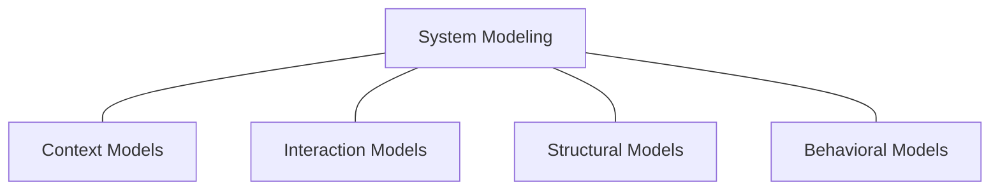

Figure 9.1 is the conceptual map for the chapter. The upper node captures the environment around the system. The left node focuses on communication across boundaries or between parts. The lower node captures the relatively stable organization of classes, components, or data structures. The right node moves from static shape to motion and asks how the system reacts once something actually happens. Good modelers switch between these views instead of trying to force one diagram to carry every burden.

The UML is the most widely recognized standardized notation family for this kind of work [OMG 2017]. It contains thirteen diagram types in the full standard. That does not mean a project needs all thirteen, any more than owning thirteen screwdrivers means every shelf requires all of them. In practice, a smaller subset covers a large fraction of day-to-day software-engineering questions.

**Figure 9.2.** Only a subset of UML is needed for most software-engineering work. The figure places the diagram types discussed in this chapter inside the larger UML family: class diagrams in the structural branch; use-case, activity, and state diagrams in the behavioral branch; and sequence diagrams in the interaction branch. The chapter stays close to these practical workhorses because they cover many real design and review situations without dragging the full notation zoo into the room. Adapted from Metzner [Metzner 2020].

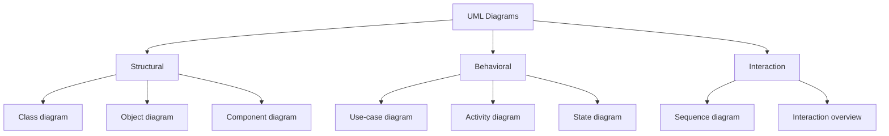

Figure 9.2 makes the scope decision explicit. Structural diagrams deal with organization. Behavioral diagrams deal with response and progression. Interaction diagrams zoom in on communication sequences. The chapter concentrates on activity, use-case, sequence, class, and state diagrams because those are the views that repeatedly show up when requirements are refined, software structure is reviewed, or AI-generated code needs a sanity check.

## Interaction Models: Who Wants What, and in Which Order

Interaction models describe how communication takes place. Sometimes that means a human using a system. Sometimes it means two systems interacting through an interface. Sometimes it means components inside one system exchanging messages and responsibilities. The common point is that interaction models make the conversation explicit. That is useful during requirements analysis, interface design, integration planning, and debugging of assumptions that would otherwise remain politely invisible.

Chapter 8 already introduced use-case diagrams as a way to clarify externally visible behavior. In system modeling they appear again, now as part of a larger toolbox. A use-case view answers the question "Which external actor wants which service?" A sequence view then sharpens that answer and asks "In which order do the participating parts communicate once that service starts?"

### Use cases capture goals before they capture implementation

A use case represents a discrete interaction goal involving external actors [Sommerville 2016; Jacobson 1992]. To make this concrete, the running example for this section is a small virtual cat-game: a mobile app for people who would love a cat but cannot have one, perhaps because of allergies, a strict landlord, or a lifestyle that involves too much travel. The user can feed, pet, and play with a cute virtual cat on screen. Of course, the cat has its own interpretation of every interaction, because that is what cats do.

The notation is deliberately simple. Stick figures represent actors. Ellipses represent use cases, meaning classes of interaction rather than code modules. Plain connection lines indicate that an actor participates in that interaction. The picture is compact because it is meant to clarify scope and intent early. It is not meant to replace the later detail that implementation or testing will need.

**Figure 9.3.** A minimal use-case view contains just enough notation to state who participates in an interaction and what the interaction is called. The two actors are the User (a.k.a. Can Opener) and the Cat System — external participants rather than internal implementation classes. The ellipse labeled "Feed" names the interaction goal, and the connecting lines say that both actors are involved in that use case.

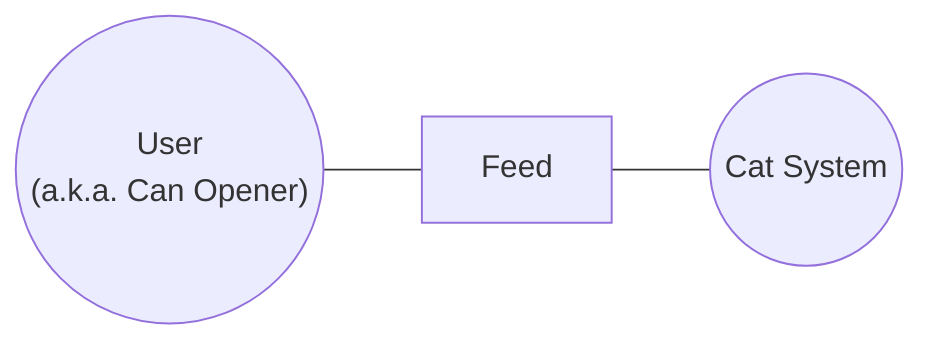

Figure 9.3 is tiny on purpose. The left actor is the user. The right actor is the cat system, which stands in for the external software service that reacts. The ellipse in the middle does not describe the algorithm for feeding, the animation engine, or the storage format. It only states that "Feed" is a meaningful interaction class between those actors. That small amount of structure already matters, because it prevents teams from jumping into implementation details before they have even agreed on the external goal.

The cat-game example becomes clearer once a short textual description is added beside the picture. The actors are the user and the cat system. The description is that the user may feed the cat, partly because the cat becomes happy and partly because the human gets the emotional reward of seeing that happen. The stimulus is pressing a feed button. The response is visible cat behavior, such as movement or purring. No meaningful data payload is needed in the simple version. That short prose block turns a human-readable diagram into something that both humans and AI tools can process more reliably. Of course, use case diagrams offer many more possibilities as outlined in the Geek Box below.

> **Geek Box: A use case starts the conversation, not the entire system**
>
> A use-case diagram is intentionally incomplete. That is not a flaw. It is the point. The picture names actors and goals while refusing to pretend that all details are already known. Once the team agrees that "Feed" is a relevant interaction, it can add the stimulus, the expected response, error cases, business rules, and later even a sequence diagram or acceptance test.
>
> The diagram below scales this idea from one interaction to a small interaction family. Login, Feed, Play, and Be Ignored all belong to the same user in the cat-game setting. Note that the cat system does not appear as an actor here, because these use cases focus exclusively on what the user wants to do. The fourth item relates to the talent of cats for turning emotional distance into a product feature. It is also a useful reminder that use cases are about externally visible interaction goals. In this case, the following analysis will probably conclude that for being ignored, neither a user interface has to be designed nor a single line of code has to be written.
>
> **Figure 9.4.** A composite use-case diagram with one actor, the User, connected to four use-case ellipses labeled Login, Feed, Play, and Be Ignored.
>
> ```mermaid
> flowchart LR
>     User(("User"))
>     Login[Login]
>     Feed[Feed]
>     Play[Play]
>     Ignored[Be Ignored]
>     User --- Login
>     User --- Feed
>     User --- Play
>     User --- Ignored
> ```
>
> This also explains why use cases work well in early AI-assisted workflows. A model can help draft the diagram — for example in TikZ — and summarize a structured use-case description. What the model still needs, however, is the accompanying text that spells out actors, triggers, assumptions, and expected system behavior. If the figure is shown alone, the agent may guess the missing details. Guessing about cats' emotional states is a charming habit, but it is a poor engineering habit.

### Sequence diagrams reveal the timing inside a use case

Once the question changes from "Which interaction exists?" to "How does that interaction unfold step by step?", sequence diagrams take over. They depict the sequential exchange of messages during a specific scenario [Sommerville 2016; Stephens 2015]. That makes them particularly useful when a team needs to discuss interfaces, temporal order, success and failure alternatives, or hidden assumptions between components. In the cat-game example, the login sequence involves the user, the user interface (UI), the backend system, and the database.

**Figure 9.5.** Sequence diagrams make temporal order explicit. The actor starts the interaction by sending login data to the UI. The UI forwards a hashed credential package to the system. The system consults the database. Only then does the alternative branch appear: if validation succeeds, the user sees the cat; if it fails, the user sees an error. The vertical lifelines and the top-to-bottom reading order make that timing visible immediately. Adapted from Sommerville [Sommerville 2016].

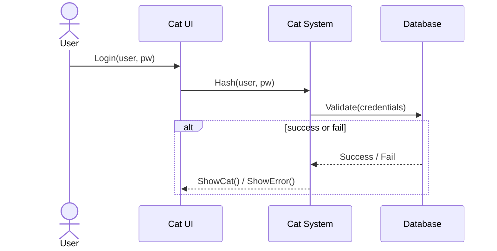

Figure 9.5 shows why sequence diagrams are so good at exposing hidden interface assumptions. The top row contains the participating actor and objects. The vertical dashed lines show their lifelines over time. The horizontal arrows are the messages. Reading starts at the top and moves downward, which means the diagram captures both participation and order in one picture. The "alt" region marks a point where the scenario branches. Success and failure are not vague comments in prose. They are first-class alternatives in the interaction logic.

This is also where sequence diagrams become more informative than use-case diagrams. A use case says that login exists. The sequence diagram says that the user sends credentials to the UI, that the UI hashes them, that the system asks the database to validate them, and that different responses follow depending on the result. That level of detail makes integration problems visible early. It also explains why sequence diagrams can look busier than activity diagrams. They carry more information about participating components.

## Structural Models: Blueprints, Relationships, and Runtime Objects

Structural models describe the relatively stable organization of a system. They are created during architectural and detailed design, and they remain useful long after initial implementation [Sommerville 2016]. A structural view can talk about the whole architecture or about one small subsystem. It can stay fairly abstract or become specific enough to name attributes, methods, and relationship types. In the age of AI-generated code, structural models are especially useful as review artifacts. They let humans check whether the software shape still matches the intended design.

> **Geek Box: From assembler to objects: how programming languages grew up**
>
> Each generation of programming languages increased the scope that a few lines of code can express.
>
> **x86 assembler** — compute `r = 5 + 3`. Even this requires managing individual CPU registers:
>
> ```
> mov eax, 5    ; put the number 5 into register eax
> add eax, 3    ; add 3 to the value already in eax
>               ; result (8) is now stored in eax
> ```
>
> **FORTRAN** (1957) — compute the *n*-th Fibonacci number $F_n = F_{n-1} + F_{n-2}$. A recursive function becomes expressible in a few readable lines:
>
> ```
> RECURSIVE FUNCTION FIB(N) RESULT(F)
>   INTEGER, INTENT(IN) :: N; INTEGER :: F
>   IF (N <= 1) THEN; F = N
>   ELSE; F = FIB(N-1) + FIB(N-2); END IF
> END FUNCTION
> ```
>
> **Java** — represent $\mathbf{C} = \mathbf{A} \cdot \mathbf{B}$ and $\mathbf{A}^\top$ as operations on matrix objects. Data and behavior are grouped into a class:
>
> ```
> class Matrix {
>   private double[][] data;
>   Matrix multiply(Matrix other) { /* ... */ }
>   Matrix transpose() { /* ... */ } }
> ```
>
> **Vibe coding** — solve open research problems via dialogue. In 2026, Donald Knuth published "Claude's Cycles" [Knuth 2026] after Anthropic's Claude solved an open graph-theory conjecture he had worked on for weeks. The AI explored 31 systematic approaches in roughly one hour and found a construction for all odd cases. Knuth wrote the rigorous proof himself, but the discovery came from natural-language interaction, not from register shuffling, recursive functions, or object hierarchies.

### A class diagram is a readable contract about structure

As the Geek Box above illustrates, each generation of programming languages increased the abstraction level from raw machine instructions to objects and beyond. Class diagrams represent classes and the relationships between them [Sommerville 2016; Metzner 2020]. They can stay very simple or become detailed enough to support code generation, reverse engineering, and architecture review. The important thing is that a class diagram does not only name the parts. It also tells the reader how to read those parts.

> **Geek Box: Classes, instances, and inheritance**
>
> A *class* is a blueprint. It defines which attributes (data) and operations (methods) a kind of thing has [Black 2013]. An *instance* (or *object*) is one concrete runtime entity created from that blueprint. Consider a `Cat` class that defines attributes like `name`, `color`, and `mood`, plus operations like `purr()` and `ignore(human)`. The class itself does not purr. It only describes what purring means. A specific cat object — say, an instance with `name="Whiskers"`, `color="orange"`, and `mood="suspicious"` — is the thing that actually runs in memory, holds real values, and decides whether to acknowledge your existence. The class says what is possible. The instance says what is real right now.
>
> At runtime, many instances can be created from one class. A cat shelter application might have hundreds of `Cat` objects, each with different names and moods, but all sharing the same structure and operations defined by the `Cat` class. That is the central efficiency of object-oriented design: define the blueprint once, instantiate it many times.
>
> *Inheritance* means that a more specific class reuses the common structure of a more general class. If `Mammal` already defines attributes like `legs` and operations like `eat()`, then `Primate` can inherit that common part and add only what is special, such as `climb()`. Similarly, `Cat` inherits from `Carnivore`, which inherits from `Mammal`, which inherits from `Animal`. Each level adds specialization without repeating what the parent already provides.
>
> The diagram below shows a full taxonomy. The open triangle arrows point from the specialized class toward the more general one. The cat belongs under "Carnivore." Putting it under "Rodent" would start an argument that the cat would probably enjoy.
>
> **Figure 9.6.** A generalization hierarchy with Animal at the top; Fish, Bird, Mammal, Reptile, and Amphibian below it; and Carnivore, Rodent, and Primate below Mammal.
>
> ```mermaid
> classDiagram
>     Animal <|-- Fish
>     Animal <|-- Bird
>     Animal <|-- Mammal
>     Animal <|-- Reptile
>     Animal <|-- Amphibian
>     Mammal <|-- Carnivore
>     Mammal <|-- Rodent
>     Mammal <|-- Primate
> ```

**Figure 9.7.** Core class-diagram notation divides the class box into compartments with distinct responsibilities. The top compartment names the class. The middle compartment lists attributes with visibility markers and types. The lower compartment lists methods, their parameters, and their return values. The symbols `+`, `-`, and `#` indicate public, private, and protected visibility. Adapted from Metzner [Metzner 2020].

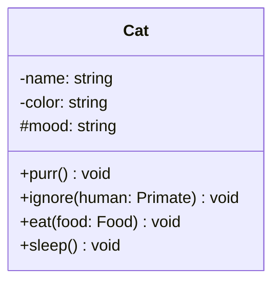

Figure 9.7 is the smallest useful reading exercise for class diagrams. The top compartment names the class, here `Cat` from the virtual cat-game. The middle compartment lists attributes: the cat's name, color, and mood. The lower compartment lists operations such as purring, ignoring humans, eating, and sleeping. The punctuation is doing real work. The colon separates a name from its type. Parentheses hold the parameter list. A trailing type after the method name states the return value. Once that notation becomes familiar, a class diagram turns into a fast structural summary instead of an intimidating rectangle cemetery. The underlying object-oriented concepts, namely what a class is, what an instance is, and how inheritance works, are explained in the Geek Box above. The visibility markers `+`, `-`, and `#` are covered in the Geek Box below.

Class diagrams have always been practical because they can point in both directions. Long before AI-assisted coding, object-oriented tools used parsers to generate code skeletons from class models (forward engineering) and to recover class views from existing source code (reverse engineering). That bidirectional conversion is built into the structure of object-oriented languages: classes, attributes, methods, and inheritance map directly to diagram elements and back. In AI-assisted workflows, this remains equally useful. If an agent has generated a large subsystem, a recovered class diagram often reveals questionable responsibilities or suspicious couplings faster than a line-by-line reading session would.

> **Geek Box: Access modifiers and method overloading**
>
> The diagram below shows inheritance in detail. `Primate` does not repeat `eat()` or `walk()`; it inherits them from `Mammal` and adds only `scream()` and `climb()`. The arrow points from the specialized class to the generic one.
>
> **Figure 9.8.** Two related class boxes. Mammal lists `category` and `legs` as attributes and `eat` and `walk` as methods. Primate adds a `species` attribute and the methods `scream` and `climb`. An open triangle arrow points from Primate to Mammal.
>
> ```mermaid
> classDiagram
>     Mammal <|-- Primate
>     class Mammal {
>         -category: string
>         -legs: int
>         +eat() void
>         +walk(speed) void
>     }
>     class Primate {
>         -category: "Primate"
>         -legs: 2
>         -species: string
>         +scream() void
>         +climb(tree) void
>     }
> ```
>
> The diagram uses visibility markers that control which parts of a class are accessible to the outside world. These *access modifiers* are a central concept in object-oriented design.
>
> A leading `+` marks a *public* member, part of the visible interface that any other class can call. In the diagram, `+eat()` and `+walk(speed)` are public. A leading `-` marks a *private* member, hidden inside the class: `-category` and `-legs` can only be read or modified by Mammal itself, which protects internal state from accidental corruption. A leading `#` marks *protected* visibility: accessible within the class and its subclasses, but not from unrelated code.
>
> *Method overloading* means defining multiple methods with the same name but different parameter lists. A `Mammal` class could define both `walk()` for a default pace and `walk(speed)` for a specific speed. The compiler selects the correct version based on the arguments.
>
> *Method overriding* is tied to inheritance. If `Primate` defines its own `walk(speed)`, that version replaces the inherited one for all Primate instances. The signature stays the same, but the behavior changes. Code holding a reference to any Mammal can still call `walk(speed)` and get the correct behavior, a principle known as *polymorphism*.
>
> Together, access modifiers and overloading/overriding explain why class diagrams are contracts about who can do what and where specialization begins. If an AI agent generates a class hierarchy, these are exactly the design decisions a reviewer should inspect first.

### Aggregation and composition are not the same relationship in nicer clothing

Part-whole relations look similar until lifecycle questions arrive. Aggregation means that a whole is composed of parts, but the parts can still exist independently. Composition is stricter. The parts exist only as long as the whole exists [Sommerville 2016; Metzner 2020]. If that difference is modeled loosely, teams later discover that they disagreed on ownership, deletion behavior, persistence, and cleanup responsibilities.

**Figure 9.9.** Aggregation and composition answer different lifecycle questions. The open diamond marks aggregation, meaning the part may continue to exist independently of the Whole. The filled diamond marks composition, meaning the dependent part belongs to the Whole strongly enough that its lifecycle is tied to it. Adapted from Metzner [Metzner 2020].

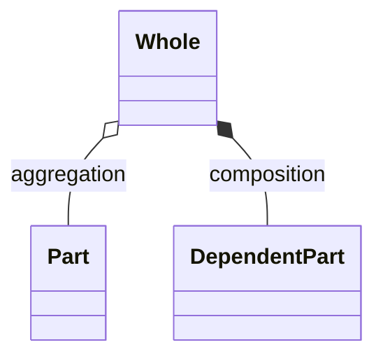

Figure 9.9 reads from the whole toward the diamonds. The upper connection uses an open diamond. That is aggregation. The part belongs to the whole conceptually, but it can still outlive that relationship. The lower connection uses a filled diamond. That is composition. If the whole disappears, the dependent part disappears with it. This is why composition is often used for strongly owned internal parts, while aggregation is used for looser assembly relations.

The runtime perspective completes the picture. Classes are blueprints. Objects are the instances created from those blueprints while the program runs. At runtime the software does not execute "the class" in the abstract. It creates objects with concrete values and state. That is why class diagrams remain useful even if a team lets an AI system generate much of the implementation. The diagram tells the human reviewer what kinds of runtime things are supposed to exist and how they are meant to relate.

## Behavioral Models: When Data Flows and When Events Fire

Behavioral models describe how a system reacts to stimuli from its environment [Sommerville 2016]. Some reactions are driven by incoming data and process flow. Others are driven by events that move the system from one state to another. This difference sounds small until somebody uses the wrong diagram and produces a picture that is technically correct, vaguely confusing, and unhelpful at exactly the moment it should have clarified something.

### Activity diagrams show end-to-end processing

Activity diagrams are the standard UML tool for data-driven behavior and process flow. They are widely used because they can express sequencing, branching, and completion with a notation that many readers find more accessible than raw pseudocode. They are useful for algorithm sketches, business processes, and end-to-end flows in which the main question is "What happens next?" rather than "Which stable state does the system inhabit right now?"

**Figure 9.10.** Activity-diagram primitives show how control moves through a process. A filled circle marks the start. A circle with a filled center (the encircled dot) marks the end. Rounded boxes denote actions. Arrows denote control flow. Diamonds split the flow into different cases that must be labeled on the outgoing arrows.

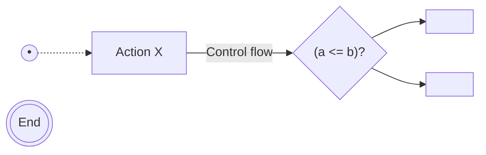

Figure 9.10 contains the basic reading vocabulary. The filled circle marks where the process starts. The double end marker shows termination. Rounded rectangles represent actions or activities. Arrows represent control flow, which means the direction in which the process progresses. The diamond represents a branch point. Once a condition is evaluated, different outgoing arrows represent the different cases. With only those elements, one can already sketch a surprising number of processes.

**Figure 9.11.** A data-driven activity model shows how information and control move across a process. The cat first perceives a human through the visual sensor. The system then detects the human, processes visual data, computes a path, and sends motor commands to the legs. After movement, the flow continues through voice-command handling and an acoustic actor, ending in the purring behavior that is supposed to convince the human that dinner should arrive soon.

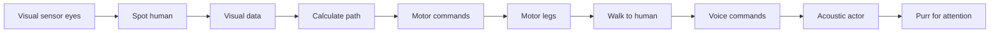

The cat example in Figure 9.11 is useful because it reads like an algorithm without looking like pseudocode. The top row captures perception and planning. The lower row captures action and signaling. Visual sensing leads to spotting a human. That produces visual data. Visual data feeds path calculation. Path calculation produces motor commands. Those motor commands drive the legs, which leads to walking. After movement, the chain continues through voice-related signaling until the cat reaches the purring stage. The whole diagram is data-driven because it focuses on the progression of processing and action from one step to the next.

This is also why activity diagrams are often preferred for process communication. A busy sequence diagram can be more precise about which component sends which message. An activity diagram is often quicker to grasp when the real question is simply how the process unfolds from start to finish. In practice, teams often keep both views. They use an activity diagram for the overall process and a sequence diagram for the technically relevant order of messages.

### State diagrams show event-driven behavior

State diagrams answer a different question. They assume that the system occupies one state at a time and moves to another state when a triggering event occurs [Sommerville 2016]. They are especially useful for systems whose behavior depends strongly on mode, state, or external triggers. Unlike activity diagrams, they do not try to show data flow. They focus on the states and the events that cause transitions.

**Figure 9.12.** State diagrams compress event-driven behavior into states and transitions. The enclosing context is the broader behavioral mode "Beg." Inside it, the cat searches for a food source, walks once a target is spotted, purrs after reaching the target, checks for food, and either loops back to searching or transitions to eating. The important information is the trigger behind each change of state, not the data path that enabled it. Adapted from Sommerville [Sommerville 2016].

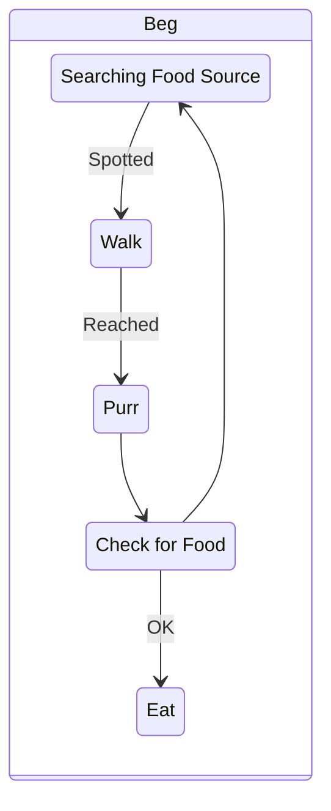

Figure 9.12 is more compact than the activity model because it refuses to show every processing step. It starts in the searching state. The event *Spotted* moves the system to *Walk*. The event *Reached* moves it to *Purr*. From there the system checks for food. If the condition is not satisfied, the diagram loops back to searching. If the condition is satisfied, the system moves to eating. This is event-driven modeling. The important unit is the transition between stable states, not the intermediate transformation of data.

The distinction between the two behavioral views matters in practice. If a team wants to explain a workflow, an activity model is usually the right opening move. If the team wants to explain mode switching, trigger handling, or reactive control logic, the state model is often the cleaner choice. Choosing the wrong one is like using a train schedule to explain the design of the train station. Related topic, wrong abstraction.

## Context Models: Where the System Ends

Context models define the environment in which a system lives. They are usually created early because boundary mistakes spread quickly into architecture, responsibilities, testing scope, and deployment assumptions [Sommerville 2016]. Technical constraints matter here, but so do organizational and social ones. A context boundary is not discovered by engineering alone. It is also shaped by business ownership, regulation, user groups, and operational reality.

**Figure 9.13.** Context models show the system and its relevant environment without pretending to explain every relation in detail. The central system "Cat" is linked to humans, dogs, wildlife, airspace, fields, and ponds. The figure states that these surroundings matter. It does not yet state protocols, data types, spatial distance, or causality. That deliberate vagueness is part of the notation.

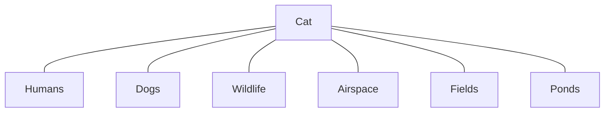

Figure 9.13 shows what context models do well and what they deliberately leave out. The diagram identifies the central system and the surrounding environment elements that matter to it. Humans matter. Dogs matter. Ponds matter, probably more than the cat would prefer after an unfortunate slip. Airspace matters because birds live there. What the model does *not* say is equally important. It does not specify how these elements communicate, what data they exchange, whether they are physically near one another, or which relation is stronger than another. Context models are about relevant surroundings, not detailed choreography.

That is why context models are often paired with a second model that adds operational detail. A context picture defines the stage. Another model explains what happens on that stage.

**Figure 9.14.** Supporting models add operational meaning to a context view. The park scenario starts with entering the park, branches on whether a dog is present, then continues through activities such as playing with the dog, sitting on a bench, admiring nature, or admiring a cat before leaving. The attached "Dog" and "Cat" boxes tie the process back to named context entities.

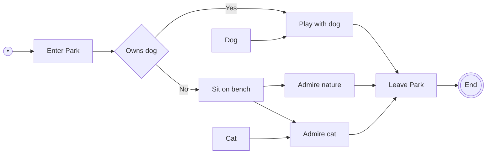

Figure 9.14 shows how a supporting model adds detail that the pure context view intentionally omitted. The activity starts with entering the park and branches on the question of whether a dog is present. If yes, the visitor plays with the dog. If no, the visitor sits on a bench and may then admire nature or, if the environment cooperates, admire a cat. All roads eventually lead to leaving the park. The small *Dog* and *Cat* boxes connect the activity back to the environmental entities already identified in the context model. Together the two figures give a fuller story than either would alone.

## Using System Models in Current AI Workflows

System modeling has not become obsolete just because code generation has become faster. If anything, the opposite is true. Large generated code bases need high-level review surfaces. Class diagrams can expose dubious inheritance decisions or strange coupling patterns. Sequence diagrams can reveal that two components disagree about order or responsibility. Context models can show that a system was designed as if external constraints did not exist. Activity and state diagrams can make the intended behavior explicit before implementation drifts into inventive side quests.

There is, however, one practical adaptation worth making for AI-native workflows. Diagrams alone are usually not enough. Current tools often work better when the model is represented twice: once visually for people and once textually for machines. Text-first diagramming tools such as Mermaid fit this pattern well because the diagram itself is already written in a structured textual form that can be versioned, diffed, and discussed in the same repository as the code [Mermaid 2026]. A concrete example of this approach applied to the DVD database project is shown in the Geek Box below. The underlying semantics still rest on the UML standard or UML-inspired conventions, which is why basic notation literacy remains useful even when the tooling changes [OMG 2017].

This chapter therefore points to a practical working rhythm. Use diagrams to think, discuss, and review. Add structured text so the same idea can be consumed by AI tools without visual guesswork. Use recovered structural models to inspect generated code. Use behavioral and interaction models to check whether an implementation matches the intended scenario. In larger projects, that skill is not optional decoration. It is how engineers ensure that fast code generation does not outrun the team's ability to understand, review, and maintain the result.

## Choosing the Right View Under Pressure

A useful self-check is whether the question at hand already suggests the model type. If the team is arguing about who interacts with the system and what those actors want, a use-case view is the natural start. If the team is arguing about message order, a sequence diagram is better. If the debate is about data structures, responsibilities, and ownership, the answer is usually structural. If the question is whether the system flows through processing stages or reacts to events and modes, the choice between activity and state modeling becomes clearer. If the disagreement is about what belongs inside the system boundary and what belongs outside, the context model should appear before anybody draws method signatures.

Good modeling is therefore less about memorizing symbols than about choosing the view that removes the current ambiguity most directly. That is also why the chapter keeps returning to the same practical warning. No single figure carries the whole truth. The useful result comes from selecting the right view, explaining it clearly, and keeping the visual and textual versions consistent.

> **Geek Box: Post-hoc requirements for the DVD database**
>
> The DVD database from Chapter 1 was built in a single prompt without any upfront requirements documentation. As a demonstration of how system models can be applied retroactively, we used an AI agent to create a complete requirements package *after* the system was already working. The prompt was deliberately casual:
>
> > *"This repo has been vibe coded but the documentation is limited. I think, we should start by adding proper requirements documents. Create a subfolder for the requirements analysis and create corresponding documentation there. I also would like to see use case, sequence, and structural diagrams there. Use markdown and mermaid for this."*
>
> The result is publicly available in the project repository at <https://github.com/akmaier/dvd_database/tree/main/docs/requirements> and consists of four files: a *requirements specification* covering functional and non-functional requirements plus the data model, a *use-case document* with a Mermaid diagram and detailed use-case descriptions, *sequence diagrams* for page load, filtering, detail view, and error handling, and *structural diagrams* including the component diagram described below.
>
> All diagrams are written in **Mermaid**, a text-based diagramming language that uses a compact, human-readable syntax and renders directly inside Markdown files on platforms such as GitHub. The key advantage for software engineering is that diagrams become *code*: they live in the same repository as the source, can be versioned with Git, diffed in pull requests, and processed by AI tools without visual parsing. Combined with **Markdown** for the surrounding prose, this creates a lightweight documentation stack that requires no special editor and no separate image files.
>
> **Figure 9.15.** A component diagram of the DVD database. It shows the two browser pages (`index.html` and `detail.html`) and their JavaScript and CSS dependencies, next to the static assets they consume — namely the JSON dataset (`dvds.json`) and the original shelf photograph. Both pages link to the shared CSS and JavaScript files and fetch data from `dvds.json`, while the main page also displays the shelf image.

## Exercises

These exercises ask you to build, compare, and critique system models using the diagram types and modeling principles covered in this chapter.

**Exercise Problem 1:** Build a dual representation for one user interaction so that both humans and AI tools can work with it. Start with a small use-case diagram that identifies the actors and the goal. Then add a short textual description that names the trigger, the expected response, and one important failure case. Example task: model a login-and-notification feature with one user actor, one system actor, and a structured description of what happens after the login button is pressed.

**Exercise Problem 2:** Model one scenario as a sequence diagram and explain why the message order matters. Name the participating actors or components, then describe the timeline from the first request to the final response. Use this approach to develop a sequence diagram of the Kerberos key handshake: identify the client, the authentication server, the ticket-granting server, and the target service as participants, then show the message exchanges step by step. Mark where session keys are issued and where tickets are forwarded. Finally, annotate at least two points in the diagram where an attacker could intervene (e.g., replay of a ticket, interception of a session key) and explain what the protocol does to prevent each attack.

**Exercise Problem 3:** Create a class model for a small subsystem and explain how runtime objects would emerge from it. Include at least one attribute, one method, one visibility decision, and one relationship between classes. Example task: model a media-library subsystem with classes for Library, Item, and UserProfile, then explain which concrete objects would exist while the program is running.

**Exercise Problem 4:** Compare an activity model and a state model for the same behavior. Use the activity diagram to show the processing flow and the state diagram to show trigger-driven state changes. Then explain which of the two views is easier to use for stakeholder discussion and which is better for describing reactive behavior. Example task: model an autonomous door system once as an end-to-end opening process and once as a set of states such as Closed, Opening, Open, and Closing.

## Bibliography

- [Black 2013] Black, A. P. *Object-Oriented Programming: Some History, and Challenges for the Next Fifty Years.* Information and Computation, 231:3–20, 2013.
- [Jacobson 1992] Jacobson, I., Christerson, M., Jonsson, P., Overgaard, G. *Object-Oriented Software Engineering: A Use Case Driven Approach.* Addison-Wesley, 1992.
- [Knuth 2026] Knuth, D. E. *Claude's Cycles.* Stanford Computer Science Department, 2026. <https://www-cs-faculty.stanford.edu/~knuth/papers/claude-cycles.pdf>
- [Mermaid 2026] Mermaid. *Class diagrams — Mermaid Documentation.* 2026. <https://mermaid.js.org/syntax/classDiagram.html>
- [Metzner 2020] Metzner, A. *Software Engineering – Kompakt.* Carl Hanser Verlag, 2020.
- [OMG 2017] Object Management Group. *Unified Modeling Language (UML), Version 2.5.1.* December 2017. <https://www.omg.org/spec/UML/2.5.1>
- [Sommerville 2016] Sommerville, I. *Software Engineering.* Pearson, 2016.
- [Stephens 2015] Stephens, R. *Beginning Software Engineering.* Wrox/Wiley, 2015.

## Source

This chapter is derived from the *Vibe Coding* book (Maier et al., Springer, CC BY, <https://link.springer.com/book/9783032399069>), chapter source `vhb_vibe_coding/VIBE_09_SystemModeling/chapter.tex`. It is part of the VHB course *Vibe Coding*: <https://www.studon.fau.de/studon/ilias.php?baseClass=ilrepositorygui&ref_id=6720901>
</content>
</invoke>
