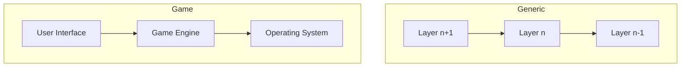
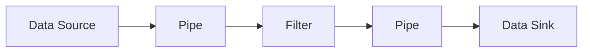
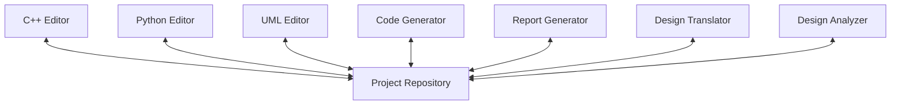
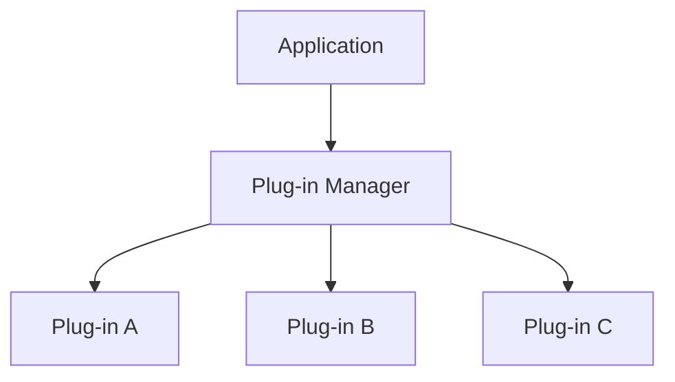
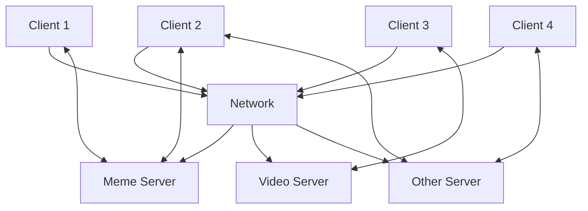
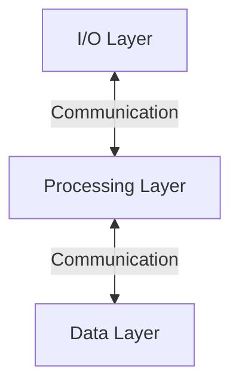
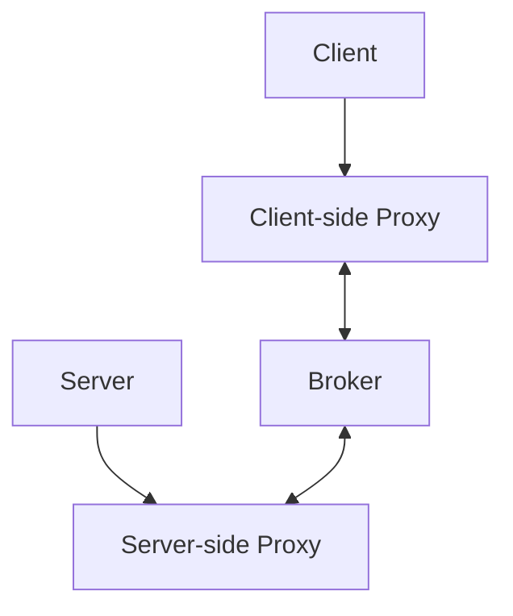
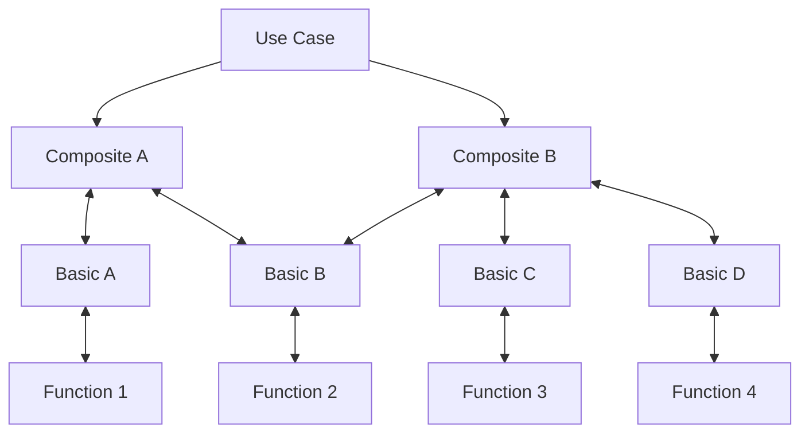
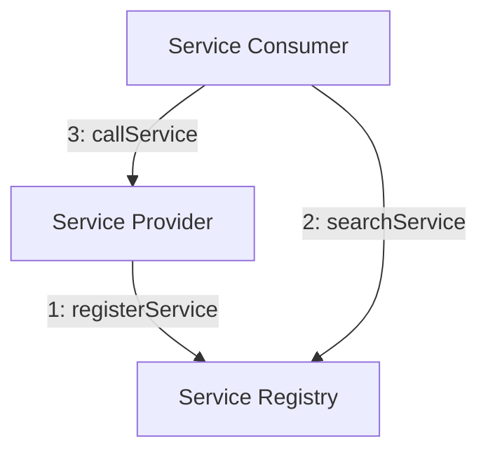

# Chapter 10 — Architectural Design for Vibe Coding Systems

**Andreas Maier¹, Aline Sindel¹, Christian Bergler², and Sally Zeitler¹**
¹ Friedrich-Alexander-Universität Erlangen-Nürnberg (FAU)
² Ostbayerische Technische Hochschule Amberg-Weiden (OTH-AW)

## Abstract

This chapter develops architectural design as the bridge between requirements and implementation in artificial intelligence (AI)-assisted software engineering. It explains why architecture remains decisive even when coding speed increases through large language model (LLM)-based tooling, and it moves from architectural design decisions and viewpoints to a practical taxonomy of architectural patterns for structuring, adaptable, and distributed systems. Layered architecture, pipe-and-filter, repository, plug-in, client-server, broker, and service-oriented design are discussed with concrete engineering trade-offs and examples linked to current AI workflows. Special emphasis is placed on interfaces, testability, extensibility, and the risk of architectural drift when generated code is accepted without system-level control. The chapter concludes with practice-oriented exercises that train architecture thinking for modern vibe-coding projects.

## Why Software Architecture Is a Core Competence in Vibe Coding

Architectural design marks the transition from the conceptual software-engineering foundations discussed in Chapter 2 toward concrete implementation strategy. In the previous chapters we have looked at what software engineering is, why it matters, and how requirements and system models capture what a system should do (Chapters 8 and 9). Now we need to decide *how* the system will be built internally: which components exist, how they talk to each other, and which rules govern their evolution. This is the domain of software architecture.

The widely used Institute of Electrical and Electronics Engineers (IEEE) standard defines software architecture as follows [IEEE 2000]:

> "Software architecture: The **fundamental organization** of a system, embodied in its **components**, their **relationships** to each other and to the **environment**, and the **principles** guiding its design and evolution."

That definition is not merely formal. It directly explains why architecture quality determines whether an implementation remains maintainable and extensible over time, or degrades into fragile coupling and uncontrolled rework. Architecture contains three things at once: the *static* decomposition of a system into its components, the description of the *dynamic* interaction of all those components at runtime, and the overarching strategy that holds both together.

Understanding software architecture is essential in a vibe-coding context because, without it, you cannot communicate to your AI developer or to other human developers how you want the software to be constructed and how the components should interact. Architecture is the part you still want to describe and control yourself in order to be effective. In classical teams, architecture decisions were already high-impact; in AI-assisted development they become even more influential because generated code can be produced quickly while architectural errors propagate just as quickly. A striking recent example of this dynamic is the OpenClaw project (see Geek Box below).

> **Geek Box: OpenClaw — when vibe-coded architecture meets reality**
>
> OpenClaw is a free and open-source AI agent framework created in late 2025 that puts computer use — controlling browsers, files, terminals, and applications — into the hands of any developer. The idea is compelling: connect any LLM to your local machine via messaging apps like WhatsApp or Telegram, and let it act as an autonomous assistant that can execute real tasks. By February 2026, the project had surpassed 200,000 GitHub stars, making it one of the fastest-growing open-source repositories in history [VentureBeat 2026].
>
> The architectural problems, however, are equally striking. Ying et al. provide a systematic security analysis [Ying 2026] that reveals several fundamental design weaknesses. The framework grants an LLM operating-system-level permissions, including file access, shell execution, and browser control, without rigorous containerization or sandboxing by default. Security relies primarily on *instruction-based safety*: the agent is told in its system prompt not to do dangerous things, rather than being physically prevented from doing them by a virtual machine or sandbox boundary. This is the architectural equivalent of protecting a bank vault with a sign that reads "There's millions here. Plz don't take 'em."
>
> The consequences materialized quickly. CVE-2026-25253, discovered by Levin [CVE 2026], exposed a remote code execution vulnerability rated CVSS 8.8: any website a developer visited could silently connect to the local OpenClaw gateway via WebSocket, brute-force the password without rate limiting, and gain full control of the machine. Bitsight identified over 30,000 publicly exposed instances [Bitsight 2026], many running without authentication. In parallel, a supply-chain attack contaminated roughly 20% of the skills marketplace with malware.
>
> The architectural lesson is direct. OpenClaw demonstrates that vibe-coded speed without architectural discipline produces systems that are simultaneously powerful and dangerously fragile. The missing elements, namely process isolation, sandboxed execution, cryptographic skill verification, and defense in depth against prompt injection, are not features that can simply be added later. They are architectural decisions that needed to be made before the first user connected.

Architecture decisions are deeply interleaved with requirements engineering (see Chapter 8) [Goll 2023; Sommerville 2016]. The architecture should meet functional requirements, meet non-functional requirements such as quality and performance, and provide a blueprint for the system implementation. Getting the architecture right is crucial. A good software architecture will also be extensible, meaning that not too much work is needed to extend it in the future. Both risk and development cost of a project can be reduced by the use of patterns, and a complete system architecture can combine multiple architectural patterns. We will describe a number of these architectural patterns in this chapter, grouped into structuring patterns, adaptable-system patterns, and distributed-system patterns.

## Architectural Design Decisions and Viewpoints

Architectural design decisions involve both technical and organizational dimensions. The non-functional requirements that a system architecture should address include performance, security, safety, availability, and maintainability on one hand, and simplicity, scalability, testability, expandability, and reliability on the other. You want your system to be simple, scalable, testable, and extensible, and these important features should be reflected in your actual software design choices. To meet these requirements, the architect has to decide on a range of issues. On the technical side, these include the system structure, the interfaces between components (and why they are important, because this also relates to dynamic behavior), the architectural patterns to use, the products and tools to employ, and the testing strategy. The architectural design phase is also when you decide which external software, application programming interfaces (APIs), and libraries you will integrate. On the organizational side, decisions include how to use human resources (how many developers you have, how much AI development you can pay for), how to prioritize use cases, and how to manage cost. Sometimes the ideal design and the feasible design are not the same, because you may simply not have the money or the time to implement everything perfectly, and then you have to make deliberate trade-offs. These decisions need to be documented and can be revisited later if needed.

To structure these trade-offs, architecture is typically documented through complementary viewpoints. The widely used 4+1 model by Kruchten [Kruchten 1995] defines four views: the logical, process, development, and physical views, plus use-case scenarios that tie them together (see Geek Box below). In modern AI-enabled projects, these views are also useful as prompt and review artifacts: if you ask an LLM to generate code for a component, you can check the result against the logical view to confirm it implements the right abstractions, against the process view to confirm it handles concurrency correctly, and against the physical view to confirm it will run where it needs to run.

> **Geek Box: The 4+1 Architectural View Model**
>
> The 4+1 view model was proposed by Philippe Kruchten in his seminal 1995 paper in *IEEE Software* [Kruchten 1995]. The core insight is that no single perspective is sufficient to capture the architecture of a complex system. Instead, five concurrent views are needed, each addressing a specific set of concerns and a specific group of stakeholders. The four views (logical, process, development, physical) describe different structural and behavioral aspects of the system. The "+1" is the set of use-case scenarios that tie all views together: scenarios serve as both a driver for discovering architectural elements during design and as a validation tool for confirming that the architecture works.
>
> The 4+1 model became deeply embedded in the **Rational Unified Process (RUP)**, an iterative software-development framework developed by Rational Software (later acquired by IBM) [Kruchten 2003]. RUP organizes development into four phases, specifically inception, elaboration, construction, and transition, and uses Kruchten's views as a standard way to document the architecture that emerges during the elaboration phase. The logical and process views guide design decisions, the development view structures the implementation plan, and the physical view drives deployment planning.
>
> The model was also a key influence on **IEEE 1471** (now ISO/IEC/IEEE 42010), the international standard for architectural descriptions of software-intensive systems [IEEE 2000]. IEEE 1471 generalized Kruchten's idea into a formal framework: every architecture description must identify *stakeholders*, define *concerns*, and present one or more *viewpoints*, each governed by explicit conventions. The standard does not prescribe which views to use. It requires that the chosen views be justified, documented, and traceable to stakeholder concerns. This flexibility means that the 4+1 views are one valid instantiation, but teams may add or replace views as needed.
>
> The practical lesson for vibe coding is direct: before you start generating code, sketch out at least these four perspectives. It does not have to be elaborate. Even a rough diagram for each view is far better than having no architecture documentation at all.

## Principles for Robust Architecture Under AI Acceleration

There are several design principles that make your life easier when building software, and they become especially relevant when an AI assistant is generating large amounts of code quickly. If you are not careful about these principles, the speed advantage of AI generation turns into a liability.

**Divide and conquer.** If you have a complex system, try to deconstruct it top-down into smaller, independent parts. This reduces cognitive load and allows independent verification. In a vibe-coding setting, it also means you can give each part as a separate task to your AI assistant rather than trying to generate the entire system at once.

**Design to test.** The system should be designed in a way that is easy to test. When you are thinking about design choices, think also about how you want to test the whole system and what to test. This principle matters especially when AI-generated code needs to be verified: if the architecture does not support testing, you have no reliable way to check whether the generated code is correct.

**KISS (keep it simple, stupid).** The system should be as easy as possible. Do not make it overly complex. This sounds obvious, but in practice it is surprisingly easy to over-engineer, especially when an AI assistant happily generates complex solutions for problems that could have been solved more simply.

**YAGNI (you aren't gonna need it).** Do not come up with stuff that you will not actually need. You have the risk of over-engineering, and you should be careful with that. Try to keep the design slim, because otherwise communication is more difficult, things can go wrong, and you can have misinterpretations. Speculative requirements that are not directly linked to user demands should be avoided.

**DRY (don't repeat yourself).** Avoid code duplicates and similar redundancy. This is very important. On the implementation side, if you are reviewing code that has been generated by an AI, make sure it does not create any copy-paste kind of code. Duplicated code is very difficult to maintain because, when you fix a bug in one copy, you also have to remember to fix it in every other copy, and that step is easily overlooked. You may want to re-engineer the code such that there are no duplications anymore.

**Principle of least astonishment.** You do not want to astonish the user, the designer, or other developers. If you have a very surprising kind of system design, it may not be ideal. Interfaces should behave the way people expect them to behave.

**Open-closed principle.** Modules should be open for extension but closed for changes. You want to be able to extend them, but you do not want to change the modules all the time. Make them extensible rather than having to change everything, because that can bring you into lots of trouble if you start re-engineering the system every time a new feature is needed.

**Develop against interfaces, not implementations.** Make sure that you have proper interfaces where the software needs to connect, and start with defining those interfaces. The interface definitions should tell the user everything that needs to be considered. If you develop against implementations, you may run into a dangerous risk: you know that there is maybe a bug in the other implementation on the other side of the interface, and then you start adjusting your code so that it correctly deals with the bug on the other side. This is something you really want to avoid. If the interface is not correctly implemented, make sure that you notify the other developers such that they can fix the problems. Do not start fixing it on your side with a quick-and-dirty workaround. This is not a good procedure of design.

In AI-assisted coding this risk of workaround cascades increases because local fixes are easy to generate repeatedly. The correct response is still architectural: repair interface contracts and implementation conformance, rather than accumulating compensating patches. These principles were first catalogued systematically by the Gang of Four in their landmark book on design patterns (see Geek Box below).

> **Geek Box: The Gang of Four and the Origin of Design Patterns**
>
> The idea of reusable design patterns in software was popularized by the landmark book *Design Patterns: Elements of Reusable Object-Oriented Software*, published in 1994 by Erich Gamma, Richard Helm, Ralph Johnson, and John Vlissides [Gamma 1994]. The four authors are commonly known as the "Gang of Four" (GoF), and their book catalogued 23 design patterns organized into creational, structural, and behavioral categories.
>
> The concept was inspired by the architect Christopher Alexander, who had proposed a "pattern language" for building and urban design in the 1970s. The GoF adapted this idea to software: each pattern describes a problem that occurs over and over again in software development, and then describes the core of the solution to that problem, in such a way that you can use the solution a million times over without ever doing it the same way twice.
>
> The GoF book focuses on object-level design patterns (how individual classes and objects collaborate), while this chapter discusses *architectural* patterns, which operate at the system level (how large components and subsystems are organized). Three examples illustrate the difference:
>
> The **Observer** pattern solves the problem of keeping multiple objects in sync. One object (the *subject*) maintains a list of dependents (the *observers*) and notifies them automatically whenever its state changes. For example, in the cat game from Chapter 9, the cat's mood could be the subject: when it changes from "content" to "hungry," all registered observers, such as the animation system, the sound engine, and the score display update themselves without the mood class needing to know anything about them.
>
> The **Strategy** pattern lets a class delegate one specific behavior to an interchangeable algorithm object. Instead of hard-coding how the cat moves, the cat class holds a reference to a movement strategy. Swapping a `LazyWalkStrategy` for a `SprintToFoodStrategy` changes the behavior without modifying the cat class itself. This is inheritance applied sideways: the variation is in the algorithm, not in the object's identity.
>
> The **Factory** pattern hides the creation logic for objects behind a single method. Instead of calling `new PersianCat()` or `new MaineCoon()` directly, client code calls `CatFactory.create("persian")` and receives the right subclass. This is useful when the exact type depends on configuration, user input, or runtime conditions, and it keeps the rest of the code independent of which concrete class was instantiated.
>
> Architectural patterns like layered architecture or pipe-and-filter set the large-scale structure; design patterns like Observer, Strategy, or Factory solve recurring problems *within* that structure. Knowing both levels helps you communicate precisely about software design, whether you are talking to a human colleague or prompting an AI assistant.

Architectural patterns can be divided into three families [Goll 2023; Sommerville 2016]. **Structuring patterns** address how to decompose a system and manage complexity; they include layers, pipes and filters, and the repository. **Adaptable system patterns** address how to make a system extensible without rewriting its core; the main representative is the plug-in architecture. **Distributed system patterns** address how components communicate, scale, and handle faults across network boundaries; they include client-server, broker, and service-oriented architecture (SOA).

This grouping is useful because each family addresses a different dominant concern. Structuring patterns primarily control complexity and decomposition. Adaptable-system patterns primarily control extensibility and variability. Distributed-system patterns primarily control communication, scalability, and fault boundaries. A real system often combines patterns from multiple families. For example, a web application might use a layered architecture internally, expose a service-oriented interface externally, and use a plug-in system for custom extensions.

## Structuring Patterns

### Layered Architecture

Layered design is one of the most common structuring patterns. The system is divided into horizontal layers, where each layer is associated with a functionality [Goll 2023; Sommerville 2016]. A layer can access services provided by the layer below through interfaces, the lowest layer provides core functionality, and every layer is only dependent on the layer directly below.

This arrangement supports separation of concerns and allows teams to reason about local functionality without traversing the full system complexity each time. Think of a simple computer game as an example. There is a user interface layer, a game engine layer, and an operating-system layer. You do not want to cross those layers. The game engine should not have to deal with how files are written onto disk. That is the operating system's job. The game engine wants to access the disk, but it does not need to know about which physical sectors of the hard disk a file occupies. Similarly, the user interface should not need to know how the game engine internally realizes certain features. You want to separate these concerns, and if you do that, you can create much better software.

If you think of layers of abstraction in your architectural design, your software becomes much more easy to expand and maintain. You can also distribute the work: for example, have the user interface implemented by a different AI agent or developer team than the game engine.

**Figure 10.1.** Layered decomposition from abstract to concrete system structure. The diagram places two stacks side by side. On the left, three generic layers (Layer n+1, Layer n, Layer n-1) are stacked so that each depends only on the one directly below. On the right, the same principle is applied to a computer game: the user interface sits on top of the game engine, which in turn relies on operating-system services. Changes inside one layer do not affect other layers as long as the interfaces between them remain stable. Adapted from Goll et al. [Goll 2023].



Figure 10.1 illustrates this core idea. On the left side, three generic layers are stacked to show the principle: each layer depends only on the one directly below it. On the right side, the same principle is applied to a concrete example, where the user interface sits on top of the game engine, which in turn relies on operating-system services. The key point is that changes inside one layer do not affect other layers as long as the interfaces between them remain stable.

A canonical large-scale example of layered architecture is internet protocol layering, as described by the ISO/OSI model [ISO 7498]. Communication responsibilities are distributed across seven layers, namely application, presentation, session, transport, network, data link, and physical, allowing implementation changes inside one layer without requiring all others to be redesigned, as long as the interfaces remain stable. We discuss this model in detail in the following Geek Box.

> **Geek Box: The ISO/OSI Model — Layers as the Key to Everything on the Internet**
>
> The Open Systems Interconnection (OSI) model, standardized as ISO/IEC 7498 [ISO 7498], is probably the most famous layered architecture in the world. It decomposes network communication into seven layers, and you use it every single day when you access the internet.
>
> | Layer | Name |
> |-------|------|
> | 7 | Application |
> | 6 | Presentation |
> | 5 | Session |
> | 4 | Transport |
> | 3 | Network |
> | 2 | Data Link |
> | 1 | Physical |
>
> When you open a browser, you operate at **Layer 7** (application). Below it, **Layer 6** (presentation) handles data encoding such as UTF-8. **Layer 5** (session) manages connections. **Layer 4** (transport) chops data into packets. **Layer 3** (network) routes packets via Internet Protocol (IP) addresses. **Layer 2** (data link) abstracts whether you use Wi-Fi or cable. **Layer 1** (physical) is the actual hardware, including signals, cables, and radio waves.
>
> Each layer only knows its own job and the interface to its neighbors. You can swap the physical medium without the application noticing. This is separation of concerns in its purest form, and it is why the internet works.
>
> And then there is **Layer 8**: the user. Among system administrators, a "Layer 8 problem" is insider shorthand for "the issue is not the network, the server, or the software, it is the person sitting in front of the screen." When one admin tells another "this is a Layer 8 issue," the subtext is clear: no amount of debugging will fix it, because the root cause is between the chair and the keyboard. Layer 8 does not care about serialization or packet transport. Layer 8 just wants the cat video to play.

Layers are often used in projects with hardware, an operating system, and application software; in embedded systems; when development is based on an existing system; when development is spread across several teams each responsible for one layer; and when multilevel security is required.

The same architecture has practical limitations that you should be aware of. Defining the right layer boundaries can be difficult, and getting them wrong can lead to costly rework. Strict layering can become too limiting, which leads developers to start bridging layers informally (essentially skipping a layer to access a lower one directly), which undermines the architecture. Accessing through several layers is more time-consuming than direct access, because every layer adds overhead: additional function calls, additional data packaging. And if you need to change interfaces at lower layers, those changes can ripple through multiple layers above. In AI-assisted projects this means layer contracts should be explicit and test-backed before large generation batches are accepted.

### Pipe-and-Filter

Pipe-and-filter architecture models processing as a chain of sequential data transformations where data flows from a source through filters to a sink [Goll 2023; Sommerville 2016]. Only neighboring filters exchange data, and data flows in one direction. As the data flows, it is transformed by each filter, and these transformations can be sequential or parallel.

This pattern is very common for streaming and staged processing. If you are watching a video on Netflix or lecture recordings, you are essentially using a pipe-and-filter application. The data source is the video file that sits on the server. This is transmitted through the network. Along the way, filters can modify the data on the fly: for example, video processing pipelines might embed a watermark, resize the frame, or adjust the encoding. Then it goes into the next pipe, and at the end the data sink can be a file that is written to disk, or it can simply be the screen you are watching. Such pipe-and-filter concepts are very useful whenever you have data flows, especially continuous processes like video, audio, or text processing.

**Figure 10.2.** Pipe-and-filter architecture for staged data transformation. Data enters from a source on the left, passes through alternating pipes and filters, and arrives at a data sink on the right. Each filter performs one localized transformation step. Adapted from Goll et al. [Goll 2023].



Figure 10.2 shows the basic structure. Data enters from a data source on the left and flows through alternating pipes and filters in a descending staircase arrangement until it reaches the data sink on the right. Each filter performs exactly one processing step, taking data from the previous stage and transforming it before passing it along. At the beginning of every pipeline, a data source provides the initial data, and at the end a data sink takes the final output. Both data source and data sink are connections with the system's environment.

Pipes can buffer data, which is important for handling differences in processing speed. For example, if a video stream has already delivered too many frames, they can be placed in a buffer and then played back at the speed the user is actually watching. Pipes also allow asynchronous decoupling between stages.

Filters implement one processing step each. They take data input from the previous filter, transform it, and produce output that serves as input for the next filter. Filters can remove, add, or modify data. For example, if your display is not fast enough, a filter might drop frames because you simply cannot display all of the information in real time.

There is an important distinction between active and passive filters. An **active filter** actively fetches data, sends data to the next element, and runs as an independent parallel process. Active filters are coupled with a pipe to even out differences in processing speed. A **passive filter** can be invoked directly. In the **push principle**, the passive filter passively receives data and acts like a void function. It takes input and produces results without explicit return values. In the **pull principle**, data is fetched by the next element, and the filter acts like a function that returns a result when called.

The advantages of pipe-and-filter architecture are clear. It is flexible and reusable. It enables rapid prototyping. Components are decoupled, which makes parallel development possible. Saving intermediate results is possible but not necessary. Parallelization to a degree is straightforward, and the pipeline can evolve by adding new transformation stages. The workflow style also matches many business processes.

The disadvantages are equally real. Filters do not have access to global data, they only have the input from the previous stage, so if you need to access something global (like configuration parameters), you need a separate lookup mechanism such as a database. Bugs are hard to find because they may emerge in one filter and then propagate through subsequent ones before becoming visible. The bottleneck is always the slowest filter in the chain. You may have overhead from data conversion between stages. Maintenance changes in one filter can ripple through connected components.

### Repository Pattern

The repository pattern centralizes shared data so that multiple components can read and write through one managed store [Sommerville 2016]. A set of interacting components that share the same data can be structured with this pattern: data is managed centrally in a repository, and all components interact with it. You will probably need this pattern in most software projects.

This can be a database, but in a general sense you call it a repository because it is the central place where different tools and components come together. Development tooling ecosystems provide a clear example. Consider an integrated development environment (IDE) where different tools need to work together: a C++ editor, a Python editor, a unified modeling language (UML) editor, a code generator, a report generator, a design translator, and a design analyzer. All of these access the same project repository. During software development, you probably already use a repository. A version control system like Git is essentially a repository for your source code. But the software itself can also have a repository if it needs to store artifacts and pull them back and forth.

**Figure 10.3.** Repository-centered integration for shared project artifacts. A central project repository connects bidirectionally to seven different tools: editors for C++, Python, and UML, a code generator, a report generator, a design translator, and a design analyzer, allowing all components to share and synchronize data through a single managed store. Adapted from Sommerville [Sommerville 2016].



Figure 10.3 shows this architecture applied to an IDE scenario. The project repository sits at the center, and seven tools surround it, each connected by bidirectional arrows indicating that they both read from and write to the shared store. This arrangement means that data changes made by one component, for example when the code generator produces new source files, are immediately available to all other components, such as the design analyzer or the report generator.

This pattern improves data consistency and integration visibility. The components themselves remain independent from each other; they only interact through the shared repository. However, it creates potential single-point bottlenecks: if the repository goes down, no component can work. It can also become a communication bottleneck if many components try to access it simultaneously. And distributing a repository across multiple servers can be difficult. Careful fault handling is needed if repository availability is business-critical.

## Adaptable Systems: Plug-In Architecture

Plug-ins are used to create an adaptable system that can be extended flexibly according to the open-closed principle [Goll 2023]. The system is designed with extension points where plug-ins can be integrated to extend the system during runtime, without rewriting the core application.

You have probably seen this architecture before. If you do photo editing in Photoshop, the different filters that you can apply on images, such as interpolation, sharpening, and now all the AI filters, are realized as plug-ins. You have the main application, you have the plug-in manager, and then you have software components that can be loaded on the fly. This is a very useful architecture whenever you have a core application and want to bring in new functionality without modifying the core.

A plug-in is essentially a software component that provides additional functionality. It is independent of the application software: you do not have to change the application software when you load a new plug-in. This allows the complete decoupling of specialized applications. You can develop all the plug-ins in parallel. Usually a plug-in is not executable on its own. It needs the main application to run and you can even cascade plug-ins: put a plug-in inside a plug-in.

**Figure 10.4.** Plug-in architecture decouples extensible features from the core application. The application delegates extension management to a plug-in manager, which in turn controls the lifecycle of individual plug-ins A, B, and C. Adapted from Goll et al. [Goll 2023].



Figure 10.4 shows the structure. At the top sits the main application. Below it, the plug-in manager acts as an intermediary. At the bottom, three plug-ins (A, B, and C) are connected to the manager. The plug-in manager knows the number and type of available plug-ins, searches for fitting ones, and instantiates them at runtime as needed. Think of the plug-in manager in Photoshop as the menu bar entry labeled "Filters": it invokes the plug-in manager, which reports what filters are present, and then you can click one, configure it, and run it. The plug-in is only loaded into main memory when you actually click the button, so it does not eat up additional space as long as it is not used.

The advantages are substantial. The pattern provides strong separation of concerns. It is robust. You can extend the system without knowledge of the core application's code. The system stays lean. It is easily maintainable and allows easily distributed implementation. Version management of individual plug-ins is possible, and each plug-in can be tested independently.

The disadvantages are nontrivial. The initial implementation effort is higher because you have to build the plug-in manager infrastructure. There is overhead during execution because the system has to search for and load plug-ins at runtime. Moreover, the design of a common interface between the core application and the plug-ins can be hard, because that interface typically has to be very generic. For example, in Photoshop the interface is essentially the image. You open an image, and the plug-in operates on it. This works well for image editing, but designing a similarly clean interface for a different domain can be challenging.

Plug-ins are usually used when multiple user groups have different requirements that only differ in process details. For AI-assisted development, the practical rule is: stabilize extension contracts early, then allow generation and iteration inside plug-in boundaries.

## Distributed System Patterns

### Client-Server and API-Centered Interaction

Now we move from patterns that organize code within a single system to patterns that organize communication between multiple systems across a network. The historical evolution of these distributed patterns, from mainframes through client-server and SOA to micro-services, is summarized in the Geek Box at the end of this section. You use distributed systems every day: you have clients (like your laptop or phone) that connect over a network to servers that provide services.

The client-server architecture organizes services around server-provided capabilities consumed by networked clients [Sommerville 2016; Goll 2023]. The system is designed as a set of services delivered by a server, and clients use those services by accessing the server.

A typical internet session illustrates the pattern well. One server hosts image content, such as cat memes, dog memes, and, inevitably, more cat memes, because the internet has clear priorities. Another server delivers video content, such as romantic movies, action movies, and thrillers. A third may provide entirely different services. Each server specializes in one content domain, and clients access them independently over a shared network.

**Figure 10.5.** Client-server systems distribute service delivery across networked endpoints. Four clients at the top connect through a shared network to three content servers below: a meme server, a video server, and another server. Each client may access one or more servers depending on the services it needs, and communication flows in both directions as clients send requests and servers send responses.



Figure 10.5 shows a concrete example. Four clients at the top connect through a network to three servers: a meme server, a video server, and another server. Each client may connect to one or more servers depending on what services it needs. The bidirectional arrows show that communication flows in both directions: clients send requests, and servers send responses.

We distinguish two important variants. A **thin client** essentially just shows the visualization and collects user input, then processes everything to the server. The server does all the expensive computation. This comes at the cost of heavy computational load on the server side. A **fat client** does the data processing on the client itself. The server is only used for data storage and synchronization.

This distinction is directly relevant for AI systems. Most large hosted models naturally produce thin-client usage patterns because inference remains server-side. Models of the scale used in ChatGPT and similar services far exceed the memory and compute capacity of consumer hardware, which is why providers operate dedicated server farms with thousands of GPUs. The architectural consequence is that AI-powered applications are inherently dependent on network availability and server-side capacity planning. The extent of the current gap between server infrastructure and consumer devices, and the question of when it might close, are explored in the following Geek Box.

> **Geek Box: How large are today's AI models, and when will they fit on your desk?**
>
> The exact parameter counts of frontier models like Claude Opus 4.6 and GPT-5.4 are not publicly disclosed, but industry estimates place them at one to two trillion parameters. At half-precision (FP16), each parameter requires 2 bytes, so a 1.5-trillion-parameter model needs roughly 3 TB of GPU memory for the weights alone.
>
> | Device | Memory | Cost | Gap to 3 TB |
> |--------|--------|------|-------------|
> | Frontier server cluster (40–60× NVIDIA H100) | ~3,200 GB | >$1M | 1× |
> | Gaming PC (NVIDIA RTX 4090) | 24 GB | ~$2,000 | ~130× |
> | Smartphone (2026 flagship) | 12 GB | ~$1,000 | ~250× |
>
> Epoch AI's analysis shows that GPU compute per dollar doubles approximately every 2.5 years [Epoch 2022; Sevilla 2022]. Assuming a more aggressive GPU-specific doubling time of 1.4 years (reflecting recent NVIDIA architectural improvements), we can estimate when today's frontier models will fit on consumer devices:
>
> | Target device | Gap | Doublings needed | Estimated year |
> |---------------|-----|------------------|----------------|
> | Consumer desktop | ~130× | log₂(130) ≈ 7.0 | 2026 + 7.0 × 1.4 ≈ **2036** |
> | Smartphone | ~250× | log₂(250) ≈ 8.0 | 2026 + 8.0 × 1.4 ≈ **2037** |
>
> These estimates are conservative: they assume models stay at their current size. In practice, distillation, quantization, and architectural efficiency improvements are advancing rapidly. Smaller models that match today's frontier quality at a fraction of the parameter count are already appearing. The combination of hardware scaling and model efficiency could shorten both timelines.

The server offers services and acts on client requests. When you design your own system, you have to consider what can actually be done on the client and what should be done on the server. The advantages of the client-server model are that one server can handle multiple clients, and the architecture maps naturally to how most internet services work. The disadvantages include a single point of failure (if your server goes down, nobody can reach it), management complexity, network dependency, and the additional considerations that come with thin-client architectures (such as latency for every operation).

### APIs

If you want to connect software components, you need some way of communicating, and this is done with a programming interface, typically called an API. We have used this term before in earlier chapters, but now that we are talking about actual implementation, we need to be more specific.

An API defines the functions and data structures that one component exposes to another while hiding internal implementation details. It is essentially a contract between provider and consumer: the provider promises to deliver certain capabilities through a defined interface, and the consumer can rely on those capabilities without knowing how they are implemented internally. This enables modularity and reuse.

There is an essential distinction between a **local library API** and a **remote service API**. A local library API runs on your own computer. For example, you call a matrix multiplication library, pass it two matrices, and get the result back. You do not want to re-implement matrix multiplication every time because there are good libraries for that.

A service API, on the other hand, connects over the internet. For example, you call a weather API, request the forecast for a city like Erlangen, and display the response. The forecast is not something that is present on your computer. You have to connect over the internet to get it. But the critical point is that on the code level, it *looks* like you are executing something locally. The API call has the same syntax as a local function call, but in fact it transmits data over the internet. This is why understanding the difference is important. Remote invocation can look syntactically local but includes network transport, protocol constraints, and failure behavior that local calls do not have.

> **Geek Box: REST — The Architectural Style Behind Web APIs**
>
> When components communicate over the internet, they very frequently use a so-called representational state transfer (REST) interface. REST stands for Representational State Transfer, and it was formally described by Roy Fielding in his doctoral dissertation [Fielding 2000]. It is the architectural style behind most web-based APIs.
>
> REST resources are identified by URLs, and communication happens via the Hypertext Transfer Protocol (HTTP), the same protocol that web browsers use to fetch pages. REST reuses HTTP for structured data exchange between programs.
>
> The data exchanged in REST requests is typically formatted as JavaScript Object Notation (JSON). It is a lightweight, human-readable text format built from two structures: *objects* (curly brackets containing key-value pairs) and *arrays* (square brackets containing ordered lists). Keys are always strings in double quotes, and values can be strings, numbers, booleans, `null`, or nested objects and arrays. A cat in JSON looks like this:
>
> ```json
>   {
>     "name": "Milo",
>     "breed": "tabby",
>     "age": 3,
>     "indoor": true,
>     "toys": ["mouse", "feather", "box"]
>   }
> ```
>
> Because JSON is plain text, it is easy to read, transmit, and debug. It has become the dominant data format for web APIs and is also widely used in configuration files, data storage, and AI tool interfaces.
>
> REST defines four main HTTP methods that correspond to the standard operations on data:
>
> | Method | Example | Meaning |
> |--------|---------|---------|
> | `GET` | `GET /api/cats/42` | Retrieve cat number 42. |
> | `POST` | `POST /api/cats` | Create a new cat (send JSON body). |
> | `PUT` | `PUT /api/cats/42` | Update cat number 42. |
> | `DELETE` | `DELETE /api/cats/42` | Remove cat number 42. |
>
> Authentication is handled through API tokens transmitted in the HTTP header, typically in the form `Authorization: Bearer YOUR_API_KEY`. This mechanism is discussed in the next section.
>
> A key property of REST is that the interaction is *stateless*: the server does not remember previous interactions. If a client requests the weather forecast twice, it receives the same result both times. The server does not need to remember the first request. This statelessness is what makes REST scalable. Any server instance can handle any request, because no request depends on previous state.

### API Tokens and Security

Many commercial APIs, including translation services such as Google Translate and LLM providers such as OpenAI, charge per request. To identify the calling account, each client must include an API token: a secret credential that the server uses to authenticate the caller. The same mechanism is used by social media platforms, cloud services, and virtually every paid web API. Tokens are typically generated through a developer portal or account settings page.

API tokens serve four purposes: *authentication* (confirming the caller's identity), *authorization* (determining which operations the caller may perform), *accounting* (tracking usage for billing), and *rate limiting* (preventing abuse by capping the number of requests per time interval).

As described in the REST Geek Box above, tokens are transmitted in the HTTP header. This makes their protection a critical security responsibility. A leaked API key is functionally equivalent to a published credit card number. Anyone who obtains it can issue requests and incur charges on the owner's account. Keys must never be committed to public repositories, embedded in client-side code, or shared outside secure credential-management systems [OpenAI 2025; GitHub 2025].

This remains one of the most common security failures in AI-assisted projects, because generated code examples often include placeholder tokens that developers accidentally commit without proper secret management. GitHub has implemented push protection for secret scanning, specifically to catch this kind of leak before it reaches a public repository [GitHub 2025].

### Three-Tier and Multi-Tier Scaling

You can also organize client-server systems in layers. A three-tier client-server model separates the system into an I/O layer on the client, a processing layer on a processing server, and a data layer on a data server [Goll 2023; Sommerville 2016]. You can stack these tiers, and further tiers can be added in large deployments.

This makes sense in several scenarios. If you have legacy systems that you want to connect to a modern front end, a separate processing tier can mediate between the two. If you have computationally intensive tasks like compiling code or transcoding a video stream, you may want to run those on a dedicated server so that the heavy central processing unit (CPU) load does not prevent the server from responding to other requests. The architectural value is selective scaling and isolation of hotspots. The cost is increased coordination overhead and more interface boundaries to maintain.

**Figure 10.6.** Three-tier decomposition supports selective scalability and role separation. The I/O layer handles user interaction on the client, the processing layer runs business logic on a dedicated server, and the data layer manages persistent storage on a data server. Communication bands between tiers indicate network boundaries. Adapted from Goll et al. [Goll 2023].



Figure 10.6 shows the three-tier structure. Three horizontal layers are separated by communication bands representing network boundaries. The I/O layer at the top handles user interaction on the client. The processing layer in the middle runs business logic on a dedicated processing server. The data layer at the bottom manages persistent storage on a data server. Each tier can be scaled independently. If the processing tier becomes a bottleneck, you can add more processing servers without changing the I/O or data tiers.

### Broker Pattern

The broker pattern is essentially the internet version of the plug-in architecture. It decouples clients and servers by routing communication through a broker service with proxies on both sides [Goll 2023].

The interaction proceeds in three stages. First, a client issues a request through a *client-side proxy*, which serializes the data into a network-transmittable format and forwards it to the broker. The broker maintains a registry of available services. Servers register their capabilities on startup and de-register them when they become unavailable. Upon receiving a request, the broker resolves the target service and forwards the serialized message to the appropriate *server-side proxy*, which de-serializes the data and passes it to the actual server implementation. Responses travel the same path in reverse.

**Figure 10.7.** Broker-mediated decoupling with explicit proxy boundaries. The client communicates through a client-side proxy that serializes requests (`callService`, `returnResponse`, `serializeData`); the broker routes them (`registerService`, `forwardRequest`, `forwardResponse`) to the appropriate server-side proxy, which de-serializes and forwards to the actual server (`handleRequest`, `deserializeData`). This indirection allows services to be registered and discovered dynamically. Adapted from Goll et al. [Goll 2023].



Figure 10.7 shows this architecture. The key advantage beyond the request-routing flow described above is that services can be dynamically registered and de-registered: the broker maintains a live directory of available services, similar to how a plug-in manager maintains a list of loaded plug-ins. This provides separation of concerns, platform independence, and location transparency. The client does not need to know where the server physically resides. Its weaknesses are clear and should be planned for. If the broker goes down, you need to think about how to deal with it. You need fault tolerance. Indirect communication through the broker adds latency. And the broker can become a throughput bottleneck if scaling and fault tolerance are not engineered explicitly. The broker pattern is typically used when clients and servers need to be decoupled, when the system must be extensible, and when multiple components change at runtime.

### Service-Oriented Architecture (SOA)

SOA is somewhat similar to the broker pattern, but it focuses on representing the business view [Goll 2023]. It structures capabilities as distributed, self-contained, loosely coupled, stateless services exposed through interfaces and discoverable through service directories.

The translation services discussed earlier in the context of REST APIs are a direct example of this pattern. Each use case is encapsulated as an independent service, so that changes to one service do not require modifications to the rest of the architecture. This isolation principle is what makes SOA a natural fit for internet-based systems, where services must evolve independently and communicate through standardized interfaces.

**Figure 10.8.** SOA composition from use cases to composite and basic service elements. A use case at the top is decomposed into composite services, which in turn call basic services, each backed by concrete function implementations. This hierarchy allows complex workflows to be built from reusable, independently deployable service components. Note that Basic Service B is shared between Composite A and Composite B. Adapted from Sommerville [Sommerville 2016].



Figure 10.8 shows this decomposition. A composite service that translates and summarizes text, for example, combines a translation service and a summarization service as basic building blocks, each of which may itself be a REST API. Notice that Basic Service B is shared between Composite A and Composite B. This reuse across different workflows is one of the key benefits of SOA.

**Figure 10.9.** Service discovery and invocation flow in service-oriented architectures. Step 1: the service provider registers its capabilities with the service registry. Step 2: the service consumer searches the registry to discover available services. Step 3: the consumer calls the provider directly using the information obtained from the registry. Adapted from Goll et al. [Goll 2023].



The three-step interaction is shown in Figure 10.9. First, the service provider registers its capabilities with the service registry (step 1). Then, the service consumer searches the registry to find available services (step 2). Finally, the consumer calls the provider directly using the information it obtained from the registry (step 3). Note that the arrows for steps 1 and 2 go upward from the provider and consumer toward the registry, while the direct call in step 3 goes horizontally between consumer and provider.

This service-registry mechanism is how many of the web-services used daily are implemented in practice. In the next chapter, we will see how this concept has been extended into the AI domain with the Model Context Protocol (MCP) and other interface and control strategies.

> **Geek Box: From Mainframes to Microservices — A Short History of Distributed Architecture**
>
> The evolution of distributed system patterns mirrors the evolution of computing itself [Sommerville 2016]. Each era introduced new architectural ideas in response to the limitations of the previous one.
>
> **Mainframes (1960s–1970s).** In the earliest era of commercial computing, all processing was centralized on large, expensive mainframe computers. Users interacted through "dumb" terminals, that is, screens and keyboards with no local processing power. The terminal sent keystrokes to the mainframe and displayed whatever the mainframe sent back. This is the purest form of a thin-client architecture. The client has zero intelligence, and the server does everything.
>
> **Two-tier client-server (1980s–early 1990s).** As personal computers became powerful enough to run local applications, the two-tier client-server model emerged. A fat client ran the user interface and some business logic locally, while a database server stored and managed shared data. This architecture enabled richer user experiences but created tight coupling between client and server. Changes to the database schema often required updating every installed client.
>
> **Three-tier and the Web (mid-1990s–2000s).** The explosive growth of the World Wide Web drove the adoption of three-tier architectures, cleanly separating presentation (the browser), business logic (an application server), and data (a database server). This separation allowed each tier to evolve independently. The same era saw the rise of CORBA (Common Object Request Broker Architecture), a middleware standard that allowed programs written in different languages on different machines to call each other's methods, making it a direct predecessor of modern broker patterns.
>
> **SOA (2000s).** As enterprises needed to integrate heterogeneous systems across organizational boundaries, SOA emerged. The key insight was that capabilities should be exposed as coarse-grained, loosely coupled, self-describing services accessible through standardized interfaces. Instead of building monolithic applications, teams composed business processes from independent services that could be developed, deployed, and scaled separately. The service-registry pattern (Figure 10.9) is the architectural backbone of this approach.
>
> **Microservices (2010s).** Microservice architectures pushed the SOA idea further: instead of large services covering broad business domains, systems were decomposed into very small, independently deployable services, each responsible for a single business capability. Each microservice has its own database, its own deployment pipeline, and its own team. This extreme decomposition increases operational complexity but enables independent scaling, faster release cycles, and technology diversity within a single system.
>
> **AI tool interfaces (2020s).** Today, the same pattern evolution continues. The MCP, discussed in the next chapter, extends SOA principles into the AI domain by enabling language models to discover and invoke tools and data sources through a standardized registry, making it a direct descendant of the service-registry pattern.

## From Architecture to Agentic Systems

The architectural patterns introduced in this chapter, including layered decomposition, client-server, broker, plug-in, and SOA, were designed for systems in which every component is a deterministic program. The next chapter examines what happens when one of those components is a probabilistic language model that reasons in natural language and emits structured requests instead of compiled function calls. We will look into how to apply the same SOA and broker principles to let AI agents discover and invoke tools through standardized registries and workflows. The architectural vocabulary from this chapter, comprising interface contracts, service boundaries, separation of concerns, and the open-closed principle, remains the foundation for making those agentic systems reliable, auditable, and secure.

## Exercises

The following exercises apply the architectural design concepts and patterns from this chapter to realistic system-design problems.

**Exercise Problem 1:** Use an AI coding tool to create a complete 4+1 architectural view (see the 4+1 Geek Box) for the DVD database project from Chapter 1. Prompt the agent to generate the logical view (which classes and abstractions exist), the process view (how does the application behave at runtime when a user searches and filters), the development view (which files and modules make up the implementation), and the physical view (where does the application run: in the browser, on the server, or on both?). Finally, ask it to produce use-case scenarios that tie the views together. Compare the AI-generated views against the actual code structure and evaluate where the agent got the architecture right and where it made assumptions that do not match reality.

**Exercise Problem 2:** Model one realistic workflow as a pipe-and-filter system and evaluate whether active or passive filters are more appropriate for each stage. Begin with the raw input source and final sink, then specify stage-by-stage transformations, bottlenecks, and error-propagation risks. Example task: design a text-to-report processing pipeline that ingests raw lecture transcripts, normalizes language, extracts key concepts, and generates structured summaries. For each filter, state whether it should be active or passive and justify your choice.

**Exercise Problem 3:** Propose a plug-in architecture for a tool with heterogeneous user groups and show how extension points prevent changes to the core application. Start by defining the stable core and plug-in manager responsibilities, then specify interface contracts, loading strategy, and versioning rules. Example task: design an extensible image-analysis workstation where different clinical departments can add custom filters without modifying the base application. Draw the architecture and explain how a new department would add their filter without touching the core code.

**Exercise Problem 4:** Compare the architectures of at least three current AI computer-use tools: a local-execution environment such as Claude Code or OpenAI Codex (where the LLM runs in the cloud but scripts and compilers execute on the developer's machine), a fully open-source local agent such as OpenClaw (see the OpenClaw Geek Box), and a cloud-hosted environment such as Cursor AI (where editing, execution, and inference all run on remote servers). For each tool, classify the architecture as thin client or fat client, identify how many tiers are involved, and map the components to the client-server, broker, or plug-in patterns from this chapter. Discuss where code and data reside in each case, what happens when the network connection drops, and which architecture gives the developer the most control over security and privacy.

**Exercise Problem 5:** Design a secure API integration plan for an AI-enabled feature with strict secret handling and measurable abuse protection. Start by defining API boundaries and token lifecycle management, then add rate-limiting, monitoring, and incident-response controls. Example task: implement an external LLM summarization service in a student portal where leaked keys must be detected quickly and rotated without downtime. Specify concretely where and how API keys should be stored: compare environment variables and dedicated secret managers (e.g. AWS Secrets Manager). Which of these approaches maps to which of the discussed architectural patterns, and why does separating the secret-storage layer from the application layer reduce risk?

## Bibliography

- [Bitsight 2026] Cruz, J. *OpenClaw (ex-Moltbot (ex-Clawdbot)): The AI Butler With Its Claws On The Keys To Your Kingdom.* Bitsight, 2026.
- [CVE 2026] Hunt.io. *Hunting OpenClaw Exposures: CVE-2026-25253 in Internet-Facing AI Agent Gateways.* 2026.
- [Epoch 2022] Hobbhahn, M., Besiroglu, T. *Trends in GPU Price-Performance.* Epoch AI, 2022.
- [Fielding 2000] Fielding, R. T. *Architectural Styles and the Design of Network-based Software Architectures.* PhD thesis, University of California, Irvine, 2000.
- [Gamma 1994] Gamma, E., Helm, R., Johnson, R., Vlissides, J. *Design Patterns: Elements of Reusable Object-Oriented Software.* Addison-Wesley, 1994.
- [GitHub 2025] GitHub. *About Push Protection.* 2025.
- [Goll 2023] Goll, J., Koller, M., Watzko, M. *Architektur- und Entwurfsmuster der Softwaretechnik: Mit lauffähigen Beispielen in Java.* Springer, 2023.
- [IEEE 2000] IEEE. *IEEE Recommended Practice for Architectural Description for Software-Intensive Systems (IEEE Std 1471-2000).* 2000.
- [ISO 7498] International Organization for Standardization. *Information technology — Open Systems Interconnection — Basic Reference Model: The Basic Model (ISO/IEC 7498-1:1994).* 1994.
- [Kruchten 1995] Kruchten, P. *The 4+1 View Model of Architecture.* IEEE Software, 12(6):42–50, 1995.
- [Kruchten 2003] Kruchten, P. *The Rational Unified Process: An Introduction.* 3rd ed., Addison-Wesley, 2003.
- [OpenAI 2025] OpenAI Help Center. *Best Practices for API Key Safety.* 2025.
- [Sevilla 2022] Sevilla, J., Heim, L., Ho, A., Besiroglu, T., Hobbhahn, M., Villalobos, P. *Compute Trends Across Three Eras of Machine Learning.* arXiv:2202.05924, 2022.
- [Sommerville 2016] Sommerville, I. *Software Engineering.* Pearson, 2016.
- [VentureBeat 2026] Columbus, L. *OpenClaw proves agentic AI works. It also proves your security model doesn't.* VentureBeat, 2026.
- [Ying 2026] Ying, Z., Yang, X., Wu, S., Song, Y., Qu, Y., Li, H., Li, T., Wang, J., Liu, A., Liu, X. *Uncovering Security Threats and Architecting Defenses in Autonomous Agents: A Case Study of OpenClaw.* arXiv:2603.12644, 2026.

## Source

This chapter is derived from the *Vibe Coding* book (Maier et al., Springer, CC BY, <https://link.springer.com/book/9783032399069>), chapter source `vhb_vibe_coding/VIBE_10_ArchitecturalDesign/chapter.tex`. It is part of the VHB course *Vibe Coding*: <https://www.studon.fau.de/studon/ilias.php?baseClass=ilrepositorygui&ref_id=6720901>
