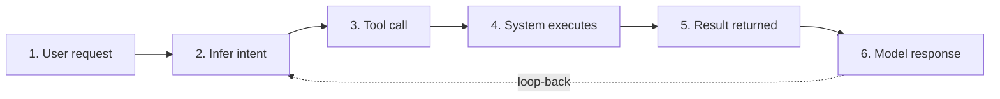
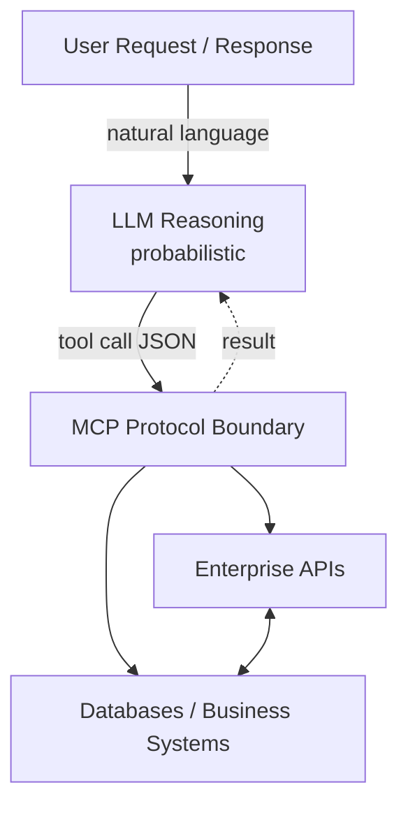

# Chapter 11 — Agentic Design and Control Patterns

**Andreas Maier, Yipeng Sun, Siyuan Mei, Adarsh Bhandary Panambur, Changhun Kim, and Siming Bayer**
Friedrich-Alexander-Universität Erlangen-Nürnberg (FAU)

## Abstract

This chapter bridges the gap between text-generating language models and systems that can act. Starting from the observation that tool integration—such as Wolfram Alpha for computation—transforms what language models can do, it introduces the six-step execution loop—the reason-act-observe cycle that transforms a one-shot text generator into a persistent agent. Skills are then introduced as Markdown-based instruction sets that guide agents through multi-step workflows, illustrated with a real example from the production of this book. The chapter presents the Model Context Protocol (MCP) as the standardized protocol layer that makes tool calling interoperable across models and platforms, covering tool descriptions, schema constraints, and the growing MCP ecosystem. It traces the historical path from Toolformer through ChatGPT Plugins and function calling to today's open standard. The chapter then examines governance, security, and human oversight—including prompt injection attacks and their parallels to social engineering—and concludes with the observation that agentic artificial intelligence (AI) is not magic autonomy but engineered autonomy built on the architectural principles from Chapter 10.

## From Text Generation to Action

Chapter 10 introduced the architectural patterns that organize software at the system level: layered decomposition, client-server communication, broker-mediated routing, plug-in extensibility, and service-oriented architecture. All of those patterns assume that the components making decisions are deterministic programs. This chapter addresses what changes when one of those components is a probabilistic language model—a large language model (LLM) that reasons in natural language and produces structured requests rather than compiled function calls.

As we know, LLMs are remarkably good at generating and transforming text. They summarize, translate, explain, and write code. But for all their fluency, they live in a text world. Every output is a sequence of tokens, and no matter how convincing that sequence looks, the model itself cannot open a file, query a database, send a message, or press a button. It produces words about actions, not the actions themselves.

This limitation matters because software value in production almost always requires more than text generation. In the early days of LLMs, the poor mathematical performance of these models was widely ridiculed—a system that could write poetry but failed at basic arithmetic seemed more like a party trick than a serious tool. That changed instantly when OpenAI integrated Wolfram Alpha as a plugin in March 2023 [Wolfram 2023]: the model could now delegate computation to a symbolic engine and return exact results (see the Geek Box below). This was one of the earliest and most convincing demonstrations that tool integration transforms what language models can do. Real systems need to query databases, update tickets, send messages, trigger workflows, and react to live state changes. The gap between describing what should happen and making it happen is where tool integration becomes relevant.

> **Geek Box: When ChatGPT learned to do math: the Wolfram Alpha integration**
>
> In March 2023, the Wolfram Alpha plugin for ChatGPT [Wolfram 2023] became one of the earliest demonstrations that tool integration transforms LLM capabilities. When a user asked a question requiring computation, ChatGPT would generate Wolfram Language code, send it for execution, and present the result. For example: "What was the distance between Earth and Jupiter on September 15, 1975?"
>
> ```wolfram
> PlanetaryDistance["Earth", "Jupiter",
>   DateObject[{1975, 9, 15, 0, 0, 0}]]
> ```
>
> Wolfram Alpha returns: approximately 604 million km (4.04 AU). The user sees both the generated code and the natural-language answer—a pattern that became the blueprint for all subsequent tool integrations. Before this plugin, ChatGPT would have attempted to reason about the answer token by token, likely producing a confident but wrong number. With the tool, the computation is delegated to a symbolic engine that queries curated astronomical ephemeris data and returns an exact result. An accompanying figure shows the solar system on that date—with nine planets, as Pluto was not reclassified as a dwarf planet until 2006—with an arrow marking the Earth–Jupiter distance of 604 million km. Inner planets are drawn to scale in AU; outer planets beyond Saturn are compressed for page fit.

This chapter addresses how that tool integration is structured at three levels. First, the *execution loop* describes the basic mechanism: a repeated cycle of reasoning, acting, observing, and reasoning again that turns a text generator into a persistent agent. Second, *skills* combine textual instructions with executable code into repeatable workflows that guide the agent through complex multi-step tasks. Third, the MCP standardizes tool discovery and invocation across models and platforms, applying the distributed architectural patterns from Chapter 10—client-server transport, broker-style service registries, and JSON-based interface contracts—to the agent-tool boundary.

The distinction between a chatbot and an agent matters architecturally. A chatbot can remain a self-contained user interface (UI) component with no side effects beyond displaying text. An agentic system, by contrast, must be designed as part of an operational control flow with clear interfaces, permissions, and auditability. The way a system is decomposed into layers and components—the central topic of Chapter 10—determines how reliably it can operate. Agentic systems demand even more attention to architectural boundaries, because the entity making decisions about which operations to perform is a probabilistic model, not a deterministic program.

This transition is worth stating plainly: large language models produce text, they live in this text world, and all they can do is create more text. Agentic AI changes this. It is the step from a text-production system that summarizes and describes into action—AI that can perform tasks on your behalf. That shift is what this entire chapter is about.

## The Execution Loop

The mechanism that turns a text generator into an agent is the execution loop: a repeated cycle of reasoning, acting, observing, and reasoning again. In practice, agentic systems rarely stop at one action. The real power comes from chaining these cycles until a complex goal is achieved.

**Figure 11.1.** The agentic execution loop, adapted from the Anthropic tool-use documentation [Anthropic 2025] and the ReAct pattern [Yao 2023]. The user sends a request (1), the model reasons about intent (2), emits a structured tool call (3), the system executes the operation (4), returns a validated result (5), and the model integrates the result into its response (6). The dashed arrow indicates the loop-back for multi-step tasks.



Figure 11.1 shows the six steps at a conceptual level. The user sends a request (step 1). The model reasons about the intent using internal reasoning tokens (step 2) and emits a structured tool call (step 3). The system executes the requested operation deterministically (step 4)—this may be a remote server, a local system call, or a shell script—and returns a validated result (step 5). The model integrates this result and produces a natural-language response (step 6). The critical architectural insight is the transition at step 4: the model's reasoning is probabilistic, but the execution is fully deterministic regardless of whether it runs on a server or the local machine. This separation—probabilistic intent above, deterministic action below—is what makes agentic systems reliable.

The dashed arrow represents the loop-back: for complex tasks, step six leads back to step two. A model that needs to "organize my schedule for next week" might first query the calendar, then check for conflicts, then propose changes, then execute changes, and finally summarize what it did. Each iteration goes through the same steps. A concrete step-by-step example with actual reasoning traces and JSON tool calls is shown in the Geek Box below. The theoretical foundation for this interleaving of reasoning and action is the ReAct pattern (see the ReAct Geek Box).

> **Geek Box: The execution loop in action: "Add task Buy milk"**
>
> The following trace shows what happens inside the execution loop when a user says "Add task Buy milk" to an agent with access to a shell script `addtask.sh`:
>
> ```bash
> #!/bin/bash
> # addtask.sh - Insert a task into the database
> TITLE="$1"
> ID=$(sqlite3 tasks.db \
>   "INSERT INTO tasks(title) VALUES('$TITLE');
>    SELECT last_insert_rowid();")
> echo "{\"id\": $ID, \"title\": \"$TITLE\"}"
> ```
>
> **Step 1 — User request:**
>
> ```text
> "Add task Buy milk"
> ```
>
> **Step 2 — Model reasoning** (internal, not shown to user):
>
> ```text
> The user wants to create a new task. I have
> addtask.sh which takes a title as argument.
> I should call: addtask.sh "Buy milk"
> ```
>
> **Step 3 — Structured tool call** (emitted as JSON):
>
> ```json
> {
>   "tool": "bash",
>   "arguments": { "cmd": "./addtask.sh \"Buy milk\""}
> }
> ```
>
> **Step 4 — System execution** (deterministic):
>
> ```bash
> $ ./addtask.sh "Buy milk"
> ```
>
> **Step 5 — Result on stdout** (structured JSON):
>
> ```json
> {"id": 42, "title": "Buy milk"}
> ```
>
> **Step 6 — Model response** (shown to user):
>
> ```text
> Done! I've added "Buy milk" to your task list
> (ID: 42).
> ```
>
> For a multi-step task, step 6 loops back to step 2. "Buy milk and eggs" would produce two successive calls to `addtask.sh`, each going through the full cycle.

> **Geek Box: ReAct: Reasoning and Acting in Language Models**
>
> The theoretical foundation for interleaving reasoning and action in language models was laid by Yao et al. in their ReAct paper [Yao 2023], published at the International Conference on Learning Representations (ICLR) in 2023. ReAct showed that language models perform significantly better on complex tasks when they alternate between generating reasoning traces (thinking about what to do) and generating actions (actually doing it). The reasoning traces help the model plan, track progress, and handle exceptions, while the actions ground the model's reasoning in real observations from the environment.
>
> The ReAct pattern maps directly onto the execution loop. Steps two through three correspond to the "reasoning then acting" phase, and steps five through six correspond to the "observing then reasoning" phase. The simplified view is a cycle: **Reason → Act → Observe**, with the observation feeding back into the next round of reasoning.
>
> Neither pure reasoning nor pure action is sufficient. A model that only reasons produces plausible plans that may not work. A model that only acts makes locally optimal choices without the bigger picture. The combination is what makes agentic behavior effective.

This execution loop is protocol-agnostic—it works whether the tool calls are dispatched through a standardized protocol, a custom API, or even local function calls. But knowing the mechanism is not enough: the agent also needs guidance on *what* to do with it. That is the role of skills.

## Skills: Guiding Agent Behavior with Markdown and Scripts

The execution loop explains how an agent reasons and acts. Skills explain what workflow to follow, what quality standards to maintain, and what decisions to make when multiple approaches are possible.

A skill, in the context of modern AI agents like Claude or Codex, is a structured set of instructions written in Markdown that tells the agent how to accomplish a specific type of task. Think of it as a recipe or a standard operating procedure. The skill does not replace the agent's reasoning—it guides it. The agent still uses its LLM capabilities to understand context, make decisions, and adapt to specific situations. But the skill provides the framework within which those decisions are made, ensuring consistency, completeness, and quality across repeated executions of the same type of task.

Skills are important because they bridge the gap between what an LLM can do in principle and what it should do in a specific context. An LLM trained on billions of tokens knows how to write LaTeX, how to generate Python code, how to structure a report. But it does not know your project's conventions, your build system's requirements, or your quality standards. A skill encodes this project-specific knowledge in a format that the agent can read and follow, turning a general-purpose reasoning engine into a specialized workflow executor.

The anatomy of a skill typically includes several components. There is a description that tells the agent when to activate the skill. There are input requirements that specify what information the agent needs before starting. There are step-by-step instructions that define the workflow. And there are quality criteria that define what a successful outcome looks like. All of this is written in plain Markdown, which means it is human-readable, version-controllable, and easy to iterate on.

> **Geek Box: Example Skill: Converting Video Lectures into Book Chapters**
>
> In a fast-developing field like vibe coding, using the technique itself to write about it is both practical and illustrative. The book at hand was written with AI support: the source material consists of LaTeX slide decks and roughly 13 hours of video recordings produced for the *Virtuelle Hochschule Bayern* (VHB), Bavaria's inter-university platform for online courses (<https://kurse.vhb.org/VHBPORTAL/kursprogramm/kursprogramm.jsp?kDetail=true>). An AI agent converted this material into raw textbook chapters using the skill shown below. Of course, many hours of additional work were necessary to create the final textbook, but the skill tremendously accelerated this.
>
> ```markdown
> # Skill: Lecture-to-Chapter Conversion
> ## Description
> Convert a slide deck (main.tex) and VTT transcripts
> into a chapter manuscript (chapter.tex).
> ## Inputs
> - main.tex (slide source, structural anchor)
> - *.vtt files (spoken content, tonal enrichment)
> - references.bib, image assets
> ## Steps
> A. Inventory: locate slides, VTTs, images, bib files
> B. Map structure: slide order -> chapter sections
> C. Draft: write prose section-by-section, integrate
>    VTT elaborations, insert figures with [tbp]
> D. Build wrapper: create chapter_build.tex
> E. Refine: expand examples, add geekboxes with
>    references, ensure no bullet-point-only sections
> F. Compile: run latexmk + biber, fix errors
> ## Quality Criteria
> - All VTT content integrated (not just slides)
> - Academic prose, playful tone from recordings preserved
> - Every figure has alt text and [tbp] placement
> - Five exercises with instructions and examples
> ```
>
> Step F references a build script that the agent calls through the execution loop. The compilation of each chapter requires `latexmk` with bibliography support:
>
> ```bash
> #!/bin/bash
> # compile_chapter.sh - Build a single chapter
> cd "$1" && latexmk -pdf -interaction=nonstopmode \
>   -file-line-error -bibtex-cond1 \
>   -e '$bibtex = q/biber %O %B/;' chapter_build.tex
> ```
>
> The agent calls this script, reads its output, identifies any LaTeX errors, fixes the source, and re-runs the script—a complete agentic cycle of reasoning, acting, and observing, all guided by the skill.

What makes skills particularly powerful is that they can reference external tools and scripts. The skill itself is a Markdown file, but the tools it references are executable scripts in the project repository (see the Example Skill Geek Box). This combination of declarative instructions (what to do) and executable tools (how to do it) is what makes skill-based workflows practical for complex tasks like document generation, code refactoring, or deployment automation.

Skills can be composed and layered. A high-level skill for "producing a book chapter" might reference lower-level skills for "formatting TikZ figures," "writing geekboxes," and "adding accessibility metadata." Each lower-level skill contains its own instructions and quality criteria, and the agent applies them as needed within the higher-level workflow. This compositional structure mirrors the layered and modular software processes and architectural patterns we discussed so far: each skill is a self-contained module with a clear interface (its inputs and outputs) and a clear contract (its quality criteria).

The practical implications for software engineering are significant. Instead of writing detailed code to orchestrate a workflow, you write a Markdown document that describes the workflow in natural language starting from your intended software process all the way to implementation and quality control. The agent reads the document and executes the workflow using its reasoning capabilities and available tools. When the workflow needs to change, you edit the Markdown file, not the code. When a new team member needs to understand the workflow, they read the same document the agent reads. The skills represent software processes from specification to implementation, reducing the gap between intent and execution. This approach scales well because skills are composable, version-controllable, and human-readable.

The historical path from early tool-augmented models through skills to today's standardized protocols is traced in the following Geek Box.

> **Geek Box: From plugins to protocols: how skills and MCP emerged**
>
> The idea that language models should call external tools evolved through several phases, each solving a different part of the problem.
>
> **Tool-augmented models (2023).** Schick et al. demonstrated with Toolformer [Schick 2023] (NeurIPS 2023) that a language model could teach itself when and how to call APIs—a calculator, a search engine, a translation service—by learning from a handful of examples. This was the first rigorous demonstration that tool use could be learned rather than hard-coded.
>
> **ChatGPT Plugins (March 2023).** OpenAI launched Plugins as the first large-scale commercial attempt to let a model interact with third-party services [OpenAI 2023a]. Plugins used manifest files describing endpoints, but the ecosystem suffered from inconsistent quality and no standardization. OpenAI deprecated it in 2024.
>
> **Function calling (June 2023).** OpenAI introduced typed function signatures with JSON schemas [OpenAI 2023b]. The model emitted structured calls that could be validated before execution—the schema acted as a contract. This was quickly adopted by Anthropic, Google, and others, establishing the pattern MCP would later standardize.
>
> **Agent frameworks (2022–2024).** Open-source frameworks such as LangChain [Chase 2022] built orchestration layers implementing the ReAct pattern [Yao 2023] as a reusable agent loop. These frameworks introduced composable *skills*—initially as Python code—showing that tool calling alone is not enough: agents need workflow-level guidance.
>
> **Skills as Markdown (2024–2025).** Anthropic's Claude Code moved skill definitions from code into structured Markdown files stored alongside the project repository. Skills became version-controllable, human-readable, and accessible to non-programmers—simultaneously documentation and executable specification.
>
> **MCP (November 2024–present).** Anthropic introduced MCP to solve the fragmentation problem [Anthropic 2024]: every provider had its own integration format. MCP standardized tool discovery, invocation, and result handling on JSON-RPC 2.0. OpenAI, Google, Microsoft, Amazon, and IBM adopted it within months. In December 2025, Anthropic donated MCP to the Agentic AI Foundation under the Linux Foundation [Anthropic 2025b], moving it from a single company's project to an industry standard.
>
> The trajectory is clear: from research (Toolformer) through commercial experiments (plugins) and engineering refinements (function calling, frameworks) to an open standard (MCP). Each step solved a specific failure of the previous one.

## From Local Skills to Distributed Agent Collectives with MCP

MCP is an open protocol that defines how clients and servers exchange context, tool descriptions, and tool calls in a consistent way across implementations. Anthropic introduced the protocol in late 2024 [Anthropic 2024], and within months it was adopted or supported by OpenAI, Google, Microsoft, Amazon, and IBM. The specification is organized in layers, with a base protocol and lifecycle requirements and optional capabilities for richer interactions [MCP 2025b]. Messages follow JSON-RPC 2.0 semantics [JSON-RPC 2010], which provides a mature request-response foundation for interoperable tooling.

A useful mental model is to think of MCP as "USB-C for AI." Just as USB-C provides a single connector standard that works for charging, data transfer, and video output across thousands of devices, MCP provides a single protocol standard that works for tool discovery, tool invocation, and result handling across different models and different backend systems. The analogy is not exact, but it is operationally helpful. Once the interface contract is explicit, model and tool infrastructure can evolve independently while still interacting safely.

In this architecture, the AI acts as an MCP client, much like a web browser acts as a Hypertext Transfer Protocol (HTTP) client. The MCP servers represent tools or data sources, and communication happens via standardized JSON messages. This is directly analogous to the client-server pattern we discussed in Chapter 10, except that the client here is not a human user clicking buttons but a language model emitting structured requests based on its reasoning about what actions to take.

The reason JSON works so well in this context is worth pausing on. JSON is human-readable, which means developers can inspect and debug tool calls without special tooling. But JSON is also something that language models can produce reliably, because they have seen enormous amounts of JSON during training. The format sits at the intersection of human readability and machine producibility, which makes it an ideal communication language between a reasoning model and a deterministic server.

**Figure 11.2.** MCP as a layered protocol boundary between model reasoning and executable system operations, adapted from the MCP documentation [MCP 2025a]. The user communicates with the LLM in natural language. The LLM emits structured JSON tool calls that cross the MCP boundary into the deterministic enterprise layer. Results flow back through the same boundary, forming one iteration of the ReAct loop (dashed arrow).



Figure 11.2 shows this architecture as a layered design. The user communicates with the LLM in natural language at the top layer. The LLM reasons about intent and emits structured JSON tool calls that cross the MCP protocol boundary—the thick middle layer that separates probabilistic reasoning above from deterministic execution below. Below the boundary, enterprise APIs and databases handle the actual operations. Results flow back through the same boundary to the LLM, forming the ReAct loop (dashed arrow) that enables multi-step agentic behavior. The entire round trip is invisible to the user, who simply sees a helpful answer that reflects actual system state.

The MCP ecosystem evolved quickly during 2025. The protocol governance process and specification cadence became more formal, with revisions documented publicly. The September 2025 project update announced the next release timeline, and the November 2025 revision documented security-related and tool-calling changes [MCP 2025c; MCP 2025d]. This rapid iteration is characteristic of infrastructure protocols in their formative years: the community converges on patterns through real deployment experience rather than theoretical specification alone.

What you can do with MCP in practice is broad. Software development tasks like code analysis, testing, and automated fixes are natural fits, and this is exactly what powers the vibe coding workflows we explore throughout this book. But the protocol extends far beyond coding. Business automation tasks like customer relationship management (CRM) queries and Slack messaging, scheduling tasks like calendar and email coordination, and analytics tasks like report generation from live data all become accessible through the same mechanism. You can even use MCP to connect AI with AI, layering agents on top of agents where one agent's output becomes another agent's input. Deep research tools, for example, are essentially MCP in action: the model decides which sources to query, retrieves information, synthesizes findings, and presents results, all through structured tool calls.

This last point connects directly to the architectural patterns from Chapter 10. The service-oriented architectures that we discussed there, with their representational state transfer (REST) APIs and service registries, are the direct predecessors of MCP. You could say that MCP is the equivalent of APIs for AI: the same idea of standardized, discoverable, callable services, now extended so that the caller is not a developer writing code but a reasoning model deciding which service to invoke.

## Tool Descriptions as an Action Space

A central practical insight is that model tool use depends on descriptive context, not only raw endpoint availability. Simply giving a model access to an API is not enough. The model needs to know what the API does, what parameters it expects, and what it returns. MCP-style integrations provide this information through machine-readable tool metadata: each tool comes with a name, a natural-language description, and an input schema. Why schemas are essential for reliability is explained in the Geek Box on schema constraints.

The scientific foundation of tool use is explored in the Toolformer Geek Box. It is worth noting that the idea of integrating external computation into neural networks predates the API-style approach. Known operator learning embeds domain-specific operations—such as physical transforms or mathematical solvers—directly into the network architecture as differentiable layers, rather than calling them through an external interface [Maier 2019]. A comprehensive review of these hybrid machine-learning approaches, which combine learned and analytically known components inside a single model, is given in [Maier 2022]. The MCP-style tool calling discussed in this chapter can be seen as the distributed, protocol-based counterpart: instead of embedding the tool into the network, the tool runs externally and communicates through a standardized interface. Both approaches share the same insight—that pure learning is less effective than learning combined with existing knowledge—but they operate at different architectural levels.

This mechanism closely aligns with function-calling and tool-calling workflows in modern model APIs [OpenAI 2026a; OpenAI 2026b]. The general pattern is always the same: the model receives tool definitions, reasons about user intent, emits a tool call, application code executes that call, and the result is reinjected into the model's context for final response synthesis. A practical takeaway is that this loop should be seen as software architecture, not only as a prompting technique. The tool descriptions are interface contracts, the tool calls are typed messages, and the execution boundary is an architectural layer. Everything we know about designing good APIs—clear naming, complete documentation, well-defined error handling—applies directly to tool descriptions.

> **Geek Box: Why schema constraints matter**
>
> LLMs generate text token by token, with each token sampled from a probability distribution controlled by a *temperature* parameter. At temperature 0, the model always picks the most likely token. At higher temperatures, it samples more broadly, introducing variety but also unpredictability. This means that without constraints, the same prompt can produce different outputs on different runs—and even small variations can break a parser.
>
> Consider what happens without schema constraints. The model might produce:
>
> ```text
> I've created a task called Buy milk
> with high priority.
> ```
>
> Application code must now parse this sentence to extract the task title—and what about "high priority"? The underlying script `addtask.sh` only accepts a title. The model invented a field that the backend does not support, and without a schema there is nothing to prevent this.
>
> With schema constraints, the tool declares an `inputSchema` that tells the model exactly what is accepted:
>
> ```json
> "inputSchema": {
>   "type": "object",
>   "properties": {
>     "title": {
>       "type": "string",
>       "description": "The task title to add"
>     }
>   },
>   "required": ["title"]
> }
> ```
>
> The model now produces output that matches the schema—and only the schema. The "priority" field is silently dropped because it does not appear in the schema:
>
> ```json
> {"title": "Buy milk"}
> ```
>
> The server validates this against the schema before processing. If the output does not conform, it rejects it and asks the model to try again. The combination of probabilistic reasoning and deterministic validation is the architectural core of every MCP-enabled agent.

> **Geek Box: Toolformer: how a language model taught itself to use a calculator**
>
> Schick et al. showed in 2023 that a language model can learn *by itself* when and how to call external tools—without any human-labeled training data for tool use [Schick 2023]. The approach works in three stages.
>
> **Stage 1 — Sampling.** The researchers started with GPT-J, a 6.7-billion-parameter open-source language model. They fed it text from CCNet, a large web-crawl dataset. At each position in the text, the model was prompted to propose candidate API calls—for example, inserting a calculator call before a number, or a search-engine query before a factual claim. For each candidate position, multiple calls were sampled.
>
> **Stage 2 — Execution.** Every proposed API call was actually executed against a real tool. Six tools were available: a calculator, a question-answering system, two search engines (Wikipedia and a web search), a translation service, and a calendar. The tool returned a concrete result—a number, a paragraph, a date.
>
> **Stage 3 — Filtering.** This is the clever part. For each candidate call, the researchers measured how well the model could predict the *next few words* of the original text in two scenarios: (a) with the API call and its result available as context, and (b) without it. The metric is the model's prediction loss—intuitively, how surprised the model is by the next words. If having the tool result made the model *significantly less surprised* (formally, if the loss decreased by more than a threshold $\tau_f$), the call was kept. Otherwise it was discarded. In practice, only about 5–10% of candidate calls survived this filter.
>
> The surviving calls were woven back into the training text, and the model was fine-tuned on this augmented dataset using up to 25,000 examples per tool, trained for 2,000 steps on 8 NVIDIA A100 GPUs without degrading general language abilities. After training, the model had learned a general pattern: when encountering a situation where a tool would help, emit a structured call, wait for the result, and continue. No human ever labeled which calls were useful—the model discovered this from the prediction-loss signal alone.

These descriptions act as an explicit action space from which the model can select. The concept is close to the plugin architecture pattern from Chapter 10: each tool is a plugin that the model can discover and invoke at runtime. Tools can be added, removed, or modified while the system is running—if a tool is removed from the list, it disappears from the model's action space. The server can even notify connected clients when the tool list changes, so the model always has an up-to-date view of available operations. A complete walk-through of a tool description, a tool call, and the server response is shown in the next Geek Box.

> **Geek Box: How milk gets into a database: an MCP tool call in three acts**
>
> **Act 1 — The tool description.** The server registers a tool via `tools/list`. The `inputSchema` uses standard JSON Schema; there is no output schema—results are returned as a `content` array.
>
> ```json
> {
>   "name": "addTask",
>   "description": "Add a new task to the database.",
>   "inputSchema": {
>     "type": "object",
>     "properties": {
>       "title": {
>         "type": "string",
>         "description": "The task title to add"
>       }
>     },
>     "required": ["title"]
>   }
> }
> ```
>
> **Act 2 — The tool call.** The user says "Add task Buy milk." The model matches intent to the tool and emits a JSON-RPC 2.0 request:
>
> ```json
> {
>   "jsonrpc": "2.0",
>   "method": "tools/call",
>   "params": {
>     "name": "addTask",
>     "arguments": { "title": "Buy milk" }
>   }
> }
> ```
>
> **Act 3 — The result.** The server validates, executes, and returns a `content` array:
>
> ```json
> {
>   "jsonrpc": "2.0",
>   "result": {
>     "content": [
>       { "type": "text",
>         "text": "Task created: Buy milk (id: 42)" }
>     ]
>   }
> }
> ```
>
> Why is a `content` array enough? MCP tools do not declare an output schema—the array can carry text, images, or resources, and the model interprets whatever comes back. Input is strictly typed (`inputSchema`); output is a flexible content stream. Examples follow MCP spec revision 2025-06-18 [MCP 2025a].

When an MCP tool call is dispatched, it enters the same execution loop introduced earlier (Figure 11.1). On the server side, implementing an MCP server is straightforward: the server maps tool names to executable handlers, validates input against the declared schema, and wraps results into the `content` array format. A concrete example using the same `addtask.sh` script from the execution-loop discussion is shown in the following Geek Box.

> **Geek Box: Wiring `addtask.sh` into an MCP server**
>
> The `addtask.sh` script from the "Add task Buy milk" Geek Box does the real work. An MCP server wraps it as a registered tool and packages its output into the `content` array:
>
> ```python
> server = MCPServer(name="tasks")
>
> def handle_add_task(args):
>     import subprocess, json
>     result = subprocess.run(
>         ["./addtask.sh", args["title"]],
>         capture_output=True, text=True)
>     data = json.loads(result.stdout)
>     return {
>         "content": [
>             {"type": "text",
>              "text": f"Task created: {data['title']}"
>                      f" (id: {data['id']})"}
>         ]
>     }
>
> server.register_tool(
>     name="addTask",
>     description="Add a new task to the database.",
>     inputSchema={...},  # as in the three-acts Geek Box
>     handler=handle_add_task)
>
> server.run(transport="stdio")
> ```
>
> The handler calls the shell script, parses its JSON output, and wraps it into a `content` array. The pattern is always the same: describe what goes in, point to the function that does the work, and wrap the result.

This architecture deliberately combines two different computational regimes. The language model contributes probabilistic inference over intent and context, while the API handlers contribute deterministic state transitions over enterprise systems. Reliability comes from separating these responsibilities and making the boundary explicit. The model is allowed to be uncertain, to reason in natural language, to consider multiple possibilities. But at the moment it emits a tool call, the uncertainty ends and the deterministic world takes over. The server does not guess, does not hallucinate, does not improvise. It validates, executes, and returns facts.

This separation is also where the layer pattern from Chapter 10 reappears in a new context. The MCP boundary is a layer boundary. Everything above it (user interaction, intent inference, tool selection) is probabilistic and flexible. Everything below it (API validation, database operations, external service calls) is deterministic and constrained. The software architecture considerations that we had to understand for building reliable systems now form the basis for agentic AI. That connection is not a coincidence—it is the reason this chapter follows the architecture chapter in the book.

## The MCP Ecosystem and Its Reach

By 2025, MCP had moved from a protocol proposal to a broadly adopted standard with production deployments across the industry. The benefits of having a unified standard for AI tool integration became apparent quickly: developers no longer needed to write custom integration code for each model-tool combination, and the friction of connecting a new tool to an existing agent dropped dramatically.

The practical reach of MCP spans several domains. In software development, which is the focus of this book, MCP enables code analysis, automated testing, bug fixes, and deployment automation—the full vibe coding workflow where the agent drafts, executes, and refines implementation steps under your supervision. In business automation, MCP connects models to CRM systems, messaging platforms like Slack, and workflow engines, allowing an agent to not just discuss a customer issue but actually look up the customer record, update the ticket, and send a notification. In scheduling and coordination, MCP connects to calendar and email APIs, enabling agents that can read your schedule, propose meeting times, and send invitations. In analytics, MCP connects to data sources and report generators, enabling agents that can query live data, produce charts, and compile reports without manual intervention.

One of the most powerful applications is connecting AI with AI. Because MCP is a standard protocol, one agent can expose its capabilities as MCP tools that another agent can discover and invoke. This enables multi-agent architectures where specialized agents collaborate on complex tasks: one agent handles data retrieval, another handles analysis, and a third handles report generation. The "deep research" tools available in modern AI assistants are essentially this pattern in action—the model orchestrates multiple search and retrieval operations through MCP to compile comprehensive research reports.

From the perspective of a web server, it does not really matter whether a browser is accessing it or an LLM agent. Both send HTTP requests and receive JSON responses. This observation has a profound implication: the decades of experience the software industry has accumulated in building secure, scalable, and reliable web services apply directly to MCP deployments. Authentication, authorization, rate limiting, logging, monitoring—all of these mature web infrastructure practices can be reused for agent-facing services. The transition from human-facing APIs to agent-facing APIs is not a revolution in infrastructure; it is an evolution in who the client is.

## Agentic AI as an Architectural Pattern

With the protocol and execution mechanics in place, we can now define what agentic AI actually means. In this chapter, agentic AI refers to systems that autonomously pursue user or business goals by repeatedly reasoning, selecting actions, and integrating execution feedback. The key word is "autonomously": unlike a chatbot that responds to one message at a time, an agent takes initiative, plans multi-step strategies, and executes them with minimal human intervention.

But autonomy does not mean independence. Agentic autonomy is bounded and delegated. The agent operates within constraints defined by its tool descriptions, permission policies, and oversight mechanisms. It is not an independent actor detached from the software process. It is an orchestrated component inside governance constraints, much like a well-managed employee who has decision-making authority within their role but escalates outside it.

The transition from reactive chatbots to proactive agents represents a qualitative shift in what software systems can do. A chatbot waits for input and produces a response. An agent receives a goal and pursues it. The distinction is important: it is not just chatting and reflecting, it is doing things. The foundation is the combination of reasoning and tool use.

This combination of reasoning and action is built on the LLM architectures we discussed in Chapter 3, including models like GPT-4, Claude, and Gemini. These models use MCP or similar interfaces to connect their reasoning capabilities with external tools. The result is a new kind of software component that can understand natural-language goals, plan sequences of operations, execute those operations through standardized protocols, observe the results, and adapt its strategy accordingly.

Several technology frameworks support building agentic systems. LangChain and LangGraph provide abstractions for chaining model calls with tool invocations (see the LangChain Geek Box). AutoGen enables multi-agent systems where multiple models collaborate on tasks. Furthermore, various enterprise platforms package agentic capabilities into products. The specifics of these frameworks change rapidly, but the underlying architectural pattern—reason, act, observe, repeat—remains stable across all of them.

> **Geek Box: LangChain and LangGraph: from chains to stateful agent graphs**
>
> LangChain, introduced by Harrison Chase in late 2022 [Chase 2022], was one of the first open-source frameworks to make LLM tool use practical for developers. Its core idea is *chain-based composition*: individual steps—prompting a model, calling a tool, parsing a result—are linked into sequential chains that can be reused and combined. A comparative review by Sapkota et al. provides a taxonomy of LangChain's architecture alongside its successors [Sapkota 2025].
>
> **LangChain** organizes an agent as a linear pipeline. A minimal ReAct agent in LangChain looks like this:
>
> ```python
> from langchain.agents import create_react_agent
> from langchain_openai import ChatOpenAI
> from langchain.tools import tool
>
> @tool
> def add_task(title: str) -> str:
>     """Add a task to the database."""
>     return f"Task '{title}' created (id: 42)"
>
> agent = create_react_agent(
>     llm=ChatOpenAI(model="gpt-4"),
>     tools=[add_task])
> ```
>
> The `@tool` decorator turns a Python function into a tool description that the model can reason about—the docstring becomes the tool's natural-language description.
>
> **LangGraph** (2024) extends this idea from linear chains to *stateful directed graphs* [Feng 2024]. Each node in the graph is a processing step (reasoning, tool call, human approval), and edges define transitions—including cycles for the ReAct loop. This graph-based design enables features that linear chains cannot support: conditional branching, parallel execution, human-in-the-loop interrupts, persistent state across turns, and multi-agent collaboration where different nodes represent different specialized agents.
>
> ```python
> from langgraph.prebuilt import create_react_agent
>
> graph = create_react_agent(
>     model=ChatOpenAI(model="gpt-4"),
>     tools=[add_task])
>
> result = graph.invoke(
>     {"messages": [("user", "Add task Buy milk")]})
> ```
>
> LangGraph's `create_react_agent` builds the full reason-act-observe graph automatically. For production use, developers can define custom graphs with explicit state schemas, checkpoint persistence, and approval gates at critical nodes.

The enterprise deployment of agentic AI accelerated significantly during 2024 and 2025. Salesforce announced Agentforce 2.0 in December 2024, positioning it as a "digital labor platform" for building reusable agent capabilities across enterprise workflows [Salesforce 2024]. In March 2025, Salesforce launched AgentExchange, a marketplace for pre-built agent components [Salesforce 2025]. IBM and Anthropic announced a strategic partnership in October 2025, focused explicitly on enterprise development controls, governance, and secure MCP-related deployment guidance [IBM 2025]. These are not research prototypes—they are production infrastructure announcements from companies with billions of dollars in enterprise revenue.

These examples matter because they show that the ecosystem has moved from experimentation to productized infrastructure. At the same time, they underline a warning that runs throughout this chapter: operational risk management becomes more, not less, important when autonomy increases. A system that can do more can also fail faster and at larger scale. The relevant performance metric is therefore not only speed but controlled speed with auditability and recovery.

## Governance, Security, and Human Oversight

Agentic systems introduce familiar distributed-system risks plus new socio-technical risks. The familiar risks are the ones any experienced software engineer would recognize: incorrect permissions, weak input validation, inadequate logging, and unhandled error states. These risks exist in any system that makes remote calls and modifies state, and the standard mitigations—least-privilege access, schema validation, comprehensive logging, and graceful error handling—apply just as they would for any web service.

The newer risks are specific to systems where a probabilistic model makes decisions about which operations to perform (see the Prompt Injection Geek Box). The most prominent of these is prompt-level manipulation: an attacker crafts input that influences the model's tool selection in ways the system designer did not intend. If a customer-service agent has access to a "discount" tool, an attacker might try to trick the agent into applying unauthorized discounts by framing their request in a way that triggers the tool. The risk is real: agents can hallucinate, and they are also prone to attacks that would work on some humans—an attacker can try to convince them that it is an emergency and they must act immediately.

> **Geek Box: Prompt Injection: Social Engineering for AI Agents**
>
> Prompt injection is a class of attacks where an adversary crafts input that causes a language model to override its instructions or take unintended actions [Liu 2023]. The analogy to social engineering is apt: just as a social engineer manipulates a human into violating security policies, a prompt injection manipulates a model by embedding adversarial instructions in what appears to be normal input.
>
> In 2025, Lin discovered 18 manuscripts on arXiv containing hidden instructions—white text on white background, zero-width Unicode characters—designed to manipulate AI-assisted reviewers into giving favorable assessments [Lin 2025]. Systematic evaluation showed that simple injections can achieve up to 100% acceptance-score manipulation on LLM-generated reviews [Rossen 2025]. The responsibility, of course, remains with the human reviewer: a reviewer who delegates assessment to an LLM without reading the paper is violating academic standards regardless of whether the paper contains hidden prompts. Many conferences and journals explicitly ban LLM use in reviews. Interestingly, the Association for the Advancement of Artificial Intelligence (AAAI) took the opposite approach and supports its review process with additional LLM reviewers under controlled conditions with human oversight [AAAI 2025].
>
> Current frontier LLMs already detect many prompt and context injection patterns and increasingly ignore them. Claude, GPT-4, and Gemini all implement instruction-hierarchy mechanisms that distinguish trusted system prompts from untrusted user input. However, no defense is complete, and the arms race between injection techniques and detection continues.
>
> In the context of MCP-enabled agents, prompt injection is particularly dangerous because the model's actions have real-world consequences. A successful injection against a chatbot produces a misleading text response. A successful injection against an agentic system could trigger unauthorized database modifications, financial transactions, or data exfiltration.
>
> In principle, the same security mechanisms that protect REST APIs apply to agent-facing services: authentication, authorization, rate limiting, and input validation. Authorizing an AI agent carries the same risk as authorizing a different person—the agent acts with the permissions it is granted, and those permissions must follow the principle of least privilege. For local execution environments like Claude Code or OpenClaw, sandboxes and virtual machines provide the appropriate isolation boundary, just as they do for untrusted code from any other source.

This connection between social engineering on humans and prompt manipulation on agents is a critical observation. We will see quite a bit of agent engineering and prompt engineering that will try to fool AI agents into giving discounts, revealing confidential information, or performing unauthorized operations. The attack surface is different from traditional software exploits, but the motivation and the consequences are the same. As we saw in the early days of the internet, we will see failures. The systems will need to be hardened iteratively, just as web applications were hardened against SQL injection, cross-site scripting, and session hijacking over the course of decades.

Security for agentic systems has two distinct sides that should not be conflated. The first side is the *security of the agentic software product itself*. This is standard software and security engineering, applied to a system that happens to include an LLM. Considering the discount agent, the discount tool needs hard limits on the maximum discount percentage, quotas on how many codes can be issued per hour, and validation that the requesting user is authorized. These are not AI-specific controls—they are the same requirements-engineering and implementation disciplines discussed in Chapters 8 and 12, applied to a new kind of user interface. If the requirements specification does not include abuse limits, the system will be abused regardless of whether the caller is a human, a website, or an LLM.

The second side is the *security of the agentic development workflow*. Here, the risks mirror those that every software developer already faces: is the package I am installing safe, or does it include malware? Does the dependency I just pulled from PyPI do what it claims, or has it been tampered with? The same standard operational procedures that protect traditional software development—dependency auditing, reproducible builds, runtime inspection, signed packages, and supply-chain verification—apply with equal force to agentic workflows. Testing, inspecting runtimes, and monitoring network behavior remain the primary tools for detecting something fishy. The recent history of supply-chain attacks makes this point with uncomfortable clarity (see the Supply-chain Geek Box).

> **Geek Box: Supply-chain attacks: from XZ Utils to LiteLLM**
>
> Two recent supply-chain attacks illustrate how open-source transparency is both the vulnerability and the defense.
>
> In March 2024, software engineer Andres Freund noticed unusual performance degradation in OpenSSH on a pre-release Debian system. Investigating, he discovered a backdoor in XZ Utils (CVE-2024-3094), a compression library that OpenSSH depends on in certain Linux configurations [Freund 2024]. The attack had been planned for over two years. A pseudonymous contributor called "Jia Tan" joined the XZ Utils project in late 2021, submitting helpful bug fixes and earning commit access. Fake accounts were used to pressure the original maintainer with feature requests and complaints, creating the appearance that a second maintainer was needed. By 2023, Jia Tan had enough trust to introduce subtle changes into the build system. In February 2024, the actual backdoor was committed: malicious code in the build scripts injected an obfuscated payload into the compiled library, which intercepted OpenSSH's authentication process and enabled remote code execution. The backdoor was sophisticated enough to bypass code review—it was hidden in test fixture files and activated only through the build system, not visible in the source code itself. Freund's discovery, triggered by a 500-millisecond performance anomaly, prevented the compromised version from reaching stable Linux distributions and effectively the end of security in the Internet.
>
> In March 2026, the agentic AI community experienced its own supply-chain moment. The threat group TeamPCP compromised the PyPI publishing credentials for LiteLLM, a widely used library for routing requests across LLM providers [Snyk 2026]. The attack was cascading: the attackers first poisoned a security-scanning tool (Trivy) used in LiteLLM's CI/CD pipeline, then used that foothold to publish two backdoored versions of LiteLLM to PyPI. The malicious packages—downloaded 47,000 times in the 46 minutes before PyPI quarantined them—installed a persistent backdoor that harvested credentials, attempted lateral movement across Kubernetes clusters, and polled for additional payloads. LiteLLM is present in roughly 36% of cloud environments and is downloaded over 3 million times per day, making the potential blast radius enormous.
>
> Both attacks share the same anatomy: a trusted dependency is compromised through social engineering and patience, and the poisoned code rides the existing trust chain into production systems. Both were discovered because open-source software is transparent—Freund could inspect the binary, and the security community could analyze the PyPI packages. The lesson for agentic development workflows is direct: the packages your agent installs, the tools it invokes, and the dependencies it pulls are attack surfaces that require the same vigilance as any other software supply chain.

In general, there are two important oversight patterns: *Human-in-the-loop* places human approval inside specific decision checkpoints. Every time the agent reaches a high-impact decision—approving a loan, deploying code to production, sending an email on someone's behalf—it pauses and asks a human to confirm. This pattern provides strong safety guarantees but reduces throughput, because the agent blocks on human response times. Human-above-the-loop allows autonomous execution under policy constraints, with human monitoring and intervention authority. The agent operates independently as long as its actions fall within predefined policy boundaries, and a human monitors the aggregate behavior and can intervene when something looks wrong. This pattern provides higher throughput but requires more sophisticated monitoring and alerting. Both of the patterns are also used in human-human oversight.

The right pattern depends on the impact, reversibility, and accountability requirements of each workflow. For a vibe coding session where the worst case is a bad commit that can be reverted, human-above-the-loop is usually sufficient: you let the agent code and review the results periodically. For a banking agent that can transfer money, human-in-the-loop is essential for transactions above a certain threshold. The rule is simple: do not give your agent access to all of your bank accounts without proper controls, because if it sends your money away, no amount of clever prompting can fix that (unless you prompt inject some other system).

## Industry Momentum and Business Impact

Agentic AI entered the mainstream in 2025, and the pace of adoption has been striking. OpenAI released AgentKit for building agent-based applications. Salesforce deployed Agentforce across its enterprise platform. IBM partnered with Anthropic specifically to drive MCP adoption in enterprise environments. Google integrated agentic capabilities into Gemini Enterprise. Oracle announced its own agentic AI initiative. These are not incremental updates to existing products; they represent a fundamental shift in how enterprise software is designed and deployed.

The business impact projections are substantial. Industry analysts project process acceleration of 30 to 50 percent for tasks amenable to agentic automation. The shift is from passive systems that wait for human commands to self-optimizing systems that identify opportunities, plan actions, and execute them proactively. The promise is that this frees humans for strategic work—the kind of work that requires judgment, creativity, and contextual understanding that agents cannot yet provide.

In the context of this book, this shift manifests as vibe coding: the agent drafts, executes, and refines implementation steps under your supervision. You provide the strategic direction, the architectural decisions, and the quality standards. The agent handles the implementation details, the repetitive coding tasks, and the build-test-debug cycle. This is not a replacement for software engineering knowledge—if anything, it makes software engineering knowledge more valuable, because you need to be able to evaluate what the agent produces and correct it when it goes wrong.

Understanding agentic design patterns is a competitive advantage. Staying informed is itself a skill: this book is a structured starting point, but the field evolves so quickly that continuous learning is essential. Technologies and frameworks will come and go, but the underlying principles—structured interfaces, schema validation, governance layers, human oversight—will remain relevant regardless of which specific tools dominate the market.

The synergy between tools, skills, MCP and agentic AI is the core message of this chapter. Skills and MCP are the connective infrastructure: they standardize how models discover and invoke tools. Agentic AI is the intelligence layer: it provides the reasoning that decides which tools to use and how to combine them. Together, they produce systems that understand goals expressed in natural language, decide on courses of action, execute those actions through real systems, and learn from the results. This will be the basis for next-generation enterprise automation, and it will have effects not just on businesses but on societies.

## Conclusion

This chapter introduced three layers of agentic design. The execution loop—reason, act, observe, repeat—is the basic mechanism that turns a text generator into an agent. Skills encode project-specific workflows in Markdown, making multi-step tasks repeatable and human-readable. MCP standardizes tool discovery and invocation across models and platforms, sitting at the architectural boundary between probabilistic reasoning and deterministic execution.

Reliability requires all three layers working together. Tool descriptions must be clear and complete. JSON schemas must enforce correctness at execution boundaries. Permission boundaries must follow least-privilege principles. Observability must capture every tool call for auditing. And human oversight—whether in-the-loop or above-the-loop—must provide meaningful control at critical decision points. Prompt injection and other socio-technical risks demand at least the same defense-in-depth approach that web security has developed over decades.

The practical direction for software engineers is clear: build autonomous capabilities, but treat the control architecture as a first-class feature. The architectural principles from Chapter 10—layered decomposition, interface contracts, separation of concerns—are not academic abstractions but operational necessities for systems that reason and act in the real world.

## Exercises

These exercises give you hands-on practice with the Model Context Protocol and agentic workflow patterns introduced in this chapter.

**Exercise Problem 1:** Design a minimal MCP integration for a task-management backend and document each interface artifact needed for reliable operation. Start by defining one tool with name, description, and input schema, then describe how the server validates requests and returns results via the `content` array. Example task: implement an `addTask` flow where the model receives "Add task Buy milk" and emits a valid structured tool call that inserts the task in a database. Write the tool description JSON, the server registration code, and a sample round-trip showing the request and response.

**Exercise Problem 2:** Compare natural-language-only agent output against schema-constrained tool calling for the same workflow and evaluate failure modes. Start with an unconstrained prompt-response implementation where the model produces a free-text description of the action it would take, then add schema validation and deterministic server checks, and document where errors are prevented. Example task: use a customer-support ticket creation flow and compare malformed requests before and after schema enforcement. Produce a table showing at least five failure modes and how each is handled with and without schema constraints.

**Exercise Problem 3:** Build a governance blueprint for one high-impact agentic workflow with explicit oversight points. Start by defining allowed actions, identity scope, logging requirements, and escalation thresholds, then specify where human-in-the-loop approval is mandatory and where human-above-the-loop monitoring is acceptable. Example task: design a loan-prequalification assistant that can collect data automatically but requires human approval before final decisions. Document the policy layer, permission layer, validation layer, observability layer, and oversight layer for your design.

**Exercise Problem 4:** Perform a threat analysis for prompt and context manipulation in an MCP-enabled agent system. Begin by identifying at least three attack paths where an adversary attempts to influence the agent's tool selection or parameter construction, then map each path to concrete mitigations at the policy, schema, and execution layers. Example task: analyze how an attacker might coerce an agent into sending unauthorized discounts through a customer-service tool, and design controls that block the action even if the model is persuaded linguistically. Document your analysis using the two-sided security model from this chapter (product security and workflow security) as a framework.

**Exercise Problem 5:** Write a skill in Markdown that guides an AI agent through a repeatable software engineering task, then execute the skill and evaluate the output. The skill should include a description, input requirements, step-by-step instructions, quality criteria, and references to at least one external tool (such as a shell script or build command). Example task: create a skill for generating unit tests from existing source code, where the skill instructs the agent to read the source file, identify testable functions, generate test cases using a testing framework, run the tests, and report results. Evaluate whether the agent's output meets the quality criteria defined in the skill.

## Bibliography

- [AAAI 2025] AAAI. *AAAI Launches AI-Powered Peer Review Assessment System.* 2025. <https://aaai.org/aaai-launches-ai-powered-peer-review-assessment-system/>
- [Anthropic 2024] Anthropic. *Introducing the Model Context Protocol.* 2024. <https://www.anthropic.com/news/model-context-protocol>
- [Anthropic 2025] Anthropic. *How Tool Use Works.* 2025. <https://platform.claude.com/docs/en/agents-and-tools/tool-use/how-tool-use-works>
- [Anthropic 2025b] Anthropic. *Donating the Model Context Protocol and Establishing the Agentic AI Foundation.* 2025. <https://www.anthropic.com/news/donating-the-model-context-protocol-and-establishing-of-the-agentic-ai-foundation>
- [Chase 2022] Chase, H. *LangChain: The Agent Engineering Platform.* 2022. <https://github.com/langchain-ai/langchain>
- [Feng 2024] Feng, K. et al. *Agent AI with LangGraph: A Modular Framework for Enhancing Machine Translation Using Large Language Models.* arXiv:2412.03801, 2024.
- [Freund 2024] Freund, A. *Backdoor in Upstream xz/liblzma Leading to SSH Server Compromise.* 2024. CVE-2024-3094. <https://www.openwall.com/lists/oss-security/2024/03/29/4>
- [IBM 2025] IBM. *IBM and Anthropic Partner to Advance Enterprise Software Development with Proven Security and Governance.* 2025. <https://newsroom.ibm.com/2025-10-07-2025-ibm-and-anthropic-partner-to-advance-enterprise-software-development-with-proven-security-and-governance>
- [JSON-RPC 2010] JSON-RPC Working Group. *JSON-RPC 2.0 Specification.* 2010. <https://www.jsonrpc.org/specification>
- [Lin 2025] Lin, Z. *Hidden Prompts in Manuscripts Exploit AI-Assisted Peer Review.* arXiv:2507.06185, 2025.
- [Liu 2023] Liu, Y. et al. *Prompt Injection Attack against LLM-Integrated Applications.* arXiv:2306.05499, 2023.
- [Maier 2019] Maier, A., Syben, C., Lasser, T., Riess, C. *Learning with Known Operators Reduces Maximum Training Error Bounds.* Nature Machine Intelligence, 1:373–380, 2019.
- [Maier 2022] Maier, A., Köstler, H., Heisig, M., Krauss, P., Yang, S. H. *Known Operator Learning and Hybrid Machine Learning in Medical Imaging—A Review of the Past, the Present, and the Future.* Progress in Biomedical Engineering, 4(2):022002, 2022.
- [MCP 2025a] Model Context Protocol. *What is the Model Context Protocol (MCP)?* 2025. <https://modelcontextprotocol.io/docs/getting-started/intro>
- [MCP 2025b] Model Context Protocol Project. *Model Context Protocol Specification Overview (Revision 2025-06-18).* 2025. <https://modelcontextprotocol.io/specification/2025-06-18/basic>
- [MCP 2025c] Soria Parra, D. *Update on the Next MCP Protocol Release.* 2025. <https://blog.modelcontextprotocol.io/posts/2025-09-26-mcp-next-version-update/>
- [MCP 2025d] Model Context Protocol Project. *Model Context Protocol Key Changes (Revision 2025-11-25).* 2025. <https://modelcontextprotocol.io/specification/2025-11-25/changelog>
- [OpenAI 2023a] OpenAI. *ChatGPT Plugins.* 2023. <https://openai.com/index/chatgpt-plugins/>
- [OpenAI 2023b] OpenAI. *Function Calling and Other API Updates.* 2023. <https://openai.com/index/function-calling-and-other-api-updates/>
- [OpenAI 2026a] OpenAI. *Function Calling Guide (OpenAI API Docs).* 2026. <https://platform.openai.com/docs/guides/function-calling/function-calling-with-structured-outputs>
- [OpenAI 2026b] OpenAI. *Using Tools (OpenAI API Docs).* 2026. <https://platform.openai.com/docs/guides/tools/tool-choice>
- [Rossen 2025] Rossen, M. et al. *Prompt Injection Attacks on LLM Generated Reviews of Scientific Publications.* arXiv:2509.10248, 2025.
- [Salesforce 2024] Salesforce. *Introducing Agentforce 2.0: The Digital Labor Platform for Building a Limitless Workforce.* 2024. <https://www.salesforce.com/ap/news/press-releases/2024/12/18/introducing-agentforce-2-0-the-digital-labor-platform-for-building-a-limitless-workforce-2/>
- [Salesforce 2025] Salesforce. *Salesforce Launches AgentExchange: the Trusted Marketplace for Agentforce.* 2025. <https://investor.salesforce.com/news/news-details/2025/Salesforce-Launches-AgentExchange-the-Trusted-Marketplace-for-Agentforce/default.aspx>
- [Sapkota 2025] Sapkota, S. et al. *LangChain vs. LangGraph vs. LangSmith: Taxonomies of Agentic AI Toolchains for End-to-End Orchestration.* TechRxiv preprint, 2025.
- [Schick 2023] Schick, T. et al. *Toolformer: Language Models Can Teach Themselves to Use Tools.* Advances in Neural Information Processing Systems, 36:68539–68551, 2023.
- [Snyk 2026] Snyk. *How a Poisoned Security Scanner Became the Key to Backdooring LiteLLM.* 2026. <https://snyk.io/blog/poisoned-security-scanner-backdooring-litellm/>
- [Wolfram 2023] Wolfram, S. *ChatGPT Gets Its "Wolfram Superpowers"!* 2023. <https://writings.stephenwolfram.com/2023/03/chatgpt-gets-its-wolfram-superpowers/>
- [Yao 2023] Yao, S. et al. *ReAct: Synergizing Reasoning and Acting in Language Models.* International Conference on Learning Representations (ICLR), 2023.

## Source

This chapter is derived from the *Vibe Coding* book (Maier et al., Springer, CC BY, <https://link.springer.com/book/9783032399069>), chapter source `vhb_vibe_coding/VIBE_11_MCP/chapter.tex`. It is part of the VHB course *Vibe Coding*: <https://www.studon.fau.de/studon/ilias.php?baseClass=ilrepositorygui&ref_id=6720901>
