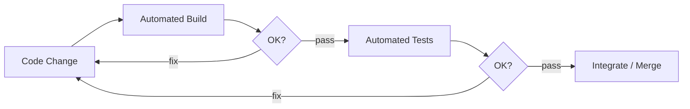
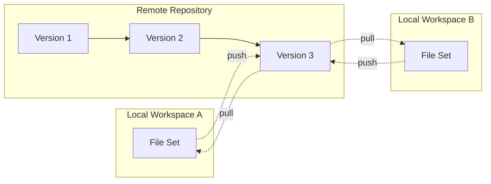

# Chapter 12 — Implementation and Version Control in Vibe Coding

**Andreas Maier, Sally Zeitler, Aline Sindel, Siyuan Mei, Adarsh Bhandary Panambur, Changhun Kim, and Siming Bayer**
Friedrich-Alexander-Universität Erlangen-Nürnberg (FAU)

## Abstract

This chapter discusses implementation practice for AI-assisted software engineering, covering coding standards, build discipline, test automation, design principles, scalability considerations, and version control workflows. The central argument is that coding agents do not remove the need for engineering rules—they increase the value of explicit rules by making automated generation and review faster and more frequent. The chapter introduces practical guidance for what to standardize in code style, how to structure implementation work in manageable increments, why continuous integration (CI) should gate every repository change, and how computational complexity affects design decisions when systems grow. It closes with a comprehensive introduction to Git concepts and command-level workflows that remain essential for collaborative development, whether your collaborators are humans, AI agents, or both. Throughout, the discussion connects implementation choices to the architectural and process foundations established in earlier chapters, emphasizing that good implementation is not about typing speed but about disciplined decision-making at every level.

## Implementation Standards in the Age of Coding Agents

Implementation standards are not cosmetic restrictions. They are coordination mechanisms that improve code quality, development speed, and teamwork stability [Sutter 2004]. If you have ever worked in a team where one developer uses tabs and another uses spaces, where function names alternate between `camelCase` and `snake_case` within the same file, or where half the codebase has comments and the other half has none, you know the friction this creates. Code reviews slow down because reviewers spend energy on inconsistencies rather than logic. Debugging becomes harder because you cannot rely on conventions to guide your reading. And onboarding new team members takes longer because there is no single style to learn.

In AI-assisted projects, this coordination role becomes even more important because generated code can arrive quickly and at scale. A coding agent can produce hundreds of lines in seconds. If the standards are unclear, the team accumulates inconsistent artifacts faster than ever before. If the standards are explicit, however, the AI tools can follow them and reduce friction between generated code and human review. This is one of the key practical insights in practice: you can provide a document with your coding guidelines directly into the context of the coding system, and it will tremendously help reduce the friction between AI and human developers.

The recommendation is straightforward: define your implementation rules early and include them directly in the working context of the coding agent. That can be a project guideline document stored in the repository, a conventions file that the agent reads at startup, or policy prompts attached to automation workflows. In Chapter 11, we discussed how skills—markdown-based instruction sets—can guide agent behavior across complex tasks. Coding standards are a natural fit for this mechanism. You write a skill that says "follow PEP 8 naming conventions, use type hints, keep functions under 30 lines," and the agent incorporates these constraints into every generation cycle.

The goal is not rigid stylistic control for its own sake. The goal is consistent engineering behavior across humans and agents, so that the resulting codebase reads as if it were written by a single disciplined team rather than a collection of independent authors with different habits. As Sutter and Alexandrescu put it in their classic guide on coding standards [Sutter 2004], a good standard is based on proven concepts rather than personal taste, and it should be set at the beginning of a project and reviewed periodically as the team learns what works.

The factors that shape a coding standard are familiar from any team-based software project: organizational rules that reflect company-wide policies, team practices that have evolved through experience, the programming language itself (which often comes with community conventions like PEP 8 for Python [PEP 8 2001]), and the specifics of the project at hand. What is new in the vibe coding context is that the AI will comply with these standards if you specify them clearly. The AI does not have personal preferences. It will not argue about whether to use tabs or spaces. It will follow whatever you put in the context, which means the quality of your standards directly determines the quality of the generated code.

This also connects back to the language choice. As discussed in Chapter 2, picking a programming language is partly determined by the system architecture and the available libraries. An additional practical consideration specific to vibe coding: use a programming language that you have some experience with, because if there is a point where you really have to go into the code, that obviously helps a lot. Python, with its enormous library ecosystem, is excellent for rapid prototyping. If you already have a large codebase in C++ or C#, you probably want to continue with that. The AI can work with any mainstream language, but your ability to review and debug its output depends on your own familiarity with the language.

## What to Standardize, and What Not to Overregulate

A useful implementation standard focuses on readability, maintainability, and defect prevention rather than personal taste. The distinction between beneficial guidance and overregulation matters because overly prescriptive standards create compliance burden without quality benefit, while too-loose standards provide no coordination value at all. The sweet spot is a set of rules that are easy to follow, easy to check, and directly connected to measurable quality outcomes.

**Table 12.1.** Pragmatic scope of coding-standard rules. The left column lists areas where over-specification adds friction without improving quality. The right column lists the corresponding actionable guidance that delivers real benefits in readability and maintainability [Sutter 2004].

| Avoid overregulation | Prefer actionable guidance |
| --- | --- |
| Hard-coding indentation amounts without quality effect | Indent to expose structure clearly |
| Fixed line limits without contextual flexibility | Keep lines readable for review and tooling |
| Overly complex naming legislation | Keep naming consistent and intention-revealing |
| Comment quantity as a metric | Write comments that explain non-obvious intent |

> **Geek Box: Clean Code in the age of agents: principles, risks, and backlogs**
>
> Robert C. Martin's *Clean Code* [Martin 2008] argues that code quality is a concrete engineering practice: clean code reads like well-written prose, reveals its intent clearly, and makes it easy for the next developer to understand and modify. His "Boy Scout Rule"—leave the code cleaner than you found it—and his insistence that "the ratio of time spent reading versus writing code is well over 10 to 1" explain why readability standards matter.
>
> In agentic workflows, however, applying these principles naively introduces a subtle risk. If an agent is instructed to "improve code quality on every pass," the temperature-driven sampling of the LLM means each pass introduces slightly different rewrites—variable renames, function restructurings, comment reformulations—even when the original code was already acceptable. Over multiple iterations, these random "improvements" can drift the codebase away from its established style, introduce unintended semantic changes, or simply churn code without meaningful benefit. The agent is not being malicious; it is being probabilistic. Every touch rewrites, and every rewrite carries risk.
>
> The more reliable approach is to separate *detection* from *correction*—and to separate the *role* that identifies improvements from the *role* that applies them. Fixed, deterministic rules—linters, formatters, static analyzers—should handle style enforcement automatically. For deeper quality concerns that require judgment ("this function does too much," "this abstraction leaks implementation details"), a dedicated quality-assessment step should collect improvement suggestions in a *code-quality backlog* rather than applying them on the spot. Each suggestion is a backlog item with a description, the affected location, and a proposed fix.
>
> The important point is not whether a human or an agent performs the assessment—it is that the assessment happens in a *different scope and role* than the implementation work. The implementing agent should not simultaneously judge and rewrite its own output; a separate review step, whether performed by a human reviewer, a dedicated review agent, or a scheduled quality sprint, evaluates and prioritizes the backlog items. This separation of concerns mirrors the distinction between developer and reviewer in traditional code review, and it integrates naturally into the agile processes from Chapter 7. Martin's principles remain valuable as the *criteria* by which suggestions are evaluated—but the role that proposes must be distinct from the role that implements.

Table 12.1 summarizes this balance. On the left are things that teams sometimes standardize but that do not meaningfully improve quality: mandating exactly four spaces of indentation (unless the language requires it, as Python does), imposing a rigid 80-character line limit regardless of context, creating elaborate naming rules that are hard to remember, or requiring a fixed number of comment lines per function. On the right are the corresponding actionable alternatives: indent to expose the structure of your code clearly, keep lines at a readable length for your review tools and monitors, use a consistent naming convention that reveals intent, and write comments that explain why, not what.

The underlying principle is straightforward: standards should serve the humans (and agents) who read the code, not the other way around. If a standard makes code harder to read or maintain, it is working against its own purpose.

Naming conventions deserve special attention because they are one of the most effective low-cost controls available. A consistent mapping between identifiers and their semantic roles makes both generated and manually edited code easier to inspect. A common convention illustrates this: classes and functions use CamelCase like `NameOfClass()`, variables use lowerCamelCase like `nameOfVariable`, private members have a trailing underscore like `privateMember_`, and macros use ALL_CAPS like `MACRO_NAME`. The exact convention varies by language and team, but consistency is the non-negotiable property. When you see an identifier with a capital letter, you should immediately know whether it is a class, a function, or a constant, without having to look up the definition. How classical clean-code principles interact with agentic workflows—and why agents should propose improvements rather than impose them continuously—is discussed in the Geek Box "Clean Code in the age of agents".

The point about conventions having no single "truth" extends well beyond code. In mathematics, physics, and engineering, communities have developed competing notational systems that each optimize for different properties—and switching between them causes exactly the same friction as switching between coding styles. This parallel is explored in the Geek Box "Notation wars".

> **Geek Box: Notation wars: why mathematicians, physicists, and engineers cannot agree**
>
> Coding conventions are not unique to software. Mathematics, physics, and engineering have their own long-standing notation debates, and they illustrate the same lesson: conventions are agreements, not truths. Each system optimizes for a specific set of operations, and switching between systems mid-project causes real confusion.
>
> **Engineering notation (bold vectors and matrices).** In engineering and applied mathematics, vectors are bold lowercase and matrices bold uppercase. Vectors are column vectors by default; a row vector is the transpose. The key operations are:
>
> $$\text{matrix-vector product: } \mathbf{A}\mathbf{x}, \qquad \text{inner product: } \mathbf{x}^\top\mathbf{y}, \qquad \text{outer product: } \mathbf{x}\mathbf{y}^\top$$
>
> A quadratic form is written as $\mathbf{x}^\top\mathbf{A}\mathbf{x}$. Dimensional compatibility can be checked at a glance: if $\mathbf{A}$ is $m \times n$ and $\mathbf{x}$ is $n \times 1$, the shapes line up left to right. This notation dominates linear algebra, machine learning, and signal processing, and it is the convention used throughout this book.
>
> **Dirac notation (bras and kets).** In quantum mechanics, Dirac introduced a notation where a column vector (*state*) is a *ket* and its conjugate transpose (*dual vector*) is a *bra*:
>
> $$\text{ket (state): } |\psi\rangle, \qquad \text{bra (dual): } \langle\psi|, \qquad \text{inner product: } \langle\phi|\psi\rangle$$
>
> An outer product is $|\psi\rangle\langle\phi|$, and an operator acting on a state is $\hat{A}|\psi\rangle$. Expectation values read naturally:
>
> $$\langle\phi|\hat{A}|\psi\rangle \quad \text{("the expectation of } A \text{ between states } \phi \text{ and } \psi\text{")}$$
>
> The advantage is extreme compactness for quantum algebra; the disadvantage is hidden matrix dimensions, which cause friction when translating to numerical code.
>
> **Einstein summation convention.** Einstein notation eliminates summation signs: any index appearing twice is implicitly summed. The matrix-vector product becomes:
>
> $$\mathbf{y} = \mathbf{A}\mathbf{x} \quad\longrightarrow\quad y_i = A_{ij}\, x_j \quad \text{(sum over } j \text{)}$$
>
> This is extremely compact for tensor calculus in general relativity and continuum mechanics. The disadvantage is that beginners must learn to spot repeated indices and track which are summed and which are free.
>
> The parallel to coding conventions is direct. No notation is inherently superior. Engineering notation makes dimensional checks easy. Dirac notation makes quantum algebra elegant. Einstein notation makes tensor expressions compact. Each community chose the system that minimizes friction for their most common operations. The important rule—in mathematics as in code—is to pick one convention, document it, and stick with it throughout the project. Mixing conventions mid-document is the notational equivalent of mixing camelCase and snake_case in the same file: technically possible, practically painful, and a reliable source of bugs.

Comments are another area where practical guidance matters. If you are using automated documentation frameworks like Javadoc or Sphinx, you may want to adopt a commenting style that is compatible with the framework. But this typically affects only the documentation comments in front of methods or functions, not the inline comments between lines of code. The general rule is: write comments that explain non-obvious intent. If the code is clear enough to understand without a comment, do not add one just to hit a comment-per-line metric. If the code does something surprising or non-obvious, explain why. A striking example of how Javadoc comments can be turned into a self-documenting system is the CONRAD framework (see the Geek Box "CONRAD: when comments build the GUI").

> **Geek Box: CONRAD: when comments build the GUI**
>
> CONRAD (Cone-Beam Imaging in Radiology) is a Java-based open-source framework for X-ray imaging simulation and cone-beam CT reconstruction, developed jointly at Stanford University and the Pattern Recognition Lab at FAU [Maier 2013; CONRAD 2013]. It supports the full imaging pipeline from raw projection data through preprocessing, filtering, and backprojection to the final reconstructed 3D volume.
>
> Architecturally, CONRAD uses a plug-in system that maps to the pipe-and-filter pattern from Chapter 10. All algorithms—noise filters, truncation correction, cosine weighting, ramp filtering, GPU-accelerated backprojectors, bilateral filtering—are independent plug-ins implementing a common interface. The user assembles a reconstruction pipeline by chaining plug-ins in sequence. Plug-ins can be added, removed, or reordered at runtime—a direct application of the open-closed principle. Each plug-in's configurable parameters—threshold values, kernel sizes, iteration counts, file paths—are exposed as Java Beans: standardized getter/setter pairs that the framework discovers via reflection and auto-generates GUI elements for (text fields, spinners, checkboxes, file choosers). No separate GUI code is written for individual plug-ins.
>
> Because the pipe-and-filter architecture has no global state by design, CONRAD introduced a *registry* for settings that need to be shared across filters—such as file paths, `MAX_THREADS`, and `OPENCL_DEVICE_SELECTION`. The registry keys were documented with Javadoc comments, and CONRAD's help window was auto-generated from this Javadoc: each registry key appeared with its description, type, and default value, all extracted at runtime. If a developer added a new registry key but skipped the Javadoc, the help window showed an undocumented entry—immediately visible to every user. This created a self-enforcing incentive: the Javadoc comments were not documentation for future readers but the specification from which the help system was built.
>
> The lesson for vibe coding: comments that serve a machine-readable purpose—Javadoc, Sphinx, or AI context—are maintained far more reliably than comments for hypothetical readers. If a missing comment has a visible consequence, developers will write it.
>
> **Figure 12.1.** The CONRAD pipeline configuration dialog shows a chain of image-processing filters whose GUI controls (text fields, spinners, checkboxes, file choosers) are auto-generated at runtime from Javadoc annotations on each plug-in's Java Bean parameters. The dialog demonstrates that no per-filter GUI code is written; the documentation comments themselves drive the interface. Image from [Maier 2013], CC BY 4.0.

## Coding Guidelines: Build Discipline and Warnings

A core implementation principle is that committed code must build cleanly and should not leave unresolved warnings without explicit and localized justification. This practice has always mattered in team development, but it takes on special urgency when multiple developers—or multiple agents—contribute to the same codebase.

Any experienced developer will recognize this situation: you fetch the new code and you try to work on it, and then you realize that somebody else made a lot of errors and your code doesn't compile anymore. That is really, really annoying. The good news, fortunately, is that with AI, this is hopefully no longer the case, because coding agents will make sure that the code builds without errors. The AI coding platforms compile the code automatically and then they will only accept the code if it compiles error-free.

This is a genuine advantage of working with coding agents: they have infinite patience for compile-fix-compile cycles. A human developer might submit code with a "known" warning because fixing it would take another half hour, and besides, it is just a warning, not an error. An agent has no such temptation. It will keep iterating until the code compiles cleanly, because it does not get tired, bored, or hungry.

But warnings deserve more attention than many teams give them. Even warnings that seem harmless can mask real problems. A deprecation warning might indicate that a library function will disappear in the next version. A type-conversion warning might hide a subtle data-loss bug. Even warnings that can be ignored should be resolved, as they can lead to misleading warnings or errors later on. If your team decides to ignore a specific warning, disable it as locally as possible and clearly document why it is being ignored. This way, the suppression is visible, intentional, and reversible.

The goal is a build process where any new warning is a signal worth investigating, not noise that everyone has learned to tune out. In AI-assisted workflows, this goal is achievable because the agent can fix most warnings as part of its normal generation cycle. You do not need to choose between clean builds and development speed—you can have both.

## Automated Build Systems

The whole project should be built with what Sutter and Alexandrescu call a "one-action" build system [Sutter 2004]: a system that produces a full deliverable without manual intervention. You press one button (or type one command), and out comes the complete, tested, ready-to-deploy artifact. No manual file copying, no "remember to run this script first," no "it works on my machine."

In modern repositories, this typically means scripted build targets for several variants: a full build that compiles everything from scratch, an incremental build that only recompiles what has changed, separate targets for debug and release configurations, and possibly architecture-specific outputs if the software runs on multiple platforms. Build systems encode these targets in configuration files that live in the repository alongside the source code, making the build process version-controlled, reviewable, and reproducible. The most widely used build systems are compared in the Geek Box "Build systems".

> **Geek Box: Build systems: Make, CMake, Gradle, and npm**
>
> A build system automates the transformation from source code to deliverable artifact. Each ecosystem has developed its own tool, but they all solve the same fundamental problem: track dependencies between files, determine which steps are out of date, and execute only the necessary transformations in the correct order.
>
> **Make** (1976) is the oldest and most universal build tool [Mecklenburg 2004]. A `Makefile` declares *targets*, their *prerequisites*, and the *recipes* (shell commands) to produce them. Make compares file timestamps to decide what needs rebuilding. A minimal example:
>
> ```makefile
> chapter.pdf: chapter.tex references.bib
> 	latexmk -pdf chapter.tex
> clean:
> 	latexmk -C
> ```
>
> Typing `make` rebuilds `chapter.pdf` only if `chapter.tex` or `references.bib` have changed. Make is language-agnostic—it builds C, LaTeX, Python packages, or anything else that can be described as file transformations. This book's own build system uses Make with `latexmk` as the LaTeX driver.
>
> **CMake** (2000) is a *meta-build system*: it does not build code directly but generates native build files for Make, Ninja, or Visual Studio [Scott 2018]. A `CMakeLists.txt` describes the project's structure, and CMake produces platform-specific build instructions. This solves the portability problem: the same CMake project can build on Linux, macOS, and Windows without maintaining separate Makefiles. CMake dominates C and C++ development and is used by projects ranging from LLVM to OpenCV.
>
> **Gradle** (2007) is the standard build tool for Java, Kotlin, and Android development [Gradle 2024]. Unlike Make's declarative rules, Gradle uses a Groovy or Kotlin DSL that allows programmatic build logic. It features incremental builds, build caching, and parallel task execution. A typical `build.gradle` declares dependencies, compilation targets, and test configurations. Gradle resolves library dependencies automatically from repositories like Maven Central, which eliminates the manual library management that plagued earlier Java build tools like Ant.
>
> **npm** (2010) is the package manager and script runner for the JavaScript and TypeScript ecosystem [npm 2024]. A `package.json` file declares project metadata, dependencies, and named scripts. Running `npm install` downloads all dependencies into a local `node_modules` directory; `npm run build` executes the project's build script. npm is less a traditional build system and more a dependency manager with a built-in script runner, but in web development it serves the same role: one command produces the deliverable.
>
> The common thread is that all four systems encode the build process as a text file in the repository. This means the build is version-controlled, diffable, and reproducible on any machine. For AI-assisted development, this property is critical: the agent can read the build file, execute the build command, inspect the output, and iterate—exactly the feedback loop described in the execution-loop pattern from Chapter 11.

An important observation about how AI coding platforms relate to build systems: all the AI coding platforms compile the code automatically and only accept the code if it compiles error-free. Every time the agent generates or modifies code, it runs the build, checks the result, and iterates until the build succeeds. Large projects might also employ a "build master"—a dedicated person (or, increasingly, a dedicated automation pipeline) whose job is to maintain the build system itself and ensure it stays fast, reliable, and comprehensive.

For the vibe coding workflow specifically, the automated build system is not just a best practice but a critical feedback mechanism. The agent needs a way to know whether its code works. Compilation is the first gate: if the code does not compile, the agent knows immediately that something is wrong and can fix it.

## Test Automation and Continuous Integration (CI)

Beyond compiling code, modern projects rely on automated testing. Test automation means that unit tests and integration tests are executed automatically, that test results are reproducible and independent of manual execution, and that regressions—cases where previously working functionality breaks—are detected early. We will discuss testing strategies in detail in the next chapter, but the connection to implementation standards is important enough to address here.

With CI, every commit triggers an automated build, runs the complete test suite, and reports failures immediately. This enforces quality control and prevents unstable code from entering the main branch. This is the loop in the context of AI-assisted development: you ask the AI to do changes, then it sees that it compiles, it runs all the tests, and only if the tests and everything compiles successfully do you actually commit it to the repository.

**Figure 12.2.** A continuous integration loop for AI-assisted implementation. A code change enters from the left and passes through two quality gates—an automated build and automated tests—each guarded by an OK? decision point. A failure at either gate loops the change back to the code-change stage for correction (the "fix" path); only code that passes both gates reaches the integration and merge stage. In an AI-assisted workflow, the agent performs the fix loop automatically, iterating until both gates are satisfied.



Figure 12.2 shows this loop visually. A code change enters from the left and must pass through two quality gates: an automated build and automated tests. Each gate has a decision point that either passes the code forward to the next stage or loops it back for correction. Only code that survives both gates reaches the final integration and merge stage. In a traditional development workflow, a failing test means the developer receives a notification, investigates the problem, fixes the code, and submits a new change. In an AI-assisted workflow, the agent can perform this fix loop automatically, receiving the error message, analyzing the failure, modifying the code, and re-running the build and tests until everything passes.

It is worth noting how natural this model is for agent-based development: the cool thing with the AI is that if it gets this error message, it will continue to work on the code until it reaches the point where it builds and all the tests are completed. This is a genuine productivity advantage. Human developers often find the compile-test-fix cycle tedious, especially for small issues. Agents handle it without complaint, which means teams can enforce stricter quality gates without slowing down delivery.

The connection to CI platforms like GitHub Actions is worth noting. Modern CI systems [GitHub Actions 2026] run as automated pipelines triggered by repository events—typically push or pull-request events. When a developer (or an agent) pushes code, the CI system spins up a build environment, compiles the code, runs the test suite, and reports the result. If the build fails, the pull request is flagged and cannot be merged until the issue is resolved. This creates a hard quality gate that protects the main branch from broken code, regardless of whether the code was written by a human or generated by an AI.

## Design Guidelines: One Thing at a Time

A recurring recommendation in software engineering is decomposition: implement one well-defined unit at a time [Sutter 2004]. This principle, sometimes called the Single Responsibility Principle, says that every entity in your code—every variable, class, function, module—should have a singular, clearly defined responsibility. When responsibilities grow and diverge, the entity becomes harder to use, harder to reuse, and harder to test. Overlapping areas create confusing interfaces, and the implementation becomes more complex because it has to manage multiple unrelated behaviors.

This principle connects directly to vibe coding workflows. If you are working on a large project, you might be tempted to put the entire specification into the AI system and ask it to build everything at once. For a small project, this might work. But for anything substantial, the recommendation is clear: first decompose the tasks into one thing at a time, and then build them one thing at a time. For example, you could start with developing one software module, begin by implementing the test cases first and preparing everything for CI, and then actually start the implementation of the module, and then slowly scale up. You can even ask the AI to develop such an implementation plan for you before starting the actual implementation. For advanced users, you can even instruct the agent to follow a specific software process—such as waterfall, Scrum, or Kanban—to structure the development workflow according to the principles discussed in Chapters 6 and 7.

This approach limits error propagation and makes both human and AI reasoning more reliable. When the scope of a single generation request is small and well-defined, the agent can focus its reasoning on one problem at a time, and you can verify each piece before moving to the next. When the scope is too large, the agent may spend a lot of compute looping on a problem where an additional interaction with a human developer would have resolved it quickly. Decomposition is not just good engineering—it is good prompting strategy.

The same principle applies at the code level. Complex behavior should be implemented as a combination of several simple entities, not as one monolithic block that tries to do everything. A function that reads a file, parses its contents, validates the data, transforms it, and writes the result to a database is doing five things. If any one of those steps changes, the entire function must be modified and retested. Five separate functions, each doing one thing, are easier to write, easier to test, easier to debug, and easier to reuse.

## KISS: Keep It Simple

The KISS principle [Sutter 2004] is one of the oldest and most reliable guidelines in engineering: correct is better than fast, simple is better than complex, clear is better than cute, safe is better than insecure. In the context of software implementation, this means that when you have a choice between a clever solution that is hard to understand and a straightforward solution that is easy to verify, you should almost always choose the straightforward one.

The recommendation is clear: prefer clear code, and make that preference explicit in the prompts to the AI by putting these design guidelines directly into the context of the agent, telling it to prioritize correctness over performance, simplicity over cleverness, and safety over speed. This guidance shapes the agent's output in measurable ways. When teams ask for clear, explicit, and safe implementations, generated outputs tend to be easier to test and integrate. Highly condensed or over-optimized code can obscure intent and increase debugging cost. A striking example of code that deliberately trades readability for performance—and why such trade-offs require careful justification—is the Quake III inverse square root hack discussed in the Geek Box "Quake III fast inverse square root".

The key insight behind KISS is asymmetric difficulty: while correct code can easily be optimized later when profiling shows where the bottlenecks are, it is much harder to correct optimized code, because the optimization may have introduced subtle assumptions that are no longer valid when the requirements change. The safe strategy is therefore to start simple, verify correctness, measure performance, and optimize only the specific hotspots where measurement shows it matters.

> **Geek Box: Quake III fast inverse square root: when fast code is intentionally non-obvious**
>
> Inverse and square-root operations were historically high-latency on many target CPUs used for real-time graphics engines. Quake III therefore used a very fast approximation for
>
> $$\frac{1}{\lVert \vec{c} \rVert} = \frac{1}{\sqrt{x^2 + y^2 + z^2}} \approx \texttt{Q\_rsqrt}(x^2 + y^2 + z^2)$$
>
> to normalize vectors $(x,y,z)$ in tight loops.
>
> The original C implementation (including the famous swear-word comment) is [Quake III 2005]:
>
> ```c
> float Q_rsqrt( float number )
> {
>     long i;
>     float x2, y;
>     const float threehalfs = 1.5F;
>     x2 = number * 0.5F;
>     y  = number;
>     i  = * ( long * ) &y;             // evil floating point bit level hacking
>     i  = 0x5f3759df - ( i >> 1 );     // what the fuck?
>     y  = * ( float * ) &i;
>     y  = y * ( threehalfs - ( x2 * y * y ) );  // 1st iteration
>     return y;
> }
> ```
>
> Why this works, in compact form [Lomont 2003]: the cited technical note needs roughly 12 pages to explain the derivation and error behavior in full detail.
>
> 1. IEEE 754 single-precision encodes a float so that its bit pattern, interpreted as an integer, is approximately affine in $\log_2(x)$. The code intentionally abuses this by reinterpreting a `float` as a `long`.
> 2. For normalized values, a linear model $\log_2(1+m)\approx m$ (with $m\in[0,1)$) gives a cheap approximation. This is the "log trick" behind the integer arithmetic.
> 3. The operation `(i >> 1)` approximates multiplication by $+1/2$ in the log domain, and subtracting from the magic constant (`0x5f3759df`) implements the required sign flip to $-1/2$ plus correction factors that reduce approximation error.
> 4. One Newton step, $y \leftarrow y\left(1.5 - 0.5xy^2\right)$, rapidly refines the estimate so the result is accurate enough for many graphics tasks while staying extremely fast.
>
> Put simply, this one-step variant typically reaches roughly 1% error relative to a classical inverse-square-root computation while using only a fraction of the computational cost in the relevant hardware context [Lomont 2003].
>
> This is an excellent "easy code vs. fast code" example: the implementation is harder to read and relies on IEEE 754 bit-level behavior, but it was engineering-optimal for its performance context.

## Scalability and Computational Complexity

Implementation quality is strongly affected by how algorithms behave when the input grows. A function that works perfectly with ten items might become unbearably slow with ten thousand, and completely unusable with a million. Understanding computational complexity—the study of how resource requirements grow with input size—is therefore essential for making informed implementation decisions.

The standard notation for expressing complexity is Big-O notation, which describes the growth rate of an algorithm's running time as a function of the input size $n$. The notation captures the dominant term and ignores constants and lower-order terms, because for sufficiently large inputs, the dominant term overwhelms everything else. An algorithm with complexity $O(n)$ (linear) will take roughly ten times longer if the input grows tenfold. An algorithm with complexity $O(n^2)$ (quadratic) will take roughly a hundred times longer. An algorithm with complexity $O(2^n)$ (exponential) will become effectively impossible for large inputs regardless of hardware speed. The formal foundations and concrete examples of complexity classes for common operations are presented in the Geek Box "Big-O Notation".

> **Geek Box: Big-O Notation and Asymptotic Analysis**
>
> The formal study of algorithm complexity was pioneered by Donald Knuth in *The Art of Computer Programming* [Knuth 1968], where he systematized the use of asymptotic notation (Big-O, Big-Omega, Big-Theta) for analyzing algorithms. The standard reference textbook for the field is Cormen, Leiserson, Rivest, and Stein's *Introduction to Algorithms* [Cormen 2009], which provides rigorous treatment of complexity classes for all major algorithm families.
>
> The key idea is simple: we want to characterize how an algorithm's resource usage (usually time or memory) grows as the input gets larger, without getting distracted by hardware-specific constants. Big-O notation, written $O(f(n))$, means that the algorithm's growth rate is bounded above by some constant multiple of $f(n)$ for sufficiently large $n$. So $O(n)$ means the time grows at most linearly, $O(n^2)$ means at most quadratically, and so on. The notation deliberately ignores constant factors: an algorithm that takes $3n + 7$ steps and one that takes $100n + 42$ steps are both $O(n)$, because for large enough $n$, the linear growth dominates in both cases. This abstraction is what makes Big-O useful for comparing algorithms independent of specific hardware.
>
> Consider several concrete examples of complexity for common arithmetic and algebraic operations. Addition and subtraction of two $n$-digit numbers produces an $(n+1)$-digit result and requires $O(n)$ operations—you process each digit once from right to left, carrying as needed. Multiplication of two $n$-digit numbers produces a $2n$-digit result and requires $O(n^2)$ operations in the straightforward "schoolbook" algorithm (each digit of one number multiplies each digit of the other). More sophisticated algorithms like Karatsuba's method can reduce this to $O(n^{\log_2 3}) \approx O(n^{1.585})$, and the theoretical minimum is $O(n \log n)$ using advanced techniques. Division has complexity in the order of the multiplication complexity, $O(M(n))$, because efficient division algorithms are built on top of multiplication.
>
> | Operation | Input model | Complexity class |
> | --- | --- | --- |
> | Addition / Subtraction | Two $n$-digit integers | $O(n)$ |
> | Multiplication | Two $n$-digit integers | $O(n^2)$ schoolbook |
> | Division | Two $n$-digit integers | $O(M(n))$ |
> | Square root | One $n$-digit integer | $O(M(n))$ |
> | *Fixed-size machine words (e.g., 32-bit or 64-bit):* | | |
> | Addition / Multiplication | Two machine integers | $O(1)$ |
> | Polynomial evaluation | Degree-$n$ polynomial | $O(n)$ |
> | Matrix multiplication | Two $n \times n$ matrices | $O(n^3)$ classical |
>
> Complexity depends on the input model: for two 32-bit integers, addition is $O(1)$ because the digit count is fixed, while the $O(n)$ bound applies when $n$ can grow, as in cryptography. For matrix multiplication, the classical $O(n^3)$ algorithm is often faster in practice than the theoretical $O(n^{2.373})$ minimum, because the latter carries enormous constant-factor overhead. Big-O hides constants, and sometimes those constants matter a great deal.

For user-facing operations, aim for constant, logarithmic, or linear complexity, and avoid algorithms with above-linear complexity in performance-critical paths unless you have a specific justification. Exponential algorithms should be avoided unless absolutely necessary, because they simply take forever to solve. And remember that optimization should not be done prematurely: optimize on a bigger structural scale when the need becomes clear, rather than micro-optimizing individual lines before you know where the actual bottlenecks are.

## Design Patterns: Reusable Solutions to Common Problems

Beyond coding standards and complexity awareness, experienced developers rely on design patterns—proven solutions to problems that come up again and again in software construction [Gamma 1994]. Design patterns are not code that you copy and paste. They are templates for solving structural problems, described at a level of abstraction that makes them applicable across different programming languages, domains, and team sizes. The Gang of Four catalog and its relationship to architectural patterns were introduced in Chapter 10.

Design patterns connect directly to the architectural patterns discussed there. Architectural patterns like layered architecture and client-server describe system-level structure, while design patterns describe component-level structure. The plugin architecture pattern, for example, is closely related to the Strategy pattern: both involve selecting among interchangeable components at runtime. The broker pattern from service-oriented architectures relates to the Mediator pattern, which centralizes communication between components. Understanding both levels—architecture and design—gives you a complete vocabulary for describing and communicating software structure.

Interestingly, the idea of design patterns extends beyond classical software engineering into deep learning, where recurring architectural motifs serve analogous roles. Just as the Gang of Four catalogued reusable solutions for object-oriented design, a set of emerging *deep design patterns* captures reusable structural templates for neural network architectures [Maier 2022]. These are explored in the Geek Box "Deep design patterns?".

> **Geek Box: Deep design patterns?**
>
> Classical design patterns [Gamma 1994] solve recurring structural problems in object-oriented software. An analogous set of patterns is emerging for deep neural networks, where certain architectural motifs recur across domains because they encode fundamental computational principles [Maier 2022; Maier 2019]. The following five patterns outline this idea:
>
> **1. Multi-scale Matcher (U-Net).** The U-Net [Ronneberger 2015] pattern is a multi-scale template matcher and replacer. The encoder contracts the spatial resolution through successive downsampling, extracting features at increasingly coarse scales. The decoder expands back to full resolution, and skip connections concatenate encoder features at each scale. This allows the network to match patterns at multiple resolutions and replace them with learned output features—a structure used in segmentation, denoising, and image-to-image translation.
>
> **2. Multi-task and autoencoder losses.** Instead of training with a single output loss, multi-task learning attaches auxiliary loss functions to intermediate layers, enforcing that internal representations satisfy specific interface constraints. An autoencoder loss on a U-net layer, for instance, ensures that the learned features can reconstruct the input, preventing information collapse. These losses act as design-time interfaces—analogous to interface specifications in classical software design [Fu 2020].
>
> **3. RNNs as sequence processors.** Recurrent neural networks process inputs as *ordered sequences*. At each time step $t$, the network receives the current input $\mathbf{x}_t$ together with a hidden state $\mathbf{h}_{t-1}$ carried from the previous step, producing output $\mathbf{y}_t$ and an updated hidden state. This feedback loop makes RNNs the natural pattern for any task where temporal order matters: language modeling, speech recognition, or time-series prediction.
>
> **4. Transformers as set processors.** In contrast to RNNs, transformers process their input as an *unordered set* via self-attention: every element attends to every other element simultaneously, with positional information added explicitly rather than emerging from sequential processing. This set-processing pattern is the structural reason why transformers scale more efficiently than RNNs on modern hardware—attention is parallelizable, while recurrence is inherently sequential.
>
> **5. ResNets and variational networks as unrolled optimization.** A residual network [He 2016] computes $\mathbf{y} = \mathbf{x} + H(\mathbf{x})$, where $H$ is a learned residual function. This is structurally identical to one step of gradient descent: $\mathbf{x}^{t} = \mathbf{x}^{t-1} - \eta\,\nabla f(\mathbf{x}^{t-1})$, where the network learns the update direction. Variational networks [Hammernik 2018] make this connection explicit by unrolling an iterative optimization algorithm into a fixed number of network layers, with learnable parameters replacing hand-tuned solver settings. Stacking $N$ residual blocks is thus equivalent to running $N$ steps of a learned optimizer.

## Version Control as Collaboration Infrastructure

Version control is the backbone of multi-developer and multi-agent implementation. It preserves history, supports rollback, and enables parallel change integration. Without version control, collaborative software development is essentially impossible at any meaningful scale. With it, teams of dozens or even thousands of developers can work on the same codebase simultaneously, tracking every change, resolving conflicts, and maintaining a complete history of how the software evolved.

A helpful analogy introduces version control: maybe you know Word's track changes feature—the version control system is essentially the full-blown version of track changes, but over many different versions of a source code over time. Track changes shows you what was inserted, deleted, and modified in a single document. A version control system does the same thing, but across thousands of files, hundreds of developers, and years of project history.

Git, created by Linus Torvalds in 2005 [Torvalds 2005], is the dominant version control system in modern software development. Git is a distributed system, which means each developer (or agent) has a full local copy of the entire repository, not just the latest version. This local repository stores the complete history of the project, so you can inspect any previous version, compare changes, and even work offline without any connection to a central server. The history of version control systems that led to Git's creation—from CVS and Subversion to BitKeeper—is traced in the Geek Box "Linus Torvalds and the Creation of Git".

> **Geek Box: Linus Torvalds and the Creation of Git**
>
> Git was created in 2005 by Linus Torvalds, the creator of the Linux kernel [Torvalds 2005]. To understand why Git was revolutionary, it helps to know what was before it.
>
> **CVS** (Concurrent Versions System, 1990) [CVS 1990] was one of the first widely adopted version control tools. It introduced the idea of a central repository that multiple developers could access concurrently, with file-level locking and later optimistic merging. However, CVS tracked changes per file rather than per commit, making atomic multi-file changes impossible—a commit could partially succeed, leaving the repository in an inconsistent state. Renaming or moving files was not supported; you had to delete and re-add them, losing history in the process.
>
> **Subversion** (SVN, 2000) [SVN 2004] was designed as "a better CVS." It introduced atomic commits (all files in a commit succeed or fail together), proper directory versioning, and efficient binary file handling. SVN remained centralized: a single server held the authoritative repository, and developers checked out working copies. This meant that operations like viewing history or creating branches required network access to the server, and the server was a single point of failure.
>
> **BitKeeper** (1998) [BitKeeper 1998] was the first widely used *distributed* version control system. Every developer held a full copy of the repository, and changes were exchanged between peers. The Linux kernel adopted BitKeeper in 2002, but it was proprietary software offered to the kernel community under a special free-of-charge license. When a licensing dispute ended that arrangement in 2005, Torvalds decided to build his own system rather than return to centralized tools.
>
> He designed Git with specific goals: it had to be fast (able to handle the massive Linux kernel repository), distributed (no single point of failure), and resistant to data corruption. The result was a system where every clone is a complete repository with full history. This makes branching, committing, and viewing history extremely fast (they all happen locally) and makes the system resilient (if the server goes down, any clone can serve as a backup). Git's branching model—where creating a branch is nearly instantaneous and merging is well-supported—encouraged a workflow based on feature branches and pull requests that has become the industry standard.

The architecture of Git is layered, as emphasized earlier. You have two repositories: a local repository on your machine and a remote repository used for collaboration. You work locally, making changes and committing them to your local repository as often as you like. When you reach a version that you want to share—say, you have finished implementing a module and all its tests pass—you push your local commits to the remote repository, where other developers and agents can access them.

**Figure 12.3.** Local and remote repository roles in collaborative version control. Two developers (or agents) maintain local workspaces, each with its own file set, on the left. The remote repository on the right stores the complete version history as a chain of versions (Version 1 → Version 2 → Version 3). Developers pull the latest version from the remote to synchronize their local work and push their committed changes back when ready to share. This layered architecture allows asynchronous, parallel development while maintaining a single authoritative project history.



> **Geek Box: The push-and-pull dance: how distributed version control coordinates work**
>
> Consider a scenario that makes the value of distributed version control concrete. Two developers, A and B, work on the same project. Developer A finishes a feature and pushes it to the remote repository as Version 4. Developer B is not finished yet but needs something from A's work. B keeps the local changes, pulls Version 4 from the remote, merges it into the local state, finishes the remaining tasks, and pushes the combined result as Version 5. Developer A can then pull Version 5 and continue. This asynchronous dance of push, pull, and merge is how large-scale projects coordinate many contributors.
>
> ```mermaid
> sequenceDiagram
>     participant A as Dev A
>     participant R as Remote
>     participant B as Dev B
>     Note over A: work
>     A->>R: push V4
>     Note over B: work
>     R->>B: pull V4
>     Note over B: merge
>     Note over B: work
>     B->>R: push V5
>     R->>A: pull V5
>     Note over A: continue
> ```

Figure 12.3 illustrates this architecture. Two local workspaces (which could represent human developers, AI agents, or a mix of both) each maintain their own file sets. The remote repository stores the complete version history, represented here as Version 1, Version 2, and Version 3 stacked chronologically. Developers pull the latest version from the remote to synchronize their local work, and push their committed changes back when they are ready to share.

A concrete scenario illustrating this push-and-pull workflow is described in the Geek Box "The push-and-pull dance". In AI-assisted settings, this architecture maps cleanly to agent-based workflows. You can have multiple agents working on different tasks, each with its own branch in the repository. When an agent finishes a task, it commits its changes and creates a pull request for review. The human developer (or another agent acting as a reviewer) examines the changes, discusses any issues, and either merges or requests modifications. This keeps automation aligned with software-engineering governance rather than bypassing it. The key point is that you're essentially just following the software engineering playbook, but you just increase the automation.

> **Geek Box: Core Git commands and their practical roles**
>
> These seven commands cover the most common version control operations. Understanding them is essential even when using AI coding platforms that automate repository management, because you will need to intervene manually when conflicts arise or when the AI's changes need to be reviewed or reverted.
>
> | Command | Practical role |
> | --- | --- |
> | `git init` | Initialize a new local repository in a project directory. This creates the hidden `.git` folder that stores all version history. |
> | `git clone` | Create a local copy of an existing remote repository, including its full history. This is how you start working on an existing project. |
> | `git status` | Inspect which files have been changed, added, or deleted in the working directory. This shows what will and will not be included in the next commit. |
> | `git add` | Stage selected files for the next commit. Staging lets you choose exactly which changes to include, even if you modified more files than you want to commit. |
> | `git commit` | Record a logical, message-labeled project change in the local repository. The message should describe what was changed and why. |
> | `git pull` | Fetch and integrate remote updates into the local branch. This is how you get your colleagues' (or agents') latest work. |
> | `git push` | Publish local commits to the remote repository. This makes your work available to the rest of the team. |

### Git Workflow Concepts and Practical Commands

A minimal Git workflow starts with repository initialization or cloning, continues with staging and commit creation, and ends with push or pull synchronization. Even when tooling automates most of these operations—and modern AI coding platforms like Codex handle much of this transparently—developers still need to understand what these commands mean, because they will inevitably need to debug a merge conflict, revert a bad commit, or inspect the history to understand why a change was made.

The seven most important commands—from `git init` and `git clone` through `git add`, `git commit`, and `git push`—are summarized with their practical roles in the Geek Box "Core Git commands and their practical roles". A step-by-step walkthrough showing how these commands combine into a complete workflow, from creating a repository to pushing the first version to a remote, is given in the Geek Box "A minimal Git workflow from init to push".

> **Geek Box: A minimal Git workflow from init to push**
>
> Let us walk through a complete example workflow. First, you create a new project directory and initialize a repository:
>
> ```bash
> mkdir my_project
> cd my_project
> git init
> ```
>
> This creates the hidden `.git` folder that Git uses to store all version history and metadata. Now you create a file and check the status:
>
> ```bash
> echo "Hello World" > main.txt
> git status
> ```
>
> Git reports that `main.txt` is an untracked file—it exists in the working directory but is not yet part of the repository. To include it, you stage it and create a commit:
>
> ```bash
> git add main.txt
> git commit -m "Add initial version of main.txt"
> ```
>
> The file is now in your local repository as the first version. To share it with others, you connect to a remote repository and push:
>
> ```bash
> git remote add origin https://example.com/my_project.git
> git push -u origin main
> ```

If you are starting from an existing project rather than creating a new one, you would use `git clone` instead, which creates a local copy and automatically configures the remote connection. This is very common with open source projects: you start by cloning the project, make your changes locally, and then push your contributions back or create a pull request.

An important observation about commit messages in the age of AI: in the age of AI, the commit message is often essentially associated with the prompt that you used to invoke that particular change. This creates an elegant documentation trail where each commit carries not just a description of what changed but also the instruction that caused the change. When you later need to understand why a particular piece of code was written, you can trace it back to the prompt that generated it.

### Pull Requests as Review Gates

Pull requests are one of the most important collaboration mechanisms in modern software development [GitHub PR 2026], and they are particularly valuable in AI-assisted workflows. A pull request is a formal proposal to merge changes from one branch into another. It is not just a technical merge operation—it is a communication and review process. A typical pull request workflow is illustrated in the Geek Box "The pull request workflow".

> **Geek Box: The pull request workflow: from branch to merge**
>
> The AI (or a developer) finishes a set of changes, commits them to a branch, and creates a pull request that says: "I am done with my changes, I think this is good, and I request the other repository to pull my changes." The owner of the target branch receives a notification, reviews the changes (which are shown as highlighted diffs compared to the previous version), and can discuss, comment, request modifications, or approve the merge.
>
> ```mermaid
> sequenceDiagram
>     participant D as Developer
>     participant R as Repository
>     participant V as Reviewer
>     Note over D: work
>     D->>R: push branch
>     D->>R: create pull request
>     R->>V: notify + show diff
>     Note over V: review
>     V-->>D: request changes
>     Note over D: fix
>     D->>R: update PR
>     V->>R: approve + merge
> ```

This review process is critical for AI-generated code because it provides a structured checkpoint where humans can inspect what the agent produced before it enters the shared codebase. The agent does not push directly to the main branch—it proposes changes through a pull request, and a human reviews and approves them. This is the human-above-the-loop pattern from Chapter 11 applied to implementation: the agent works autonomously within its branch, but integration into the shared repository requires human approval.

An additional fascinating observation about the natural fit between pull requests and AI: the neat thing is that all of this is based on natural language—comments, messages, discussions—and this will very naturally integrate with the AI. An AI agent running MCP can participate in pull request discussions the same way a human developer can: reading comments, responding to review feedback, and updating the code. You could even have two AI agents in different roles in a software process discussing changes through the pull request interface, one acting as the author and the other as the reviewer.

Tools like OpenAI Codex [OpenAI Codex 2026] already implement this workflow. Codex operates in a web interface where you describe what you want, the agent makes changes, and the result appears as a pull request that you can review, comment on, and merge. You send comments and feedback back to the agent, and it updates the pull request accordingly. This is a very structured way of working, and it is hard to disagree: the entire collaboration happens through the same repository mechanisms that have served software teams for decades, just with an AI as one of the participants.

## Conclusion

Implementation in the age of coding agents is not about typing code—it is about setting the stage so that the code comes out right. Standards, build discipline, test automation, design principles, complexity awareness, and version control are the mechanisms that make this possible. None of them are new. What is new is that AI agents can follow these mechanisms with perfect consistency and infinite patience, which makes the investment in setting them up pay off faster and more completely than ever before.

Define your standards explicitly and include them in the agent's context. Use one-action build systems and CI to create automatic quality gates. Decompose work into small, testable units. Prefer simplicity over cleverness. Understand complexity well enough to avoid scaling traps. And use Git not just as a backup tool but as a collaboration infrastructure that supports parallel development, code review, and traceable history.

In practice, you are essentially just following the software engineering playbook, but you just increase the automation. The engineering principles do not change when the developer is an AI. They become more important, because an agent that generates code without constraints generates problems as fast as it generates solutions. The constraints—the standards, the gates, the reviews—are what channel the agent's output into reliable, maintainable, production-ready software.

## Exercises

The following exercises practice the implementation and version-control workflows covered in this chapter, from coding standards to branching strategies.

**Exercise Problem 1:** Define an implementation standard package for a new repository that will be used by both human developers and coding agents. Include naming conventions, comment policy, warning handling, and merge-gate rules, with a rationale for each decision. Example task: write a project standard for a Python backend where lint warnings must be resolved before merge, naming follows PEP 8 [PEP 8 2001], type hints are required on all public functions, and each pull request must include a description of what the AI prompt was.

**Exercise Problem 2:** Analyze one subsystem for scalability risk and justify algorithmic choices using complexity classes. Identify potential bottlenecks, estimate growth behavior, and propose at least one redesign that improves asymptotic or practical performance. Example task: compare a quadratic duplicate-detection approach (nested loops, $O(n^2)$) with a hash-based linear alternative ($O(n)$) for large log ingestion, and calculate the time difference for $n = 10{,}000$ and $n = 1{,}000{,}000$ entries.

**Exercise Problem 3:** Build a complete Git collaboration workflow for two developers and one coding agent working in parallel. Specify the branching strategy, commit granularity, pull request policy, and conflict-resolution procedure. Example task: design a weekly sprint workflow where the agent handles refactoring tasks on a dedicated branch while humans own feature branches, and all changes merge through reviewed pull requests into a shared development branch.

## Bibliography

- [BitKeeper 1998] McVoy, L. *BitKeeper.* 1998. <https://www.bitkeeper.org/>
- [CONRAD 2013] Maier, A. et al. *CONRAD: Cone-Beam Imaging in Radiology.* 2013. <https://github.com/akmaier/CONRAD>
- [Cormen 2009] Cormen, T. H., Leiserson, C. E., Rivest, R. L., Stein, C. *Introduction to Algorithms.* 3rd ed. MIT Press, 2009.
- [CVS 1990] Berliner, B. *CVS II: Parallelizing Software Development.* USENIX Winter 1990 Technical Conference, 1990.
- [Fu 2020] Fu, W., Husvogt, L., Ploner, S., Fujimoto, J. G., Maier, A. *Modularization of Deep Networks Allows Cross-Modality Reuse.* Bildverarbeitung für die Medizin 2020, Springer, 2020.
- [Gamma 1994] Gamma, E., Helm, R., Johnson, R., Vlissides, J. *Design Patterns: Elements of Reusable Object-Oriented Software.* Addison-Wesley Professional, 1994.
- [GitHub Actions 2026] GitHub Docs. *Understanding GitHub Actions.* 2026. <https://docs.github.com/en/actions/about-github-actions/understanding-github-actions>
- [GitHub PR 2026] GitHub Docs. *About pull requests.* 2026. <https://docs.github.com/en/pull-requests/collaborating-with-pull-requests/proposing-changes-to-your-work-with-pull-requests/about-pull-requests>
- [Gradle 2024] Gradle Inc. *Gradle Build Tool.* 2024. <https://gradle.org/>
- [Hammernik 2018] Hammernik, K. et al. *Learning a Variational Network for Reconstruction of Accelerated MRI Data.* Magnetic Resonance in Medicine, 79(6), 2018.
- [He 2016] He, K., Zhang, X., Ren, S., Sun, J. *Deep Residual Learning for Image Recognition.* IEEE CVPR, 2016.
- [Knuth 1968] Knuth, D. E. *The Art of Computer Programming: Volume 1 — Fundamental Algorithms.* 3rd ed. Addison-Wesley, 1968.
- [Lomont 2003] Lomont, C. *Fast Inverse Square Root.* Technical report, 2003. <https://lomont.org/papers/2003/InvSqrt.pdf>
- [Maier 2013] Maier, A. et al. *CONRAD—A Software Framework for Cone-Beam Imaging in Radiology.* Medical Physics, 40(11):111914, 2013.
- [Maier 2019] Maier, A., Syben, C., Lasser, T., Riess, C. *Learning with Known Operators Reduces Maximum Training Error Bounds.* Nature Machine Intelligence, 1:373–380, 2019.
- [Maier 2022] Maier, A., Köstler, H., Heisig, M., Krauss, P., Yang, S. H. *Known Operator Learning and Hybrid Machine Learning in Medical Imaging—A Review of the Past, the Present, and the Future.* Progress in Biomedical Engineering, 4(2):022002, 2022.
- [Martin 2008] Martin, R. C. *Clean Code: A Handbook of Agile Software Craftsmanship.* Prentice Hall, 2008.
- [Mecklenburg 2004] Mecklenburg, R. *Managing Projects with GNU Make.* 3rd ed. O'Reilly Media, 2004.
- [npm 2024] npm Inc. *npm: The Node Package Manager.* 2024. <https://docs.npmjs.com/>
- [OpenAI Codex 2026] OpenAI. *OpenAI Codex Documentation.* 2026. <https://developers.openai.com/codex/overview>
- [PEP 8 2001] van Rossum, G., Warsaw, B., Coghlan, A. *PEP 8 — Style Guide for Python Code.* 2001. <https://peps.python.org/pep-0008/>
- [Quake III 2005] id Software. *Quake III Arena Source Code: q_math.c.* 2005. <https://raw.githubusercontent.com/id-Software/Quake-III-Arena/master/code/game/q_math.c>
- [Ronneberger 2015] Ronneberger, O., Fischer, P., Brox, T. *U-Net: Convolutional Networks for Biomedical Image Segmentation.* MICCAI, Springer, 2015.
- [Scott 2018] Scott, C. *Professional CMake: A Practical Guide.* Crascit, 2018.
- [Sutter 2004] Sutter, H., Alexandrescu, A. *C++ Coding Standards: 101 Rules, Guidelines, and Best Practices.* Addison-Wesley Professional, 2004.
- [SVN 2004] Collins-Sussman, B., Fitzpatrick, B. W., Pilato, C. M. *Version Control with Subversion.* 2004. <https://svnbook.red-bean.com/>
- [Torvalds 2005] Torvalds, L. *Git: Fast Version Control System.* 2005. <https://git-scm.com/>

## Source

This chapter is derived from the *Vibe Coding* book (Maier et al., Springer, CC BY, <https://link.springer.com/book/9783032399069>), chapter source `vhb_vibe_coding/VIBE_12_Implementation/chapter.tex`. It is part of the VHB course *Vibe Coding*: <https://www.studon.fau.de/studon/ilias.php?baseClass=ilrepositorygui&ref_id=6720901>
