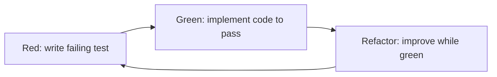

# Chapter 13 — Software Testing in the Age of Coding Agents

**Andreas Maier, Sally Zeitler, and Aline Sindel**
Friedrich-Alexander-Universität Erlangen-Nürnberg (FAU)

## Abstract

Software testing remains the central quality-control mechanism of software engineering, regardless of whether code is written manually or generated with coding agents. We follow a structured sequence from foundations to operational practice and integrate both conceptual foundations and detailed practical explanations. We introduce the goals of testing, clarify the distinction between errors, faults, and failures, and explain verification and validation as complementary quality activities. We then develop the three major testing stages: development testing, release testing, and user testing. Within development testing, we detail unit, component, and system testing, including partition-based case design, guideline-based heuristics, interface error classes, and practical use of mock objects in application programming interface (API)-heavy systems. We also present test-driven development (TDD) as an incremental engineering workflow and discuss when it is effective and where it is limited. Release testing is explained through requirements-based, scenario-based, and performance-focused strategies, while user testing is structured through alpha, beta, and acceptance testing. The final section provides five exercises with an actionable instruction-and-example format to support transfer into practical projects.

## Why Software Testing Is Still Necessary

Software testing serves two fundamental goals that appear simple but are difficult in practice: it should show that software behaves as intended for its stakeholders, and it should reveal defects before deployment. From a technical point of view, this logic applies equally to human-written and AI-generated code. Coding agents can increase development speed, but they do not eliminate uncertainty about correctness, interoperability, security, or robustness. Both humans and AI systems make mistakes and may misunderstand requirements or hallucinate functionality that does not actually exist. In fact, faster implementation cycles usually increase the need for disciplined testing because a team can introduce changes more frequently, and changes accumulate risk if not validated at each stage.

A central consequence is that testing must be integrated into engineering decisions rather than treated as a final gate. This includes deciding what confidence level is needed for a release, how defects are prioritized, and which parts of the system require stronger evidence. In safety-critical or high-impact systems, confidence thresholds are much higher than in exploratory prototypes. In competitive product markets, however, teams often balance testing depth against release timing and business constraints. Testing is essentially the state-of-the-art technique to ensure that software is evolving in the right direction, even when development uses advanced tools.

## Conceptual Foundations

### From Human Error to Observable Failure

Testing discussions are clearer when terminology is precise. We distinguish between *error*, *fault*, and *failure*, each operating at a different layer of the engineering pipeline [Schatten 2010]. An error is a human action that introduces an incorrect result during engineering work, such as misunderstanding a requirement, making a typing mistake, or implementing invalid logic. An error reflects on process quality: a well-designed process with proper reviews and quality gates should have caught the mistake before it propagated into the delivered product. A fault is the defect embedded in the software artifact itself: the buggy code, the incorrect data structure, the wrong algorithm. Faults affect product quality because they represent deficiencies in what was built. A failure is the externally visible deviation from expected behavior at runtime. A failure might manifest as a system crash, unexpected output, security breach, or performance degradation. Failures affect the quality of use, because they are what users and customers actually experience [Schatten 2010]. Figure 13.1 illustrates this chain.

This chain matters because prevention and detection measures operate at different points in the pipeline. Inspections of requirements and design artifacts can catch errors before code is written, and code reviews can catch faults before they reach production. Configuration management and version control may prevent some faults from entering production. Runtime testing is needed to expose failures under concrete execution conditions where components interact and real data flows through the system.

**Figure 13.1.** Error, fault, and failure as connected but distinct quality concepts, shown as a left-to-right chain. An *error* is a human mistake during engineering work (reflecting process quality); it can produce a *fault*, a defect embedded in the software artifact itself (reflecting product quality); a fault can in turn cause a *failure*, an externally visible runtime deviation that users observe (reflecting quality of use). Prevention measures act at different points along this chain. Adapted from Schatten, Demolsky, Winkler, et al. [Schatten 2010].

### Validation, Verification, and the Limits of Testing

We also separate validation and verification in the standard way [Sommerville 2016; Metzner 2020]. Validation asks whether the product addresses the right problem and meets stakeholder expectations. Verification asks whether the implementation satisfies the specified requirements correctly. In practical testing, these questions overlap continuously: a system can pass a technically correct implementation check and still fail user expectations if requirements are incomplete or wrong. Validation testing checks whether the system performs correctly using test cases that reflect real or realistic usage. Defect testing deliberately designs test cases to reveal defects, focusing on boundary conditions and error-prone code patterns.

Practical evidence repeatedly highlights a classical insight from Dijkstra (1970): testing can show the presence of defects, but it cannot prove their complete absence [Dijkstra 1970]. This is not a limitation of testing practice; it is a fundamental theorem rooted in the undecidability of the halting problem (see Geek Box "The halting problem"). Testing can therefore only sample behavior, not certify completeness.

> **Geek Box: The halting problem: why complete testing is impossible**
>
> In 1936, Alan Turing proved that no general algorithm can decide whether an arbitrary program will eventually halt (terminate) or run forever [Turing 1936]. This result, known as the *halting problem*, is one of the foundational theorems of computer science and has direct consequences for software testing.
>
> **Proof sketch (by contradiction).** Assume a halting oracle $H(P, x)$ exists that, for any program $P$ and input $x$, returns HALTS if $P(x)$ terminates and LOOPS if it does not. Now construct a new program $D$ that takes a program $P$ as input and does the following:
>
> 1. Call $H(P, P)$ — ask whether $P$ halts when given its own source as input.
> 2. If $H$ returns HALTS, enter an infinite loop.
> 3. If $H$ returns LOOPS, halt immediately.
>
> Now ask: what happens when we run $D(D)$? Both branches lead to a contradiction:
>
> ```mermaid
> flowchart TD
>     start(( )) --> call["Call H(D, D)"]
>     call --> dec{"H(D, D)?"}
>     dec -->|halts| loop["D loops forever"]
>     dec -->|loops| halt["D halts"]
>     loop --> c1["contradicts 'halts'"]
>     halt --> c2["contradicts 'loops'"]
> ```
>
> Since $D$ is a valid program constructible from $H$, the assumption that $H$ exists must be false. No such oracle can exist [Turing 1936; Sipser 2012].
>
> **Consequence for testing.** If we cannot even decide whether a program terminates, we certainly cannot decide whether it is correct for all possible inputs. Any test suite can only cover a finite subset of the input space. A program that passes all tests may still fail on an untested input. This is why Dijkstra's observation — "Program testing can be used to show the presence of bugs, but never to show their absence!" [Dijkstra 1970] — is not pessimism but mathematical fact. Complete verification of arbitrary programs is provably impossible; testing must therefore be guided by risk analysis, partition strategies, and engineering judgment rather than by the hope of exhaustive coverage.

This is one reason why defect prioritization is unavoidable. Teams decide which defects must block release immediately, which can be mitigated through workarounds, and which are deferred to later cycles. Table 13.1 summarizes the five key criteria that guide this decision [Stephens 2015].

**Table 13.1.** Defect prioritization criteria. Each criterion addresses a different dimension of the decision whether to fix, defer, or accept a known defect [Stephens 2015].

| Criterion | Question |
| --- | --- |
| Severity | How painful is the bug for users? How much loss of work, time, money, or resources does it cause? |
| Frequency | How often does the bug occur? Daily and annoying, or very infrequent? |
| Workaround availability | Can users continue working with a temporary solution while a fix is prepared? |
| Difficulty of fix | How hard is the fix? Does it require changes to the core architecture, making the risk unacceptable even if the bug is annoying? |
| Risk of fix | Could fixing the bug cascade to dependent systems that have adapted to the buggy behavior, introducing more failures than it resolves? |

Mature teams also recognize that some bugs may remain in production. Release timing is often driven by deadlines. Sometimes, fixing all severe bugs is possible, but minor bugs remain. Sometimes a bug fix has undesired consequences for dependent systems that have built workarounds into their code. Sometimes it is wiser to wait for a major release. Too many releases annoy users and increase support burden. Good defect management, therefore, requires recording bugs in a traceable way so the organization can commit to fixing them in a planned release cycle rather than ad-hoc patches [Stephens 2015].

## Inspection and Testing Together

Verification and validation include both static activities, such as inspections and reviews, and dynamic activities, such as executable test runs. Inspections are effective for standards conformance, portability concerns, and maintainability issues before runtime integration. In an inspection, teams carefully read the artifacts (requirements, architecture diagrams, code) and check them for correctness. Inspections can be done on incomplete versions of a system because a human reviewer can mentally simulate the missing parts. Dynamic testing is stronger at finding interaction defects that only emerge when program parts execute together, when asynchronous timing creates race conditions, or when real data with unexpected distributions reaches the code. Mature processes combine both approaches because neither can replace the other comprehensively [Sommerville 2016].

The separation is important because some organizations attempt inspections on design and code while skipping dynamic testing, only to find that components that look correct in isolation fail at integration. Conversely, organizations that rely entirely on dynamic testing often miss design problems and compliance issues that would have been caught by structured review.

The testing process itself should begin early in the engineering lifecycle. Test-case design and test-data preparation are often started during requirements engineering, not only after implementation. During requirements work, teams can identify which requirements are testable and which are vague. During architecture work, teams can sketch out black-box test scenarios. Execution follows implementation milestones, but comparison between expected and observed outcomes should be traceable and documented from the beginning [Sommerville 2016; Metzner 2020]. Figure 13.2 shows this staged process.

**Figure 13.2.** The software testing process with early test design and documented evaluation, shown as a staged flow. Test design begins during requirements and architecture work; test data is prepared once implementation starts; tests are then executed on the code; finally, expected and actual results are compared and reported. If failures are found, results feed back into implementation, so execution and comparison happen iteratively. Adapted from Sommerville [Sommerville 2016].

Inspections are particularly important when an organization uses AI-assisted development. An AI system can generate code that looks syntactically correct and compiles successfully, but may miss subtle requirements or introduce architectural problems. Code review and design inspection with human expertise remain essential gatekeeping activities.

## Stages of Software Testing

Commercial systems usually pass through three major testing stages: development testing, release testing, and user testing [Sommerville 2016]. Development testing is performed close to implementation work and focuses on defect discovery and local correctness. Teams execute unit tests, component tests, and system tests as modules come online. Release testing evaluates whether a full candidate release satisfies requirements for delivery to customers. Release testing is often performed by an independent validation team rather than the development team, providing a fresh perspective. User testing observes behavior in real or realistic usage contexts and often reveals issues in usability, operational robustness, and environment-specific performance that internal teams did not fully anticipate.

This stage structure is especially relevant in AI-assisted development because high generation speed can blur boundaries between coding and quality assurance. Practical evidence argues for preserving these boundaries conceptually even when tooling integrates them operationally. A developer using a coding agent can execute unit tests against generated code immediately. That is good practice and does not replace the need for integration testing and release testing by independent teams.

### Unit Testing and Automation Structure

Unit testing addresses individual program units, functions, classes, or small modules. Typical unit tests call a method with controlled inputs and assert that outputs and state transitions match expectations. A unit test focuses on a single piece of functionality in isolation, independent of other components. Automated unit tests usually follow a three-part flow: setup (prepare the test environment and inputs), invocation (call the code under test), and assertion (check that the outcome matches expectations) [Sommerville 2016; Metzner 2020]. This pattern is directly compatible with AI-supported workflows because coding agents can generate candidate tests rapidly based on code specifications, but human review is still needed to ensure that assertions reflect true requirements rather than superficial behavior matching.

Practical evidence adds an operational detail that is increasingly important in contemporary systems: external dependencies, especially paid API calls, should not be exercised blindly in every test run. When a system depends on external services, mocking becomes essential. Mock objects have identical interfaces to real components but simulate their behavior using pre-configured responses. A test can verify that the code correctly handles a successful response, a timeout, an error response, or malformed data. All of this can be tested without making real calls. This enables robust coverage of rare failure paths that are difficult to trigger reliably in live integrations.

**Figure 13.3.** Partition testing maps input classes to expected output classes and error reactions. On the left, the space of possible inputs is divided into equivalence partitions (valid and invalid input classes); these flow through a central *System* box to the right, where the space of possible outputs is likewise partitioned into correct outputs and exceptions. Each partition is tested with representative values, and boundary values between partitions are particularly important test cases. Adapted from Sommerville [Sommerville 2016].

Mock objects are particularly important when external dependencies are slow, expensive, or hard to trigger in error mode. Consider a system that calls a language model API to generate summaries. Every test run should not charge the account. Instead, mock the API: run it once, store the response in a test fixture, and use that fixture in all subsequent tests. Also, a payment-processing system that calls a banking API cannot run test transactions against a live banking interface. This would transfer real money — an obvious no-go. Test infrastructure must mock the banking interface so tests run without financial side effects. Similarly, if a system calls a machine-learning inference service, mocking allows testing of error-handling paths (timeout, out-of-memory, malformed input) without actually overloading the service. This is a best practice for any system that integrates expensive or unreliable external resources.

Effective unit-test selection has two targets: demonstrating expected behavior under normal conditions and revealing faults under abnormal or boundary conditions. We present partition testing and guideline-based testing as complementary strategies [Sommerville 2016]. Partition testing divides the input space into equivalence classes: groups of inputs that should be handled identically. The test designer identifies key partitions, selects representative values from each partition, and includes boundary values where behavior transitions from one partition to another. Guideline-based testing uses known programmer error patterns to choose cases that are historically defect-prone. Figure 13.3 visualizes this mapping from input partitions through the system to output partitions.

For example, suppose a function accepts a numeric input `x` representing an array index and should return the element at that position. The valid range might be 0 to 999. Input partitions would be: `x < 0` (invalid), `0 <= x <= 999` (valid), `x > 999` (invalid). Within the valid partition, boundary values are important: 0 (first element), 999 (last element), and perhaps a midpoint like 500. The test plan should include tests for negative indices, boundary values, out-of-range indices, and normal cases. It should also test whether the function properly raises exceptions for invalid inputs rather than crashing or returning garbage. This selective sampling approach, illustrated with concrete boundary values in Figure 13.4, is far more practical than exhaustive testing while still catching common defects.

**Figure 13.4.** Boundary and representative values for numeric partition testing. Three partitions are shown side by side as boxes — $x < 0$ (invalid), $0 \le x \le 999$ (valid), and $x > 999$ (invalid) — with representative test values marked above each. Boundary values (such as 0, 1, 999, 1000) often reveal off-by-one errors and transition bugs, while an interior value (such as 500) confirms that normal behavior works throughout the valid partition. Adapted from Sommerville [Sommerville 2016].

Guideline-based testing broadens this approach by using error-prone structures as a heuristic. For sequences and arrays, typical recommendations include testing single-element cases, variable collection sizes (empty, one element, large), and first/middle/last index behavior. For string handling, test empty strings, single characters, strings at maximum buffer length, and strings with special characters. For loops, test whether they execute zero times, once, and multiple times. In practice, these heuristics complement formal partitions and improve defect yield in routine code. They encode patterns that experienced developers have learned from past bugs. When combined with partition testing, guidelines ensure coverage of both normal and abnormal paths.

### Component Testing and Interface Risks

Component testing integrates previously unit-tested units and verifies whether component interfaces behave according to specification. This is where interface contracts become central because many defects arise not from local algorithm errors but from mismatched assumptions between caller and callee. A component typically consists of multiple units (classes, modules, functions) that work together. Component testing checks that their interactions are correct, as shown in Figure 13.5.

**Figure 13.5.** Component testing focuses on interface behavior across interacting units. Three units — A, B, and C — interact within a component boundary drawn as a rounded rectangle: unit A calls units B and C, and B and C also call each other. Outside the boundary, a test driver interacts with the component interface. Tests verify that the interfaces between units work correctly and that the external component interface behaves as specified. Adapted from Sommerville [Sommerville 2016].

We distinguish parameter interfaces, shared-memory interfaces, procedural interfaces, and message-passing interfaces [Sommerville 2016]. Parameter interfaces are the most common: a function call with arguments and return values. Shared-memory interfaces occur when multiple components access the same data structure (a file, shared heap, network buffer). Procedural interfaces involve method calls on objects. Message-passing interfaces occur in distributed systems where components send and receive messages asynchronously.

Associated interface defects typically fall into three classes. Interface misuse occurs when a caller uses an interface incorrectly, for instance, by passing arguments in the wrong order, the wrong type, or the wrong number. If documentation is unclear or code lacks type safety, misuse can happen easily. Interface misunderstanding occurs when a caller assumes semantics that were never guaranteed, such as assuming a binary search works on unsorted input, or assuming that a method call is thread-safe when it is not. Timing errors occur when asynchronous or concurrent access sequences violate temporal assumptions, especially in real-time and distributed systems. If component A expects to receive data from component B before sending a result, but the timing changes due to system load or network delay, the protocol breaks.

Component testing should therefore include tests for misuse (what happens if I pass null pointers, wrong types, or extreme values?), misunderstanding (what happens if I call operations in unexpected orders, or assume thread safety?), and timing (what happens if messages arrive out of order, or are delayed significantly?). These tests verify that the interface contract is enforced, that documentation is accurate, and that failure modes are handled gracefully.

### System Testing and Practical Scope Selection

System testing evaluates the behavior of the integrated system as a whole, including interactions among custom modules, reused components, and external services. Use-case-driven testing is common because use cases force realistic interaction paths and make cross-component effects visible. A use case describes a sequence of actions that a user performs to achieve a goal. System testing walks through use cases end-to-end, verifying that all components cooperate correctly to deliver the promised functionality.

Exhaustive execution coverage is impossible for non-trivial systems. A modern web application might have millions of possible execution paths. A real-time system might behave differently depending on the timing of external events. System testing, therefore, requires pragmatic scope selection: teams select representative subsets based on risk policies, previous incidents, and expected usage patterns [Sommerville 2016]. High-risk use cases (payment processing, security-critical actions, data deletion) deserve thorough testing. Common use cases deserve coverage. Edge cases and error recovery deserve testing, but may be sampled rather than exhaustive.

This pragmatic selection principle is critical for AI-assisted projects. Naive test explosion (generating test cases for every possible combination of inputs and states) can consume budget without improving confidence proportionally. A better strategy is to test systematically: cover high-risk paths thoroughly, cover normal paths representatively, and defer low-risk edge cases unless they expose architectural flaws.

## Test-Driven Development

Test-driven development (TDD) interleaves test creation and implementation in small increments: write a failing test for the next behavior, implement the minimal change required to pass, then refactor while keeping tests green [Sommerville 2016]. Each increment should take minutes to hours, not days or weeks, giving developers and agents rapid feedback through a tight write-test, implement, refactor cycle. Figure 13.6 shows this iterative cycle.

In an agentic workflow, TDD becomes a software process that the agent itself can follow autonomously. The developer encodes the red-green-refactor cycle as a skill or markdown-based instruction set (see Chapter 11): write a failing test for the next specified behavior, implement the minimal code to make it pass, run the test suite, and refactor while keeping all tests green. The agent executes this loop independently, iterating until the tests pass before moving to the next increment. A human review gate at defined checkpoints — after a module is complete, or after a fixed number of cycles — provides the quality oversight without requiring the developer to supervise every step. This approach keeps the agent on track: it cannot claim completion until the test passes. Testing becomes the control mechanism for the coding process, and the TDD cycle itself becomes the SOP that governs agent behavior.

**Figure 13.6.** The iterative cycle of test-driven development, shown as a repeating three-phase loop. In the *red* phase, a failing test is written for the next behavior; in the *green* phase, the minimal code needed to pass the test is implemented; in the *refactor* phase, the code is improved while keeping the test passing. The cycle then repeats. Only small changes are made per cycle, so tests provide continuous, rapid feedback and keep development focused on specified behavior rather than over-engineering. Adapted from Sommerville [Sommerville 2016].



Advantages of TDD are substantial. First, it clarifies implementation intent. The test is a specification: it says exactly what the code should do. This reduces ambiguity and misunderstanding. Second, tests function as executable documentation. A new team member reading the test suite learns how the code is expected to be used and what behavior is guaranteed. Third, regression safety is built in. Every time the codebase is modified, all tests are run. New changes that break old functionality are caught immediately rather than discovered late in integration testing. Fourth, debugging is faster and more localized. When a test fails, the change that caused the failure is recent and small, so finding the bug is easier. Fifth, code quality tends to improve. Writing testable code forces developers (and agents) to write modular code with clear interfaces, reducing coupling and improving maintainability.

Limitations remain important. TDD is less straightforward for large legacy modules with weak isolation boundaries. If a module depends on many other modules in complicated ways, writing isolated unit tests becomes difficult. Mock objects can help, but mocking a large subsystem is expensive. TDD can become challenging in highly concurrent systems where nondeterministic timing behavior complicates stable assertions. A test might pass on one run and fail on the next due to race conditions that are hard to reproduce. In these cases, property-based testing or simulation-based testing may be more practical than traditional TDD. For AI-assisted development, TDD is especially valuable because it forces the agent to validate each feature against an objective specification. However, writing good tests requires domain knowledge and thought. If tests are poorly specified, the agent will reliably implement the wrong thing, and the test will pass and hide the error.

## Release Testing

Release testing evaluates a concrete release candidate from a customer-facing perspective, typically by a team independent of feature development. Its objective is validation: confirming that the delivered system is suitable for intended use and aligned with contractual or product requirements [Sommerville 2016]. Because release testing focuses on externally visible behavior, it commonly uses black-box methods derived from system specifications rather than implementation internals. The release team does not need access to source code or architecture diagrams; they work from the system specification and user documentation.

Requirements-based testing translates each requirement into one or more executable tests and maintains traceability between requirements and test evidence. If the specification says the system should authenticate users and deny invalid passwords, a test will attempt login with invalid credentials and verify rejection. If the specification says reports should be delivered within 5 seconds, a test will measure report generation time under specified conditions. Traceability ensures that every requirement has at least one test, and every test is linked back to a requirement. This is essential for certified systems and security-critical software, where regulators may demand evidence that each requirement was verified.

> **Geek Box: When your own users are the DDoS: self-inflicted denial of service**
>
> Some of the most dramatic system failures in recent history were not caused by malicious attackers, but by legitimate users arriving in numbers the system was never tested for. The COVID-19 pandemic produced a cascade of such incidents that collectively demonstrate what happens when performance testing is skipped or scoped too narrowly.
>
> **Healthcare.gov (October 2013).** The launch of the US health insurance marketplace expected 50,000–60,000 concurrent users. It received 250,000 within two hours [HealthcareGov 2013]. Only six people successfully enrolled on day one. The site had not been load-tested at scale before launch, and the failure catalyzed the creation of the US Digital Service.
>
> **Mebis, Bavaria (March 2020).** When Bavaria closed all schools and directed 1.6 million pupils to the online learning platform Mebis, the system collapsed on the first morning [Heise 2020]. Officials claimed a DDoS attack from "hundreds of thousands of automated requests from outside Germany." Anonymous insiders repeated this claim on Reddit — but the accounts were later deleted, and independent verification was never published. Whether the outage was caused by a malicious actor, a student prank, or simply 1.6 million pupils logging in at 8:00 a.m. on the same Monday remains unclear. As Emil du Bois-Reymond might have put it: *ignoramus et ignorabimus* — we do not know, and we shall not know.
>
> **US unemployment systems (March 2020).** When pandemic lockdowns triggered mass layoffs, state unemployment websites across the US crashed simultaneously [NBC 2020]. Weekly claims jumped from 281,000 to over 2.25 million in a single week. Many state systems ran on decades-old infrastructure designed for a fraction of that load. States resorted to rationing access by last-name alphabetical scheduling — a workaround that no requirements document had ever anticipated.
>
> **NHS vaccine booking (2021).** The UK's NHS vaccine booking website crashed repeatedly — when over-45s became eligible (April), when over-25s were added (June), and during the Omicron booster surge (December), each time because more than 100,000 users arrived simultaneously [NHS 2021].
>
> The pattern is consistent: systems that were never stress-tested at realistic peak loads failed under their own intended user base. In each case, the "attack" was simply the public doing exactly what the system was built for — just more of them at once than anyone had tested. Performance testing at realistic and worst-case load levels is not optional; it is the difference between a system that serves its users and one that denies them service.

Scenario testing combines multiple requirements into realistic usage stories so that interoperability and workflow-level behavior can be evaluated. A scenario might describe a customer registering, browsing products, adding items to a cart, checking out, and receiving a confirmation email. This end-to-end workflow is more realistic than isolated requirement tests and often reveals problems that single-requirement tests miss. For instance, if registration creates a user record in one database and the shopping cart system reads from a different database that is not yet synchronized, an isolated registration test might pass, but the scenario test would fail.

Performance testing examines whether throughput, latency, and stability targets are satisfied under intended and stress conditions. Throughput tests measure how much work the system can do per unit time (e.g., transactions per second, page loads per hour). Latency tests measure how long a single operation takes (e.g., time to respond to a query). Stability tests run the system at the intended load for extended periods (e.g., hours or days) to ensure it does not degrade or crash. Stress testing pushes the system beyond specified limits to find breaking points. If the specification calls for 1000 requests per second, stress testing might push 2000 or 5000 requests per second to see where the system degrades, and crucially, to verify that degradation is graceful (slow response) rather than catastrophic (crash or data loss).

Performance testing is important and often neglected. Many production failures have occurred when systems deployed to thousands of users exhibited behaviors not seen in smaller testing environments. If testing only reached 100 concurrent users but production reached 100,000, bottlenecks appear that were invisible in testing. Denial-of-service attacks are sometimes reported that are actually unprepared systems breaking under their own intended load — a pattern that became painfully visible during the COVID-19 pandemic (see Geek Box "When your own users are the DDoS").

With AI agents, release-level quality checks can now also be defined as markdown instructions that the agent executes autonomously — assessing criteria that traditionally required human judgment, such as cross-reference completeness, accessibility compliance, or layout quality (see Geek Box "Markdown-driven quality gates").

> **Geek Box: Markdown-driven quality gates: when agents run the production checklist**
>
> A key insight from agentic software engineering is that quality criteria, which used to require human inspection, can now be expressed as structured markdown instructions that an AI agent executes autonomously. The agent reads the checklist, runs the specified checks, collects all findings, and presents them for human review — combining the thoroughness of automated scanning with the judgment-level assessments previously exclusive to human reviewers.
>
> **Example: a production checklist for book chapters.** This book uses a markdown-based production checklist that an AI coding agent runs before each chapter is finalized. A condensed excerpt:
>
> ```
>   # Production Checklist for Chapter Review
>   The agent should: 1. Detect all problems first.
>   2. Present a PASS/FAIL table. 3. Ask the user
>   which to fix. 4. Apply only selected fixes.
>
>   ## Checks to Run
>   ### Cross-References
>   - All figures/tables/geek boxes referenced in text.
>   ### Accessibility
>   - All figures have descriptive alt-text.
>   ### Layout
>   - No "Float too large" or overfull hbox warnings.
>   ### Acronyms
>   - No duplicate acronym expansions.
> ```
>
> Several of these checks — alt-text quality, duplicate acronym detection, caption descriptiveness — require understanding the *meaning* of text, not just its syntax. An AI agent can evaluate whether alt-text actually describes what a figure shows or whether a manually spelled-out acronym conflicts with a `\gls{}` expansion nearby. These are assessments no simple script can perform reliably.
>
> **The detect-then-ask workflow.** The checklist specifies a four-step process: detect all issues, present a PASS/FAIL summary, ask the user which fixes to apply, and then execute only approved changes. This separation of detection from correction mirrors the role-separation principle from Chapter 12: the agent that finds problems should not unilaterally fix them. The human decides which findings are genuine issues and which are acceptable.
>
> This pattern generalizes beyond book production. Any domain with explicit quality criteria — code review checklists, regulatory compliance, accessibility audits, documentation reviews — can be encoded as markdown and executed by an agent. The quality gate becomes a reusable, version-controlled artifact rather than tacit knowledge in a reviewer's head.

## User Testing and Acceptance Decisions

User testing brings the software into practical usage contexts where environmental conditions, workflows, and operator expectations influence observed quality. Features that work in a lab might break in production due to network variations, resource constraints, or user behaviors the developers never anticipated. We distinguish alpha testing with a small and closely supported user group, beta testing with broader pre-release exposure, and acceptance testing where the customer decides whether delivery conditions are satisfied [Sommerville 2016; Stephens 2015].

Alpha testing involves a small number of selected users, often from the customer organization or trusted external partners. The goal is early feedback from real users to catch usability problems and unforeseen bugs before wider release. Alpha testers should be willing to report problems and give detailed feedback. Alpha testing often happens on prototype or near-final software, and early rounds may be rough. In the gaming industry, alpha tests might be released to selected streamers or gaming communities who will play extensively and report issues. The expectation is that alpha testers will find many bugs; rough edges are acceptable. The feedback drives priorities for final polish.

Beta testing expands to a larger user group, often thousands of users, before general release. Beta testers are volunteers or users in a specific geographic region or organization. Unlike alpha testing, beta testing is more structured: explicit test plans, bug reporting processes, and formal triage. Beta testers are not expected to tolerate as many problems as alpha testers, so beta typically begins after alpha issues have been addressed. Beta also serves as a stress test: sudden exposure to thousands of concurrent users often reveals bottlenecks and resource issues that small-scale testing never found. The video game industry has pioneered some of the most ambitious alpha and beta testing programs in software history, turning pre-release testing into both an engineering practice and a business model (see Geek Box "Alpha and beta testing in the game industry").

> **Geek Box: Alpha and beta testing in the game industry**
>
> The video game industry has pushed alpha and beta testing to a scale unmatched in most other software domains, and in doing so has turned pre-release testing into a revenue-generating business model [Lin 2018].
>
> **Minecraft (2009–2011).** Markus "Notch" Persson released Minecraft as a public alpha in May 2009. Players could buy access for €9.95 and received every future update. By October 2010, over 500,000 of 1.6 million registered players had purchased alpha licenses. The beta phase (December 2010) raised the price to €14.95. Before the official release in November 2011, the game had accumulated over 4 million purchases and \$33 million in revenue — all from pre-release testers who simultaneously funded development and stress-tested the game at scale [Minecraft 2025].
>
> **World of Warcraft (2004–2005).** Blizzard ran a structured beta starting in March 2004, inviting external testers and media to play the game before its November 2004 launch. The beta uncovered scalability and balance issues that shaped the final release. After launch, an unintended experiment occurred: the *Corrupted Blood incident* (September 2005), where a contagious debuff escaped a raid dungeon and spread uncontrollably across servers, killing low-level characters and creating virtual panic. Epidemiologists Lofgren and Fefferman studied the incident and published in *The Lancet Infectious Diseases*, arguing that player behavior during the outbreak — curiosity-driven exposure, altruistic healing attempts, deliberate spreading — mirrored real pandemic dynamics in ways that mathematical models fail to capture [Lofgren 2007].
>
> **The early access model.** An empirical study of 1,182 early access games on Steam found that user involvement during pre-release phases generally improves user satisfaction, but also that developer–player communication is difficult, and player groups often have conflicting priorities [Lin 2018]. The lesson for software engineering is that large-scale beta testing generates invaluable real-world feedback, but requires explicit processes for triaging, prioritizing, and communicating about the defects that testers surface.

Acceptance testing focuses on whether the delivered system meets contractual acceptance criteria. In custom software development, the customer defines acceptance criteria in the contract: response-time targets, number of concurrent users, specific features, performance metrics, and so on. The acceptance test plan is developed before implementation, so both customer and developer agree on how success will be measured. When the release candidate is ready, acceptance testing begins. Test execution occurs in the target environment when possible (real network, real data, real hardware). When failures appear, test-result negotiation determines whether remediation is required before acceptance. Sometimes the negotiation reveals that acceptance criteria were impossible or misunderstood; in these cases, conditional acceptance (accepting the system with known limitations) might be justified. Sometimes the failures are so serious that rejection and rework are necessary. This negotiation is often where technical evidence, business constraints, and risk tolerance must be reconciled transparently. Figure 13.7 shows this structured process from criteria definition to the accept-or-reject decision [Sommerville 2016].

**Figure 13.7.** The acceptance testing process from criteria definition to accept-or-reject decision, shown as six sequential steps: (1) define acceptance criteria (customer and developer agree on measurable criteria), (2) plan testing (allocate resources, schedule), (3) derive test cases (from requirements and acceptance criteria), (4) execute testing (run tests in the target environment), (5) negotiate results (discuss failures and remediation options), and (6) make the decision (accept, accept conditionally, or reject). The figure emphasizes that acceptance testing is a structured negotiation process, not just a pass/fail gate, which reduces disputes and aligns both parties on delivery expectations. Adapted from Sommerville [Sommerville 2016].

## Integrated Perspective

Across all sections, the core message is not that AI changes the definition of software testing, but that AI changes the velocity and therefore the need for explicit quality strategy. Rapid generation without staged testing can produce superficially complete but operationally weak systems. Structured testing with clear goals, documented evidence, and user-centered acceptance criteria remains the most reliable way to build trust in delivered software. Contemporary practice reinforces this model with continuous integration (CI) pipelines and platform tooling [GitHub Actions 2026; Python 2026; pytest 2026]. The foundational principles — testing can show the presence of defects but not their absence, testing must be layered from unit to user level, and testing must be integrated into development rather than bolted on at the end — remain true whether developers are human or machines. Still, it's never too late to start testing. A concrete example of how a vibe coded project can be retrofitted with automated testing and CI is shown in the Geek Box "From zero tests to CI".

> **Geek Box: From zero tests to CI: the DVD database example**
>
> The DVD database from Chapter 1 was built with a single prompt and shipped without any tests. To add automated quality assurance, we gave a coding agent a one-line instruction:
>
> > *"Write unit tests for this DVD database website and set up GitHub Actions CI. Test JSON data integrity, search/filter logic, and edge cases. All tests should pass."*
>
> The agent analyzed the codebase — a static HTML/JS application with a `dvds.json` data file — and produced a test plan before writing any code. It chose Jest with jsdom for DOM integration testing and created four test files:
>
> `data.test.js` — Validates that `dvds.json` is well-formed: every entry has required fields (`id`, `title`, `genre`, `shelf_position`), years are plausible, IDs are unique, and the JSON data matches `dvds.js`.
>
> `filter.test.js` — Re-implements the search and filter logic and tests it against the real dataset: empty queries return all DVDs, substring matching is case-insensitive, genre and year filters combine correctly.
>
> `escapeHtml.test.js` — Verifies XSS protection: ampersands, angle brackets, quotes, and combined special characters are all escaped correctly.
>
> `integration.test.js` — Loads the actual HTML pages into jsdom, injects the data, executes the application JavaScript, and verifies that DOM elements render correctly, search filters update the display, and detail pages show the right DVD.
>
> The accompanying figure shows the test plan generated by the coding agent before implementation.
>
> The agent also created a GitHub Actions workflow (`.github/workflows/test.yml`) that triggers on every push and pull request to the main branch. The workflow checks out the code, installs Node.js and dependencies, and runs `npm test`. If any test fails, the commit is flagged red and cannot be merged. This means every future change to the DVD database — whether by a human or another agent — is automatically validated against the full test suite before it reaches the main branch.
>
> The full test suite is publicly available at <https://github.com/akmaier/dvd_database/tree/main/tests>.

A practical irony appears in the recurring "it worked before" style narratives: systems often fail not because teams ignored testing entirely, but because they tested the wrong assumptions. The takeaway is to design tests around risk hypotheses and state transitions, not only around nominal happy paths.

## Exercises

These exercises ask you to design, execute, and evaluate testing strategies using the techniques and principles discussed in this chapter.

**Exercise Problem 1:** Define a defect-prioritization policy for a product team that ships monthly releases. Specify severity levels, workaround rules, and release-blocking criteria so that bug triage is reproducible and transparent. The goal is to make prioritization decisions consistent and documented, so different team members (and AI agents doing triage work) follow the same criteria.

*Instruction.* Build a policy table with these columns: (1) defect category (e.g., security vulnerability, data loss, minor UI glitch), (2) severity level (critical, major, minor), (3) workaround availability (yes/no/possible), (4) release-blocking rule (blocks release / can defer to next cycle), (5) timeline for fix (immediate/within two weeks/quarterly). Include logic for how to combine criteria. For example: *"security vulnerabilities are always critical and block release immediately; hotfix is deployed within 24 hours regardless of release cycle. Data-loss risks are critical but can be conditional-acceptance if a workaround is documented. Minor UI issues are always deferred to the next scheduled release."*

*Example task:* Design a policy where security vulnerabilities require hotfixes within 24 hours, customer-facing data-loss risks block the scheduled release if not fixed, database schema changes are red-flagged for architectural review before fix attempt, and cosmetic bugs are deferred to the next cycle. Create a two-week example timeline showing which bugs from a hypothetical list get fixed in the current release and which are deferred.

**Exercise Problem 2:** Build a unit-testing strategy for a service that depends on an external paid API. Explain when to use real calls and when to use mock objects, including budget and determinism considerations. The goal is to balance test coverage and regression safety against testing costs.

*Instruction.* Identify the types of test cases (success case, timeout error, rate-limit error, malformed response, network error) and for each case, decide: (a) should this be tested with real API calls or with mocks? (b) if mock, what response data should the mock return? (c) if real, how often (every run, nightly, weekly)? Document the rationale. For instance, *"the success case is mocked: we call the real API once during development, store the response in a fixture, and use that in all unit tests. Timeout and rate-limit errors are mocked: we cannot easily trigger these on real API without consuming budget. A nightly smoke test uses the real API to verify that the API contract has not changed."*

*Example task:* Create a test plan for a language-model integration where each API call costs money. Specify (a) which test cases use mocks with captured responses, (b) which use mocks with constructed error responses, (c) a limited nightly integration test that calls the real API once to verify the latest model behavior, and (d) how to update the captured responses when the API changes. Show a concrete example: a mock that returns a 2-second timeout, and a test that verifies your code handles the timeout by retrying.

**Exercise Problem 3:** Starting from a set of requirements and usage scenarios, create a release-testing package that maps each high-priority requirement to executable tests and then combine them into realistic user stories with measurable pass criteria. The goal is to ensure systematic verification that the system meets specification.

*Instruction.* Start with a set of functional and non-functional requirements (e.g., "users can log in with email and password within 2 seconds," "the system supports 1000 concurrent users without errors"). For each requirement, write one or more test cases that verify it. Create a traceability matrix linking each requirement ID to test case IDs. Then, construct scenario-based tests that combine multiple requirements into end-to-end workflows. Document pass criteria (e.g., "test passes if login completes in under 2 seconds on 90% of attempts").

*Example task:* For an e-commerce checkout flow, specify requirements: (a) user can add items to cart, (b) user can view cart within 1 second, (c) payment processing completes in under 10 seconds for valid cards, (d) payment fails gracefully for invalid cards, (e) inventory is decremented after successful payment. Write test cases for each: TC-001 (add item to cart), TC-002 (list cart items and verify response time under 1 second), TC-003 (process valid card and verify success within 10 seconds), TC-004 (attempt invalid card and verify error message without charging), TC-005 (verify inventory database decremented after TC-003). Create a scenario test that exercises TC-001, TC-002, TC-003, and TC-005 in sequence, checking that the system state is consistent throughout.

**Exercise Problem 4:** Design two markdown-based process documents: one for a reviewer performing a peer review of a conference paper, and one for a meta-reviewer who aggregates and adjudicates multiple reviews. The goal is to make the quality criteria explicit enough that an AI agent can prepare a structured quality assessment, while recognizing that final judgment remains a human-in-the-loop task.

*Instruction.* For the *reviewer process*, define a markdown checklist that covers the key quality gates of a scientific paper: novelty (does the paper present a genuinely new contribution?), reproducibility (are methods, data, and code described in sufficient detail?), completeness of the state-of-the-art discussion (are the relevant prior works cited and compared?), methodological soundness (are experiments well-designed and conclusions supported by evidence?), and clarity of presentation. For each criterion, specify what the AI agent should check automatically (e.g., search for related work and verify whether key references are cited) and what requires human judgment (e.g., whether the claimed novelty is genuine). For the *meta-reviewer process*, define how individual reviews are aggregated: how are conflicting assessments resolved? What constitutes a consensus? When should the meta-reviewer request an additional review?

*Example task:* Write a reviewer markdown process for a machine-learning conference. The process should instruct the agent to: (a) extract the paper's claimed contributions, (b) search for related work and list relevant papers not cited by the authors, (c) check whether the experimental section specifies datasets, metrics, and baselines, (d) flag any reproducibility gaps (missing hyperparameters, unavailable code or data), (e) present a structured summary with PASS/WARN/FAIL for each quality gate, including links to the corresponding literature for ease of human verification. Then write a meta-reviewer process that takes three such reviews as input and produces a recommendation (accept, revise, reject) with justification. Note that while the agent can prepare the evidence and flag potential issues, the final accept/reject decision requires human expertise — this is a human-in-the-loop quality process where the AI handles the systematic checks and the human provides the scientific judgment.

## Bibliography

- [Dijkstra 1970] Dijkstra, E. W. *Notes on Structured Programming.* In *Structured Programming*, Academic Press, 1972. (Originally circulated as EWD 249, 1970.)
- [GitHub Actions 2026] GitHub, Inc. *Building and testing Python.* 2026. <https://docs.github.com/en/actions/how-tos/use-cases-and-examples/building-and-testing/building-and-testing-python>
- [HealthcareGov 2013] *The Failed Launch of www.HealthCare.gov.* Harvard Business School Digital Initiative, 2013.
- [Heise 2020] Krempl, S. *Bayerische Lernplattform Mebis von DDoS-Angriffen lahmgelegt.* heise online, March 16, 2020.
- [Lin 2018] Lin, D., Bezemer, C.-P., Hassan, A. E. *An Empirical Study of Early Access Games on the Steam Platform.* Empirical Software Engineering, 23(2):771–799, 2018.
- [Lofgren 2007] Lofgren, E. T., Fefferman, N. H. *The Untapped Potential of Virtual Game Worlds to Shed Light on Real World Epidemics.* The Lancet Infectious Diseases, 7(9):625–629, 2007.
- [Metzner 2020] Metzner, A. *Software Engineering — kompakt.* Carl Hanser Verlag, 2020.
- [Minecraft 2025] Wikipedia contributors. *Minecraft* (sales and development history). 2025.
- [NBC 2020] Burke, M. *Coronavirus: State Unemployment Websites Crash as Applications Surge.* NBC News, March 2020.
- [NHS 2021] Express & Star. *NHS Vaccine Website Crashes After Jabs Offered to Over-45s.* 2021.
- [Python 2026] Python Software Foundation. *unittest — Unit testing framework.* 2026. <https://docs.python.org/3/library/unittest.html>
- [pytest 2026] pytest development team. *pytest Documentation.* 2026. <https://docs.pytest.org/en/stable/>
- [Schatten 2010] Schatten, A., Demolsky, M., Winkler, D., Biffl, S., Gostischa-Franta, E., Östreicher, T. *Best Practice Software-Engineering.* Spektrum Akademischer Verlag, 2010.
- [Sipser 2012] Sipser, M. *Introduction to the Theory of Computation.* 3rd ed., Cengage Learning, 2012.
- [Sommerville 2016] Sommerville, I. *Software Engineering.* Pearson, 2016.
- [Stephens 2015] Stephens, R. *Beginning Software Engineering.* Wrox/Wiley, 2015.
- [Turing 1936] Turing, A. M. *On Computable Numbers, with an Application to the Entscheidungsproblem.* Proceedings of the London Mathematical Society, s2-42(1):230–265, 1936/1937.

## Source

This chapter is derived from the *Vibe Coding* book (Maier et al., Springer, CC BY, <https://link.springer.com/book/9783032399069>), chapter source `vhb_vibe_coding/VIBE_13_SoftwareTesting/chapter.tex`. It is part of the VHB course *Vibe Coding*: <https://www.studon.fau.de/studon/ilias.php?baseClass=ilrepositorygui&ref_id=6720901>
