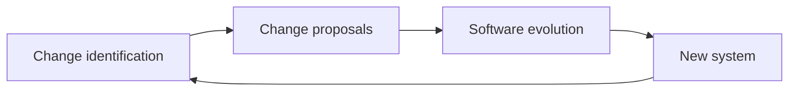
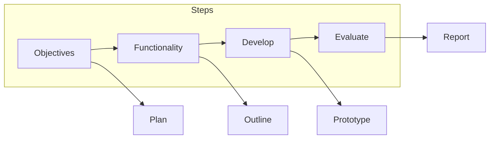

# Chapter 14 — Software Evolution and Maintenance in AI-Assisted Engineering

**Andreas Maier, Sally Zeitler, Aline Sindel, Changhun Kim, and Siming Bayer**
Friedrich-Alexander-Universität Erlangen-Nürnberg (FAU)

## Abstract

Software delivery does not end at release. Once a system is in productive use, changing business requirements, evolving platforms, user expectations, and emerging defects continuously create new change demands. This chapter presents software evolution as a structured engineering process rather than ad hoc patching. It covers the release spiral and lifecycle phases (evolution, servicing, retirement), change identification and impact analysis, change implementation across team transitions, and prototyping with incremental delivery. The chapter examines software maintenance as distinct from development, explores cost dynamics and organizational incentive misalignment, and discusses reengineering versus continuous refactoring. Throughout, the discussion addresses how AI-assisted development accelerates documentation, reverse engineering, and code transformation while underscoring that architectural discipline, test coverage, and accountability remain essential. The overarching message: evolution is not a postscript to development but the dominant lifecycle mode, and sustainable speed depends on treating evolution as a managed system from day one.

## Why Software Evolution Is Unavoidable

Large software systems typically have surprisingly long lifespans, and their economic value depends on how well they can adapt over time. The key insight is that evolution pressure does not come from a single source or occur in isolated incidents. Rather, software systems face continuous and overlapping pressure from multiple directions: business processes change as organizations respond to markets and competition, user expectations shift as they gain experience and demand improvements, platform dependencies move forward through operating-system updates and hardware evolution, and the state-of-the-art redefines what is considered acceptable quality in architecture, security, and performance. A system that does not evolve may still compile and function, but it gradually loses operational relevance and eventually becomes impossible to maintain safely.

The practical evidence illustrates this timescale vividly. The table below lists examples from enterprise systems, productivity software, and online games—all of which have been in continuous evolution for decades. The SABRE airline reservation system was released in the 1960s and remains in operational use six decades later. The IRS Master File, also from 1962, still handles critical US financial data. Microsoft Word has moved through text-only interfaces, graphical UIs, and cloud-based delivery since 1983. Online games provide equally striking examples: Ultima Online (1997), EverQuest (1999), EVE Online (2003), and World of Warcraft (2004) have all been continuously updated for over two decades, evolving through platform migrations, engine rewrites, and fundamental gameplay changes. Even newer titles like Minecraft (2009) and Fortnite (2017) have already undergone major architectural evolution. These examples span multiple generations of computing paradigms, yet the systems persisted because teams continuously evolved them rather than letting them fossilize. The important engineering takeaway is that "finished software" is usually only a temporary release state, not a destination.

**Table 14.1.** Long-lived software systems that demonstrate continuous evolution. Each has survived multiple platform generations through sustained engineering investment.

| System | Since | Evolution highlights |
| --- | --- | --- |
| SABRE | 1960s | Mainframe to distributed; still powers airline reservations |
| IRS Master File | 1962 | COBOL on tape; modernization ongoing after 60+ years |
| Microsoft Word | 1983 | DOS to Windows to cloud; desktop to mobile to web |
| Tibia | 1997 | 2D massively multiplayer online role-playing game (MMORPG); continuous updates for 28+ years |
| Ultima Online | 1997 | Pioneered MMO genre; still running with regular content |
| EverQuest | 1999 | 30+ expansions; engine and graphics upgraded repeatedly |
| EVE Online | 2003 | Single-shard server architecture evolved over 20+ years |
| World of Warcraft | 2004 | 10 major expansions; graphics engine fully rebuilt |
| Minecraft | 2009 | Alpha to full release; Java to Bedrock engine rewrite |
| Fortnite | 2017 | PvE to Battle Royale pivot; Unreal Engine upgrades |

Evolution pressure arises from business changes as organizations enter new markets or shift existing operations, from user expectations as customers demand better performance and richer features, from hardware and software platform evolution as processor architectures, operating systems, and deployment models advance, and from changes in best practices as the discipline recognizes new quality standards. To keep a software product out in the market and relevant, teams must track these changes deliberately and plan updates that address them. Software evolution is therefore not optional; it is the inevitable and normal state of long-lived software.

**Figure 14.1.** Software evolution as a recurring release spiral. Four phases are arranged around an expanding spiral—Specification, Implementation, Validation, and Operation—and three iterations are marked along it as Release 1, Release 2, and Release 3. Each complete loop represents one release cycle, and rather than ending after a single release the spiral continues and expands outward, indicating that subsequent releases absorb lessons learned and adapt to changed requirements. The visual metaphor captures the sense that software systems evolve continuously over their lifetime. Adapted from [Sommerville 2016].

The spiral model shown in Figure 14.1 captures this idea effectively. Development does not proceed linearly from specification through implementation, validation, and operation once. Instead, once a system reaches operation and is used by customers, lessons learned and environmental changes immediately create the basis for the next release. The same four phases repeat: new requirements are specified, implementation incorporates changes, validation ensures correctness, and the system goes back into operation. The spiral expands outward, symbolizing that the system typically grows in functionality, complexity, and scale with each iteration.

## Evolution, Servicing, and Retirement

A useful and practical lifecycle distinction separates three phases: active evolution, servicing, and eventually retirement. Understanding this distinction helps teams plan long-term maintenance strategy and allocate resources appropriately.

During the evolution phase, systems still absorb meaningful requirement changes and feature enhancements. The product is actively improved in response to user feedback, business expansion, competitive pressure, or technological improvements. Evolution is the normal state for systems in active competitive markets and for products that retain strategic importance to the organization. This is the expensive phase in terms of development effort, but it typically generates revenue through new capabilities and improved customer satisfaction. The long-lived online games in Table 14.1 illustrate this model clearly: virtually all of them sustain continuous evolution through recurring revenue—whether via monthly subscriptions (World of Warcraft, EVE Online, EverQuest), microtransactions and in-game purchases (Fortnite, Minecraft), or hybrid models combining both. This constant revenue stream finances the ongoing development that keeps these systems alive and competitive for decades.

During the servicing phase, only limited and economically justifiable updates are implemented. The focus shifts away from new functionality toward defect correction and compatibility preservation. A system in servicing might receive security patches, adaptations to new operating-system versions, or critical bug fixes, but planned enhancement work largely stops. This phase reflects a transition: the product is still valuable and worth maintaining, but the organization has determined that new development costs exceed the revenue generated by new features. Servicing is less expensive than evolution because the scope is narrow, but it still requires team attention and infrastructure support.

Eventually, a system reaches retirement when maintaining it no longer provides sufficient value relative to replacement cost or when the organization decides to reallocate resources to newer alternatives. At this point, support phases out. Users are encouraged to migrate to newer systems, and patches become increasingly sparse or unavailable. The organization may offer extended support for a fee during transition, but the default trajectory is decommissioning.

Practical evidence connects this model to real operating-system lifecycles. Microsoft Windows 10, released in 2015, entered mainstream support that ended on October 14, 2025. Following the end of mainstream support, extended support continued through September 30, 2026, but with reduced update frequency. After extended support ends, the system enters retirement, and users who do not upgrade face increasing security risks [Microsoft Support 2025] [Microsoft Learn Lifecycle 2025]. This is a concrete case of planned transition from active evolution through mainstream and extended servicing toward controlled end-of-life handling. Enterprise customers sometimes negotiate extended support periods, but the default path is eventual retirement. Figure 14.2 summarizes these four phases.

**Figure 14.2.** The typical long-term software lifecycle progresses through four phases arranged left to right on a time axis: development (initial creation and first release), evolution (active enhancement and feature development), servicing (limited maintenance focused on defect fixes and compatibility), and retirement (wind-down and end of support). The boxes decrease in height from left to right, suggesting the typical decrease in organizational investment intensity as a system progresses through its lifecycle. Adapted from [Sommerville 2016].

Understanding these phases has important economic implications. If a software company sells a product to customers at a single point in time and implicitly commits to servicing it indefinitely, the long-term cost can become prohibitive. This is one reason that the Software-as-a-Service (SaaS) business model has become prevalent. With SaaS, customers pay a subscription rather than a one-time license fee, which means the service provider has continuous revenue as long as customers remain active. This revenue stream makes it economically feasible to invest in ongoing evolution, security updates, and compatibility maintenance. When someone uses the software, immediate return on investment flows to the provider through subscription fees, which directly offset the cost of development, operations, and evolution. In contrast, a traditional perpetual license model can create misaligned incentives: customers expect unlimited free support, while the vendor faces eroding margins as the customer base stabilizes.

## Evolution Processes and Change Identification

Software evolution starts with explicit change proposals. These proposals originate from multiple sources: requirement updates based on business strategy or user requests, bug reports from production systems, platform adaptation needs driven by dependency changes (such as new operating-system versions), or strategic product improvements identified through competitive analysis or internal innovation. The key point is that change itself is not the difficult part. The difficult part is disciplined filtering of which changes should be accepted now, deferred to a future release, or rejected as too costly or misaligned with strategy. Without this filtering, teams tend to accept changes that sound straightforward in user language but require disproportionate backend restructuring to implement safely. Figure 14.3 shows this continuous feedback cycle.

That filtering requires a structured change-identification process with concrete engineering outputs. For each change proposal, the team must identify which components are impacted, estimate implementation cost, assess the expected effect on the system and its users, and understand release compatibility constraints. If a requested feature appears easy but actually requires rewriting a core subsystem, that cost must be visible upfront. Similarly, if a platform dependency changes (for example, a new iOS version enforces runtime permission checks), the change may be mandatory even if it does not provide direct user value, because without it the application will no longer work on the target platform.

**Figure 14.3.** The software evolution cycle as a continuous feedback loop. Change identification recognizes new requirements and opportunities. Accepted change proposals enter the evolution process, which produces a new system release. That release operates in the field, generates observations, and feeds back into the next change identification cycle. This framing applies equally to plan-driven and agile development environments. Adapted from [Sommerville 2016].

A generic operational flow follows straightforwardly: a request or observation triggers formal impact analysis, the change team decides whether to accept the change (and when), accepted changes enter release planning where they are combined with other accepted work items, selected items are then implemented according to the development process in use, and the resulting release generates observations in operation that feed into the next cycle. This framing applies cleanly to both plan-driven methodologies with fixed release schedules and agile environments with rapid iteration. In either case, the key discipline is the change-analysis step itself: understanding what will break, what will cost, and what value will return before committing implementation effort.

## Change Implementation and Organizational Context

Practical experience highlights a critical distinction that strongly affects implementation cost and risk. When the team that developed a system also implements changes to it, implementation is often a natural continuation of existing context: developers understand the architecture, remember design decisions, and can modify code with confidence. However, if a different team takes over the system—because developers have moved on, the system was outsourced, or the original vendor was replaced—then a program-understanding phase becomes mandatory before safe modifications are possible. The new team must reverse-engineer the architecture, read code to understand control flow and data structures, learn the test suite, and gradually build mental models of how the system behaves. This is not a minor cost; it can add weeks to what appears to be a simple change.

This situation is particularly common in enterprise software development. A department contracts with an external vendor to develop custom software. The vendor delivers the system, and the relationship ends. Years later, when the department needs to adapt the system to new business processes, the original vendor may be unavailable, or budget constraints require internal staff to take over maintenance. Those internal staff now face a legacy-system challenge: they must understand code written by people who have left, with documentation that may be incomplete or outdated, and dependencies that may include obsolete libraries. AI assistants can accelerate this onboarding by generating code maps, documenting architecture, and summarizing complex control logic, but they do not remove the need for human architectural judgment and careful testing. An AI can help a new team understand the existing system, but it cannot replace the discipline of reading tests, validating assumptions, and building confidence before deploying changes.

This handoff problem also affects continuity. If documentation is sparse or inconsistent, new teams may inherit fragmented understanding of requirements and design decisions. That fragmentation can lead to accidental inconsistencies during evolution: a change that seems harmless might violate an implicit architectural constraint, or a feature addition might not account for existing edge cases that the old team never explicitly documented. Smooth transitions therefore require deliberate knowledge transfer and up-to-date documentation from the original development effort.

Emergency changes add another layer of complexity. Severe faults, urgent security issues, unexpected platform changes, or sudden competitive pressure can force rapid fixes outside normal release rhythm. These emergency repairs are often necessary—a security vulnerability cannot wait for the next planned release cycle—but they tend to degrade consistency between requirements, design, documentation, and code if not followed by consolidation work. In a crisis, teams might patch code without updating design documents, apply quick fixes without comprehensive test coverage, or defer refactoring in favor of speed. These shortcuts are sometimes unavoidable, but they accumulate technical debt that must be repaid later through dedicated maintenance effort.

## Change Management with Prototyping and Incremental Delivery

The second part of evolution strategy reframes change management as a learning process. Prototyping is not a way to build the final product rapidly; it is an instrument for discovering what stakeholders actually need before teams commit to full-scale implementation. A prototype demonstrates concepts, helps the user explore the problem space, and supports cost-risk reduction by validating assumptions early.

In vibe coding contexts, prototyping is particularly important because it addresses a fundamental question: what does an LLM-assisted system actually need to do? Developers and stakeholders often have different mental models of what success looks like. A prototype—even a rough, incomplete one—makes those differences concrete and discussable. Users can interact with actual integrated behavior, rather than reading specifications, and they typically discover that they want something different from what they originally described. This discovery is a feature, not a bug: it is exactly what prototyping is designed to enable. The cost of learning through a prototype is far lower than the cost of building a complete system that does not meet actual needs.

The prototyping workflow is structured in phases. First, teams establish objectives by asking what the prototype should demonstrate and which decisions it is meant to inform. Next, they define the functionality: which features should the prototype include, and which can be omitted? Then they develop and execute a prototype, which may be a slice of real code or a simulation depending on the uncertainty. Finally, they evaluate the prototype by gathering user feedback and assessing whether the original questions have been answered. Each of these phases produces concrete outputs: a prototype plan, an outline of required functionality, an executable prototype, and an evaluation report. This structure, shown in Figure 14.4, prevents prototyping from devolving into aimless exploration.

**Figure 14.4.** Prototyping as a structured change-management workflow. Four sequential steps—Objectives, Functionality, Develop, and Evaluate—each produce a corresponding output: a Plan, an Outline, a Prototype, and a Report. Input objectives feed planning activities; functionality definition creates an outline of the prototype scope; development produces an executable prototype; and evaluation generates a formal report. This structure ensures that prototyping remains focused and produces actionable insights rather than generic "lessons learned". Adapted from [Sommerville 2016].

Incremental delivery complements prototyping by shipping usable portions of the real system rather than throwaway demonstrations. Instead of building a prototype, throwing it away, and starting the real implementation from scratch, incremental delivery uses each prototype iteration as a stepping stone toward the final product. Stakeholders receive value earlier, experience the system through actual integrated behavior, and provide feedback in a technically grounded form rather than in abstract discussions of specifications. Users gain experience with the system and can refine their requirements based on actual usage, not imagination. This learning loop has powerful effects: it improves requirement quality, reduces misunderstandings, and often results in lower total cost and higher user satisfaction.

However, important constraints can reduce the speed benefits of rapid increments. Strict contractual environments may require formal change orders before requirements can shift. Regulated domains such as medical devices or aerospace enforce certification processes that do not tolerate informal experimentation. Highly coupled legacy dependencies might make it difficult to release frequent increments without destabilizing the surrounding system. In these contexts, incremental delivery is possible but requires more upfront planning, formal approval gates, and integration verification than greenfield agile development. The core learning loop remains valuable even under constraints; the rhythm of delivery simply becomes longer.

## Software Maintenance: Types and Cost Dynamics

Maintenance aims to sustain a system's service capability after deployment. According to the IEEE Standard for Software Maintenance [IEEE 2022]:

> "Software maintenance is the **modification** of a software product after delivery to **correct** faults, to **improve** performance or other attributes, or to **adapt** the product to a modified environment."

In practice, maintenance requests often combine corrective work (fixing defects), environmental adaptation (adjusting to new platforms or dependencies), and functional extension (adding new features) rather than fitting cleanly into a single category. This blend is one reason maintenance planning is difficult: each request has different risk profiles, implementation costs, and business justifications even when stakeholders phrase them similarly.

Maintenance is typically more expensive than development of equivalent features in a greenfield project. If a team had known about a desired feature when designing the original system, they would likely have chosen an architecture that supports it naturally. For example, if the original requirement was unknown, they might not have anticipated the need for a plug-in architecture, multi-tenant support, or geographic distribution. Adding those capabilities retroactively often requires restructuring core subsystems. The team must first understand the existing code, identify the sections that will be affected, plan the changes carefully to preserve functionality, implement the modifications, and validate that nothing broke. All of this is substantially more effort than would have been required if the feature had been part of the original design.

Cost pressure in maintenance is not only technical. Teams must understand inherited codebases that may be decades old, align changes with existing operational constraints such as deployment schedules or monitoring infrastructure, and often correct architecture debt introduced by short-term delivery incentives in earlier development phases. The knowledge workers who designed the system may no longer be available; their expertise is embedded in code and perhaps captured in sparse documentation. This knowledge transfer burden falls on the maintenance team.

> **Geek Box: Star Citizen: the most expensive case of feature creep in history**
>
> The long-lived games in Table 14.1 demonstrate successful continuous evolution. Star Citizen [Wikipedia 2026a] demonstrates what happens when evolution runs ahead of delivery.
>
> **The project.** In 2012, game designer Chris Roberts launched a crowdfunding campaign for Star Citizen, a space simulation promising a persistent online universe with realistic physics, seamless planetary landings, and a single-player campaign called Squadron 42. The original Kickstarter target was US$2 million, with a suggested release around 2014.
>
> **The scope expansion.** As funding exceeded every expectation, the project's scope expanded with it. Stretch goals added star systems, alien languages, motion-captured storylines, and ship interiors with simulated physics grids. Squadron 42, originally a tutorial-like introduction, grew into a standalone AAA game with its own studio. Each funding milestone unlocked new features, creating a self-reinforcing cycle: more money enabled more ambition, which attracted more backers, which funded more ambition. By 2026, total crowdfunding had passed US$900 million—approaching a billion dollars—making it the most expensive video game development in history, exceeding the combined budgets of GTA V, Cyberpunk 2077, and Red Dead Redemption 2.
>
> **The engineering lesson.** After more than 13 years of development, Star Citizen remains in alpha. Key modules were delayed repeatedly: Arena Commander slipped six months (2013–2014), Star Marine was delayed over a year (2015–2016), and major Persistent Universe updates routinely missed targets by 12+ months. The pattern is a textbook illustration of unconstrained feature creep: each individually reasonable addition—better physics, more star systems, deeper simulation—compounds into architectural debt that delays everything else. Without stable baselines, change control, and the willingness to freeze scope for a release, even nearly unlimited funding cannot produce a finished product. The first five star systems planned for the 1.0 release represent a scope that itself is a dramatic reduction from the hundreds of systems originally promised [Wikipedia 2026a]. The contrast between the game's extraordinary funding and its incomplete delivery state makes Star Citizen the most vivid modern example of why evolution must be paired with release discipline.

A recurring business tension also affects maintenance investment. Managers are often rewarded for short-term delivery metrics: shipping features on time, hitting quarterly targets, and generating revenue. Long-term maintainability benefits are harder to quantify on quarterly horizons: the value of good architecture might not be apparent for two or three years, while the cost of achieving it is immediate. As a result, many organizations systematically underinvest in maintainability unless governance mechanisms make long-term quality visible through explicit metrics and accountability. When maintenance falls to a separate team than development, developers have little incentive to write maintainable code because they will not bear the cost of the decisions they make. When the same team develops and later maintains the code, the incentive alignment is better, but deadline pressure can still push short-term tactics. This structural challenge exists across most software organizations and is not easily resolved by process alone. Such feature creep carries risks even before a first release, as the Geek Box above illustrates with the most expensive example in gaming history.

## Reengineering and Refactoring with AI Support

When maintainability has degraded substantially—due to legacy status, architectural debt, or simply age—reengineering becomes a strategic option. Reengineering aims to improve structure and comprehensibility without intentionally changing core functionality. Typical reengineering activities include reverse-engineering and re-documentation (generating or improving documentation from the existing code), source translation (converting code from one language to another), program-structure improvement (reorganizing code for better readability), modularization (breaking monolithic code into cohesive components), and data reengineering (restructuring databases or data formats). The goal is to make the system more maintainable without replacing it entirely.

Compared with full replacement, reengineering often reduces risk and cost (see the Geek Box below). When an organization decides to rewrite a system from scratch, they accept several risks: the new team might miss edge cases that the old system handled implicitly, specification errors can introduce new defects even as old ones are fixed, and the business might discover too late that they actually need features that the new system does not provide. Reengineering sidesteps some of these risks by starting from working code and improving it. If the existing system runs a critical business process that generates value, preserving that working core while improving its structure is often more practical than rewriting.

> **Geek Box: Remaster or remake? Reengineering versus replacement in the game industry**
>
> The game industry provides some of the clearest examples of the reengineering-versus-replacement trade-off, because both approaches have been applied to the same franchises—and the results are publicly visible.
>
> **Reengineering (remastering/porting).** A remaster preserves the original game logic and content but upgrades the technical foundation. *Mass Effect: Legendary Edition* (2021) reengineered the original trilogy without rebuilding it: BioWare upgraded textures using AI upscaling, improved lighting and performance, and unified the three games under a single launcher—but the gameplay, story, and level design remained the original code [Wikipedia 2025a]. Similarly, *The Elder Scrolls V: Skyrim Special Edition* ported the game from a 32-bit to a 64-bit engine for better stability and enhanced lighting, without changing gameplay mechanics [Wikipedia 2025b]. Remastering is cheaper and faster because it reuses the working core, but it cannot fix fundamental design limitations baked into the original architecture.
>
> **Replacement (remaking/reimagining).** A remake builds an entirely new game inspired by the original. *Resident Evil 2* (2019) did not update the 1998 code—Capcom built a new game from scratch on the Resident Evil Engine, replacing the fixed camera with an over-the-shoulder perspective and reimagining level design, with a team of over 800 developers [Wikipedia 2025c]. *Final Fantasy VII Remake* (2020) replaced the turn-based combat, the engine, and the narrative structure entirely, transforming a 1997 title into a modern action-RPG at an estimated cost of US$130–200 million [Wikipedia 2025d]. Remaking produces a modern product unconstrained by legacy architecture, but carries the risk of losing features, feel, or edge-case behavior that the original handled implicitly.
>
> **The decision.** The choice depends on whether the original architecture can support the target quality. If the core is sound and the goal is modernization, reengineering preserves working logic at lower cost and risk. If the architecture itself is the bottleneck—outdated camera systems, obsolete combat models, or engines that cannot scale—replacement is the only path to a competitive product. The danger is choosing wrong in either direction: remastering a game that needed a remake wastes effort on diminishing returns, while remaking a game that only needed a remaster risks losing what made the original work.

AI agents can support many reengineering activities. They can extract documentation from code using language models, translate code from legacy languages to modern ones, identify and consolidate duplicated code, and guide modularization efforts. However, reliable gains still depend on disciplined test coverage and clear architectural intent. An AI might translate Fortran code to Python automatically, but the resulting code must be validated against the original through regression testing to ensure bit-for-bit equivalence in numerical operations. An AI can suggest refactoring opportunities, but a human architect must validate that the proposed structure aligns with the system's actual design constraints.

Refactoring differs from reengineering in timing and scope. Reengineering is often a concentrated intervention for an aging system, perhaps taking months and involving significant resources. Refactoring is continuous preventive work, applied incrementally as code is modified, to slow structural decay. Typical refactoring targets include duplicated code (consolidating copy-paste programming into reusable functions), oversized methods (splitting long functions into focused helper methods), inappropriate switch-heavy control logic (replacing case statements with polymorphism), repeated data clumps (grouping related data into cohesive objects), and unnecessary speculative abstractions (removing generality that was added but never used). AI agents can support refactoring by identifying these smells and suggesting concrete transformations, but human judgment must guide the process to ensure that changes do not violate architectural invariants or introduce subtle behavioral changes.

A practical conclusion from experience with AI-supported reengineering and refactoring is that AI can lower the entry cost for tasks such as reverse engineering and documentation generation, yet it can also reinforce short-term "quick-fix" behavior if teams optimize only for immediate pass/fail outcomes. An AI that is tasked to "make the tests pass" will do exactly that, but it might introduce technical debt or violate design principles along the way. Sustainable evolution therefore still requires explicit design standards, release governance, and human oversight. The team must decide which refactoring targets are worth pursuing, which architectural constraints matter, and which trade-offs between speed and quality are acceptable.

## Data and Infrastructure Reengineering

A specialized and high-stakes form of reengineering involves data structures and database schemas. Changing the structure of a database is risky because data is typically persistent and valuable: if a schema migration fails or introduces errors, the consequences can corrupt historical records or cause application failures. Unlike code, which can be redeployed and retested, data errors can be difficult or impossible to repair after the fact. Migration of data to a new format is therefore often done automatically but requires extensive testing and validation. Teams must verify that data is mapped correctly, that no records are lost, and that relational integrity is maintained through the transformation. If any errors occur during migration and the system continues to operate on the new (corrupted) schema, reconciliation becomes very expensive.

This is why data reengineering is typically more costly than structural code reengineering. The team must preserve business-critical information and ensure that every record in the database is correctly transformed according to the new schema. Automated transformation tools can help, and AI can assist in designing migration scripts and validation queries, but human oversight is essential. The safest approach is to run the migration on a copy of production data, validate the results thoroughly, maintain a rollback plan, and perform the actual migration during a maintenance window when system usage is minimal.

> **Geek Box: AI for utility infrastructure: from paper archives to agentic grid intelligence**
>
> Water, heating, and electricity networks represent some of the largest and oldest data-reengineering challenges in practice. Infrastructure built over decades exists as a patchwork of paper documents, CAD drawings, GIS databases, and SCADA logs—often with inconsistent formats, missing metadata, and undocumented modifications. AI is now being applied across the full stack, from initial digitization through predictive analytics to natural-language querying.
>
> **Digitization.** In [Ramachandran 2025], a framework is proposed for digitizing water utility documents into structured digital-twin representations. The approach uses document understanding models to extract network topology, pipe specifications, and asset metadata from scanned utility records—converting decades of paper archives into machine-readable graph structures that can drive simulation and planning.
>
> **Power flow prediction.** A physics-informed graph neural network for AC power flow analysis is introduced in [Kim 2026]. The architecture encodes line physics as per-edge attention biases—a known-operator layer inside the computation graph—and applies a backtracking line-search correction at inference to enforce physical consistency. This replaces thousands of Newton–Raphson solves with a single forward pass, enabling real-time scenario analysis for grid operators.
>
> **Demand forecasting.** In [Ramachandran 2024; Ramachandran 2026], attention-based deep learning is applied to heat demand forecasting in district heating systems. Accurate demand prediction enables utilities to optimize production schedules, reduce waste, and integrate renewable sources—a direct application of AI to infrastructure evolution planning.
>
> **Talking to the data: agentic grid intelligence.** GridSense represents the next level: an agentic system that lets operators ask natural-language questions about power grid infrastructure [Kim 2025]. Instead of expecting an LLM to "know" the grid, the system combines a Neo4j graph database with structured orchestration—translating questions into Cypher queries, validating results, and producing evidence-backed summaries. A LangChain-based version reached 31.7% accuracy on 104 semantic questions; a LangGraph-based workflow with explicit quality gates improved this to 71.2%. The lesson: reliability comes from workflow structure, graph-based context, and trusted tools—not from free-form text generation alone.

A frontier application of AI-driven data reengineering is the digitization of entire networks and data archives—water, heating, and electricity—where decades of paper records, heterogeneous databases, and undocumented infrastructure must be transformed into queryable digital twins (see the Geek Box above). Yet, the digitization challenge extends far beyond utility networks. The most ambitious data-reengineering project currently underway aims to digitize not a single infrastructure sector but the entire recorded history of a continent (see the Geek Box below).

> **Geek Box: The European Time Machine: digitizing more than 2000 years of history**
>
> The Time Machine project is a large-scale European research initiative that aims to create a comprehensive digital twin of European history [Time Machine Organisation 2018]. Launched in 2018 as a proposal to the European Commission's FET Flagship programme, it brings together archives, libraries, museums, and research institutions across Europe to digitize, connect, and simulate historical data spanning two millennia—from medieval manuscripts and cadastral maps to city planning records and cultural artifacts.
>
> **The vision.** The core concept is the "Information Mushroom": raw historical sources are digitized at the bottom through processing pipelines that extract structured data using AI—optical character recognition, layout analysis, named entity recognition, and knowledge graph construction. This data flows upward into a simulation layer that can reconstruct past states and project future scenarios. Access platforms on the right side make the results available to researchers, educators, and the public through 4D simulation engines, universal representation engines, and large-scale inference systems [Maier 2022].
>
> **The engineering challenge.** The project faces every data-reengineering problem discussed in this chapter, magnified to continental scale: heterogeneous source formats (handwritten manuscripts, printed books, photographs, 3D scans), multilingual content spanning dozens of historical languages, incomplete and contradictory records, and the need to link entities across centuries and borders. Building blocks include Book CT (non-destructive scanning of fragile bound volumes) and automated art understanding through deep learning [Maier 2022]. The project is ongoing but—unlike Star Citizen—operates on public research funding rather than crowdfunding, making scope discipline a necessity rather than a choice.

## AI and the Maintenance Attitude

An important observation emerges when AI agents are asked to perform maintenance tasks: they tend to prioritize immediate success (tests passing, compilation succeeding, basic functionality working) over long-term maintainability. If an AI is given the instruction "make the tests pass," it will achieve that goal, but the resulting code might be inelegant, might violate design principles, might contain unnecessary duplication, or might add technical debt. This is not because AI is inherently bad at architecture; rather, it is because the specific optimization target (pass the tests) does not include maintainability as an explicit goal.

Humans face the same bias when under deadline pressure, but humans (ideally) have long-term perspective and professional pride that push them toward better solutions. An organization that relies on AI agents for maintenance must therefore build discipline into the workflow: explicit design standards, code review gates that do not accept quick-fix patterns, test coverage requirements, and human oversight of critical changes. The AI is a tool that accelerates execution, not a substitute for architectural judgment. For documentation generation, reverse engineering, and code transformation, AI is genuinely powerful and should be used liberally. But for deciding which changes should be made, how the system should evolve, and what trade-offs are acceptable, human judgment remains essential.

## Conclusion

Software evolution is the normal state of long-lived software systems, not an exception phase that arrives after "real development" is complete. The spiral model captures the reality: successful software alternates repeatedly between periods of operation (where value is generated and lessons are learned) and periods of evolution (where the system is improved in response to those lessons). This cycle repeats throughout a system's lifetime, potentially spanning decades.

Effective teams treat change as a managed system with analysis, prioritization, implementation, and feedback loops. Prototyping and incremental delivery accelerate learning and reduce risk, but only when integrated with discipline around architecture and process governance. Maintenance, reengineering, and refactoring then become complementary mechanisms for preserving value over time: maintenance keeps systems running day-to-day, reengineering improves structure when degradation becomes severe, and refactoring prevents that degradation from accumulating in the first place.

AI-assisted development increases execution speed, yet it does not remove the need for maintainability planning, test-backed change control, and lifecycle thinking. Organizations that embrace AI while abandoning engineering discipline find themselves with systems that are fast to build but expensive to maintain. Those that combine AI acceleration with explicit design standards, comprehensive testing, and architectural accountability achieve the best outcome: rapid delivery of maintainable systems. The fundamental challenge of software engineering remains unchanged by the availability of LLMs: building software that is fast to build, cheap to maintain, and reliable in operation requires structured thinking about trade-offs and discipline to execute those trade-offs consistently.

Practical evidence adds important detail on why evolution pressure is structurally unavoidable in any organization running long-lived software. Requirement drift occurs as business conditions change, new competitors emerge, and customer preferences evolve. Environment changes happen as operating systems update, hardware capabilities advance, and platforms mature. Dependency updates become necessary as libraries move forward and security patches are released. Organizational learning occurs as teams discover better practices, identify architectural patterns that work for their domain, and build expertise. These forces act continuously and independently; even if the organization explicitly decided not to change a system, external forces would eventually force evolution anyway (for example, a critical security vulnerability that must be patched, or an operating-system update that breaks backward compatibility).

This structural inevitability means that evolution is not a postscript to development but the dominant lifecycle mode. Cumulatively, evolution work often exceeds development work in total effort and cost. Teams should therefore design architectures, tests, and release processes for changeability from the very beginning, not retrofit these properties under incident pressure after the system has become fragile. The cost of building for maintainability upfront is typically far lower than the cost of struggling with unmaintainable legacy code years later.

## Exercises

The following exercises apply the software evolution and maintenance concepts from this chapter to realistic long-lived system scenarios.

**Exercise Problem 1.** The DVD database from Chapter 1 is a static client-side website with all data in a JSON file. Evolve it into a more capable system by planning and executing the following changes using AI agents.

*Instruction.* First, plan the evolution: (a) extend the data model to include a video game collection alongside DVDs, with fields such as platform, publisher, and multiplayer support; (b) migrate from pure client-side JavaScript to a client-server architecture with a proper database backend that supports adding, editing, and removing titles through the UI; (c) identify which software process fits each phase—for instance, use a waterfall-style plan for the database schema migration (requirements are clear) and an incremental approach for the UI evolution (requirements will emerge from usage). For each phase, prepare a markdown skill document that an AI coding agent can follow: the markdown should specify inputs, steps, quality gates, and expected outputs. Then hand the markdown instructions to an agent and have it implement the changes.

*Example task:* Phase 1: Write a markdown process for extending `dvds.json` to `media.json` that includes both DVDs and games, with a `type` field and platform-specific attributes. Phase 2: Write a markdown process for setting up a Node.js/Express backend with a SQLite database, migration script from JSON, and REST endpoints for CRUD operations. Phase 3: Write a markdown process for updating the frontend to call the API instead of loading the JSON directly, and adding forms for creating and deleting entries. For each phase, define the tests that must pass before proceeding to the next. Document what the agent produced, where you had to intervene, and what the agent got wrong on the first attempt.

**Exercise Problem 2.** Perform a structured change-identification analysis on the DVD database for mobile-device support and estimate the impact before implementation begins.

*Instruction.* The feature request is: "make the DVD database work well on mobile devices." This sounds simple but may require significant changes. (a) Write a markdown analysis document that lists all affected components (HTML layout, CSS, JavaScript event handling, image sizing), technical dependencies (viewport meta tags, touch events, responsive frameworks), estimated effort, and what could break. (b) Prepare a markdown decision template with accept/defer/reject criteria. (c) Have an AI agent generate the impact report by analyzing the actual DVD database codebase against your template. Compare the agent's analysis with your own assessment.

*Example task:* Write a markdown impact-analysis process that instructs the agent to: scan `index.html` and `detail.html` for fixed-width layouts, identify CSS that assumes desktop viewports, check whether the search and filter controls are touch-friendly, estimate whether a responsive CSS refactor suffices or whether the JavaScript logic needs restructuring for mobile interaction patterns, and flag risks (broken grid layout on small screens, unusable filter dropdowns on touch devices). Present the agent's report alongside your own assessment and document where they diverge.

**Exercise Problem 3.** Compare reengineering and full replacement for an open-source game codebase, using the game-industry framing from the Geek Box "Remaster or remake?".

*Instruction.* Choose one of two open-source game revival projects: *Dune Legacy* (a C++ reimplementation of Dune II, <https://sourceforge.net/p/dunelegacy/code/ci/master/tree/>) or *Abuse* (a side-scrolling action game originally from 1995, already ported to SDL 2, available at <https://github.com/Xenoveritas/abuse>). Clone the repository and prepare two markdown assessment documents: (a) a reengineering assessment that instructs an agent to analyze the existing codebase—evaluate code structure, documentation quality, build system age, platform compatibility, and estimate the effort to modernize (e.g., refactor legacy C code to modern C++, add a modern CMake build, improve test coverage); (b) a replacement assessment that instructs the agent to design the same game from scratch using a modern engine or framework, estimate development effort, and identify gameplay features or edge cases from the original that might be lost. Have the agent execute both assessments and produce a comparison table.

*Example task:* Analyze Dune Legacy. The reengineering markdown should instruct the agent to: scan the source tree for code metrics (lines of code, number of classes, cyclomatic complexity), identify platform-specific dependencies, evaluate whether the rendering pipeline can be ported to modern graphics APIs, and estimate effort to add unit tests for the game logic. The replacement markdown should instruct the agent to: specify Dune II's core mechanics (base building, unit control, resource harvesting, AI opponents) as requirements, propose a modern tech stack (e.g., Godot or SDL 2 with a clean architecture), estimate implementation time, and flag which original behaviors (e.g., the specific AI patterns, the fog-of-war implementation) would be hardest to replicate faithfully. Compare both reports and justify whether this project is a remaster or a remake candidate.

## Bibliography

- [IEEE 2022] ISO/IEC/IEEE International Standard 14764:2022(E). *Software engineering — Software life cycle processes — Maintenance.* 2022.
- [Kim 2025] Kim, C. *GridSense — Asking Power-Grid Questions with an LLM and a Graph Database.* 2025. Video demonstration: <https://www.youtube.com/watch?v=ttD58_8Dpjc>.
- [Kim 2026] Kim, C., Conrad, T., Karim, R., Oelhaf, J., Riebesel, D., Arias-Vergara, T., Maier, A., Jäger, J., Bayer, S. *Physics-informed GNN for Medium-High Voltage AC Power Flow with Edge-Aware Attention and Line Search Correction Operator.* IEEE ICASSP, 2026.
- [Maier 2022] Maier, A. K. *Building Blocks for a Virtual Time Machine: From Book CT to Automated Art Understanding.* Proceedings of the 4th ACM International Workshop on Structuring and Understanding of Multimedia heritAge Contents, 2022.
- [Microsoft Learn Lifecycle 2025] Microsoft Learn Lifecycle. *Windows 10 reaching end of support.* 2025. <https://learn.microsoft.com/en-us/lifecycle/announcements/windows-10-end-of-support>.
- [Microsoft Support 2025] Microsoft Support. *Windows 10 support has ended on October 14, 2025.* 2025. <https://support.microsoft.com/en-us/windows/windows-10-support-ends-on-october-14-2025-2ca8b313-1946-43d3-b55c-2b95b107f281>.
- [Ramachandran 2024] Ramachandran, A., Maier, A., Bayer, S. *Advancing Heat Demand Forecasting with Attention Mechanisms: Opportunities and Challenges.* NeurIPS 2024 Workshop on Tackling Climate Change with Machine Learning, 2024.
- [Ramachandran 2025] Ramachandran, A., Neergaard, T. F. B., Maier, A., Bayer, S. *Digitization Framework of Water Utility Documents for Digital Twins.* CCWI 2025, The University of Sheffield, 2025.
- [Ramachandran 2026] Ramachandran, A., Chatterjee, S., Neergaard, T. F. B., Oberndoerfer, M., Maier, A., Bayer, S. *A deep learning framework for heat demand forecasting using time–frequency representations of decomposed features.* Energy and AI, vol. 24, p. 100704, 2026.
- [Sommerville 2016] Sommerville, I. *Software Engineering.* Pearson, 2016.
- [Time Machine Organisation 2018] Time Machine Organisation. *Time Machine Project Takes Next Step to Reconstructing Europe's History.* 2018. <https://www.timemachine.eu/time-machine-project-takes-next-step-to-reconstructing-europes-history/>.
- [Wikipedia 2025a] Wikipedia contributors. *Mass Effect Legendary Edition.* 2025. <https://en.wikipedia.org/wiki/Mass_Effect_Legendary_Edition>.
- [Wikipedia 2025b] Wikipedia contributors. *The Elder Scrolls V: Skyrim — Special Edition.* 2025. <https://en.wikipedia.org/wiki/The_Elder_Scrolls_V:_Skyrim>.
- [Wikipedia 2025c] Wikipedia contributors. *Resident Evil 2 (2019 video game).* 2025. <https://en.wikipedia.org/wiki/Resident_Evil_2_(2019_video_game)>.
- [Wikipedia 2025d] Wikipedia contributors. *Final Fantasy VII Remake.* 2025. <https://en.wikipedia.org/wiki/Final_Fantasy_VII_Remake>.
- [Wikipedia 2026a] Wikipedia contributors. *Star Citizen.* 2026. <https://en.wikipedia.org/wiki/Star_Citizen>.

## Source

This chapter is derived from the *Vibe Coding* book (Maier et al., Springer, CC BY, <https://link.springer.com/book/9783032399069>), chapter source `vhb_vibe_coding/VIBE_14_SoftwareEvolution/chapter.tex`. It is part of the VHB course *Vibe Coding*: <https://www.studon.fau.de/studon/ilias.php?baseClass=ilrepositorygui&ref_id=6720901>
