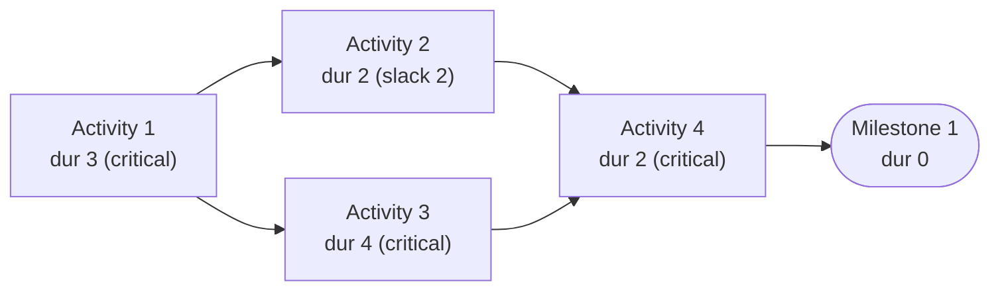
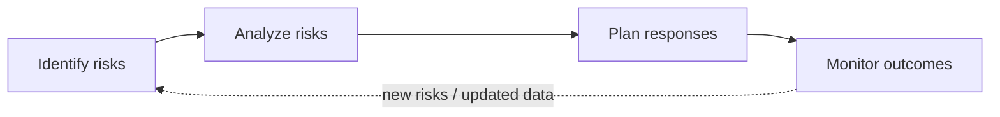

# Chapter 15 — Software Project Management for Vibe Coding

**Andreas Maier¹, Sally Zeitler¹, Aline Sindel¹, and Christian Bergler²**
¹ Friedrich-Alexander-Universität Erlangen-Nürnberg (FAU)
² Ostbayerische Technische Hochschule Amberg-Weiden (OTH-AW)

## Abstract

This chapter walks through software project management for artificial intelligence (AI)-assisted software engineering and vibe coding workflows. It develops the topic from fundamental project-management goals to practical methods for managing time, cost, quality, teams, and risks. It covers project-triangle trade-offs, SMART criteria, scheduling methods such as Program Evaluation and Review Technique (PERT)/activity-on-node (AON) and Gantt charts, the practical limits of algorithmic cost estimation, software quality standards, people management principles, and risk management processes. The guiding argument is that AI can accelerate implementation, but planning, coordination, and governance remain decisive for project success. The chapter closes with practice-oriented exercises that connect project-management methods to realistic software-engineering scenarios.

## Why Project Management Still Matters with AI

Project management in software engineering exists to keep delivery aligned with three hard constraints: scope (what features will we build?), time (when do we need to deliver?), and cost (what resources — people, compute, time — can we afford?). This applies equally to industrial projects with customer contracts and deadlines, to open-source projects with volunteer contributors and long horizons, and to academic work such as bachelor and master theses. In all contexts the operational requirement is identical: deliver meaningful software results within a fixed timeframe and with bounded resources while meeting quality expectations. The details differ: in a thesis context the "customer" may be a supervising professor or an academic peer-review committee, and the "budget" may be primarily allocated person-time (your own effort plus mentoring) rather than direct salary cost to a company. AI tools can accelerate production. A well-configured agent can generate code faster than a human can type, but such tools do not remove planning dependencies, integration bottlenecks, coordination overhead, or risk exposure. In fact, because AI-assisted development can make individual components move quickly, the project-level coordination problems often become more visible, not less.

Project management should therefore be treated as an operational discipline rather than administrative overhead. Good management cannot guarantee success (bad luck, impossible requirements, or hidden technical challenges can still cause failure), but weak management reliably increases failure probability [Sommerville 2016]. This is particularly true in AI-supported projects where local coding speed can hide global coordination debt until late phases, when dependencies collide and integration becomes expensive. A team might produce hundreds of well-written functions through agent assistance but discover too late that the functions do not integrate because the architect did not specify dependencies clearly, or because different components make incompatible assumptions about data format. Even if a project team has only one human contributor (a student writing a thesis), project management still exists implicitly. That contributor must still plan what to build, prioritize which tasks are critical versus nice-to-have, monitor their own progress against the deadline, and handle uncertainty (the main algorithm did not work as expected; the dataset is smaller than anticipated; the deployment environment has different constraints than assumed). Making that planning explicit through timelines, milestones, and contingency plans is what separates reactive scrambling from purposeful work.

## Project Management Fundamentals

**Table 15.1.** Context variables that shape project management style and formality [Sommerville 2016]. Each variable shifts the balance between lightweight and formal processes. A five-person startup and a 50-person enterprise require fundamentally different governance structures even when building similar software.

| Variable | Effect on management |
| --- | --- |
| Company size | Large firms require more governance and formal reporting structures. |
| Customer type | External customers require formal contracts and service-level agreements; internal customers allow lighter processes. |
| Software size | Large systems require more architecture, coordination, and integration planning than small utilities. |
| Organizational culture | Some organizations value speed over documentation; others prioritize correctness and compliance. |
| Process model | Agile approaches distribute planning into short iterations; plan-driven approaches front-load it. |

Software project management is necessary because software artifacts are intangible, progress can be difficult to assess directly, and large projects are often sufficiently unique that prior experience transfers only partially [Sommerville 2016]. Unlike manufacturing, where tangible progress is visible (a car body takes shape part by part), software progress is invisible: someone can spend two weeks coding and produce nothing working, or can spend two days on architecture and produce profound clarity that unlocks weeks of later work. This intangibility makes estimation hard and makes it easy to lose track of whether you are on track. Large projects are often one-off: a software system for a specific organization, with specific requirements, specific technical constraints, and specific team composition. Prior experience with similar projects is valuable but not transferable in detail. What worked for a team building payroll software may not work for a team developing machine-learning pipelines, even if both involve software.

Several context variables materially change management style and formality. Table 15.1 summarizes the most important ones. For example, a five-person startup can often operate with minimal formal process and rely on informal daily stand-ups, while a 50-person software company needs explicit role definitions, change-control procedures, and quality gates or the team will thrash through conflicting priorities.

The core activities are project planning, risk management, people management, reporting, and proposal writing [Sommerville 2016]. Reporting and proposal writing are sometimes dismissed as administrative overhead, but in practice they determine project success or failure. Proposal writing determines whether a project is approved and funded in the first place. A brilliant idea that is not well communicated will not secure resources. Reporting determines whether stakeholders (management, customers, team) can detect schedule and quality drift early enough to react and re-plan, versus discovering problems too late to recover. In AI-enabled work, these activities become more rather than less relevant, because teams often coordinate humans, multiple AI agents running in parallel, external application programming interfaces (APIs) with rate limits and changing specifications, next to infrastructure costs that scale with compute demand. The surface area of coordination expands, making clear communication and explicit planning even more critical.

**Figure 15.1.** The project management triangle: scope, time, and costs as mutually coupled constraints. An inner triangle carries outward-pointing arrows toward the three corners, representing the quality tension that arises when any one dimension is expanded without adjusting the others. Every planning decision must explicitly state which corner is being relaxed and which quality implications are accepted. Adapted from Brandt-Pook and Kollmeier [Brandt-Pook 2020].

The project management triangle in Figure 15.1 should be read as a coupled-constraint model rather than as three independent knobs [Brandt-Pook 2020; Ruhe 2014]. Scope growth without time or cost adjustment pushes quality risk upward. Time compression without scope reduction usually increases defect risk and integration pressure. Cost increases, for example by adding people or compute resources, can reduce schedule pressure but only if on-boarding and dependency structure are manageable. This makes the triangle operational: each planning decision must explicitly state which corner is being relaxed and which quality implications are accepted.

Before any detailed planning begins, the project needs well-defined objectives. The SMART criteria (see Geek Box below) provide a practical framework for turning vague intentions into actionable, trackable goals, applicable to industrial projects, academic theses, and everything in between [Doran 1981].

> **Geek Box: SMART criteria — simple project management for small projects**
>
> The SMART criteria are a widely used framework for defining project objectives that are concrete enough to be tracked and verified. In the original formulation by Doran (1981) [Doran 1981], each letter stands for one quality that a well-formed goal should have:
>
> | Criterion | Meaning |
> | --- | --- |
> | **S**pecific | The goal targets a specific area for improvement and states exactly what will be achieved. |
> | **M**easurable | There is a concrete metric or deliverable to verify completion. |
> | **A**ssignable | The goal has a clear owner: responsibilities and resources can be assigned to specific people or teams. |
> | **R**ealistic | The goal states what results can realistically be achieved given the available resources and constraints. |
> | **T**ime-related | The goal has an explicit time constraint: a deadline or milestone date by which the result must be delivered. |
>
> **Example: a Master thesis project.** Consider a six-month Master thesis on medical image segmentation. A vague goal would be: "Implement a segmentation algorithm and evaluate it." Applying SMART transforms this into concrete milestones:
>
> **S:** Implement a U-Net-based segmentation model for late gadolinium-enhanced (LGE) cardiac MRI that segments left-atrial scars using the global benchmark dataset from Xiong et al. [Xiong 2021].
>
> **M:** Achieve a Dice score $\geq 0.75$ on the benchmark test set; produce a reproducible training script with documented hyperparameters. The benchmark reports top-performing methods at Dice scores of $0.70$–$0.80$ for scar segmentation, providing a concrete comparison baseline.
>
> **A:** The thesis candidate is the sole owner of model development and evaluation; the supervisor is assigned to bi-weekly progress review and thesis guidance; a lab GPU is reserved for training throughout the thesis period.
>
> **R:** The LGE-CMR dataset is publicly available with 154 scans from multiple centers; the model fits on a single GPU; the benchmark establishes that a Dice score of $0.75$ is challenging but achievable within the thesis time budget.
>
> **T:** Literature review complete by week 4; baseline model trained by week 10; final evaluation and thesis draft by week 22.
>
> This structure works equally well for industrial projects (replace "Dice score" with a KPI, "thesis draft" with a deliverable) and for AI-assisted workflows (the SMART milestones become quality gates that an agent can check automatically). The key insight is that SMART goals make progress objectively assessable, for the student, the supervisor, and any coding agent involved.

## Time Management and Scheduling Structures

Time management starts with decomposition into tasks, dependency analysis, and assignment planning. The objective is to determine which work can run in parallel and which must remain sequential. This logic is represented using activity-on-arrow (AOA) (also called PERT) and activity-on-node (AON) planning models [Metzner 2020; Stephens 2015]. Dependency structure is the decisive element for total duration. Even when many tasks can be parallelized, the longest dependency path still defines the minimum feasible project duration.

Planning should include resource assumptions, not only task names. If an activity requires scarce graphics processing unit (GPU) infrastructure or domain-specific personnel, schedule realism depends on actual availability windows. In university settings, institutional compute infrastructure can be a decisive leverage point for realistic planning when experiments are compute-intensive.

**Figure 15.2.** Activity-on-arrow (AOA) representation for milestone-based project sequencing [Metzner 2020]. Milestones (M1–M5) appear as nodes; tasks with their durations are directed edges between milestones. The longest path through the network determines the minimum project duration (the critical path). Parallel edges indicate tasks that can execute concurrently if resources permit. Adapted from Wikimedia Commons (<https://upload.wikimedia.org/wikipedia/commons/3/37/Pert_chart_colored.svg>).

**Figure 15.3.** Activity-on-node (AON) representation for schedule analysis and critical-path reasoning. Activities appear as nodes annotated with duration, start, and end times; dependency edges show sequencing constraints. Darker nodes mark critical activities (zero slack), which must complete on time or the whole project is delayed; lighter nodes (positive slack) have scheduling flexibility. A milestone node (zero duration) at the bottom represents a gate that all paths must reach. Adapted from Metzner [Metzner 2020].

The AOA diagram in Figure 15.2 visualizes milestones as nodes and activities as edges. Its operational reading is path-based: the minimum project duration is constrained by the longest dependency path between start and end milestones. The AON diagram in Figure 15.3 flips this perspective by representing activities as nodes and dependencies as edges, which is often easier for assigning owners, durations, and tracking states. Worked examples make this concrete by contrasting shorter and longer paths and showing why the longest path defines the earliest possible completion even when all non-dependent tasks are parallelized.

Different dependency semantics, including finish-to-start, start-to-start, finish-to-finish, and start-to-finish relations, matter when translating conceptual plans into tooling because they change which overlaps are allowed and where blocking constraints occur.

The detailed AON method uses four timing values per activity to identify scheduling flexibility and critical activities. The *Early Start* (ES) is the earliest an activity can begin, given all predecessors. The *Early Finish* (EF) follows as $\text{EF} = \text{ES} + \text{Duration}$. These are computed in a *forward pass* from the project start. The *Late Finish* (LF) is the latest an activity can end without delaying the project, and the *Late Start* (LS) follows as $\text{LS} = \text{LF} - \text{Duration}$. These are computed in a *backward pass* from the project end. The difference $\text{Slack} = \text{LF} - \text{EF} = \text{LS} - \text{ES}$ measures how much an activity can slip without affecting the deadline. Activities with zero slack form the *critical path*. Any delay on them delays the entire project. Figure 15.4 shows the standard six-field layout for recording these values per activity.

**Figure 15.4.** Detailed activity node showing the six fields used in critical-path computation. The top row contains ES (Early Start), Duration, and LS (Late Start). The bottom row contains EF (Early Finish), Slack ($= \text{LF} - \text{EF} = \text{LS} - \text{ES}$), and LF (Late Finish). ES and EF are computed in a forward pass through the network; LS and LF in a backward pass. Zero slack identifies critical-path activities. Adapted from Metzner [Metzner 2020].

Table 15.2 applies this computation to the AON network in Figure 15.3. The forward pass sets $\text{ES}_{A1} = 1$ and propagates earliest times through the dependencies. The backward pass starts from the project end ($\text{LF}_{M1} = 10$) and propagates latest times back. Activity 2 has slack of 2 (it can slip two days without affecting the milestone), while Activities 1, 3, and 4 have zero slack and form the critical path $\text{A1} \to \text{A3} \to \text{A4} \to \text{M1}$.

**Table 15.2.** Critical-path computation for the AON network in Figure 15.3. The critical path (zero slack) runs through Activities 1, 3, 4, and the milestone. Activity 2 has two days of slack and can absorb delays without affecting the project end date.

| Activity | Duration | ES | EF | LS | LF | Slack | Critical? |
| --- | --- | --- | --- | --- | --- | --- | --- |
| Activity 1 | 3 | 1 | 4 | 1 | 4 | 0 | yes |
| Activity 2 | 2 | 4 | 6 | 6 | 8 | 2 | no |
| Activity 3 | 4 | 4 | 8 | 4 | 8 | 0 | yes |
| Activity 4 | 2 | 8 | 10 | 8 | 10 | 0 | yes |
| Milestone 1 | 0 | 10 | 10 | 10 | 10 | 0 | yes |

**Figure 15.5.** Gantt chart for timeline communication and resource coordination. Tasks appear as horizontal bars whose length represents duration; a diamond marks a milestone (a zero-duration gate). Dependency arrows show sequencing constraints. Gantt charts are especially useful for communicating schedules across technical and managerial audiences because task overlap and resource conflicts are immediately visible. Adapted from the pgfgantt documentation [Esser-Skala 2024]. The schedule below mirrors the critical-path example of Table 15.2.

```mermaid
gantt
    title Example schedule (critical path A1 -> A3 -> A4)
    dateFormat X
    axisFormat %s
    section Plan
    Activity 1 (critical) :crit, a1, 0, 3
    Activity 2 (slack 2)  :a2, after a1, 2
    Activity 3 (critical) :crit, a3, after a1, 4
    Activity 4 (critical) :crit, a4, after a3, 2
    Milestone 1           :milestone, m1, after a4, 0
```

Gantt charts, named after Henry Gantt, an American mechanical engineer who popularized this bar-chart format around 1910 to visualize industrial production schedules, complement network-style planning by showing tasks as time bars and milestones as diamonds on a calendar axis. Figure 15.5 should be interpreted as a calendar-anchored resource view. Bar lengths represent durations, milestone diamonds mark gating events, and task overlap immediately reveals potential staffing conflicts. This makes Gantt charts particularly valuable for detecting scheduling and resource conflicts early: if two tasks assigned to the same person overlap on the timeline, the conflict is visible at a glance, something that is much harder to spot in a network diagram. Gantt charts are also a standard component of virtually all grant submissions in academia, where funding agencies expect a visual timeline showing work packages, deliverables, and milestones across the project duration. Whether for a DFG proposal, an EU Horizon project, or an NSF grant, the Gantt chart is the universal language for communicating "who does what, when".

## Cost Management and Estimation Uncertainty

Cost management covers planning, estimation, budgeting, and control. Typical cost categories include effort cost (salaries, organizational overhead), infrastructure and software cost (licenses, compute resources), in addition to travel or training overhead [Sommerville 2016; Ruhe 2014]. In academic projects, cost often maps directly to allocated time, available personnel, and access to compute clusters, while in industrial settings organizational overhead and role-specific cost rates complicate estimation further.

The practical reality is that cost estimation is probabilistic. The output is never a single deterministic number but rather a distribution of plausible outcomes with confidence bounds. Several estimation families are useful in practice: experience-based interval estimates (person-months with low/high bounds based on similar projects), three-point estimates with best/most-likely/worst values that align with critical-path scheduling, and top-down decomposition into smaller work packages where individual tasks are easier to estimate than the whole.

In academic contexts, a common starting point is to estimate total person-months from task duration and staffing, then add costs for licenses and compute resources based on prior experience or institutional regulations. In this framework, cost planning is often much easier because research projects may have clear goals, but they virtually never have to deliver a final software product to be shipped to a customer. As such these projects often mitigate shortcomings with respect to cost and time with compromises with respect to project scope (cf. Figure 15.1).

> **Geek Box: COCOMO and COCOMO II — when precision hides uncertainty**
>
> The Constructive Cost Model is one of the most widely cited algorithmic estimation frameworks [Boehm 1981; Boehm 2000]. Two major versions exist:
>
> **COCOMO (1981).** Boehm's original model defines three modes with increasing complexity [Boehm 1981]:
>
> $$\begin{aligned}
> \text{Basic:}\quad E &= a \cdot (\text{KLOC})^b, \quad T = c \cdot E^d \\
> \text{Intermediate:}\quad E &= a \cdot (\text{KLOC})^b \cdot \textstyle\prod_{i=1}^{15} f_i
> \end{aligned}$$
>
> where $E$ is effort in person-months, KLOC is thousands of lines of code, $T$ is development time in months, and $f_i$ are fifteen cost-driver multipliers (reliability, complexity, experience, etc.). The constants $a$, $b$, $c$, $d$ depend on the project mode: organic ($a{=}2.4$, $b{=}1.05$), semi-detached ($a{=}3.0$, $b{=}1.12$), or embedded ($a{=}3.6$, $b{=}1.20$).
>
> **COCOMO II (2000).** The revised model replaces KLOC with source lines of code or function points scaled by seventeen effort multipliers and five scale factors [Boehm 2000]:
>
> $$E = A \cdot (\text{Size})^{1.01 + 0.01 \sum_{j=1}^{5} \text{SF}_j} \cdot \textstyle\prod_{i=1}^{17} \text{EM}_i$$
>
> where $\text{SF}_j$ covers precedentedness, development flexibility, risk resolution, team cohesion, and process maturity, and $\text{EM}_i$ are effort multipliers for product, platform, personnel, and project factors.
>
> **The problem.** Neither model is wrong in principle. Both acknowledge that many factors influence cost. But in practice, determining $\text{SF}_j$ and $\text{EM}_i$ requires either extensive calibration to local data or educated guesses from lookup tables. When an organization lacks historical project data, the result is a chain of subjective judgments feeding into a formula that produces a precise-looking number obscuring the true uncertainty. Standard software engineering textbooks therefore recommend multiple estimation approaches that should be triangulated rather than trusting a single model [Sommerville 2016].

### Algorithmic Cost Models and Their Limits

Algorithmic cost formulas such as

$$\mathrm{Effort} = A \cdot \mathrm{Size}^B \cdot M$$

are widely discussed in software project management textbooks, but they are fragile when parameters are weakly grounded [Sommerville 2016]. A concrete interpretation of the variables is: $A$ as a calibration constant depending on local organizational practices (often a lookup-table guess), $\mathrm{Size}$ estimated via function points or lines of code (which themselves are subjective), $B$ as a complexity exponent typically between 1.0 and 1.5 (also guessed), and $M$ as a composite multiplier for process maturity, team experience, and development risk. The methodological concern is acute. All of these quantities are often selected from tables or subjective judgment when local calibration data are scarce. The result is a formula that looks scientific and produces a precise number, but the number's reliability depends entirely on how well the inputs were estimated, which is typically not well-grounded at all. The most prominent instantiation of this pattern is COCOMO (see Geek Box above).

### Radosophie and Pseudo-Precision

> **Geek Box: The "Radosophie" critique — when formulas hide weak assumptions**
>
> Dutch astronomer Cornelis de Jager coined the term *Radosophie* (from Dutch *rad* = wheel) to satirize pseudo-quantitative reasoning [de Jager 1993]. The critique was later popularized by Harald Lesch in his television series *Alpha Centauri* [Lesch 2001].
>
> **Figure 15.6.** A stylized illustration of a Dutch women's bicycle, used to set up the Radosophie pseudo-quantitative example. (Image generated with DALL-E 3.)
>
> De Jager measured four parameters of a Dutch women's bicycle: pedal stroke $p$, front-wheel diameter $d$, lamp diameter $l$, and bell diameter $b$. Using only elementary operations, namely powers, roots, and products, he "derived" fundamental physical constants [DMV 2020]:
>
> $$\begin{aligned}
> \text{Speed of light:}\quad c &\approx \frac{2\,p^{2}\,\sqrt{l^{3}}}{\sqrt{d}\;\,b^{2}} \times 10^{8}\;\text{m/s}\\
> \text{Planck's constant:}\quad h &\approx \sqrt{(p \cdot l)^{3}} \times 10^{-34}\;\text{J\,s}\\
> \text{Fine-structure const.:}\quad \alpha^{-1} &\approx 137.036\ldots
> \end{aligned}$$
>
> Further constructions from the same four numbers yield the Earth–Sun distance, the proton-to-electron mass ratio, the Rydberg constant, the electron mass, and the gravitational constant. The numerology even extends to historical dates: $2\,m_e \times 1905 \times 1919 = (1933)^2$, where Einstein's *annus mirabilis*, Eddington's eclipse expedition, and the year the Nazis came to power are all "encoded" in the electron mass. The absurd conclusion: this bicycle must have been designed by an extraterrestrial intelligence.
>
> **Why does this work?** With $k$ free parameters and $n$ allowed operations ($\times$, $\div$, $+$, $-$, $\sqrt{\cdot}$, $\cdot^{a}$), the number of distinct algebraic expressions of depth $\leq m$ grows exponentially: binary expression trees of depth $m$ contribute $\mathcal{O}(n^m \cdot C_m)$ expressions, where $C_m$ is the $m$-th Catalan number (the number of structurally distinct binary trees with $m$ internal nodes). Matching a constant to $d$ significant digits requires landing in an interval of relative width $10^{-d}$. If expressions are roughly equidistributed over the reals, the expected number of $d$-digit matches among $N$ expressions is $N \times 10^{-d}$, which exceeds 1 as soon as $N > 10^d$. For $d=6$ (the speed of light to six digits), one needs approximately $10^6$ candidate expressions, which is easily achievable with four parameters and moderate depth. The "miracle" is thus not a miracle but a counting argument [Guy 1988].

The "Radosophie" critique (see Geek Box above) is a warning against pseudo-precision: equations do not create evidence. Evidence comes from data quality, calibration, and validation against real project histories rather than from the elegance of the mathematical form. The lesson applies directly to algorithmic cost models: when a formula like $\mathrm{Effort} = A \cdot \mathrm{Size}^B \cdot M$ incorporates weakly grounded parameters (subjective complexity factors, table lookups, function-point counts that vary by individual), the mathematical structure creates an illusion of precision.

A constructive alternative to ad-hoc formulas is data-driven regression with explicit confidence bounds (see Geek Box below). For contexts with limited data, such as a thesis project or a novel application domain, uncertainty should still be made explicit. Estimates should be based on transparent person-time assumptions, task structure, staffing constraints, and known cost drivers. Instead of presenting a single deterministic number as if it were exact, describe the estimate as a range and explain the main sources of uncertainty. This transparency allows project stakeholders to make risk-aware decisions about scope, schedule, and resource allocation.

> **Geek Box: Regression modeling with confidence bounds**
>
> Unlike table-driven cost models, statistical regression produces explicit uncertainty estimates from observed project data [Montgomery 2021]. For a single predictor variable $x$ (e.g., project size), a degree-$d$ polynomial regression expands $x$ into a feature vector $\mathbf{x} = [1,\; x,\; x^2,\; \ldots,\; x^d]^\top$ and fits:
>
> $$\hat{y}(\mathbf{x}) = \mathbf{x}^\top \hat{\boldsymbol{\beta}}, \quad \hat{\boldsymbol{\beta}} = (\mathbf{X}^\top\mathbf{X})^{-1}\mathbf{X}^\top\mathbf{y}$$
>
> where $\mathbf{X}$ is the $n \times (d{+}1)$ design matrix (one row $[1, x_i, x_i^2, \ldots, x_i^d]$ per project) and $\hat{\boldsymbol{\beta}}$ the least-squares parameter vector. The residual variance $\hat{\sigma}^2 = \frac{1}{n-p}\sum_{i=1}^{n}(y_i - \hat{y}_i)^2$ (with $p = d{+}1$ parameters) quantifies model uncertainty. To predict the effort for a new project with a single observed predictor value $x_0$ (e.g., estimated code size), we first expand it into the polynomial feature vector $\mathbf{x}_0 = [1,\; x_0,\; x_0^2,\; \ldots,\; x_0^d]^\top$ and then compute the 95% prediction interval:
>
> $$\hat{y}(\mathbf{x}_0) \;\pm\; t_{\alpha/2,\,n-p}\;\hat{\sigma}\,\sqrt{1 + \mathbf{x}_0^\top(\mathbf{X}^\top\mathbf{X})^{-1}\mathbf{x}_0}$$
>
> The $\mathbf{x}_0^\top(\mathbf{X}^\top\mathbf{X})^{-1}\mathbf{x}_0$ term measures how far $x_0$ lies from the center of the training data in the feature space: it is small when $x_0$ falls within the range of observed projects (interpolation) and large when $x_0$ lies outside (extrapolation).
>
> **Figure 15.7.** A degree-3 polynomial fit ($d=3$, i.e., $\hat{y} = \hat{\beta}_0 + \hat{\beta}_1 x + \hat{\beta}_2 x^2 + \hat{\beta}_3 x^3$) to 50 data points clustered in $[-2.5, 3.5]$, plotted over the wider range $[-5, 5]$. The mean fit is shown with a confidence envelope that is narrow where data is dense and fans out dramatically in the extrapolation zones, visually demonstrating why predictions far from observed data carry high uncertainty. Narrow bands indicate strong data support; wide bands signal high estimation risk [Montgomery 2021].
>
> The advantage over COCOMO-style models: every quantity is a model output, not a subjective input. $\hat{\boldsymbol{\beta}}$ is fitted from data, $\hat{\sigma}$ from residuals, and the interval width directly communicates risk. As more projects are completed, the model is refitted and the intervals tighten, creating a self-improving system.

## Quality Management in Software Projects

Software quality management differs fundamentally from manufacturing quality because many software properties are only partially measurable and involve contextual judgment [Sommerville 2016; O'Regan 2014]. In manufacturing, quality is often defined by physical tolerances: does a door fit within 2 millimeters of specification? Does a joint close smoothly? These can be measured with precision instruments and pass/fail decisions are often objective. In software, declaring that a system is "correct" is more subtle. A program can execute its specified functions while still having usability problems, security vulnerabilities, or performance deficits that the specification did not explicitly address. Claims such as "this system is fun to use" or "this interface is beautiful" are even harder to validate with purely objective metrics, yet they matter enormously for user acceptance.

The ISO/IEC 25010 quality model provides a shared vocabulary for systematic assessment across eight main characteristics, summarized with example metrics in Table 15.3 [ISO/IEC 2023]. These characteristics often compete. A system optimized for maximum performance efficiency may be harder to maintain. A system designed for maximum portability may have slower runtime. Quality management explicitly acknowledges these trade-offs and forces teams to decide which characteristics matter most for their specific context.

**Table 15.3.** ISO/IEC 25010 software quality characteristics with example quantitative measures [ISO/IEC 2023].

| Characteristic | Question | Example measure |
| --- | --- | --- |
| Functional suitability | Does it do what is required? | % of specified use cases passing acceptance tests |
| Performance efficiency | How fast and resource-efficient? | Response time (ms), throughput (req/s), CPU/memory usage |
| Compatibility | Does it work with other systems? | % of integration tests passing across target platforms |
| Usability | Can users learn and operate it? | Task completion time, error rate, System Usability Scale (SUS) score |
| Reliability | Is it available and fault-tolerant? | Uptime (%), mean time between failures (MTBF), recovery time |
| Security | Is data protected? | # of known vulnerabilities, time to patch, penetration test pass rate |
| Maintainability | Can it be modified and debugged? | Cyclomatic complexity (number of independent paths through the code), code duplication %, time to fix a defect |
| Portability | Can it run on other platforms? | # of platform-specific code lines, deployment time on new environment |

Quality control and quality assurance are distinct activities. Quality control focuses on validating individual deliverables (code modules, test reports, documentation) against functional and non-functional requirements through inspection, code review, and automated testing. It asks: does this artifact meet its acceptance criteria? Quality assurance focuses on process-level confidence, ensuring that the development methodology itself is sound and being applied consistently. This often involves independent review groups (separate from the development team to avoid bias), periodic audits, and quality metrics reported to management. In AI-supported development, quality assurance becomes particularly interesting. An independent AI agent configured to review code without knowing it was generated by another agent can provide unbiased quality assessment, unlike a human reviewer who might unconsciously favor their own work or that of colleagues.

Two practical implementation details are central: first, quality indicators should be integrated into routine project reporting so that quality drift is detected early rather than discovered at final acceptance testing. Second, external audits by independent regulatory bodies are mandatory in regulated domains such as medical software, aviation systems, and financial infrastructure. These audits should be anticipated and their requirements incorporated into design decisions from the start, not treated as afterthoughts.

The "voice of the customer" principle is essential and non-negotiable. Meeting internal quality criteria and passing all automated tests is insufficient if the delivered software does not actually match user needs or user expectations. In AI-supported workflows this principle is especially important because fluent, well-structured generated output can look complete and professional while still missing crucial user intent. An LLM might generate code that passes unit tests and static-analysis tools but implements a feature in a way that does not match the user's intended use of the system. Regular user feedback, usability testing, and close communication with customers remain irreplaceable even when development is accelerated by AI. Not all quality metrics need to be serious, however sometimes the most revealing indicators are the ones nobody planned to collect (see Geek Box below).

> **Geek Box: An unconventional code quality metric — profanity in commit messages**
>
> In 2011, developer Andrew Vos analyzed GitHub commit messages across nine programming languages, searching for George Carlin's "seven dirty words" to determine which language inspires the most frustration. The results were reported by Gilbertson in Wired [Wired 2011], which claimed C++ developers swore the most.
>
> **Figure 15.8.** Profanity rate per 10,000 commits by programming language, shown as a bar chart. The figure is recreated from the original data [Maier 2026]; contrary to the Wired claim, C++ does not sit at rank 1 in either the raw counts or the normalized rates.
>
> However, reproducing the analysis from Vos's original source code and data tells a different story [Maier 2026]: neither the raw counts nor the normalized rates place C++ at rank 1. The most likely explanation is that the parser contained a bug that was fixed in response to community feedback on Vos's original blog post. Notably, Vos's last commit changing the data in the repository is dated one day before the Wired article appeared, suggesting the data was corrected just before publication, but too late for the article to reflect the fix. Vos eventually deleted his post, leaving the Wired article as the sole public record of a result that the underlying data no longer supports. The total signal is tiny: approximately 180 matches across ${\sim}$1M commits (0.02%), so a single parsing error or a few prolific swearers can shift the entire ranking. Additional methodological concerns include the limited word list (only seven words, missing common expressions like "damn" or "hell"), exact matching only (no variant spellings or compounds), and uncontrolled confounding factors (non-English speakers, business versus hobby projects, community norms). A more robust modern approach could use an LLM to classify commit messages for frustration, capturing context and euphemisms that simple word matching misses.
>
> The engineering lesson, stated with tongue firmly in cheek: if your commit-message profanity rate is rising, your codebase may have a maintainability problem. More seriously, emotional signals in development artifacts, such as frustration in commit messages, an escalating tone in code reviews, or increasing use of `TODO` and `FIXME` markers, can serve as early warning indicators of technical debt, poor tooling, or team morale issues. They are not formal quality metrics, but they are signals that a perceptive project manager should not ignore.

## Human Resource Management and Team Performance

Human resource management in software projects is highly practical and often underestimated. Projects need high-performing teams where roles are clear, skills are complementary, and communication remains healthy under pressure. The fundamental challenge is not just assembling smart people, but creating conditions where those people can work effectively together, stay motivated, and remain part of the organization. A useful analogy is the sports team: strong teams combine role specialization with enough shared understanding that members can support each other when conditions change. A soccer team illustrates this well: players have primary positions (goalkeeper, defender, midfielder, forward), but technically they understand what their teammates need in adjacent roles. If a midfielder is briefly out of position, a defender can temporarily cover. This cross-functional understanding is crucial under pressure when perfect execution is impossible and teams must adapt on the fly.

**Figure 15.9.** High-performance teamwork as an organizational metaphor for resilient project execution, illustrated by an AI-generated image of a soccer team with players in diverse positions around a ball on the field. Players combine specialized roles with shared technical understanding, enabling mutual support under changing conditions. Image generated with DALL-E 3.

Figure 15.9 highlights that high-performance teams balance specialization with overlap. Players have primary positions, but they understand adjacent roles well enough to coordinate under pressure. The same principle applies to software teams. Resilient delivery requires clear role assignments but also sufficient cross-functional understanding that team members can cover for each other if someone becomes unavailable due to illness, turnover, or competing assignments.

Human and AI scaling behave fundamentally differently. Additional AI agents can often be instantiated rapidly when compute and quota are available. If one agent is overloaded, another can be spawned. If an agent fails, it can be restarted. Human team scaling, by contrast, requires recruitment (which takes weeks), on-boarding (which takes months), relationship-building, and long-term retention to recover the investment. This is why people management remains a core engineering concern even in strongly AI-augmented development. The productivity of a human team depends not just on technical skill but on psychological safety, clarity of purpose, and absence of destructive interpersonal friction. These factors cannot be easily replicated by adding more agents.

**Figure 15.10.** Maslow's hierarchy of needs drawn as a five-level pyramid, from physiological needs at the base, through safety, social, and esteem needs, up to self-realization at the apex. It is presented here as an operational framework for motivation-sensitive team management.

Management behaviors that repeatedly correlate with team stability and high performance are consistency, respect, inclusion, and honesty [Sommerville 2016]. Practical staffing guidance follows directly from these principles: assign work according to demonstrated skills (not optimism or politics), support both technical-expert and leadership career paths (not just upward management progression), avoid forcing every strong engineer into people management roles (because some excel technically but suffer in management), and maintain transparency about project status and constraints. Retention is a first-order concern because highly skilled contributors usually have external alternatives. A software engineer with strong skills and a successful track record will receive recruitment pitches from competitors. The choice to stay depends partly on compensation but more fundamentally on whether the engineer sees a meaningful path forward, feels respected by leadership, and trusts that they are being treated fairly relative to peers.

Figure 15.10 frames motivation with Maslow's hierarchy of needs [Maslow 1954], not as strict psychology doctrine, but as a practical managerial checklist.[^maslow] Human needs cascade from basic to aspirational, and all matter for team health. At the foundation, *physiological and safety needs* must be met: do not ask people to work excessive hours, do not expose them to hazardous conditions, and do not make them feel their jobs are constantly at risk. Unlike AI agents, humans cannot be pushed indefinitely without deteriorating, because overwork destroys both performance and retention. *Social needs* correspond to inclusion and communication: good managers create opportunities for team synchronization (even informal ones like a shared lunch), ensure new members feel welcomed, and facilitate cross-team knowledge-sharing. Isolation and poor communication breed resentment and errors. *Esteem needs* correspond to recognition and fair compensation: when the team succeeds, credit should flow to the people who did the work, not primarily to the manager. Raises should be transparent and visibly aligned with performance. *Self-realization needs* correspond to opportunities for growth and challenging work: talk with team members about what they want to accomplish and what skills they want to develop. Not every person wants to become a manager; some excel as deep technical experts, and that is fine — there should be clear career paths for both directions. Assigning a strong engineer only repetitive tasks will eventually lead to resignation or passive disengagement, even if the compensation is competitive.

[^maslow]: Maslow's hierarchy originates from a 1954 psychology textbook [Maslow 1954] but has become one of the most frequently cited frameworks in management literature. The fact that a psychology text reminding managers that employees need food, sleep, and safe working conditions found such a receptive audience in management circles, and continues to do so, suggests that these points clearly needed to be made explicitly.

A practical and sometimes underestimated career rule follows from long-term professional network dynamics: do not burn bridges with colleagues, because professional networks are recurrent and roles change over time. You may be a manager today, but years later you might work for a person who was once on your team, or you might work as a peer in a project where you previously held authority. If you have treated people poorly, that friction will echo in professional relationships for years. Conversely, if you have treated people with respect and fairness, even when you held power over them, they will remember that and be willing to work with you in different configurations. This advice functions as risk mitigation for both team climate and long-term career resilience.

## Risk Management as Continuous Control

Risk management addresses three overlapping categories, summarized in Table 15.4 [Sommerville 2016]. These categories often interact: a product-quality failure can cause business reputational damage; a staff-turnover crisis can cause schedule slippage and quality degradation.

**Table 15.4.** Three categories of software project risk with examples [Sommerville 2016]. Failures in one category frequently cascade to others.

| Category | Affects | Examples |
| --- | --- | --- |
| Project risks | Schedule, budget, resources | Schedule slippage, staff turnover, infrastructure unavailability (compute clusters down, quota exhausted), unexpected dependencies (third-party API changes) |
| Product risks | Software quality | Performance deficits, defects in critical paths, unsuitable or abandoned third-party components, requirements misalignment |
| Business risks | Organization | Competitive shocks (competitor releases similar functionality cheaper), market shifts, reputational damage from security breaches or product failures |

**Figure 15.11.** Iterative risk-management loop for software projects, drawn as a cycle of four stages — identify risks, analyze risks, plan responses, and monitor outcomes — with arrows returning from monitoring back to identification. The cycle repeats continuously: new risks emerge, assumptions change, and contingency plans must be updated based on real project data. Adapted from Sommerville [Sommerville 2016].

Figure 15.11 should be read as an iterative control loop rather than a one-time exercise. Identification creates a risk inventory by brainstorming likely problems (based on project history, domain knowledge, and team experience). Analysis estimates likelihood (how often does this risk occur in similar projects?) and impact (if it occurs, how bad is the consequence?). Planning defines mitigation actions (what can we do now to reduce the probability or impact?) and contingency plans (what is our plan B if the risk occurs despite mitigation?). Monitoring tracks whether risk indicators are changing (are we seeing early warning signs?) and whether contingency plans need to be activated. This loop should be tied to explicit decision points: at what threshold do we activate plan B? Who has authority to make that decision? What triggers a full risk review meeting?

Risk analysis classifies both frequency and severity because they require different management strategies. Consider a rare but catastrophic risk such as the loss of all code and data due to infrastructure failure. This demands robust mitigation through regular backups to geographically distributed storage, together with tested recovery procedures and rollback strategies. A frequent but low-impact risk such as occasional build-system failures calls for a different response: automated detection through continuous-integration monitoring, automatic retry on transient errors, and team notification without panic-mode escalation. The key insight is that high-severity risks need prevention and contingency plans, while high-frequency risks need automated detection and graceful recovery. Formal risk plans are standard in funded research proposals, particularly in European Union and government-funded projects, and in industrial contexts with regulatory oversight. Even a small thesis project benefits from explicitly identifying three to five major risks, estimating their likelihood and impact, and planning basic contingencies.

Agile and AI-assisted workflows do not eliminate risk management. They change which risks are most critical. Rapid iteration and short feedback cycles can reduce requirement-change risk by allowing customers to course-correct early, but they can amplify people and process risks when coordination depends on specialized knowledge, when tooling is unstable, or when team members are frequently context-switching between different AI agents and manual review. For example, staff turnover becomes a higher risk in agile teams with strong individual specialization because knowledge transfer is informal and rapid. In practice, risk plans for AI-assisted projects should include concrete contingency triggers (if the primary inference API quota is exhausted, switch to alternative provider; if key team member leaves, activate knowledge-transfer protocol) rather than only abstract labels.

A common misconception is that project management and agile development are opposites: that formal planning is replaced by iteration, that risk management is replaced by rapid feedback, that quality gates are replaced by continuous deployment. In practice, these are complementary. Agile development does change the planning rhythm. Instead of planning the entire project upfront, agile teams plan in shorter cycles, often in week-long sprints, and update plans based on feedback. But the underlying disciplines of identifying dependencies, estimating uncertainty, managing risks, maintaining team health, and ensuring quality remain essential. If anything, agile teams need better discipline in these areas, because the constant change creates more opportunities for miscommunication and integration failures.

## Conclusion

This chapter has presented project management not as constraint or overhead but as a foundational engineering discipline. Scope, time, and cost remain coupled constraints, so adjusting one inevitably affects the others, and quality emerges from how well all three are balanced. Estimation is inherently uncertain, and honest engineering practice demands expressing that uncertainty through ranges and confidence bounds rather than presenting false precision. Time management and scheduling are not bureaucratic exercises but practical tools for surfacing dependencies, identifying parallelization opportunities, and detecting schedule drift before it becomes unrecoverable.

Quality is multifaceted, spanning functional correctness, reliability, usability, maintainability, next to security, and requires deliberate attention throughout development, not just at final acceptance. People management is not soft HR work but direct engineering leverage: team motivation, retention, and psychological safety measurably affect productivity and innovation. Risk management is continuous, not a one-time exercise. Risks evolve, new risks emerge, and plans must be updated based on real project data rather than assumed once and forgotten.

AI tools accelerate production but do not remove the need for any of these disciplines. If anything, they make intentional management more important, because faster generation creates more surface area for coordination failures, integration problems, and quality drift. The teams that succeed with AI-assisted development are not the ones that abandon planning. They are the ones that plan more carefully because they understand how much more can go wrong when everything moves faster.

## Exercises

These exercises practice the project-management skills covered in this chapter, from planning and estimation to risk handling and team coordination.

**Exercise Problem 1.** Plan a project to modernize the profanity analysis from the profanity Geek Box by replacing the simple seven-word matching with a multilingual LLM-based classifier and redoing the analysis on current GitHub data.

*Instruction.* Define SMART objectives for the project (see the SMART Geek Box). Decompose it into phases with explicit scope, time, and cost constraints. For each phase, identify risks and trade-off decisions.

*Example task.* Phase 1 (data collection): scrape commit messages from the GitHub API across the same nine languages, collecting 100,000 commits per language. Phase 2 (classifier design): design an LLM-based prompt that classifies commit messages for frustration, profanity, and emotional tone on a 1–5 scale, supporting at least English, German, Chinese, and Spanish. Define a ground-truth test set of 500 manually labeled messages. Phase 3 (analysis): run the classifier, compute per-language normalized rates, compare with the 2011 results, and test whether the ranking changes when the word list is no longer limited to seven English words. Produce publication-ready figures. Create an AON plan showing dependencies between phases and a Gantt chart with milestones.

**Exercise Problem 2.** Create both an AON plan and a Gantt chart for the profanity analysis project from Exercise 1 and compute the critical path.

*Instruction.* Decompose the three phases from Exercise 1 into concrete tasks with estimated durations. Assign dependencies: what must complete before what? Build the AON diagram, compute ES, EF, LS, LF, and slack for each task as shown in Table 15.2. Identify the critical path. Then create a Gantt chart that places the same tasks on a calendar axis.

*Example task.* Break Phase 1 into sub-tasks: design API scraper, test scraper on one language, run full scrape across nine languages. Break Phase 2 into: design prompt, build ground-truth set, run pilot classification, iterate prompt. Break Phase 3 into: run full classification, compute statistics, generate figures, write report. Assign durations and dependencies. Show that the ground-truth labeling in Phase 2 cannot start until Phase 1 delivers sample data, and that Phase 3 depends on both the classifier and the full dataset. Compute which path determines the minimum project duration and which tasks have slack.

**Exercise Problem 3.** Build a data-driven cost estimation model by collecting real project statistics from GitHub and applying the regression technique from the regression Geek Box.

*Instruction.* Design an agentic web scraper that collects project metadata from public GitHub repositories: number of contributors, total committed lines of code, programming language, number of commits, project duration (first to last commit), and number of open/closed issues. Focus exclusively on projects and commits before 2021, so that the data can be considered purely human-created without AI-generated contributions. Use a deep-research or agentic system to supplement the GitHub data with published cost or effort figures where available (conference papers, blog posts, postmortems). Fit a polynomial regression model to predict project effort (approximated by contributor-months or total commits) from project size (lines of code), and compute confidence bounds as described in the regression Geek Box.

*Example task.* Collect data from 50–100 open-source projects in a single domain (e.g., web frameworks or scientific computing libraries). For each, record lines of code, number of contributors, project lifespan in months, and total commits. Plot the data first, then select an appropriate polynomial degree based on the observed distribution. Do not assume a degree before examining the data. Fit the regression and plot it with confidence envelope. Use the fitted model to estimate the effort for a new project of 50,000 lines, and report the point estimate and the prediction interval. Discuss where the model's confidence is strong (interpolation within the observed size range) and where it is weak (extrapolation to much larger or smaller projects).

**Exercise Problem 4.** Design a quality-management strategy for the profanity analysis project using ISO/IEC 25010 quality characteristics from Table 15.3.

*Instruction.* Select three to five quality characteristics most relevant to this project. For each, define quality-control checkpoints (what tests and reviews verify this characteristic?) and quality-assurance practices (how do you ensure the process itself is sound?). Specify who conducts independent reviews and when.

*Example task.* Select functional suitability (does the classifier correctly identify profanity in the ground-truth set?), reliability (does the scraper handle API rate limits and network errors without losing data?), security (are API tokens stored securely and not committed to the repository?), and maintainability (can the prompt be updated for new languages without rewriting the pipeline?). Define control checkpoints: classification accuracy $\geq 90\%$ on the 500-message ground-truth set, scraper retry tests for simulated API failures, secret-scanning pre-commit hook for token leaks, and modular prompt templates with per-language configuration files. Define assurance practices: code review by a second person before merging, an independent AI agent configured to review the classification prompt for bias, and a reproducibility check where a fresh clone produces identical results.

**Exercise Problem 5.** Build a risk register specifically for a vibe coding project, focusing on the risks that are unique to or amplified by AI-assisted development.

*Instruction.* Identify 10–15 risks that are specific to vibe coding workflows. These should cover risks that do not exist in traditional development or that become significantly more likely when coding agents are involved. For each risk, estimate likelihood and impact, define mitigation actions and contingency plans, and specify observable trigger conditions.

*Example task.* Consider risks such as: the LLM generates code that passes tests but contains subtle security vulnerabilities (likelihood: high; trigger: static analysis flags increase); the agent introduces architectural drift by making locally correct but globally inconsistent design decisions across modules (trigger: code review reveals conflicting patterns); API cost overruns from agent-driven iteration loops that consume tokens without converging (trigger: daily spend exceeds 2$\times$ budget projection); the agent hallucinates dependencies or library functions that do not exist (trigger: build fails on missing packages); loss of human understanding of the codebase because no developer actually wrote or deeply reviewed the generated code (trigger: time-to-fix for bugs increases despite stable code volume); prompt injection through malicious content in third-party data that the agent processes (trigger: unexpected agent behavior during data ingestion). For each risk, define what you would do now to reduce probability, what your plan B is if it occurs, and how you would detect it early.

## Bibliography

- [Boehm 1981] Boehm, B. W. *Software Engineering Economics.* Prentice-Hall, 1981.
- [Boehm 2000] Boehm, B. W., Abts, C., Brown, A. W., Chulani, S., Clark, B. K., Horowitz, E., Madachy, R., Reifer, D. J., Steece, B. *Software Cost Estimation with COCOMO II.* Prentice-Hall, 2000.
- [Brandt-Pook 2020] Brandt-Pook, H., Kollmeier, R. *Softwareentwicklung kompakt und verständlich.* Springer Vieweg Wiesbaden, 2020.
- [de Jager 1993] de Jager, C. *Was ist Radosophie?* In: von Randow, G. (ed.), *Mein paranormales Fahrrad und andere Anlässe zur Skepsis.* Rowohlt Taschenbuch Verlag, Reinbek, 1993.
- [DMV 2020] Deutsche Mathematiker-Vereinigung. *Radosophie.* 2020. <https://www.mathematik.de/dmv-blog/3198-radosophie>
- [Doran 1981] Doran, G. T. *There's a S.M.A.R.T. Way to Write Management's Goals and Objectives.* Journal of Management Review, 70, 35–36, 1981.
- [Esser-Skala 2024] Esser-Skala, W. *Drawing Gantt Charts in LaTeX with TikZ — Documentation for the pgfgantt Package,* version 5.0a. 2024. <https://ctan.net/graphics/pgf/contrib/pgfgantt/pgfgantt-doc.pdf>
- [Guy 1988] Guy, R. K. *The Strong Law of Small Numbers.* The American Mathematical Monthly, 95(8), 697–712, 1988.
- [ISO/IEC 2023] International Organization for Standardization and International Electrotechnical Commission. *ISO/IEC 25010:2023 Systems and software engineering — Systems and software Quality Requirements and Evaluation (SQuaRE) — Product quality model,* 2nd ed. ISO/IEC, 2023.
- [Lesch 2001] Lesch, H. *Was ist Radosophie? (Alpha Centauri, Staffel 4, Folge 7).* 2001. <https://www.fernsehserien.de/alpha-centauri/folgen/4x07-was-ist-radosophie-169760>
- [Maier 2026] Maier, A. *GitHub Statistics: Profanity in Commit Messages.* 2026. <https://github.com/akmaier/github-statistics>
- [Maslow 1954] Maslow, A. H. *Motivation and Personality.* Harper, New York, 1954.
- [Metzner 2020] Metzner, A. *Software Engineering — Kompakt.* Carl Hanser Verlag, 2020.
- [Montgomery 2021] Montgomery, D. C., Peck, E. A., Vining, G. G. *Introduction to Linear Regression Analysis.* John Wiley & Sons, 2021.
- [O'Regan 2014] O'Regan, G. *Introduction to Software Quality.* Springer Cham, 2014.
- [Ruhe 2014] Ruhe, G., Wohlin, C. *Software Project Management in a Changing World.* Springer Berlin, Heidelberg, 2014.
- [Sommerville 2016] Sommerville, I. *Software Engineering.* Pearson, 2016.
- [Stephens 2015] Stephens, R. *Beginning Software Engineering.* Wrox, 2015.
- [Wired 2011] Gilbertson, S. *Cussing in Commits: Which Programming Language Inspires the Most Swearing?* Wired, February 2011. <https://www.wired.com/2011/02/cussing-in-commits-which-programming-language-inspires-the-most-swearing/>
- [Xiong 2021] Xiong, Z., Xia, Q., Hu, Z., Huang, N., Bian, C., Zheng, Y., Vesal, S., Ravikumar, N., Maier, A., Yang, X., et al. *A Global Benchmark of Algorithms for Segmenting Late Gadolinium-Enhanced Cardiac Magnetic Resonance Imaging.* Medical Image Analysis, 67, 101832, 2021.

## Source

This chapter is derived from the *Vibe Coding* book (Maier et al., Springer, CC BY, <https://link.springer.com/book/9783032399069>), chapter source `vhb_vibe_coding/VIBE_15_SoftwareProjectManagement/chapter.tex`. It is part of the VHB course *Vibe Coding*: <https://www.studon.fau.de/studon/ilias.php?baseClass=ilrepositorygui&ref_id=6720901>
