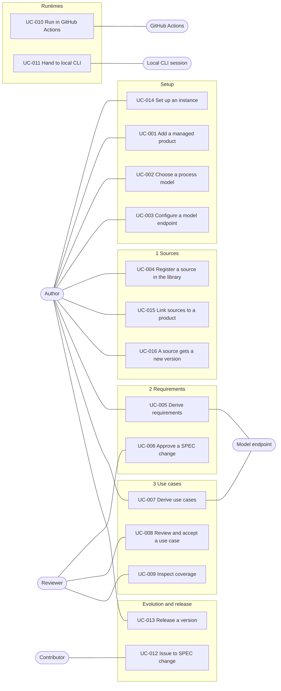

# Use cases of Agent M

Each use case is one file, `UC-<nnn>-<slug>.md`. Its status — open, accepted, changed since
acceptance — is not written anywhere: the review dashboard derives it from the approval records
in [`../approvals/`](../approvals/) (SPEC §10).

Review them on the dashboard: **https://akmaier.github.io/agent-m/** — or on your own fork's
dashboard (UC-014).

The diagram is an overview. Mermaid has no UML use-case diagram, so actors and use cases are
drawn as a flowchart; where it and a use case's text disagree, the text holds (SPEC §4).
