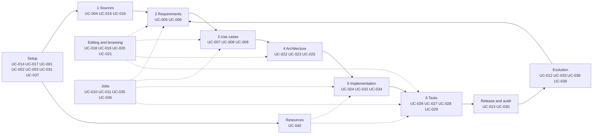

# Use cases of Agent M

Each use case is one file, `UC-<nnn>-<slug>.md`. Its status — open, accepted, changed since
acceptance — is not written anywhere: the review dashboard derives it from the approval records in
[`../approvals/`](../approvals/) (SPEC §10).

Review them on the dashboard: **https://akmaier.github.io/agent-m/** — or on your own fork's dashboard
(UC-014).

Terms: a **job** is one run (derive requirements, run a test battery, implement a backlog item); a
**phase** is a part of a process model; the nine **steps** of the cycle are the areas below.

## Setup — instance, products, participants, process

| ID | Use case |
|---|---|
| [UC-001](UC-001-add-a-managed-product.md) | Add a managed product |
| [UC-002](UC-002-choose-a-process-model.md) | Choose how the product is developed |
| [UC-003](UC-003-configure-a-model-endpoint.md) | Configure a model endpoint |
| [UC-014](UC-014-set-up-an-agent-m-instance.md) | Get your own Agent M |
| [UC-017](UC-017-configure-participants.md) | Configure the participants of the instance |
| [UC-031](UC-031-configure-a-process-model.md) | Configure a process model |
| [UC-037](UC-037-connect-a-mailbox.md) | Connect a mailbox |

## 1 · Requirement sources

| ID | Use case |
|---|---|
| [UC-004](UC-004-register-a-requirement-source.md) | Register a requirement source in the library |
| [UC-015](UC-015-link-sources-to-a-product.md) | Link requirement sources to a product |
| [UC-016](UC-016-a-source-gets-a-new-version.md) | A source gets a new version |

## 2 · Requirements

| ID | Use case |
|---|---|
| [UC-005](UC-005-derive-requirements-from-a-source.md) | Derive requirements from a source |
| [UC-006](UC-006-approve-a-specification-change.md) | Approve a specification change |
| [UC-020](UC-020-browse-the-specification.md) | Browse the specification |
| [UC-021](UC-021-group-artifacts-into-a-hierarchy.md) | Group artifacts into a hierarchy |

## 3 · Use cases

| ID | Use case |
|---|---|
| [UC-007](UC-007-derive-use-cases-from-requirements.md) | Derive use cases from requirements |
| [UC-008](UC-008-review-and-accept-a-use-case.md) | Review and accept a use case |
| [UC-009](UC-009-inspect-traceability-coverage.md) | Inspect traceability coverage |

## 4 · Architecture

| ID | Use case |
|---|---|
| [UC-022](UC-022-derive-the-architecture.md) | Derive the system architecture from requirements and use cases |
| [UC-023](UC-023-modify-the-architecture.md) | Modify the architecture |
| [UC-025](UC-025-validate-modules.md) | Validate modules against specification and tests |
| [UC-040](UC-040-declare-the-products-resources.md) | Declare the product's resources |

## 5 · Implementation

| ID | Use case |
|---|---|
| [UC-024](UC-024-implement-modules.md) | Implement modules from the architecture |
| [UC-032](UC-032-maintain-the-backlog.md) | Maintain the backlog |
| [UC-034](UC-034-implement-backlog-items-with-a-coding-agent.md) | Implement backlog items with a coding agent |
| [UC-035](UC-035-follow-progress-on-the-process-dashboard.md) | Follow progress on the process dashboard |

## 6 · Tests

| ID | Use case |
|---|---|
| [UC-026](UC-026-generate-a-multi-level-test-battery.md) | Generate a multi-level test battery |
| [UC-027](UC-027-configure-continuous-integration.md) | Configure continuous integration |
| [UC-028](UC-028-run-and-review-the-tests-of-a-commit.md) | Run and review the tests of a commit |
| [UC-029](UC-029-browse-the-tests-of-a-product.md) | Browse the tests of a product |

## Where jobs run

| ID | Use case |
|---|---|
| [UC-010](UC-010-run-a-stage-in-github-actions.md) | Run a job in GitHub Actions |
| [UC-011](UC-011-hand-a-stage-to-a-local-cli-session.md) | Hand a job to a local CLI session |

## Operation — jobs

| ID | Use case |
|---|---|
| [UC-036](UC-036-inspect-running-jobs.md) | Inspect running jobs |

## Evolution — issues, mail, editing

| ID | Use case |
|---|---|
| [UC-012](UC-012-turn-an-issue-into-a-specification-change.md) | Handle an issue — bug fix or specification change |
| [UC-018](UC-018-edit-a-specification-or-use-case.md) | Edit a specification or a use case in the dashboard |
| [UC-019](UC-019-change-a-specification-or-use-case-by-prompt.md) | Change a specification or a use case by prompt |
| [UC-033](UC-033-move-an-issue-into-the-backlog.md) | Move an issue into the backlog |
| [UC-038](UC-038-turn-mails-into-issues.md) | Turn mails into issues |
| [UC-039](UC-039-close-or-defer-an-issue-and-reply.md) | Close or defer an issue and reply |

## Release and audit

| ID | Use case |
|---|---|
| [UC-013](UC-013-release-a-version.md) | Release a version |
| [UC-030](UC-030-audit-the-tests-of-a-release.md) | Audit the tests of a release |

## How the areas connect

The diagram is an overview. Mermaid has no UML use-case diagram, so areas are drawn as a flowchart;
where it and a use case's text disagree, the text holds (SPEC §4).
