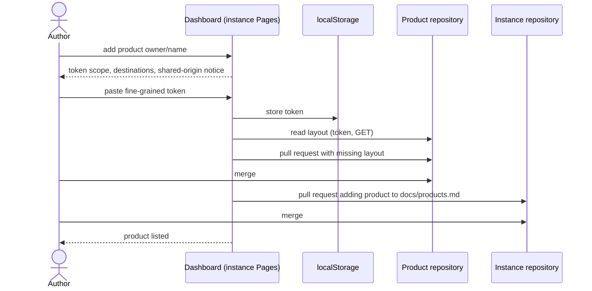

# UC-001 Add a managed product

**Goal.** The author brings an existing or new GitHub repository under their Agent M instance. The
product's artifacts live in the product's own repository; they are reviewed on the instance's
dashboard. The product gets no Pages site of its own.

## Actors

- **Author** — runs the Agent M instance and owns the product.
- **GitHub** — hosts the product repository, the instance repository, and the token page.

## Precondition

- The author has an Agent M instance (UC-014) and write access to the product repository.

## Main flow

1. The author opens the instance's dashboard and chooses **Add product**.
2. The author names the product repository (`owner/name`).
3. Agent M states what it needs: a fine-grained GitHub token with access to the product repository
   and to the instance repository, permissions *Contents* and *Pull requests*, read and write. It
   names every destination it will contact — GitHub's API and raw file host — and states that
   browser storage on `<owner>.github.io` can be read by every Pages site of the same owner.
4. The author creates the token on github.com, choosing repositories and expiry there, and pastes
   it into the dashboard's settings. Agent M stores it in `localStorage`; it sets no cookie and puts
   the token in no URL.
5. Agent M reads the product repository and reports which parts of the review layout below `docs/`
   already exist.
6. Agent M opens a pull request in the product repository with the missing parts —
   `docs/use-cases/`, `docs/approvals/`, `docs/spec-freigaben/`, a `SPEC.md` skeleton, a first
   version entry.
7. The author merges it in GitHub.
8. Agent M opens a pull request in the instance repository that adds the product to
   `docs/products.md`.
9. The author merges it; the product appears in the dashboard's product list, with its own version
   line.

## Alternative flows

- **4a. A token is already stored.** Agent M checks that it reaches the product repository; if it
  does not, it names the missing repository or permission, and the author extends or replaces the
  token on github.com.
- **5a. The repository already has the layout.** Steps 6–7 are skipped.
- **5b. The repository is private.** Nothing changes: reading uses the stored token, `GET` only.
- **7a. The author declines the pull request.** Steps 8–9 do not happen; nothing else changed.

## Postcondition

- The product repository contains the review layout, merged by the author; it has no Pages site.
- The instance lists the product in `docs/products.md`.
- The token exists only in the author's browser; no repository contains it.
