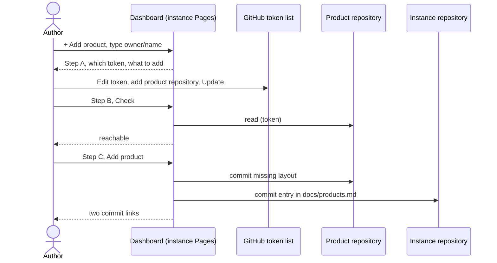

# UC-001 Add a managed product

**Goal.** The author brings a GitHub repository under their Agent M instance with as little effort
as possible, even if they are new to GitHub. The product's artifacts live in the product's own
repository; they are reviewed on the instance's dashboard. The product gets no Pages site.

## Actors

- **Author** — runs the Agent M instance and owns the product; possibly new to GitHub.
- **GitHub** — hosts the product repository, the instance repository, and the token page.

## Precondition

- The author has an Agent M instance with its token stored in this browser (UC-014).
- The product repository exists on GitHub or on a GitLab server, and the author can write to it.

## Main flow

1. On the instance's dashboard, the author opens the product selector and chooses **+ Add product**.
   A panel opens on the same page.
2. The author pastes the address of the product repository, as it appears in the browser — for
   example `https://github.com/alice/thesis-tool` or
   `https://gitlab.rrze.fau.de/fau-ai-taskforce/tools/thesis-tool`. Agent M recognises the server and
   whether it is GitHub or GitLab, and shows which of the two routes below applies.
3. **Step A · Let your key reach the product.** The key from UC-014 covers only the instance. The
   panel shows a button **Open your tokens on GitHub** and, underneath, exactly what to do there,
   with the names filled in:
   1. click the token **`Agent M · <instance>`**, then **Edit**;
   2. under *Repository access* → *Select repositories*, add **`<product repository>`** — keep
      `<instance>` selected;
   3. press **Update** at the bottom.

   The token itself does not change — nothing to copy, nothing to paste in Agent M.
4. **Step B · Check.** The author presses **Check**; Agent M reads the product repository with the
   stored token and shows ✓, or names what is missing. For a *public* repository a read succeeds
   even without the token's permission, so the panel says that write access is confirmed at the
   next step.
5. **Step C · Add the product** — one click. Agent M:
   - writes the missing review layout into the product repository's default branch
     (`docs/use-cases/`, `docs/approvals/`, `docs/spec-freigaben/`, a `SPEC.md` skeleton, a
     `CHANGELOG.md`), skipping whatever already exists;
   - adds the product to `docs/products.md` of the instance repository;
   - shows both commits as links, and offers to switch to the new product.

Every step carries a folded **What is this?** explanation for newcomers: what a repository is, why
the key has to be extended, what the two commits contain, how to undo them.

## Alternative flows

- **3a. The token already reaches the product** (for example, the author selected it in UC-014).
  Step A is shown as done; adding a product is typing its name, *Check*, *Add product*.
- **3b. No token is stored in this browser** (another computer, or the setup of UC-014 was skipped).
  The panel first shows UC-014's key setup, with both repositories named; then continues at step 4.
- **4a. The check fails.** Agent M names the repository it cannot reach and shows Step A again.
- **5a. The write is refused** although the read succeeded — a public repository not yet added to the
  token. Agent M says so and shows Step A again; nothing was written.
- **2a. The product repository does not exist yet.** Agent M says so and links GitHub's page for a
  new repository, with a folded explanation of the choices there; the author returns and continues
  at step 2.
- **5b. The product already has the complete layout.** Only the entry in `docs/products.md` is
  written.
- **3c. The product is on a GitLab server.** Step A becomes **Create a key for this project**: a
  button opens the project's *Settings → Access tokens* page on that server; underneath, what to set
  there — name `Agent M`, role **Developer**, scope **`api`**, an expiry date — then *Create project
  access token* and copy it. Step B is the familiar notice, paste field and *Store and check*; the
  token is stored for this project only and is sent only to that server. Then Step C as above. Each
  GitLab product has its own token; the instance's GitHub token is not involved there.
- **3d. The GitLab server offers no project access tokens, or the author is not *Maintainer*.**
  Agent M says which of the two it is, and explains that a personal token would reach every project
  of the author on that server; the author decides.

## Postcondition

- The product repository contains the review layout; it has no Pages site.
- The instance lists the product in `docs/products.md`.
- The one token from UC-014 now reaches the instance and this product, and nothing else.
- Clicks: *+ Add product*, *Open your tokens on GitHub*, on GitHub *Edit* and *Update*, *Check*,
  *Add product*. If the token already reaches the product: *+ Add product*, *Check*, *Add product*.
