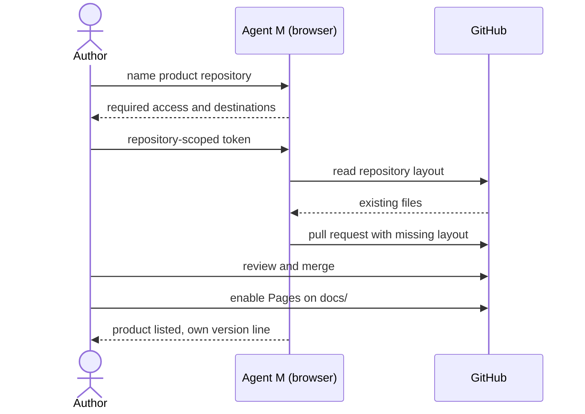

# UC-001 Add a managed product

**Goal.** The author brings an existing or new GitHub repository under Agent M, so that its
sources, requirements and use cases can be produced and reviewed there.

## Actors

- **Author** — the person who owns the product and runs Agent M for it.
- **GitHub** — hosts the product repository and its Pages site.

## Precondition

- The author has a GitHub account with write access to the product repository.
- The Agent M site is open in the author's browser.

## Main flow

1. The author names the product repository (`owner/name`).
2. Agent M states which access it needs to that repository and why, and which destinations it
   will contact.
3. The author issues a GitHub token limited to that repository and enters it in the browser.
4. Agent M reads the repository and reports which parts of the review layout below `docs/`
   already exist.
5. Agent M proposes the missing parts — `docs/use-cases/`, `docs/approvals/`,
   `docs/spec-freigaben/`, an empty `SPEC.md` skeleton, a first version entry — as a pull request.
6. The author merges the pull request in GitHub.
7. The author enables GitHub Pages for the repository, served from `docs/` on the default
   branch; this is the product's review site.
8. The product appears in Agent M's product list with its own version line.

## Alternative flows

- **4a. The repository already uses the layout.** Nothing is proposed; the product is listed
  directly.
- **4b. The token cannot read the repository.** Agent M names the missing permission and stops;
  no partial layout is written.
- **5a. The author declines the pull request.** The product is not listed; nothing else changed.

## Postcondition

- The product repository contains the review layout, merged by the author.
- The product's review site is its own GitHub Pages site; no server was set up.
- No credential has been written to the repository.
- Removing Agent M later leaves every artifact readable in the repository.
