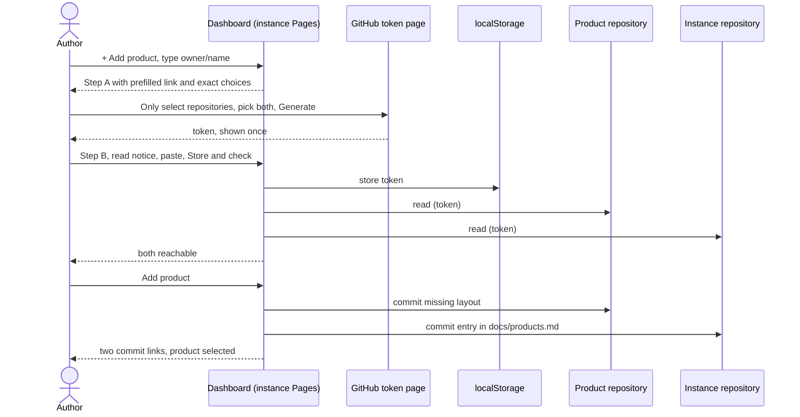

# UC-001 Add a managed product

**Goal.** The author brings a GitHub repository under their Agent M instance with as little effort
as possible, even if they are new to GitHub. The product's artifacts live in the product's own
repository; they are reviewed on the instance's dashboard. The product gets no Pages site.

## Actors

- **Author** — runs the Agent M instance and owns the product; possibly new to GitHub.
- **GitHub** — hosts the product repository, the instance repository, and the token page.

## Precondition

- The author has an Agent M instance (UC-014).
- The product repository exists on GitHub and the author can write to it.

## Main flow

1. On the instance's dashboard, the author opens the product selector and chooses **+ Add product**.
   A panel opens on the same page.
2. The author types the product repository, for example `alice/thesis-tool`.
3. If no token is stored yet, or the stored one cannot reach both repositories, the panel shows
   **Step A · Create your key on GitHub**:
   - a button **Open GitHub's token page**, which opens GitHub in a new tab with name
     (`Agent M · <instance>`), description, expiry (90 days) and the one permission Agent M needs
     (*Contents: read and write*) already filled in;
   - underneath, exactly what to do there, with the repository names filled in:
     1. under *Repository access*, choose **Only select repositories** — GitHub preselects *All
        repositories*, which would give Agent M far more than it needs;
     2. in *Select repositories*, pick **`<instance repository>`** and **`<product repository>`**;
     3. at the bottom, press **Generate token**;
     4. copy the token that GitHub shows once — it starts with `github_pat_`.
4. The panel shows **Step B · Give the key to Agent M**, on the same page:
   - the notice that everything stored in this browser can be read by every GitHub Pages site of
     the same owner, with a checkbox **I have read this**;
   - a field **GitHub token** — paste the copied token here;
   - a button **Store and check**. Agent M writes the token to this browser's `localStorage` (no
     cookie, never in a URL, never in a repository) and immediately tries to read both
     repositories. Each gets a ✓, or a message naming what is missing.
5. The author presses **Add product** — one click. Agent M:
   - writes the missing review layout into the product repository's default branch
     (`docs/use-cases/`, `docs/approvals/`, `docs/spec-freigaben/`, a `SPEC.md` skeleton, a first
     version entry), skipping whatever already exists;
   - adds the product to `docs/products.md` of the instance repository;
   - shows both commits as links, and switches the dashboard to the new product.

Every step carries a folded **What is this?** explanation for newcomers: what a token is and why
Agent M needs one; why *Only select repositories*; what happens to the token in the browser; what
the two commits contain; how to undo them.

## Alternative flows

- **3a. A token is stored and reaches both repositories.** Steps A and B are skipped: adding a
  product is typing its name and one click.
- **4a. The token cannot reach one of the repositories.** Agent M names it and shows how to add it
  to the existing token: GitHub's token list (linked) → the Agent M token → *Edit* → *Repository
  access* → add the repository → *Update*. No new token is needed.
- **4b. The pasted text is not a token.** Nothing is stored; the panel says what a token looks like.
- **2a. The product repository does not exist yet.** Agent M says so and links GitHub's page for a
  new repository, with a folded explanation of the choices there; the author returns and continues
  at step 2.
- **5a. The product already has the complete layout.** Only the entry in `docs/products.md` is
  written.

## Postcondition

- The product repository contains the review layout; it has no Pages site.
- The instance lists the product in `docs/products.md`.
- The token exists only in this browser, and can write only to the repositories the author selected.
- The author has clicked: *+ Add product*, *Open GitHub's token page*, GitHub's *Generate token*,
  *I have read this*, *Store and check*, *Add product* — and none of them twice. With a token already
  stored: *+ Add product* and *Add product*.
