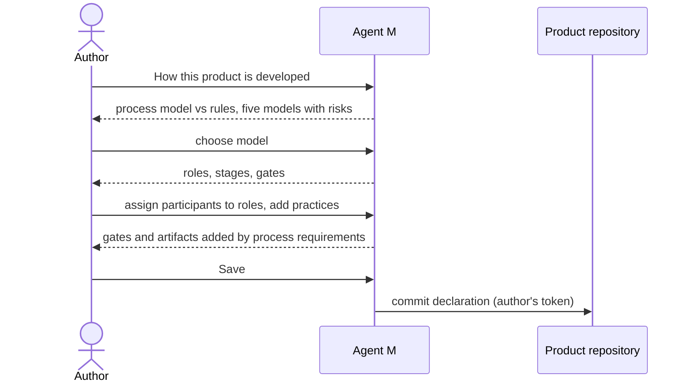

# UC-002 Choose how the product is developed

**Goal.** The author decides how the product's team of people and agents works: who does what, in
which order, and where someone has to approve before the work continues.

**Two things this use case keeps apart:**

| | The **process model** — chosen here | The **rules to be met** — not chosen here |
|---|---|---|
| answers | *how* the team works: roles, stages, order, gates | *what* has to hold: of the product, or of the way it is built |
| comes from | the author's decision, from the book's catalogue | requirement sources (UC-004), as requirements (UC-005) |
| examples | V-model, Scrum, Kanban | "exports are PDF" (product); IEC 62304 class B: "unit verification is documented" (process) |
| effect | defines the workflow | a process requirement **adds** gates and artifacts to the chosen workflow, never replaces it |

A standard such as IEC 62304 is therefore not chosen in this use case. It is registered as a source,
and its process requirements show up here as additions to whatever model the author picks.

## Actors

- **Author** — decides the process for the product.

## Precondition

- The product is managed by Agent M (UC-001).

## Main flow

1. The author opens **How this product is developed**. The page opens with the table above, folded
   after the first reading.
2. Agent M shows the book's five process models in two groups:
   - *plan-driven* — **waterfall**, **V-model**, **reuse-oriented**;
   - *agile* — **Scrum**, **Kanban**.

   For each: the risk it manages well, the risk it accepts, an example project it suits, and the
   book chapter that explains it.
3. The author selects one model.
4. Agent M shows the model's roles; for each, whether a person, an agent or either may fill it, and
   which capabilities it needs. For Scrum, for example: *Product Owner* — a person; *Scrum Master* —
   either; *Developers* — either, needing *write to the repository* and *run code and tests*. The
   author assigns participants from the instance's list (UC-017): people, model endpoints, CI agents,
   CLI agents or sandboxed agents — several to one role where the role allows it. Agent M offers only
   participants that have every capability the role needs, and shows for each where it processes
   data.
5. Agent M shows the model's stages, their order, which stages pair for verification, and each gate
   with what it checks.
6. The author may add **practices**: DevOps, prototyping, incremental delivery, a scaling layer. Each
   says what it adds and to which models it fits; none of them replaces the model.
7. Agent M shows, in the same workflow view, what the product's **process requirements** add: extra
   gates and artifacts, each marked with the requirement and the source it comes from.
8. The author presses **Save** — one click. Agent M commits the declaration to the product
   repository.

Every choice carries a folded **What is this?** for people new to software processes, with a pointer
to the book.

## Alternative flows

- **3a. The author's organisation runs a process of its own.** It is added as a data file in the
  catalogue's format, with roles, stages and gates; Agent M's code is not changed.
- **4a. A role that needs a person has none.** *Save* stays disabled, and the role is named.
- **4b. No participant has the capabilities a role needs** — for example only a model endpoint is
  configured, and *Developers* must run tests. Agent M names the missing capability and links to
  UC-017 to add a participant that has it.
- **4c. An assigned participant processes data where a linked source does not permit it.** Agent M
  says which source and which role; the assignment stays possible, and that source's content is never
  given to that participant.
- **7a. The product has no process requirements yet.** The view says so; once requirements from a
  standard are accepted (UC-005, UC-006), their additions appear here without the model changing.
- **7b. A process requirement needs a gate the model does not have** — for example, documented
  verification before release, in a Kanban flow without a release gate. Agent M shows the gate being
  added and where; the model stays Kanban.
- **3b. The author changes the model later.** Agent M lists which artifacts the new model no longer
  requires; none are deleted, and process requirements keep their gates.

## Postcondition

- The product declares exactly one process model, its role assignment, and zero or more practices.
- The workflow Agent M offers for the product follows from the model, the practices and the
  product's process requirements — and from nothing else.
