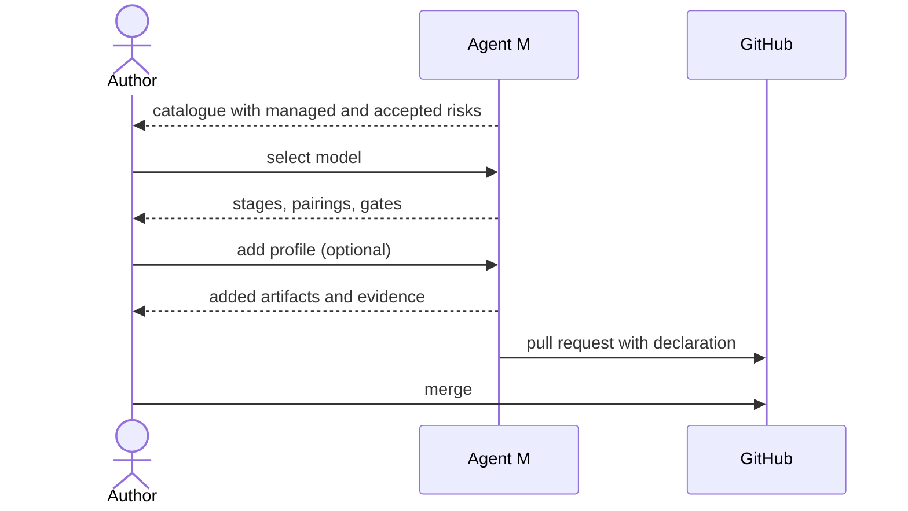

# UC-002 Choose a process model and profile

**Goal.** The author decides how the product is developed — which stages exist, in which order,
and where a person must approve before work continues.

## Actors

- **Author** — decides the process for the product.

## Precondition

- The product is managed by Agent M (UC-001).
- No process model is declared yet, or the author wants to change it.

## Main flow

1. Agent M shows the catalogue: waterfall, V-model, reuse-oriented, incremental/prototyping,
   agile, Kanban, Scrum, DevOps, disciplined agile delivery at scale.
2. For each model it shows the risk the model manages well and the risk it accepts.
3. The author selects one model.
4. Agent M shows the stages, their pairing for verification, and every gate with the artifacts it
   checks and the condition it requires.
5. The author optionally adds one or more profiles, for example IEC 62304 class B.
6. Agent M shows which artifacts and evidence each profile adds, on top of the model's own.
7. Agent M proposes the declaration as a change to the product repository.
8. The author merges it.

## Alternative flows

- **3a. The author brings a model of their own.** It is added as a data file in the catalogue's
  format; Agent M's code is not changed.
- **5a. Two profiles require the same artifact.** It is required once and shows both profiles as
  its reason.
- **7a. The product already has artifacts from an earlier model.** Agent M lists which of them
  the new model no longer requires; none are deleted.

## Postcondition

- The product declares exactly one process model and zero or more profiles.
- The workflow Agent M offers for the product follows from that declaration alone.
