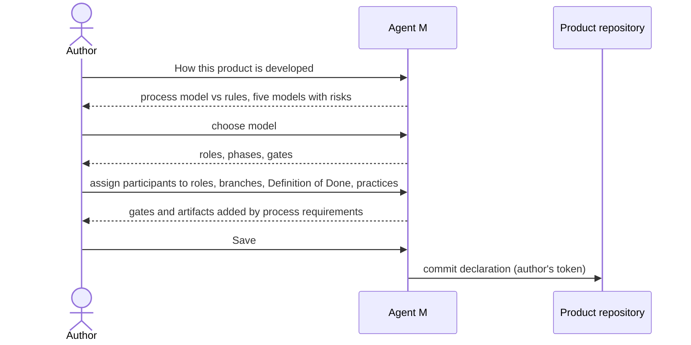

# UC-002 Choose how the product is developed

**Goal.** The author decides how the product's team of people and agents works: who does what, in
which order, and where someone has to approve before the work continues. This is the first step of
implementing the architecture (UC-024, step 1): the model decides how the software is assembled — along
an implementation plan (UC-045) or from a backlog (UC-032). Until then the product needs no model; its
requirements, use cases and architecture are worked out the same way whatever the process.

**Two things this use case keeps apart:**

| | The **process model** — chosen here | The **rules to be met** — not chosen here |
|---|---|---|
| answers | *how* the team works: roles, phases, order, gates | *what* has to hold: of the product, or of the way it is built |
| comes from | the author's decision, from the book's catalogue | requirement sources (UC-004), as requirements (UC-005) |
| examples | V-model, Scrum, Kanban | "exports are PDF" (product); IEC 62304 class B: "unit verification is documented" (process) |
| effect | defines the workflow | a process requirement **adds** gates and artifacts to the chosen workflow, never replaces it |

A standard such as IEC 62304 is therefore not chosen in this use case. It is registered as a source,
and its process requirements show up here as additions to whatever model the author picks.

## Actors

- **Author** — decides the process for the product.

## Precondition

- The product's architecture is accepted (UC-022, UC-023), and the author starts its implementation
  (UC-024, step 1) or returns to change the model (3b).

## Main flow

1. The author opens **How this product is developed**. The page opens with the table above, folded
   after the first reading.
2. Agent M shows the book's five process models in two groups:
   - *plan-driven* — **waterfall**, **V-model**, **reuse-oriented**;
   - *agile* — **Scrum**, **Kanban**.

   For each: the risk it manages well, the risk it accepts, an example project it suits, and the
   book chapter that explains it.
3. The author selects one model.
4. Agent M shows the model's roles; for each, whether a person, an agent or either may fill it, and
   which capabilities it needs. For Scrum, for example (book ch. 7 §5): *Product Owner* — a person or
   an agent, who fills the backlog, selects each sprint's items and decides what is released; *Scrum Master* — either, who watches the
   process and removes obstacles, and approves nothing; *Developers* — either, needing *write to the
   repository* and *run code and tests*, who turn items into a done increment. The
   author assigns participants from the team's list (UC-017): people, model endpoints, CI agents,
   CLI agents or sandboxed agents — several to one role where the role allows it. Agent M offers only
   participants that have every capability the role needs, and shows for each where it processes
   data. The assignment is that of the product's first team, which the author names, for example `team1`; further teams
   are added in 4d.
5. Agent M shows the model's phases, the transitions between them, which phases pair for verification, and each gate
   with what it checks and who decides it — a role held by a person or an agent, or an automated check
   (UC-031). For a phase, or for a sprint — with or without a time box —, the author may set a
   **branch of its own**; the work is then merged into that branch, and merging it into the default
   branch is the gate at its end, decided in Scrum by the Product Owner after the review of the
   increment (UC-041). Preset is *none*: work merges into the default branch.
6. The author may add **practices**: DevOps, prototyping, incremental delivery, a scaling layer. Each
   says what it adds and to which models it fits; none of them replaces the model.
7. Agent M shows, in the same workflow view, what the product's **process requirements** add: extra
   gates and artifacts, each marked with the requirement and the source it comes from.
8. Agent M shows the product's **Definition of Done** — the conditions a pull request must meet before
   it is merged. It is preset to the rules every implementation job already follows: CI green, the
   first commit held only failing tests, only the job's modules changed, every gate before the merge
   recorded. The author may add conditions, for example *reviewed by a second developer*. A folded
   explanation says that in Scrum the Developers meet the Definition of Done, whoever presses merge.
9. The author presses **Save** — one click. Agent M commits the declaration to the product
   repository as `docs/process_<team>.md`.

Every choice carries a folded **What is this?** for people new to software processes, with a pointer
to the book.

```mermaid
sequenceDiagram
    actor A as Author
    participant M as Agent M
    participant G as Product repository
    A->>M: How this product is developed
    M-->>A: process model vs rules, five models with risks
    A->>M: choose model
    M-->>A: roles, phases, gates
    A->>M: assign participants to roles, branches, Definition of Done, practices
    M-->>A: gates and artifacts added by process requirements
    A->>M: Save
    M->>G: commit declaration (author's token)
```

## Alternative flows

- **3a. The author's organisation runs a process of its own.** It is added as a data file in the
  catalogue's format, with roles, phases and gates; Agent M's code is not changed.
- **4a. A role that needs a person has none.** *Save* stays disabled, and the role is named.
- **4b. No participant has the capabilities a role needs** — for example only a model endpoint is
  configured, and *Developers* must run tests. Agent M names the missing capability and links to
  UC-017 to add a participant that has it.
- **4d. The product is developed by several teams** — in a model with sprints, as many as the author wants. The
  author chooses **+ Team** and names it, for example `team2`. Every team, the first included, has a declaration of its
  own, `docs/process_<team>.md`, and a participant list of its own, `docs/participants_<team>.md` (UC-017). In its
  declaration the author assigns the model's roles for that team from its list, as in step 4; a participant may hold
  roles in several teams, standing in each of their lists under its one name. Every declaration names the product's model and states the same
  Definition of Done (step 8): a declaration that differs in either is not saved, and Agent M names the difference. A
  team's jobs go to its own holders of their roles, and its gates are decided by its own holders of the deciding role
  (UC-034). Where sprints have a branch of their own, a team's is `sprint/<team>/<nn>`. A team whose sprint still holds
  items cannot be removed until they are merged into the default branch or back in the backlog (UC-041).
- **4c. An assigned participant processes data where a linked source does not permit it.** Agent M
  says which source and which role; the assignment stays possible, and that source's content is never
  given to that participant.
- **7a. The product has no process requirements yet.** The view says so; once requirements from a
  standard are accepted (UC-005, UC-006), their additions appear here without the model changing.
- **7b. A process requirement needs a gate the model does not have** — for example, documented
  verification before release, in a Kanban flow without a release gate. Agent M shows the gate being
  added and where; the model stays Kanban.
- **3b. The author changes the model later.** Agent M lists which artifacts the new model no longer
  requires; none are deleted, and process requirements keep their gates. With several teams, the change is made in
  every team's declaration in the same commit.

## Postcondition

- The product declares exactly one process model, its teams with their role assignments, its Definition of Done, and
  zero or more practices.
- The workflow Agent M offers for the product follows from the model, the practices and the
  product's process requirements — and from nothing else.
- Implementation continues as the model calls for: with the implementation plan (UC-045) or the
  backlog (UC-032), then the jobs (UC-024, UC-034).
