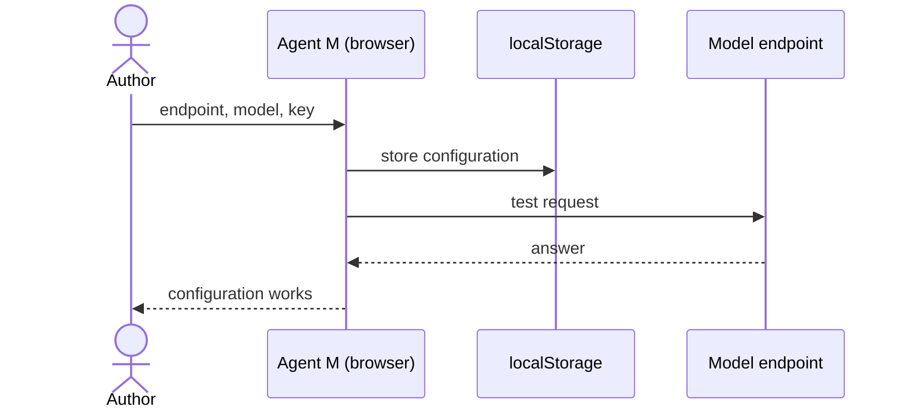

# UC-003 Configure a model endpoint

**Goal.** The author connects Agent M to a language model so that jobs can run in the browser.

## Actors

- **Author** — owns the API key.
- **Model endpoint** — an OpenAI-compatible or Anthropic endpoint, hosted or self-hosted.

## Precondition

- The author has an endpoint URL, a model name and, if the endpoint requires one, an API key.

## Main flow

1. The author opens the configuration screen.
2. The author enters endpoint URL, model name and API key.
3. Agent M stores them in the browser's `localStorage` of the Agent M site; it sets no cookie.
4. Agent M sends one short test request to the endpoint.
5. The endpoint answers; Agent M shows the configuration as working.

## Alternative flows

- **4a. The endpoint refuses calls from a browser.** Agent M names the reason (for example a
  missing cross-origin permission or opt-in header) and the runtimes that would work instead —
  GitHub Actions (UC-010) or the local bridge (UC-011).
- **4b. The key is wrong.** Agent M shows the endpoint's error message; the key stays stored until
  the author changes or clears it.
- **6. The author clears the configuration.** Agent M removes the entries from `localStorage`,
  not only from the form, and confirms that nothing is stored.

## Postcondition

- The configuration exists only in this browser.
- The key has not appeared in a URL, a cookie, or any repository.
