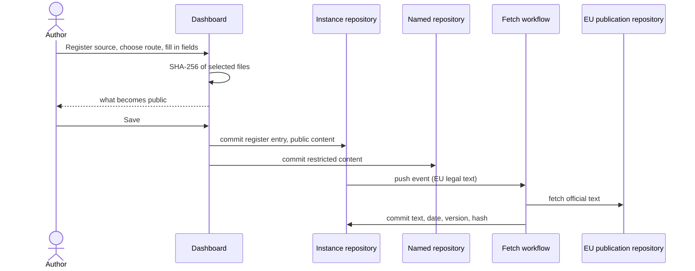

# UC-004 Register a requirement source in the library

**Goal.** The author adds a source of rules — a law, a norm, a set of documents, a repository — to
the instance's library once, so that any product can link to it later (UC-015), and so that it is
always clear which version was used.

**Where things end up:**

| | stored in | public? |
|---|---|---|
| the register entry: name, kind, authority, licence, versions, identifiers, hashes | the instance, `docs/sources/SRC-<slug>.md` | yes — the instance is a public fork |
| content that may be republished (EU law, openly licensed guides) | the instance, `docs/sources/SRC-<slug>/<version>/` | yes |
| restricted content (a bought norm, internal documents) | a repository the author names, public or private | as that repository |

## Actors

- **Author** — knows the sources behind the products.
- **Fetch workflow** — a workflow of the instance that downloads EU legal texts.

## Precondition

- The author has an instance with its token stored in this browser (UC-014).

## Main flow

1. The author opens **Library** on the dashboard and chooses **+ Register source**.
2. Agent M asks what the source is, with one sentence and an example for each:
   - **An EU legal text** — paste its EUR-Lex or ELI address;
   - **A standard** — for example IEC 62304;
   - **Documents** — PDF, Word, Markdown files, or a zip file containing them;
   - **A repository** — the address of a repository, public or private, on GitHub or GitLab.
3. The author fills in the fields common to all: name, kind, authority (*normative*, *advisory*,
   *informational*), and licence (*may be republished* or *restricted*). Each field has a folded
   explanation with an example.
4. The route-specific part:
   - **EU legal text:** Agent M recognises the CELEX number or ELI from the address (for the AI Act,
     `32024R1689`) and fills in the identifier.
   - **Standard:** the author enters the full designation, with edition and amendments —
     `IEC 62304:2006+AMD1:2015`. A folded explanation shows where to find it on the norm's cover page
     and why the amendment matters. Licence is preset to *restricted*.
   - **Documents:** the author selects the files or the zip. The browser computes the SHA-256 of each
     file. If the licence is *restricted*, the author chooses the repository where the files go.
   - **Repository:** the author pastes its address; Agent M reads its current commit with the stored
     token and pins it.
5. Before saving, Agent M states what becomes public: the register entry always; the content only if
   it may be republished.
6. The author presses **Save** — one click. Agent M commits the register entry, and the content where
   it belongs, under the author's account.
7. For an EU legal text, the fetch workflow then downloads the official text from the EU's
   publication repository, stores it with retrieval date, the repository's version identifier and
   its SHA-256, and completes the register entry. The library shows the source as *fetched*.

## Alternative flows

- **4a. The author has only a printed or local copy of a norm and does not want to upload it.** The
  author selects the file anyway; the browser computes its SHA-256 without sending it anywhere, and
  only designation and hash are recorded, with a note where the copy is kept.
- **4b. The licence is unknown.** The source is treated as *restricted* until someone records a
  licence.
- **4c. The named repository is not reachable with the stored token.** Agent M says so and shows how
  to extend the token, as in UC-001.
- **7a. The fetch fails** (the EU repository is unreachable, or the address names no text). The
  register entry shows the error and a **Fetch again** button; nothing is guessed.
- **1a. The source is already in the library.** Agent M offers to add a new version instead (UC-016).

## Postcondition

- The library lists the source with kind, authority, licence and at least one version, each version
  with identifier, date and the SHA-256 of every file read.
- No restricted content is in the public instance repository.
- Products can now link to the source (UC-015).
