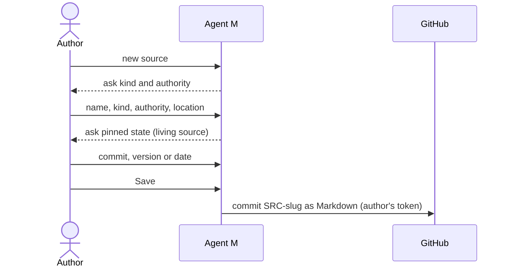

# UC-004 Register a requirement source

**Goal.** The author records who or what may legitimately impose requirements on the product, and
with which authority — before any requirement is written.

## Actors

- **Author** — knows the stakeholders, standards and documents behind the product.

## Precondition

- The product is managed by Agent M (UC-001).

## Main flow

1. The author starts a new source.
2. Agent M asks for a name, a kind from the closed set (organisation, person, standard,
   regulation, document, system, measurement) and an authority (normative, advisory,
   informational).
3. The author enters them, plus a location and a contact where they exist.
4. If the source is maintained elsewhere, Agent M asks for the state that was read — a commit, a
   version, or a retrieval date.
5. Agent M assigns the identifier `SRC-<slug>`.
6. The author presses **Save** — one click. Agent M commits the source as a Markdown file to the
   product repository under the author's account; it is the author's own input and needs no second
   approval.

Each field carries a folded explanation: what counts as a source, and the difference between
*normative*, *advisory* and *informational*, with an example of each.

## Alternative flows

- **2a. The kind fits none of the seven.** The author picks the closest and explains in the
  description; the set is not extended ad hoc.
- **4a. The author cannot name a state.** The retrieval date is recorded; Agent M marks the source
  as pinned by date only.
- **5a. A source with the same slug exists.** Agent M proposes a different slug; a withdrawn
  identifier is never reused.

## Postcondition

- The source exists with identifier, kind, authority and, for a living source, a pinned state.
- Requirements can now name it (UC-005).
