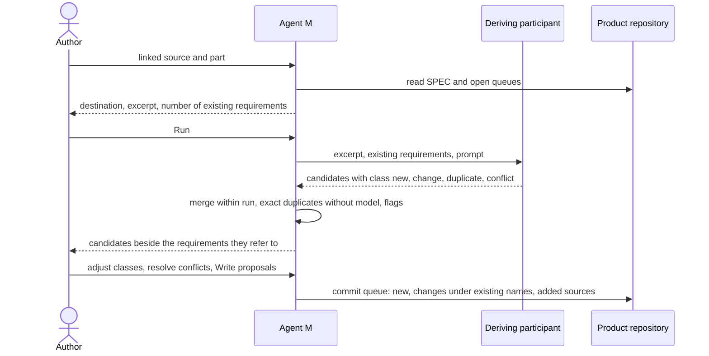

# UC-005 Derive requirements from a source

**Goal.** Agent M turns the content of a registered source into candidate requirements in the
five-field form, for the author to approve or reject one by one.

## Actors

- **Author** — decides which candidates become requirements.
- **Deriving participant** — a model endpoint or agent from the instance's list (UC-017) that can
  *draft text*; it drafts the candidates.
- **GitHub** — receives the proposal.

## Precondition

- The source is in the library (UC-004) and linked to the product (UC-015).
- At least one participant that can *draft text* is configured (UC-017); it runs in the browser, in
  GitHub Actions (UC-010) or behind the local bridge (UC-011).

## Main flow

1. The author selects one of the product's linked sources and, optionally, the part to work on. Agent M
   reads exactly the linked version, and checks its hash.
2. Agent M collects **every existing requirement of the product** — its SPEC and its open change
   queues — and checks that source excerpt and requirements together fit into the chosen
   participant's context.
3. The run panel shows the destination, what exactly is sent (the excerpt *and* the existing
   requirements), and how many requirements are included; the author presses **Run** — that click is
   the decision.
4. Agent M sends both with the requirement prompt from the repository's single definition. The prompt
   asks for candidates *against* the existing requirements, not beside them.
5. The participant returns candidates, each with name, source passage, rule, occasion, check,
   whether it constrains the **product** or the **process** — and a class:
   - **new** — nothing existing covers it;
   - **change** — it alters a named existing requirement;
   - **duplicate** — it restates a named existing requirement;
   - **conflict** — it contradicts a named existing requirement.
6. **The deduplication pass**, before anything is written:
   1. candidates of this run that state the same rule are merged into one, naming every passage;
   2. a candidate whose name or normalised rule equals an existing requirement's is classified as a
      duplicate without a model, whatever the model said;
   3. Agent M flags candidates whose rule contains a conjunction, and candidates without a check.
7. The review panel shows the candidates grouped by class, each beside the existing requirement it
   refers to. The author can move a candidate to another class — for example, from *new* to
   *duplicate of X* — and choose how each conflict is resolved.
8. The author presses **Write proposals** — one click. Agent M writes a new queue under
   `docs/spec-freigaben/`, where the entries are open until accepted:
   - **new:** an entry adding the requirement to its section;
   - **change:** an entry for the section holding the existing requirement, changing it **under its
     name**, with the current text beside it and its impact list;
   - **duplicate:** an entry that adds the new source to the existing requirement;
   - **conflict:** written only as the author resolved it in step 7; undecided conflicts stay in the
     panel and are not written.

   Every entry records Agent M version, participant, model and date.
9. The author reviews and accepts entries as in UC-006.

## Alternative flows

- **2a. The existing requirements and the excerpt do not fit into the participant's context.** Nothing
  is sent. Agent M says how many requirements there are and how much fits, and offers a participant
  with a larger context or a smaller part of the source; it never drops requirements silently.
- **3a. The author does not press Run.** Nothing is sent.
- **5a. A candidate points to a rule from a source the product does not link.** It is not proposed;
  Agent M lists it as a hint to link the source first (UC-015).
- **1a. The file's hash differs from the one recorded for the linked version.** Nothing is sent;
  Agent M says that the content changed and that a new version must be registered (UC-016).
- **6a. The author splits a flagged candidate.** Each part becomes an entry of its own.
- **5b. A candidate constrains the process.** It is marked as such; once accepted, it adds its gates
  and artifacts to the product's workflow (UC-002, step 7).
- **7a. A conflict involves a normative source.** The panel says which side is normative; the author
  still decides — a normative source does not win automatically, because the product may be out of
  that source's scope.
- **7b. Every candidate is a duplicate.** The panel says so; writing then only adds sources to existing
  requirements.

## Postcondition

- The product repository holds a queue of proposals; the SPEC itself is unchanged until entries are
  accepted.
- No proposal duplicates an existing requirement: what the source adds is new, what it alters is a
  change under the existing name, what it repeats is an added source.
- Each proposal names its source passage, the source version and the participant that produced it.
