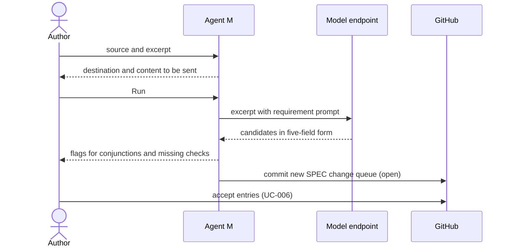

# UC-005 Derive requirements from a source

**Goal.** Agent M turns the content of a registered source into candidate requirements in the
five-field form, for the author to approve or reject one by one.

## Actors

- **Author** — decides which candidates become requirements.
- **Model endpoint** — drafts the candidates.
- **GitHub** — receives the proposal.

## Precondition

- The source is registered (UC-004).
- A runtime is available: a configured endpoint (UC-003), GitHub Actions (UC-010) or the local
  bridge (UC-011).

## Main flow

1. The author selects a source and provides its relevant text or excerpt.
2. The run panel shows which destination will receive the text, and what exactly is sent; the
   author presses **Run** — that click is the decision, there is no separate confirmation.
3. Agent M sends the text with the requirement prompt from the repository's single definition.
4. The endpoint returns candidates, each with name, source, rule, occasion and check.
5. Agent M flags candidates whose rule contains a conjunction, and candidates without a check.
6. Agent M records Agent M version, model and date on every candidate.
7. Agent M writes the candidates as SPEC change entries in a new queue under
   `docs/spec-freigaben/` on the default branch, where they are open until accepted.
8. The author reviews and accepts entries as in UC-006.

## Alternative flows

- **2a. The author does not press Run.** Nothing is sent.
- **4a. A candidate has no source that is registered.** It is not proposed; Agent M lists it as
  a hint to register the source first (UC-004).
- **5a. The author splits a flagged candidate.** Each part becomes an entry of its own.

## Postcondition

- The product repository holds a queue of proposed requirements; the SPEC itself is unchanged
  until entries are accepted.
- Each proposed requirement names its source and the version that produced it.
