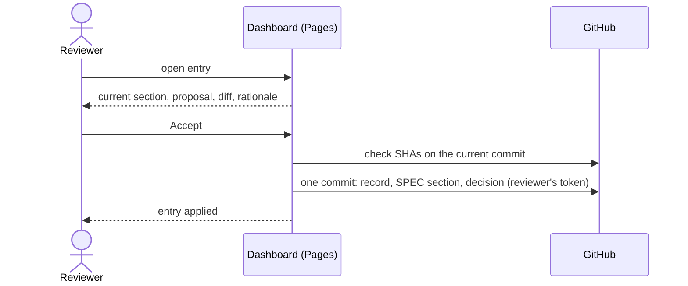

# UC-006 Approve a specification change

**Goal.** The reviewer — usually the Product Owner — decides on one proposed SPEC change, seeing
the proposal beside the text it would replace, and the decision is written exactly as taken.

## Actors

- **Reviewer** — has write access to the product repository.
- **GitHub** — hosts the dashboard, the web editor, and the commit that records the decision.
- **Apply workflow** — the instance's GitHub Actions workflow; it writes an accepted change of the
  instance's own SPEC when the approval record was committed without the dashboard (4c).

## Precondition

- A queue with at least one open entry exists under `docs/spec-freigaben/`.
- The reviewer is logged into GitHub.

## Main flow

1. The reviewer opens the dashboard and selects an open entry.
2. The dashboard shows the current SPEC section beside the proposal, the difference between them,
   and the rationale.
3. The reviewer checks that each rule is a single checkable statement and states a target rather
   than a current condition.
4. The reviewer presses **Accept** — one click.
5. The dashboard checks, on the commit it writes on, that the proposal and the SPEC section still have
   the SHAs it showed.
6. In **one** commit under the reviewer's own account, it adds the approval record, replaces the SPEC
   section with the proposal byte for byte, and appends the decision to the queue's
   `entscheidungen.md`.
7. The dashboard shows the entry as *in SPEC*.

## Alternative flows

- **3a. The reviewer wants different wording.** The reviewer edits the proposal on the dashboard,
  with a live preview, and presses **Save**; the dashboard commits it. The entry is then shown from
  step 2 with the new text, and **Accept** applies to that text.
- **4b. No token is stored.** **Accept** opens GitHub's new-file page with the record prefilled;
  the reviewer presses *Commit changes* there. Editing opens GitHub's editor with the text on the
  clipboard.
- **3b. The change touches an existing requirement.** The dashboard lists the artifacts that
  reference its name before the reviewer decides.
- **5a. The proposal or the SPEC section changed since the reviewer opened it.** Nothing is written;
  the dashboard shows the new state, and the reviewer decides again on the current text.
- **4c. The instance's own SPEC, without a token.** The record is committed on GitHub's page; the
  instance's workflow then writes the section, applying the same checks. For a product, a token is
  required — no product carries the workflow.
- **4a. The reviewer rejects.** No record is committed; the entry stays open until it is removed
  from the queue by a commit.

## Postcondition

- The SPEC contains exactly the approved text.
- The commit history shows who approved, when, and which text; the replaced text is reachable in
  the history.
