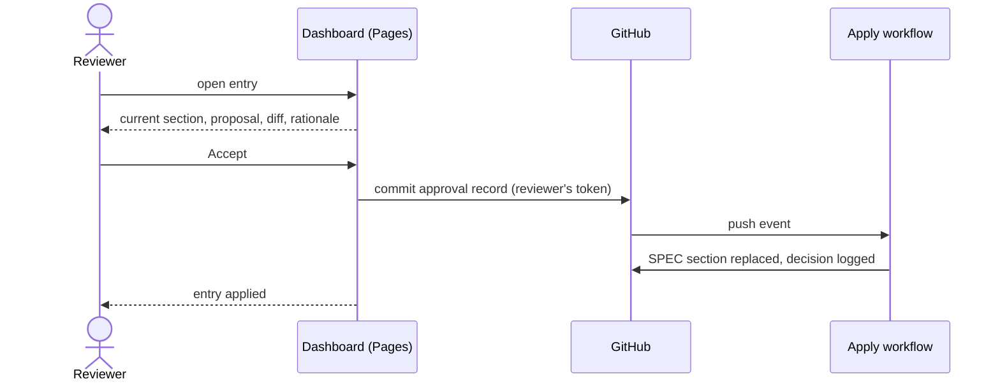

# UC-006 Approve a specification change

**Goal.** The reviewer — usually the Product Owner — decides on one proposed SPEC change, seeing
the proposal beside the text it would replace, and the decision is written exactly as taken.

## Actors

- **Reviewer** — has write access to the product repository.
- **GitHub** — hosts the dashboard, the web editor, and the commit that records the decision.
- **Apply workflow** — a GitHub Actions workflow that writes approved proposals into `SPEC.md`.

## Precondition

- A queue with at least one open entry exists under `docs/spec-freigaben/`.
- The reviewer is logged into GitHub.

## Main flow

1. The reviewer opens the dashboard and selects an open entry.
2. The dashboard shows the current SPEC section beside the proposal, the difference between them,
   and the rationale.
3. The reviewer checks that each rule is a single checkable statement and states a target rather
   than a current condition.
4. The reviewer presses **Accept** — one click.
5. The dashboard computes the blob SHA of the proposal and of the SPEC section it showed, and
   commits an approval record naming both, under the reviewer's own account.
6. The dashboard shows the entry as *approved* while the workflow runs.
7. The apply workflow checks both SHAs, replaces the section with the proposal byte for byte, and
   appends the decision to the queue's `entscheidungen.md`.
8. The dashboard shows the entry as applied.

## Alternative flows

- **3a. The reviewer wants different wording.** The reviewer edits the proposal on the dashboard,
  with a live preview, and presses **Save**; the dashboard commits it. The entry is then shown from
  step 2 with the new text, and **Accept** applies to that text.
- **4b. No token is stored.** **Accept** opens GitHub's new-file page with the record prefilled;
  the reviewer presses *Commit changes* there. Editing opens GitHub's editor with the text on the
  clipboard.
- **3b. The change touches an existing requirement.** The dashboard lists the artifacts that
  reference its name before the reviewer decides.
- **7a. The proposal or the SPEC section changed after the record was committed.** The workflow
  writes nothing and fails visibly; the dashboard shows the entry as stale, and the reviewer
  decides again on the current text.
- **4a. The reviewer rejects.** No record is committed; the entry stays open until it is removed
  from the queue by a commit.

## Postcondition

- The SPEC contains exactly the approved text.
- The commit history shows who approved, when, and which text; the replaced text is reachable in
  the history.
