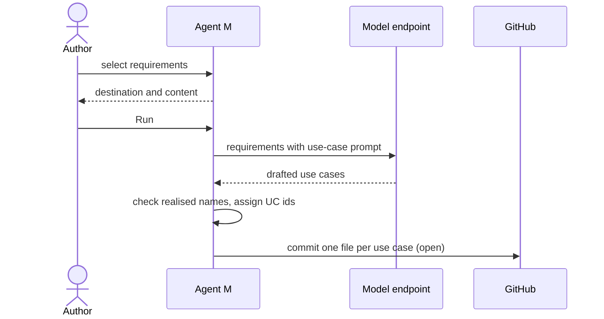

# UC-007 Derive use cases from requirements

**Goal.** Agent M drafts use cases that realise the product's accepted requirements, each in its
own file, for review in UC-008.

## Actors

- **Author** — starts the stage and chooses what it covers.
- **Model endpoint** — drafts the use cases.
- **GitHub** — receives the proposal.

## Precondition

- The product has accepted requirements.
- A runtime is available (UC-003, UC-010 or UC-011).

## Main flow

1. The author selects the requirements the stage should cover, by default all that no use case
   realises yet.
2. The run panel shows the destination and the content to be sent; the author presses **Run**.
3. Agent M sends the requirements with the use-case prompt from the single definition.
4. The endpoint returns use cases, each with actors, precondition, main flow, alternative flows,
   postcondition, a Mermaid diagram, and the names of the requirements it realises.
5. Agent M checks every realised name against the product's requirements and assigns
   identifiers `UC-<nnn>`.
6. Agent M writes one file per use case under `docs/use-cases/` on the default branch; they appear
   on the dashboard as open, and each is accepted on its own (UC-008).

## Alternative flows

- **4a. A drafted use case names a requirement that does not exist.** Agent M removes the name
  and marks the use case for review; it does not invent a requirement.
- **4b. A drafted use case realises no requirement.** It is proposed anyway and marked; it may
  point to a requirement that was never written down.
- **6a. A use case with the same goal already exists.** Agent M proposes a change to that file
  instead of a new identifier.

## Postcondition

- Each proposed use case is one Markdown file naming the requirements it realises.
- None of them counts as accepted until UC-008.
