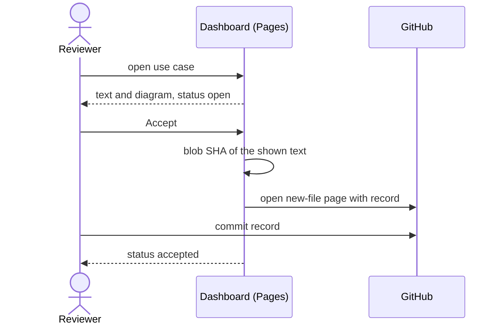

# UC-008 Review and accept a use case

**Goal.** The reviewer reads a use case with its diagram, corrects it if needed, and accepts
exactly the text they read — by a commit in GitHub.

## Actors

- **Reviewer** — logged into GitHub, usually with write access.
- **GitHub** — hosts the dashboard on Pages, the web editor, and the commit.

## Precondition

- The use case exists on the default branch under `docs/use-cases/`.

## Main flow

1. The reviewer opens the instance's dashboard and selects a product; the dashboard lists every
   use case of that product with its derived status: open, accepted, or changed since acceptance.
2. The reviewer opens a use case; the dashboard renders its text and Mermaid diagram.
3. The reviewer chooses **Accept**.
4. The dashboard computes the git blob SHA of the text it shows and opens GitHub's new-file page
   for `docs/approvals/UC-<nnn>-<sha>.md`, prefilled with a three-line record.
5. The reviewer commits the record.
6. The dashboard shows the use case as accepted, because a record now names its current SHA.

## Alternative flows

- **3a. The reviewer wants to change the text.** The dashboard opens an editor with a live
  preview. **Commit in GitHub** copies the edited text and opens GitHub's web editor for the file;
  the reviewer pastes and commits. The use case then has a new SHA and is reviewed from step 2.
- **4a. The prefill does not arrive.** The dashboard shows the record with a copy button and the
  exact file path.
- **1a. The product repository is private.** The dashboard reads it with the token stored in the
  reviewer's browser, `GET` only. Without a token that reaches the repository, it says so and
  shows nothing.
- **5a. The reviewer has no write access.** GitHub turns the commit into a pull request; the
  acceptance counts only once a maintainer merges it.
- **6a. The file is edited after acceptance.** Its SHA changes, no record names it, and the
  dashboard shows it as changed since acceptance — without anyone resetting a status.

## Postcondition

- An approval record names the file and the SHA of the accepted text; the commit names who and
  when.
- Where the diagram and the prose disagree, the prose is what was accepted.
