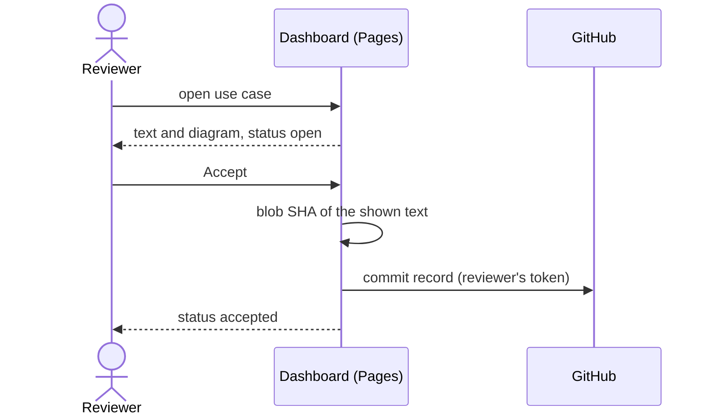

# UC-008 Review and accept a use case

**Goal.** The reviewer reads a use case with its diagram, corrects it if needed, and accepts
exactly the text they read — by a commit in GitHub.

## Actors

- **Reviewer** — logged into GitHub, usually with write access.
- **GitHub** — hosts the dashboard on Pages, the web editor, and the commit.

## Precondition

- The use case exists on the default branch under `docs/use-cases/`.

## Main flow

1. The reviewer opens the instance's dashboard and selects a product; the dashboard lists every
   use case of that product with its derived status: open, accepted, or changed since acceptance.
2. The reviewer opens a use case; the dashboard renders its text and Mermaid diagram.
3. The reviewer presses **Accept** — one click.
4. The dashboard computes the git blob SHA of the text it shows and commits
   `docs/approvals/UC-<nnn>-<sha>.md`, a three-line record, under the reviewer's own account.
5. The dashboard shows the use case as accepted, because a record now names its current SHA.

## Alternative flows

- **1a. The product repository is private.** The dashboard reads it with the token stored in the
  reviewer's browser. Without a token that reaches the repository, it says so and shows nothing.
- **3a. The reviewer wants to change the text.** The dashboard opens an editor with a live
  preview; **Save** commits it. The use case then has a new SHA and is shown again from step 2.
- **3b. No token is stored.** **Accept** opens GitHub's new-file page with the record prefilled, and
  the reviewer presses *Commit changes*; if the prefill does not arrive, the dashboard shows the
  record with a copy button and the exact path. Editing opens GitHub's editor with the text on the
  clipboard.
- **3c. The product is on a GitLab server and no token for it is stored.** The dashboard reads, but
  offers no *Accept* or *Save*: GitLab has no page that could be prefilled with the record. It links
  to the step that stores the project's token instead.
- **4a. The reviewer has no write access.** The commit is refused; the dashboard says so and offers
  the GitHub path, where the commit becomes a pull request that counts once a maintainer merges it.
- **5a. The file is edited after acceptance.** Its SHA changes, no record names it, and the
  dashboard shows it as changed since acceptance — without anyone resetting a status.

## Postcondition

- An approval record names the file and the SHA of the accepted text; the commit names who and
  when.
- Where the diagram and the prose disagree, the prose is what was accepted.
