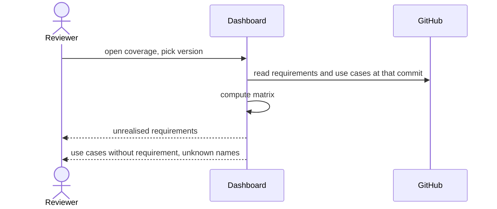

# UC-009 Inspect traceability coverage

**Goal.** The reviewer sees, at any moment, which requirements no use case realises and which use
cases realise no requirement.

## Actors

- **Reviewer** — anyone reading the dashboard.

## Precondition

- The product has requirements and use cases on its default branch.

## Main flow

1. The reviewer opens the coverage view. A **version selector** at the top right lists the
   product's released versions (its tags, newest first) and *current* — the default branch as it is
   now.
2. The reviewer picks a version. Agent M reads the artifacts **at exactly that commit** and computes
   the matrix from them: every requirement name against every use case — and, once they exist,
   architecture decisions, modules and tests — that names it.
3. Agent M lists requirements realised by no use case.
4. Agent M lists use cases that realise no requirement, and names that match no requirement.
5. The reviewer follows a line to the requirement or use case it concerns, as it read in that
   version.
6. Optionally, the reviewer picks a second version to compare with; Agent M marks what became
   covered, what lost its coverage, and which requirements were added or withdrawn in between.

## Alternative flows

- **3a. Every requirement is realised.** The list says so; the view does not hide.
- **2a. The chosen version predates Agent M's artifacts.** The view shows what exists at that
  commit and says what is missing, instead of an empty matrix without explanation.
- **4a. A use case names a requirement that was withdrawn.** It appears under unknown names with
  the note that the name was withdrawn, not renamed.

## Postcondition

- Nothing is written; coverage is a view, never a stored document.
- Gaps are shown but block nothing.
