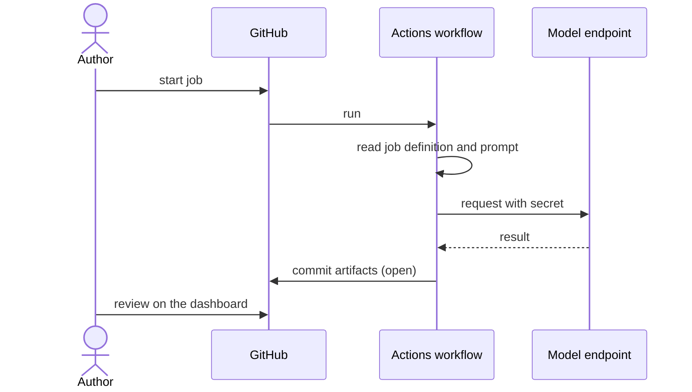

# UC-010 Run a job in GitHub Actions

**Goal.** A job runs server-side in the product repository's own CI, for long runs or when the
endpoint does not accept browser calls.

## Actors

- **Author** — starts the run.
- **GitHub Actions** — executes the job with a repository secret.
- **Model endpoint** — does the drafting.

## Precondition

- The product repository holds the endpoint key as an Actions secret, not in any file.
- The job workflow of Agent M is installed in the product repository.

## Main flow

1. The author starts the job from the dashboard or from GitHub's Actions page.
2. The workflow reads the job definition and prompt — the same files the browser uses.
3. The workflow calls the endpoint with the secret.
4. The workflow commits the resulting artifacts to the default branch, where they are open.
5. The author reviews them on the dashboard, as in UC-006 or UC-008.

## Alternative flows

- **3a. The secret is missing.** The workflow fails with a message naming the secret; nothing is
  written.
- **4a. The result equals the current artifacts.** Nothing is committed; the run reports
  "no change".

## Postcondition

- The artifacts are of the same kind the browser runtime would produce.
- Nothing counts as accepted before a person accepts it on the dashboard.
