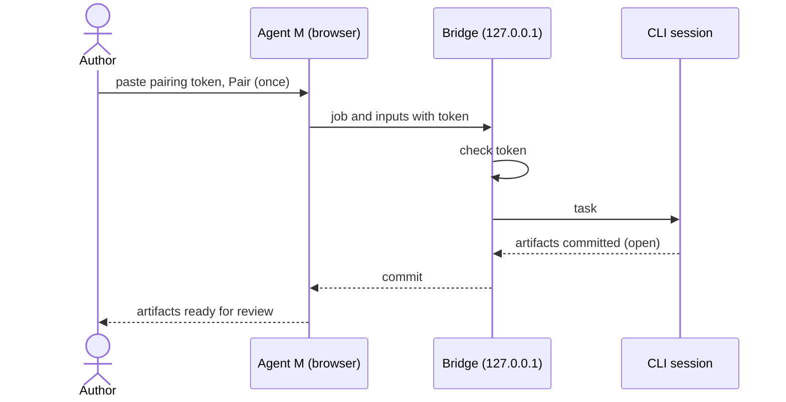

# UC-011 Hand a job to a local CLI session

**Goal.** The author hands a job to a coding agent (`opencode`, `claude` or `codex`) already running and
authenticated on a machine they control.

## Actors

- **Author** — runs the bridge and the CLI session.
- **Local CLI session** — performs the job with its own tools and credentials.

## Precondition

- The Agent M Bridge app is installed and paired on the author's machine (UC-044); it is bound to
  loopback, and its bridge token is stored in this browser.
- For current browsers, a dated measurement shows that the Pages site can reach the bridge.

## Main flow

1. **Once:** the author pairs the bridge (UC-044, step 4): the bridge's window shows its pairing token
   with **Copy**; the author pastes it on the settings page and presses **Pair**, and the dashboard
   stores the bridge's address and token in this browser. The bridge keeps the token across restarts;
   after that, handing a job over needs neither again.
2. The author's click commits the job's start record `docs/jobs/JOB-<id>.md` in the product repository;
   the site sends the job definition and inputs to the bridge, with the token.
3. The bridge checks the token and hands the task to the CLI session.
4. The CLI session commits the artifacts to the default branch, where they are open; a code change
   goes to a branch with a pull request instead.
5. The CLI session writes the job's end record with its last commit; the bridge reports what was
   committed, and the site shows the new artifacts for review.

## Alternative flows

- **1a. The author works from another machine.** The author opens an SSH tunnel or port forward
  that ends on the bridge's loopback address, and uses the forwarded address; the bridge's bind
  does not change.
- **1c. The CLI session runs on a machine behind NAT**, which accepts no incoming connection.
  1. In Settings, the author has named a **jump host** both machines can reach — hostname, SSH user,
     and the **port range** the sessions may use (UC-042). They add the session with **+ Remote
     session**; Agent M gives it the lowest free port of the range.
  2. The dashboard shows two commands, filled in from the settings: the **reverse tunnel** to run on
     the NAT machine (`ssh -N -R 127.0.0.1:<port>:127.0.0.1:<bridge port> <user>@<jump host>`, with
     keep-alive options, and how to keep it running as a service), and the **forward** to run on the
     author's machine (`ssh -N -L <port>:127.0.0.1:<port> <user>@<jump host>`). Each names the SSH key
     file it uses; the keys stay in `~/.ssh` of the two machines.
  3. With both running, the dashboard reaches the session at `localhost:<port>`, and pairing and jobs
     work as in the main flow. The tunnel's end on the jump host listens on its loopback only.
  With the Agent M Bridge on both machines, the two bridges open these tunnels themselves and the author
  types nothing (UC-044, 6a); the commands above are for a machine without the bridge.
  4. If the author would rather have no tunnel, a **self-hosted runner** on that machine works without
     any incoming connection (UC-010, UC-017) — registered to a private repository only.
- **1b. The author suspects the token has leaked.** They press **Pair anew** in the bridge's window; it
  shows a new token, the old one is rejected from then on, and the new one is pasted once as in step 1
  (UC-044, 4b).
- **3a. The token is missing or wrong.** The bridge refuses the request; nothing reaches the CLI
  session.
- **2a. The browser blocks the call.** The site names the reason and points to UC-010.

## Postcondition

- The artifacts arrived as open; nothing counts as accepted before a person accepts it.
- The bridge never listened on a non-loopback interface.
