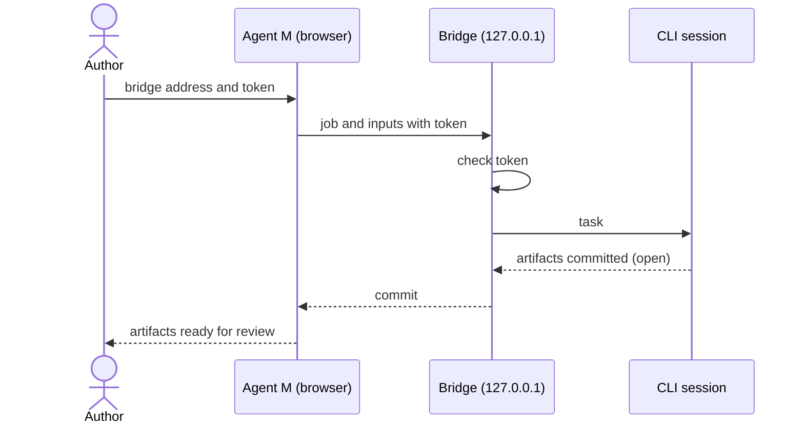

# UC-011 Hand a job to a local CLI session

**Goal.** The author hands a job to a coding agent (`claude` or `codex`) already running and
authenticated on a machine they control.

## Actors

- **Author** — runs the bridge and the CLI session.
- **Local CLI session** — performs the job with its own tools and credentials.

## Precondition

- The Agent M bridge runs on the author's machine, bound to loopback, and has printed a session
  token.
- For current browsers, a dated measurement shows that the Pages site can reach the bridge.

## Main flow

1. **Once:** the author starts the bridge for the first time; it prints a token and keeps it across
   restarts. The author enters the bridge address and that token on the Agent M site, which stores
   them in this browser. After that, handing a job over needs neither again.
2. The site sends the job definition and inputs to the bridge, with the token.
3. The bridge checks the token and hands the task to the CLI session.
4. The CLI session commits the artifacts to the default branch, where they are open; a code change
   goes to a branch with a pull request instead.
5. The bridge reports what was committed; the site shows the new artifacts for review.

## Alternative flows

- **1a. The author works from another machine.** The author opens an SSH tunnel or port forward
  that ends on the bridge's loopback address, and uses the forwarded address; the bridge's bind
  does not change.
- **1b. The author suspects the token has leaked.** They start the bridge with *pair anew*; it prints a
  new token, the old one is rejected from then on, and the new one is entered once as in step 1.
- **3a. The token is missing or wrong.** The bridge refuses the request; nothing reaches the CLI
  session.
- **2a. The browser blocks the call.** The site names the reason and points to UC-010.

## Postcondition

- The artifacts arrived as open; nothing counts as accepted before a person accepts it.
- The bridge never listened on a non-loopback interface.
