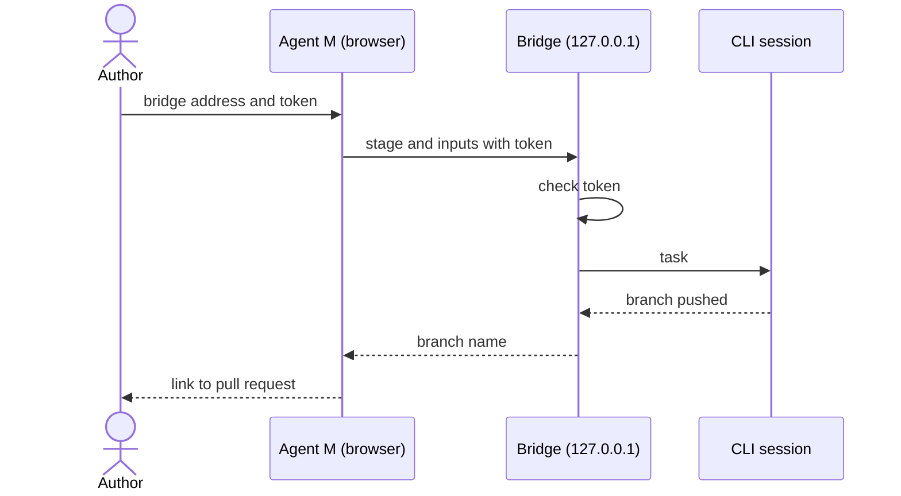

# UC-011 Hand a stage to a local CLI session

**Goal.** The author hands a stage to a coding agent (`claude` or `codex`) already running and
authenticated on a machine they control.

## Actors

- **Author** — runs the bridge and the CLI session.
- **Local CLI session** — performs the stage with its own tools and credentials.

## Precondition

- The Agent M bridge runs on the author's machine, bound to loopback, and has printed a session
  token.
- For current browsers, a dated measurement shows that the Pages site can reach the bridge.

## Main flow

1. The author enters the bridge address and the session token on the Agent M site.
2. The site sends the stage definition and inputs to the bridge, with the token.
3. The bridge checks the token and hands the task to the CLI session.
4. The CLI session produces the artifacts and pushes a branch.
5. The bridge reports the branch; the site links to the pull request.

## Alternative flows

- **1a. The author works from another machine.** The author opens an SSH tunnel or port forward
  that ends on the bridge's loopback address, and uses the forwarded address; the bridge's bind
  does not change.
- **3a. The token is missing or wrong.** The bridge refuses the request; nothing reaches the CLI
  session.
- **2a. The browser blocks the call.** The site names the reason and points to UC-010.

## Postcondition

- The artifacts arrived as a branch for review, never on the default branch.
- The bridge never listened on a non-loopback interface.
