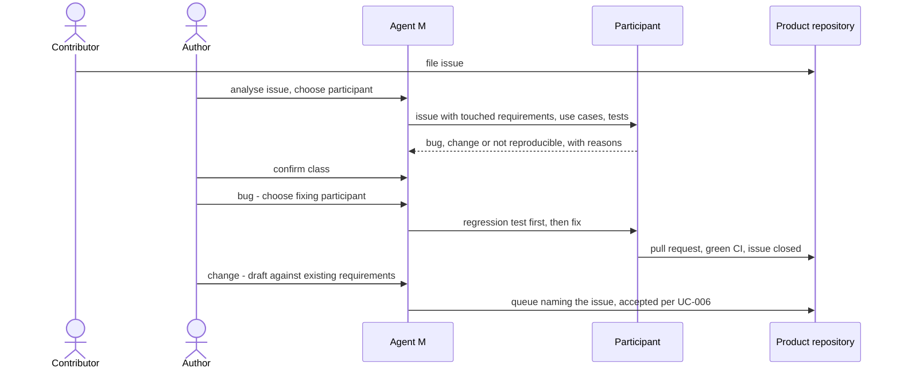

# UC-012 Handle an issue: bug fix or specification change

**Goal.** An issue — filed by a person, or created from a mail (UC-038) — is resolved the right way.
It is either a **bug**: the specification is right, and code or tests are wrong, so they are fixed.
Or it is a **change**: the specification itself has to change, so the change goes through the
specification first, and only then into code.

## Actors

- **Contributor** — anyone who files an issue.
- **Author** — decides what the issue means, and which participant works on it.
- **Participant** — the model endpoint or agent the author hands the work to (UC-017).
- **GitHub** — hosts issue, proposals and pull requests (or the product's GitLab server).

## Precondition

- The product is managed by Agent M, with its specification and tests in the repository.

## Main flow

1. The contributor files an issue.
2. The author opens it in Agent M and chooses a participant to **analyse** it. Agent M sends the
   issue with the requirements, use cases and tests it touches.
3. The participant proposes a class with its reasoning:
   - **bug** — the specification is right; the code or a test is wrong, and it names which;
   - **change** — the specification is wrong, incomplete or unclear for this case;
   - **not reproducible** — it says what it tried.
4. The author confirms or corrects the class — one click.
5. **Bug:** the author chooses a participant for the **fix** — a CLI, sandboxed or CI agent that can
   run tests. The job first writes a regression test that fails on the reported behaviour, then fixes
   code or test until it passes, on a branch; the pull request links the issue and the requirement it
   restores. It is merged once the product's Definition of Done holds (UC-002, step 8), and the issue
   is closed with a link to the fix.
6. **Change:** Agent M drafts the changed requirements against the existing ones (as in UC-005), with
   an impact list, and writes them as a queue under `docs/spec-freigaben/` naming the issue. After the
   author accepts them (UC-006), the downstream jobs — use cases, architecture, code, tests — become
   available, and the issue moves to the backlog (UC-033).

## Alternative flows

- **3a. The participant cannot tell bug from change** — the specification says nothing about the case.
  That is a change: a missing requirement is a gap in the specification, not a bug in the code.
- **5a. The test was wrong, not the code.** The fix changes the test; the pull request says which
  requirement the test now checks correctly, and the author sees the old and the new expectation side
  by side before merging.
- **5b. No participant with *run code and tests* is configured.** Agent M says so and links to UC-017;
  a model endpoint may analyse, but cannot fix.
- **4a. The author rejects the issue.** It is closed with the reason; nothing else changes.

## Postcondition

- A bug is fixed with a regression test that guards it from now on; the specification is unchanged.
- A change is in the specification before any code implements it, and the accepted entry names the
  issue it came from.
