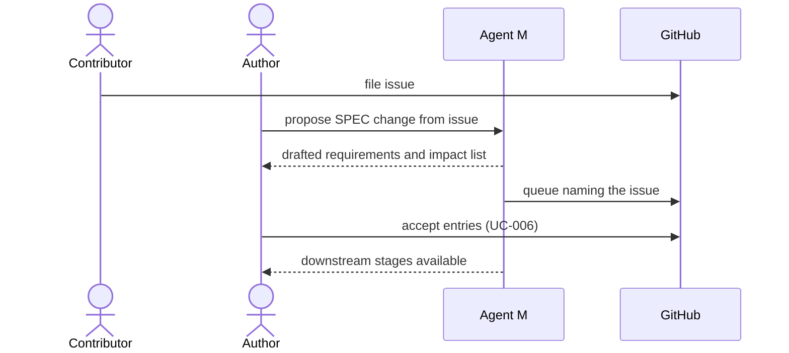

# UC-012 Turn an issue into a specification change

**Goal.** A request for changed behaviour, filed as a GitHub issue, becomes a SPEC change first
and only then work on code or other artifacts.

## Actors

- **Contributor** — anyone who files an issue.
- **Author** — decides what the issue means for the SPEC.
- **GitHub** — hosts issue and proposal.

## Precondition

- The issue describes changed or new behaviour, not a defect against the current SPEC.

## Main flow

1. The contributor files an issue.
2. The author opens it in Agent M and chooses **Propose SPEC change**.
3. Agent M drafts the new or changed requirements and, for each changed one, lists every artifact
   that references its name.
4. Agent M proposes them as a queue under `docs/spec-freigaben/`, naming the issue as origin.
5. The author reviews the queue (UC-006).
6. Only after acceptance does Agent M offer the downstream stages for the changed requirements.

## Alternative flows

- **1a. The issue reports a defect against the current SPEC.** No SPEC change is proposed; the
  issue goes to implementation directly.
- **5a. The author rejects the change.** The issue is closed with a link to the rejected entry.

## Postcondition

- The SPEC describes the changed behaviour before any code implements it.
- The accepted entry names the issue it came from.
