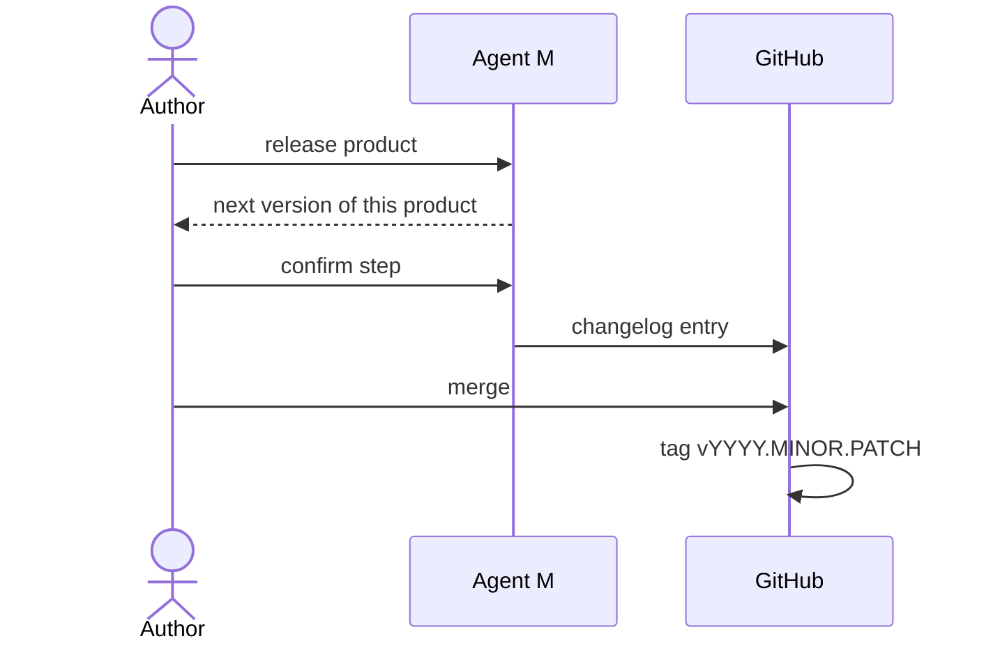

# UC-013 Release a version

**Goal.** The author marks a state of the product as a release that can be recovered, compared
and referred to later.

## Actors

- **Author** — decides when a state is a release and whether it is a minor or a patch step.
- **GitHub** — holds tag and changelog.

## Precondition

- The default branch contains the state to release.

## Main flow

1. The author chooses **Release** for a product.
2. Agent M proposes the next version `YYYY.MINOR.PATCH` of that product's own line.
3. The author confirms or changes the step.
4. Agent M proposes a changelog entry dated today.
5. The author merges the changelog entry.
6. The tag `vYYYY.MINOR.PATCH` is set on that commit.

## Alternative flows

- **2a. The year changed since the last release.** The version restarts at `YYYY.1.0`.
- **6a. The tag already exists.** The release stops; an existing tag is never moved. A correction
  becomes the next version.

## Postcondition

- The release is recoverable by its tag and described in the changelog.
- No other product's version changed.
