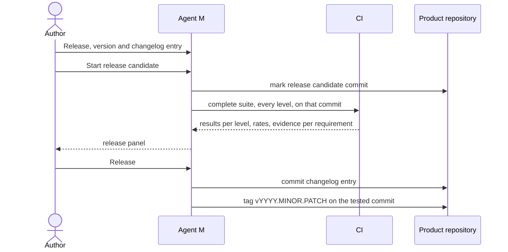

# UC-013 Release a version

**Goal.** The author marks a state of the product as a release that can be recovered, compared
and referred to later.

## Actors

- **Author** — decides when a state is a release and whether it is a minor or a patch step.
- **GitHub** — holds tag and changelog.

## Precondition

- The default branch contains the state to release.
- The product's test battery has levels (UC-026) and its CI knows which level runs when (UC-027).

## Main flow

1. The author chooses **Release** for a product. Agent M shows the next version `YYYY.MINOR.PATCH` of
   that product's own line, preset to a minor step, and a changelog entry dated today, both
   editable.
2. The author presses **Start release candidate** — one click. Agent M marks the current commit as
   release candidate `vYYYY.MINOR.PATCH-rc.N` and starts **the complete test suite at every level**
   on exactly that commit (book ch. 12: CI runs "the complete test suite"; ch. 13: the levels):
   - **unit** and **component** tests, with paid external services mocked;
   - **system** tests, walked through the use cases end to end;
   - **integration with real external services**, the run that is otherwise only nightly;
   - **release tests** — requirements-based, one or more tests per requirement, written by a
     participant **other than the one that implemented** the behaviour (book ch. 13: release testing
     "typically by a team independent of feature development").
3. The job dashboard (UC-036) shows the run. When it ends, the release panel shows every level with
   its result, every model-dependent check as a rate against the running version, and every
   requirement with the evidence that guards it (the audit view, UC-030).
4. If every level is green, the author presses **Release** — one click. Agent M commits the changelog
   entry and sets the tag `vYYYY.MINOR.PATCH` on the release candidate's commit — the one that was
   tested, not a later one.

Folded explanations say what each level checks, why release tests run with a different participant,
and why a released version is never changed afterwards.

## Alternative flows

- **3a. A level is red.** *Release* stays disabled; the panel names the failing tests and the
  requirements they guard. The author either fixes (UC-012) and starts a new candidate `-rc.N+1`, or —
  as the book's conditional acceptance allows (ch. 13 §7) — accepts the release test report **with
  known limitations**: the failing tests and the reason are recorded in the approval (UC-028, UC-030),
  and the release then carries them in its changelog. *(Open question to the PO, queue 2026-09-24g
  entry 07: whether this second route is allowed at all.)*
- **3b. A model-dependent rate fell below the running version's.** It is shown as a finding with its
  confidence interval, not as a verdict; the author decides, and the decision and its reason are
  recorded with the release.
- **2a. Only the implementing participant can run release tests.** Agent M says so and asks the author
  to assign a second participant, or to run the release tests as a person.
- **1a. The year changed since the last release.** The version restarts at `YYYY.1.0`.
- **4a. The tag already exists.** The release stops; an existing tag is never moved. A correction
  becomes the next version.
- **4b. The default branch moved on while the suite ran.** The release is still tagged on the tested
  commit; later commits go into the next version.

## Postcondition

- The release is recoverable by its tag and described in the changelog.
- The tagged commit is exactly the one on which the complete suite ran green at every level; the
  evidence per requirement is kept with the release.
- No other product's version changed.
