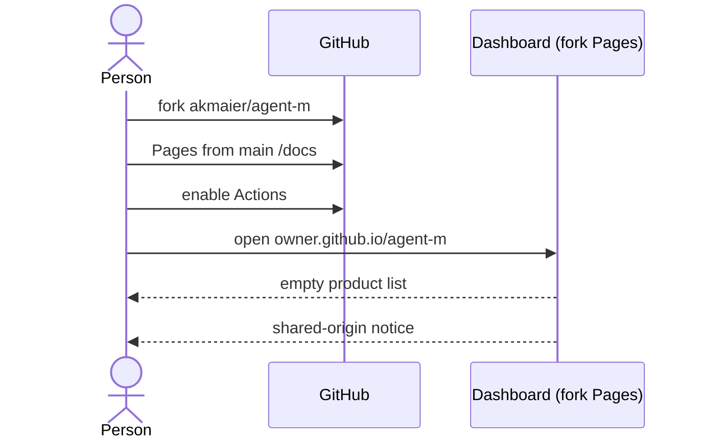

# UC-014 Set up an Agent M instance

**Goal.** A person — typically a reader of the book — gets their own Agent M: their own dashboard,
their own settings, their own list of products.

## Actors

- **Person** — has a GitHub account; becomes the author of the products this instance manages.
- **GitHub** — hosts the fork, its Pages site and its workflows.

## Precondition

- The person has a GitHub account.

## Main flow

1. The person forks `akmaier/agent-m`, under their own account or under an owner they use for
   nothing else. The fork's front page (its README) opens with **Start here**: two links and what to
   press on each page.
2. The first link opens the fork's Pages settings; the person chooses *Deploy from a branch*,
   `main`, `/docs`, *Save*. GitHub lets no one else switch this on for them.
3. The second link opens the fork's Actions page; the person presses *I understand my workflows, go
   ahead and enable them*. GitHub disables workflows on every fork until its owner does.
4. The person opens `https://<owner>.github.io/agent-m/`. The dashboard derives its repository from
   that address and shows the instance's product list, empty at first.
5. The dashboard states that everything stored in the browser can be read by every other Pages site
   of the same owner, and that an owner used for nothing else avoids it.

## Alternative flows

- **2a. Pages is not turned on.** The address answers 404; nothing else is affected.
- **3a. Actions are not enabled.** Approval commits for SPEC changes are recorded but never written
  into the SPEC; the dashboard shows such entries as *approved*, never *in SPEC*, and says why.
- **1a. The person later wants Agent M's improvements.** They use GitHub's *Sync fork*; their
  product list and settings are not part of Agent M's own files and are not overwritten.

## Postcondition

- The person has a dashboard at their own address, served from `docs/` of their fork; no server was
  set up.
- The fork also carries Agent M's own specification and use cases; the person does not have to
  review them.
