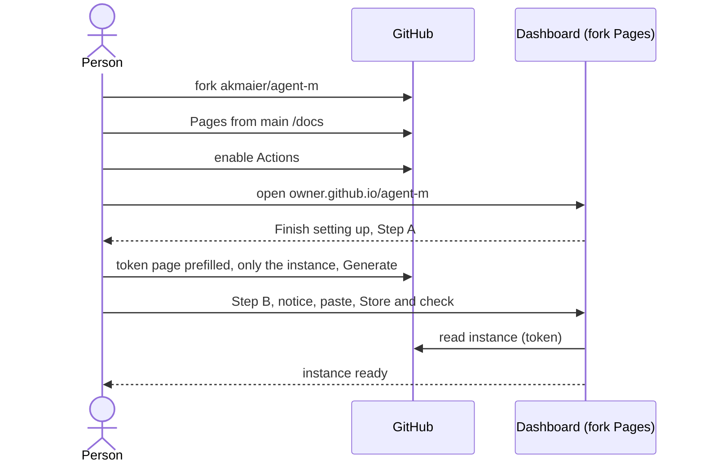

# UC-014 Set up an Agent M instance

**Goal.** A person — typically a reader of the book — gets their own Agent M: their own dashboard,
their own settings, their own list of products.

## Actors

- **Person** — has a GitHub account; becomes the author of the products this instance manages.
- **GitHub** — hosts the fork, its Pages site and its workflows.

## Precondition

- The person has a GitHub account.

## Main flow

1. The person forks `akmaier/agent-m`, under their own account or under an owner they use for
   nothing else. The fork's front page (its README) opens with **Start here**: two links and what to
   press on each page.
2. The first link opens the fork's Pages settings; the person chooses *Deploy from a branch*,
   `main`, `/docs`, *Save*. GitHub lets no one else switch this on for them.
3. The second link opens the fork's Actions page; the person presses *I understand my workflows, go
   ahead and enable them*. GitHub disables workflows on every fork until its owner does.
4. The person opens `https://<owner>.github.io/agent-m/`. The dashboard derives its repository from
   that address and, because no token is stored yet, shows **Finish setting up your instance** at the
   top of its start page; the person presses **Set up now**.
5. **Step A · Create your key on GitHub.** A button opens GitHub's token page with name, description,
   expiry and *Contents: read and write* prefilled. Underneath, what to do there: choose **Only
   select repositories**, pick **`<owner>/agent-m`** — only the instance, products come later —,
   press *Generate token*, copy it.
6. **Step B · Give the key to Agent M.** The dashboard states that everything stored in this browser
   can be read by every other Pages site of the same owner; the person ticks *I have read this*,
   pastes the token and presses **Store and check**. Agent M stores it in `localStorage` and checks
   that it reaches the instance.
7. The dashboard shows the instance, ready: its own use cases, and **+ Add product** (UC-001).

Both steps carry a folded *What is this?* for people new to GitHub.

## Alternative flows

- **2a. Pages is not turned on.** The address answers 404; nothing else is affected.
- **3a. Actions are not enabled.** Approval commits for SPEC changes are recorded but never written
  into the SPEC; the dashboard shows such entries as *approved*, never *in SPEC*, and says why.
- **1a. The person later wants Agent M's improvements.** They use GitHub's *Sync fork*; their
  product list and settings are not part of Agent M's own files and are not overwritten.

- **5a. The person uses a second browser or computer later.** The token lives only in the browser it
  was stored in; the dashboard there opens *Finish setting up* again. The same token can be pasted,
  or a new one created.
- **5b. The person only wants to read public repositories.** They can skip the setup; the dashboard
  reads without a token, and accepting then goes through GitHub's own pages.

## Postcondition

- The person has a dashboard at their own address, served from `docs/` of their fork; no server was
  set up.
- One token, limited to the instance repository, is stored in this browser. Adding a product later
  extends this token; it never needs a second one.
- The fork also carries Agent M's own specification and use cases; the person does not have to
  review them.
