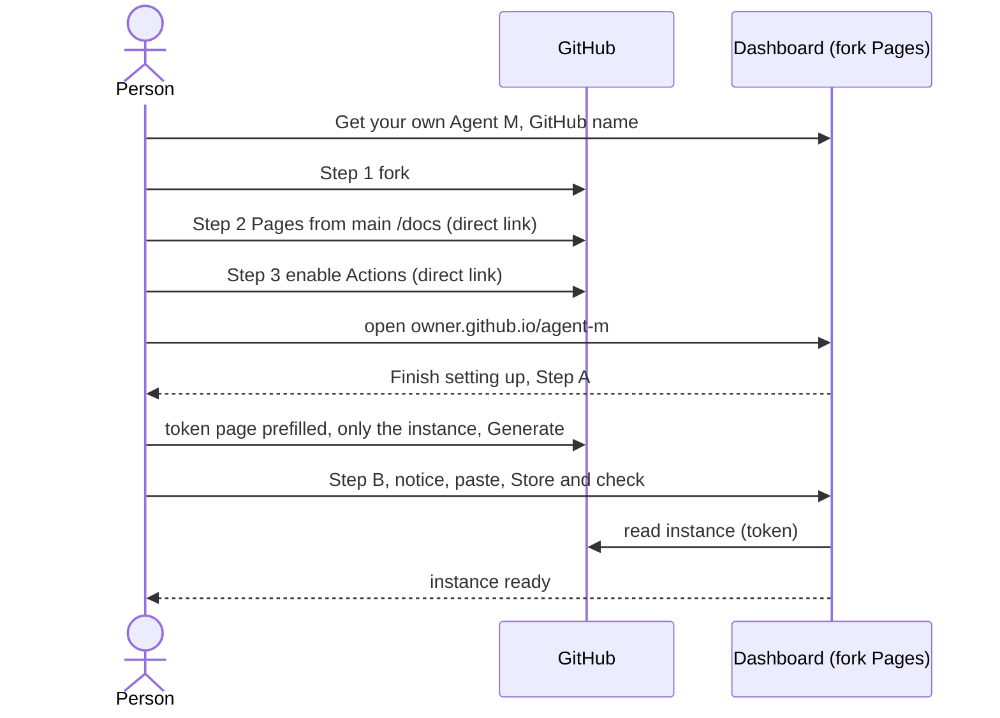

# UC-014 Get your own Agent M

**Goal.** A person — typically a reader of the book — gets their own Agent M: their own dashboard,
their own settings, their own list of products.

## Actors

- **Person** — has a GitHub account; becomes the author of the products this instance manages.
- **GitHub** — hosts the fork, its Pages site and its workflows.

## Precondition

- The person has a GitHub account.

## Main flow

1. The person opens the original dashboard, `https://akmaier.github.io/agent-m/`, and presses
   **Get your own Agent M**. A guided page opens; it asks for the person's GitHub name (or the
   organisation to fork into — one used for nothing else is recommended, with the reason folded
   underneath).
2. **Step 1 · Fork.** A button opens GitHub's fork page for `akmaier/agent-m`; the person presses
   *Create fork*.
3. **Step 2 · Turn on the dashboard.** Now that the owner is known, a button opens exactly
   `github.com/<owner>/agent-m/settings/pages`; the page says what to choose there — *Deploy from a
   branch*, `main`, `/docs`, *Save*. GitHub lets no one but the owner switch this on.
4. **Step 3 · Turn on the workflows — optional now.** The instance's workflows are needed only to fetch
   EU legal texts (UC-004) and to write an accepted change of the instance's own SPEC without a token
   (UC-006, 4c); the page says so and offers **Later**. When a feature first needs them, the dashboard
   shows this step again. A button opens `github.com/<owner>/agent-m/actions`; the person presses *I
   understand my workflows, go ahead and enable them*. GitHub disables workflows on every fork until
   its owner does.
5. **Step 4 · Open your dashboard.** A button opens `https://<owner>.github.io/agent-m/` — with a
   folded note that GitHub needs about a minute after Step 2 before the address answers.

The fork's README carries the same three steps as text, for people who start on GitHub rather than
on the dashboard. Agent M's MIT licence, shown with a folded explanation, is what allows the fork and
leaves the licence of every product to the person.

6. On the person's own dashboard, the setup continues: because no token is stored yet, it shows
   **Finish setting up your instance** at the top of its start page; the person presses **Set up
   now**.
7. **Step A · Create your key on GitHub.** A button opens GitHub's token page with name, description,
   expiry and the permissions every feature of Agent M needs prefilled — *Contents* and *Issues* read
   and write, *Actions* read and write, *Metadata* read — so that one key is all the person ever
   creates. A folded **Why these?** says what each is for: Contents to save and accept, Issues for
   reports that become issues, Actions to start a run. Underneath, what to do there: choose **Only
   select repositories**, pick **`<owner>/agent-m`** — only the instance, products come later —,
   press *Generate token*, copy it.
8. **Step B · Give the key to Agent M.** The dashboard states that everything stored in this browser
   can be read by every other Pages site of the same owner; the person ticks *I have read this*,
   pastes the token and presses **Store and check**. Agent M stores it in `localStorage` and checks
   that it reaches the instance.
9. The dashboard shows the instance, ready: its own use cases, and **+ Add product** (UC-001).

Both steps carry a folded *What is this?* for people new to GitHub.

## Alternative flows

- **3a. Pages is not turned on.** The address answers 404; nothing else is affected.
- **4a. Actions are not enabled.** Everything done on the dashboard with a token works as usual. Only an
  approval of the instance's own SPEC committed on GitHub's page without a token is recorded but not
  written; the dashboard shows it as *approved*, not *in SPEC*, says why, and offers step 3. EU legal
  texts are registered but not fetched until step 3 is done.
- **1a. The person later wants Agent M's improvements.** They use GitHub's *Sync fork*. The fork
  commits nothing about its products — the list lives in the browser — so the sync does not collide
  with it and overwrites nothing of the person's.

- **1b. The person also works in a local clone** — for CLI agents on their machine. They clone their
  fork; products they check out go into their own folders under `products/`, which git ignores, so no
  product ever reaches the fork. `products/README.md` says so.
- **7a. The person uses a second browser or computer later.** The token lives only in the browser it
  was stored in; the dashboard there opens *Finish setting up* again, with **Import settings** beside
  it. In the first browser, *Settings → Export* saved a file with the products, endpoints, bridge
  address and mailbox server — no token, key or password. Imported, only the secrets are entered again,
  each at its own notice; the same token can be pasted, or a new one created.
- **6a. The person only wants to read public repositories.** They can skip the setup; the dashboard
  reads without a token, and accepting then goes through GitHub's own pages.

## Postcondition

- The person has a dashboard at their own address, served from `docs/` of their fork; no server was
  set up.
- One token, limited to the instance repository, is stored in this browser. Adding a product later
  extends this token; it never needs a second one.
- The fork also carries Agent M's own specification and use cases; the person does not have to
  review them.
